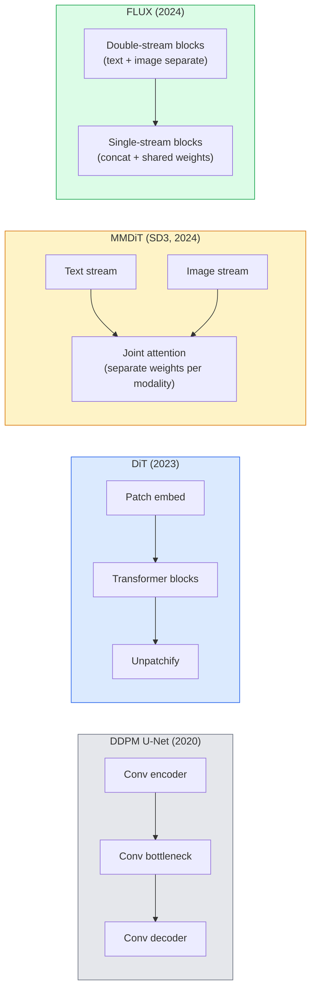

# 扩散 Transformer 与整流流

> U-Net 并不是扩散模型的奥秘所在。把它换成 Transformer，把噪声调度换成直线流，你就得到了 SD3、FLUX，以及 2026 年所有的文生图模型。

**Type:** Learn + Build
**Languages:** Python
**Prerequisites:** Phase 4 Lesson 10 (Diffusion DDPM), Phase 4 Lesson 14 (ViT), Phase 7 Lesson 02 (Self-Attention)
**Time:** ~75 minutes

## 学习目标

- 梳理从 U-Net DDPM（第 10 课）到扩散 Transformer（DiT）、MMDiT（SD3）以及单流+双流 DiT（FLUX）的演进脉络
- 解释整流流（Rectified Flow）：为什么噪声与数据之间的直线轨迹能让模型在 20 步而不是 1000 步内完成采样
- 实现一个微型 DiT 块和一个整流流训练循环，各自不超过 100 行代码
- 从架构、参数规模和许可证三个维度区分各模型变体（SD3、FLUX.1-dev、FLUX.1-schnell、Z-Image、Qwen-Image）

## 问题背景

第 10 课用 U-Net 去噪器构建了一个 DDPM。这套配方统治了 2020-2023 年：U-Net + beta 调度 + 噪声预测损失。它孕育了 Stable Diffusion 1.5、2.1 和 DALL-E 2。

2026 年所有最先进的文生图模型都已经超越了它。Stable Diffusion 3、FLUX、SD4、Z-Image、Qwen-Image、Hunyuan-Image——没有一个还在用 U-Net。它们用的是扩散 Transformer（Diffusion Transformer，DiT）。SD3 和 FLUX 还把 DDPM 的噪声调度换成了整流流，它拉直了从噪声到数据的路径，配合一致性或蒸馏变体可以实现 1-4 步推理。

这一转变之所以重要，是因为它正是扩散式图像生成变得可控、提示词精准（SD3/SD4 解决了文字渲染问题）、生产级快速的原因。理解 DiT + 整流流，就是理解 2026 年的生成式图像技术栈。

## 核心概念

### 从 U-Net 到 Transformer



- **DiT**（Peebles & Xie，2023）——用类 ViT 的 Transformer 在隐空间补丁（latent patches）上替代 U-Net。通过自适应层归一化（AdaLN）注入条件信息。
- **MMDiT**（SD3，Esser et al.，2024）——文本和图像 token 各自拥有独立权重的两条流，共享同一个联合注意力。
- **FLUX**（Black Forest Labs，2024）——前 N 个块采用与 SD3 类似的双流结构，后面的块将两个模态拼接并共享权重（单流），以在更大深度下保持效率。
- **Z-Image**（2025）——一个 6B 参数的高效单流 DiT，向"不计代价堆规模"的路线发起挑战。

### 一段话讲清整流流

DDPM 将前向过程定义为一个带噪 SDE，其中 `x_t` 被逐步污染。学到的反向过程是另一个 SDE，需要 1000 个小步来求解。

整流流则在干净数据与纯噪声之间定义了一条**直线**插值：

```
x_t = (1 - t) * x_0 + t * epsilon,     t in [0, 1]
```

训练一个网络去预测速度（velocity）`v_theta(x_t, t) = epsilon - x_0`——即沿着从干净数据指向噪声的直线路径的前向方向（`dx_t/dt`）。采样时，沿着这个速度反向积分，从噪声一步步走向数据。由此得到的 ODE 非常接近一条直线，因此采样所需的积分步数要少得多。

SD3 称之为**整流流匹配（Rectified Flow Matching）**。FLUX、Z-Image 以及大多数 2026 年的模型都使用同样的目标函数。典型推理：20-30 步 Euler（确定性），而旧的 DDPM 体系需要 50+ 步 DDIM。蒸馏 / turbo / schnell / LCM 变体则进一步压缩到 1-4 步。

### AdaLN 条件注入

DiT 通过**自适应层归一化**来注入时间步和类别/文本条件：从条件向量预测 `scale` 和 `shift`，并在 LayerNorm 之后施加。这比 U-Net 中 FiLM 风格的调制干净得多，也是所有现代 DiT 的默认做法。

```
cond -> MLP -> (scale, shift, gate)
norm(x) * (1 + scale) + shift, then residual add * gate
```

### SD3 与 FLUX 中的文本编码器

- **SD3** 使用三个文本编码器：两个 CLIP 模型 + T5-XXL。嵌入向量拼接后作为文本条件送入图像流。
- **FLUX** 使用一个 CLIP-L + T5-XXL。
- **Qwen-Image / Z-Image** 等变体使用与其基座 LLM 对齐的自研文本编码器。

文本编码器是 SD3/FLUX 在提示词理解上远胜 SD1.5 的重要原因。仅 T5-XXL 一个模型就有 4.7B 参数。

### 无分类器引导依然成立

整流流改变的是采样器，而不是条件机制。无分类器引导（classifier-free guidance：训练时以 10% 概率丢弃文本，推理时混合有条件和无条件的预测）在整流流下完全照常工作。2026 年大多数模型使用 3.5-5 的引导尺度——低于 SD1.5 的 7.5，因为整流流模型在默认情况下对提示词的遵循就更紧密。

### Consistency、Turbo、Schnell、LCM

同一个思路的四个名字：把一个慢的多步模型蒸馏成一个快的少步模型。

- **LCM（Latent Consistency Model，潜在一致性模型）**——训练一个学生模型，使其能从任意中间状态 `x_t` 一步预测出最终的 `x_0`。
- **SDXL Turbo / FLUX schnell**——用对抗式扩散蒸馏训练的 1-4 步模型。
- **SD Turbo**——OpenAI 风格的 Consistency Models 适配到潜在扩散。

任何新模型的生产部署都会同时发布"完整质量"检查点和"turbo / schnell"变体。Schnell（德语"快"，Black Forest Labs 的命名习惯）在 1-4 步内完成，可以接入实时流水线。

### 2026 年的模型版图

| 模型 | 规模 | 架构 | 许可证 |
|-------|------|--------------|---------|
| Stable Diffusion 3 Medium | 2B | MMDiT | SAI Community |
| Stable Diffusion 3.5 Large | 8B | MMDiT | SAI Community |
| FLUX.1-dev | 12B | 双流 + 单流 DiT | 非商用 |
| FLUX.1-schnell | 12B | 同上，蒸馏版 | Apache 2.0 |
| FLUX.2 | — | FLUX.1 的迭代版 | 混合 |
| Z-Image | 6B | S3-DiT（Scalable Single-Stream） | 宽松许可 |
| Qwen-Image | ~20B | DiT + Qwen 文本塔 | Apache 2.0 |
| Hunyuan-Image-3.0 | ~80B | DiT | 仅限研究 |
| SD4 Turbo | 3B | DiT + 蒸馏 | SAI Commercial |

FLUX.1-schnell 是 2026 年开源界的默认选择。Z-Image 是效率上的领跑者。FLUX.2 和 SD4 是当前的质量巅峰。

### 为什么这次范式转移很重要

DDPM + U-Net 是能用的。DiT + 整流流则**更好、更快、扩展性更佳**。这次转变与 NLP 中从 RNN 到 Transformer 的转变如出一辙：两种架构解决的是同一个问题，但 Transformer 能扩展规模，于是占据了统治地位。2026 年所有关于图像、视频或 3D 生成的论文都使用 DiT 形态的去噪器，并且通常采用整流流目标函数。U-Net DDPM 如今主要是教学用途（第 10 课）。

## 从零实现

### 第 1 步：带 AdaLN 的 DiT 块

```python
import torch
import torch.nn as nn


class AdaLNZero(nn.Module):
    """
    Adaptive LayerNorm with a gate. Predicts (scale, shift, gate) from the conditioning.
    Init such that the whole block starts as identity ("zero init").
    """

    def __init__(self, dim, cond_dim):
        super().__init__()
        self.norm = nn.LayerNorm(dim, elementwise_affine=False)
        self.mlp = nn.Linear(cond_dim, dim * 3)
        nn.init.zeros_(self.mlp.weight)
        nn.init.zeros_(self.mlp.bias)

    def forward(self, x, cond):
        scale, shift, gate = self.mlp(cond).chunk(3, dim=-1)
        h = self.norm(x) * (1 + scale.unsqueeze(1)) + shift.unsqueeze(1)
        return h, gate.unsqueeze(1)


class DiTBlock(nn.Module):
    def __init__(self, dim=192, heads=3, mlp_ratio=4, cond_dim=192):
        super().__init__()
        self.adaln1 = AdaLNZero(dim, cond_dim)
        self.attn = nn.MultiheadAttention(dim, heads, batch_first=True)
        self.adaln2 = AdaLNZero(dim, cond_dim)
        self.mlp = nn.Sequential(
            nn.Linear(dim, dim * mlp_ratio),
            nn.GELU(),
            nn.Linear(dim * mlp_ratio, dim),
        )

    def forward(self, x, cond):
        h, gate1 = self.adaln1(x, cond)
        a, _ = self.attn(h, h, h, need_weights=False)
        x = x + gate1 * a
        h, gate2 = self.adaln2(x, cond)
        x = x + gate2 * self.mlp(h)
        return x
```

`AdaLNZero` 一开始是恒等映射，因为它的 MLP 权重被初始化为零。训练过程会慢慢把这个块从恒等映射推开；这一招极大地稳定了深层 Transformer 扩散模型的训练。

### 第 2 步：一个微型 DiT

```python
def timestep_embedding(t, dim):
    import math
    half = dim // 2
    freqs = torch.exp(-math.log(10000) * torch.arange(half, device=t.device) / half)
    args = t[:, None].float() * freqs[None]
    return torch.cat([args.sin(), args.cos()], dim=-1)


class TinyDiT(nn.Module):
    def __init__(self, image_size=16, patch_size=2, in_channels=3, dim=96, depth=4, heads=3):
        super().__init__()
        self.patch_size = patch_size
        self.num_patches = (image_size // patch_size) ** 2
        self.patch = nn.Conv2d(in_channels, dim, kernel_size=patch_size, stride=patch_size)
        self.pos = nn.Parameter(torch.zeros(1, self.num_patches, dim))
        self.time_mlp = nn.Sequential(
            nn.Linear(dim, dim * 2),
            nn.SiLU(),
            nn.Linear(dim * 2, dim),
        )
        self.blocks = nn.ModuleList([DiTBlock(dim, heads, cond_dim=dim) for _ in range(depth)])
        self.norm_out = nn.LayerNorm(dim, elementwise_affine=False)
        self.head = nn.Linear(dim, patch_size * patch_size * in_channels)

    def forward(self, x, t):
        n = x.size(0)
        x = self.patch(x)
        x = x.flatten(2).transpose(1, 2) + self.pos
        t_emb = self.time_mlp(timestep_embedding(t, self.pos.size(-1)))
        for blk in self.blocks:
            x = blk(x, t_emb)
        x = self.norm_out(x)
        x = self.head(x)
        return self._unpatchify(x, n)

    def _unpatchify(self, x, n):
        p = self.patch_size
        h = w = int(self.num_patches ** 0.5)
        x = x.view(n, h, w, p, p, -1).permute(0, 5, 1, 3, 2, 4).reshape(n, -1, h * p, w * p)
        return x
```

### 第 3 步：整流流训练

```python
import torch.nn.functional as F

def rectified_flow_train_step(model, x0, optimizer, device):
    model.train()
    x0 = x0.to(device)
    n = x0.size(0)
    t = torch.rand(n, device=device)
    epsilon = torch.randn_like(x0)
    x_t = (1 - t[:, None, None, None]) * x0 + t[:, None, None, None] * epsilon

    target_velocity = epsilon - x0
    pred_velocity = model(x_t, t)

    loss = F.mse_loss(pred_velocity, target_velocity)
    optimizer.zero_grad()
    loss.backward()
    optimizer.step()
    return loss.item()
```

对比 DDPM 的噪声预测损失（第 10 课）：结构相同，目标不同。我们预测的不再是噪声 `epsilon`，而是**速度** `epsilon - x_0`——沿直线插值从数据指向噪声的方向。

### 第 4 步：Euler 采样器

整流流是一个 ODE。Euler 法是最简单的求解方法，对于训练良好的整流流模型，在 20 步以上时其精度几乎不输高阶求解器。

```python
@torch.no_grad()
def rectified_flow_sample(model, shape, steps=20, device="cpu"):
    model.eval()
    x = torch.randn(shape, device=device)
    dt = 1.0 / steps
    t = torch.ones(shape[0], device=device)
    for _ in range(steps):
        v = model(x, t)
        x = x - dt * v
        t = t - dt
    return x
```

20 步。在训练好的模型上，这能产出与 1000 步 DDPM 相当的样本。

### 第 5 步：端到端冒烟测试

```python
import numpy as np

def synthetic_blobs(num=200, size=16, seed=0):
    rng = np.random.default_rng(seed)
    out = np.zeros((num, 3, size, size), dtype=np.float32)
    yy, xx = np.meshgrid(np.arange(size), np.arange(size), indexing="ij")
    for i in range(num):
        cx, cy = rng.uniform(4, size - 4, size=2)
        r = rng.uniform(2, 4)
        mask = (xx - cx) ** 2 + (yy - cy) ** 2 < r ** 2
        colour = rng.uniform(-1, 1, size=3)
        for c in range(3):
            out[i, c][mask] = colour[c]
    return torch.from_numpy(out)
```

用整流流在这份数据上训练一个 `TinyDiT`。500 步之后，采样输出应该呈现出隐约可见的彩色斑块。

## 生产实践

要用 FLUX / SD3 / Z-Image 做真实的图像生成，`diffusers` 为每个模型都提供了统一的 API：

```python
from diffusers import FluxPipeline, StableDiffusion3Pipeline
import torch

pipe = FluxPipeline.from_pretrained(
    "black-forest-labs/FLUX.1-schnell",
    torch_dtype=torch.bfloat16,
).to("cuda")

out = pipe(
    prompt="a golden retriever surfing a tsunami, hyperrealistic, studio lighting",
    guidance_scale=0.0,           # schnell was trained without CFG
    num_inference_steps=4,
    max_sequence_length=256,
).images[0]
out.save("surf.png")
```

三行核心代码。`FLUX.1-schnell` 四步出图。把模型 id 换成 `black-forest-labs/FLUX.1-dev`，配合 CFG 用 20-30 步可以获得更高质量。

SD3 的用法：

```python
pipe = StableDiffusion3Pipeline.from_pretrained(
    "stabilityai/stable-diffusion-3.5-large",
    torch_dtype=torch.bfloat16,
).to("cuda")
out = pipe(prompt, guidance_scale=3.5, num_inference_steps=28).images[0]
```

## 交付产物

本课产出：

- `outputs/prompt-dit-model-picker.md` —— 在给定质量、延迟和许可证约束下，从 SD3、FLUX.1-dev、FLUX.1-schnell、Z-Image、SD4 Turbo 中做出选择。
- `outputs/skill-rectified-flow-trainer.md` —— 编写一个完整的整流流训练循环，包含 AdaLN DiT 和 Euler 采样。

## 练习

1. **（简单）** 在合成斑块数据集上训练上面的 TinyDiT 500 步。比较 10、20、50 步 Euler 采样产生的样本。
2. **（中等）** 通过把一个可学习的类别嵌入拼接到时间嵌入上，加入文本条件（按颜色分 10 个斑块"类别"）。用类别 0、5、9 采样，验证颜色是否对应。
3. **（困难）** 在相同数据上、以相同步数训练同等规模网络的整流流版本和 DDPM 版本，计算生成样本之间的 Fréchet 距离（FID 代理指标）。报告哪一个收敛更快。

## 关键术语

| 术语 | 人们怎么说 | 实际含义 |
|------|----------------|----------------------|
| DiT | "扩散 Transformer" | 取代 U-Net 作为扩散去噪器的 Transformer；在补丁化的隐变量上运行 |
| AdaLN | "自适应层归一化" | 通过在 LayerNorm 之后施加可学习的 scale、shift、gate 来注入时间步/文本条件；所有现代 DiT 的标准做法 |
| MMDiT | "多模态 DiT（SD3）" | 文本和图像 token 各自拥有独立权重流，共享一个联合自注意力 |
| 单流 / 双流 | "FLUX 的招数" | 前 N 个块为双流（每个模态独立权重），后面的块为单流（拼接 + 共享权重）以提升效率 |
| 整流流 | "噪声到数据的直线" | 数据与噪声之间的线性插值；网络预测速度；推理时所需的 ODE 步数更少 |
| 速度目标 | "epsilon - x_0" | 整流流中的回归目标；从干净数据指向噪声 |
| CFG 引导 | "无分类器引导" | 混合有条件和无条件的预测；整流流模型中仍在使用 |
| Schnell / turbo / LCM | "1-4 步蒸馏" | 从完整质量模型蒸馏出的少步变体；生产级实时推理 |

## 延伸阅读

- [Scalable Diffusion Models with Transformers (Peebles & Xie, 2023)](https://arxiv.org/abs/2212.09748) —— DiT 论文
- [Scaling Rectified Flow Transformers (Esser et al., SD3 paper)](https://arxiv.org/abs/2403.03206) —— 大规模 MMDiT 与整流流
- [FLUX.1 model card and technical report (Black Forest Labs)](https://huggingface.co/black-forest-labs/FLUX.1-dev) —— 双流 + 单流细节
- [Z-Image: Efficient Image Generation Foundation Model (2025)](https://arxiv.org/html/2511.22699v1) —— 6B 参数的单流 DiT
- [Elucidating the Design Space of Diffusion (Karras et al., 2022)](https://arxiv.org/abs/2206.00364) —— 每一个扩散设计权衡的参考文献
- [Latent Consistency Models (Luo et al., 2023)](https://arxiv.org/abs/2310.04378) —— LCM-LoRA 如何带来 4 步推理
