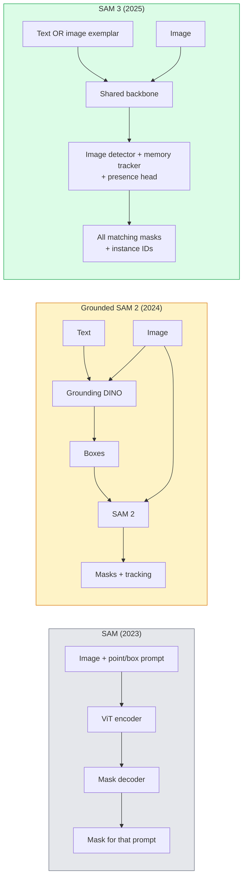

# SAM 3 与开放词汇分割

> 给模型一段文本提示和一张图像，就能得到所有匹配对象的掩码。SAM 3 把这件事变成了一次前向传播。

**Type:** Use + Build
**Languages:** Python
**Prerequisites:** Phase 4 Lesson 07 (U-Net), Phase 4 Lesson 08 (Mask R-CNN), Phase 4 Lesson 18 (CLIP)
**Time:** ~60 minutes

## 学习目标

- 区分 SAM（仅支持视觉提示）、Grounded SAM / SAM 2（检测器 + SAM）和 SAM 3（通过可提示概念分割原生支持文本提示）
- 解释 SAM 3 的架构：共享主干网络 + 图像检测器 + 基于记忆的视频追踪器 + 存在性头 + 解耦的检测器-追踪器设计
- 使用 Hugging Face `transformers` 的 SAM 3 集成完成文本提示的检测、分割和视频追踪
- 根据延迟、概念复杂度和部署目标，在 SAM 3、Grounded SAM 2、YOLO-World 和 SAM-MI 之间做出选择

## 问题背景

2023 年的 SAM 是一个只支持视觉提示的模型：你点一个点或画一个框，它返回一个掩码。要实现"把这张照片里所有的橙子都找出来"，你需要先用检测器（Grounding DINO）生成边界框，再用 SAM 逐个分割。Grounded SAM 把这套流程做成了流水线，但它本质上是两个冻结模型的级联，误差累积不可避免。

SAM 3（Meta，2025 年 11 月，ICLR 2026）把这个级联压缩成了一步。它接受一个简短名词短语或一张图像示例（image exemplar）作为提示，在一次前向传播中返回所有匹配的掩码和实例 ID。这就是**可提示概念分割（Promptable Concept Segmentation, PCS）**。结合 2026 年 3 月的 Object Multiplex 更新（SAM 3.1），它还能在视频中高效追踪同一概念的多个实例。

这节课讲的是这一变化背后的结构性转变。二维分割、检测和文本-图像定位（grounding）已经合并进同一个模型。生产环境的问题不再是"我该把哪些模块串成流水线"，而是"哪个可提示模型能端到端覆盖我的使用场景"。

## 核心概念

### 三代模型



### 可提示概念分割

"概念提示"（concept prompt）是一个简短名词短语（`"yellow school bus"`、`"striped red umbrella"`、`"hand holding a mug"`）或一张图像示例。模型会为图像中所有匹配该概念的实例返回分割掩码，并为每个匹配分配唯一的实例 ID。

它与经典的视觉提示 SAM 有三点不同：

1. 无需逐实例提示——一条文本提示返回所有匹配。
2. 开放词汇（open-vocabulary）——概念可以是任何能用自然语言描述的东西。
3. 一次返回多个实例，而不是每个提示一个掩码。

### 关键架构组件

- **共享主干网络（Shared backbone）**——单个 ViT 处理图像，检测器头和基于记忆的追踪器都从它读取特征。
- **存在性头（Presence head）**——预测该概念是否存在于图像中。把"它在不在？"和"它在哪儿？"解耦，减少对不存在概念的误报。
- **解耦的检测器-追踪器**——图像级检测和视频级追踪使用独立的头，互不干扰。
- **记忆库（Memory bank）**——跨帧存储每个实例的特征，用于视频追踪（与 SAM 2 使用的机制相同）。

### 大规模训练

SAM 3 在 **400 万个独立概念**上训练，这些概念由一个数据引擎生成，该引擎通过 AI + 人工审核迭代地标注和修正。新的 **SA-CO 基准**包含 27 万个独立概念，比之前的基准大 50 倍。SAM 3 在 SA-CO 上达到人类表现的 75-80%，在图像和视频 PCS 任务上是现有系统的两倍。

### SAM 3.1 Object Multiplex

2026 年 3 月更新：**Object Multiplex** 引入了一种共享记忆机制，用于同时联合追踪同一概念的多个实例。在此之前，追踪 N 个实例意味着 N 个独立的记忆库。Multiplex 把它们压缩成一个共享记忆加每实例查询。结果：多目标追踪速度大幅提升，且不牺牲精度。

### 2026 年 Grounded SAM 仍然有用的场景

- 需要换用特定的开放词汇检测器（DINO-X、Florence-2）时。
- SAM 3 的许可证（在 HF 上受限访问）成为阻碍时。
- 需要比 SAM 3 暴露的接口更精细的检测器阈值控制时。
- 针对检测器组件做研究或消融实验时。

模块化流水线仍有一席之地。但对大多数生产工作来说，SAM 3 是更简单的答案。

### YOLO-World 对比 SAM 3

- **YOLO-World**——只做开放词汇检测（无掩码）。实时。需要高帧率边界框时的最佳选择。
- **SAM 3**——完整的分割 + 追踪。更慢，但输出更丰富。

生产环境的分工：YOLO-World 用于只需检测的快速流水线（机器人导航、高速看板），SAM 3 用于任何需要掩码或追踪的场景。

### SAM-MI 的效率优化

SAM-MI（2025-2026）解决了 SAM 解码器的瓶颈。核心思路：

- **稀疏点提示（Sparse point prompting）**——用少量精选点替代密集提示；将解码器调用次数减少 96%。
- **浅层掩码聚合（Shallow mask aggregation）**——把粗糙的掩码预测合并成一个更锐利的掩码。
- **解耦掩码注入（Decoupled mask injection）**——解码器接收预先计算好的掩码特征，而不是重新运行。

结果：在开放词汇基准上比 Grounded-SAM 提速约 1.6 倍。

### 三个模型的输出格式

它们都返回相同的通用结构（边界框 + 标签 + 分数 + 掩码 + ID），这很方便——下游流水线不需要根据运行的是哪个模型来分支处理。

## 从零实现

### 第 1 步：构造提示

写一个辅助函数，把用户输入的句子转换成 SAM 3 概念提示列表。这是"用户输入了什么"和"模型消费什么"之间的边界。

```python
def split_concepts(sentence):
    """
    Heuristic splitter for multi-concept prompts.
    Returns list of short noun phrases.
    """
    for sep in [",", ";", "and", "or", "&"]:
        if sep in sentence:
            parts = [p.strip() for p in sentence.replace("and ", ",").split(",")]
            return [p for p in parts if p]
    return [sentence.strip()]

print(split_concepts("cats, dogs and balloons"))
```

SAM 3 每次前向传播只接受一个概念；对于多概念查询，循环或批量处理即可。

### 第 2 步：后处理辅助函数

把 SAM 3 的原始输出转换成干净的检测结果列表，与我们 Phase 4 Lesson 16 的流水线契约保持一致。

```python
from dataclasses import dataclass
from typing import List

@dataclass
class ConceptDetection:
    concept: str
    instance_id: int
    box: tuple          # (x1, y1, x2, y2)
    score: float
    mask_rle: str       # run-length encoded


def rle_encode(binary_mask):
    flat = binary_mask.flatten().astype("uint8")
    runs = []
    prev, count = flat[0], 0
    for v in flat:
        if v == prev:
            count += 1
        else:
            runs.append((int(prev), count))
            prev, count = v, 1
    runs.append((int(prev), count))
    return ";".join(f"{v}x{c}" for v, c in runs)
```

即使有很多高分辨率掩码，RLE 也能让响应负载保持小巧。同一格式在 SAM 2、SAM 3、Grounded SAM 2 之间通用。

### 第 3 步：统一的开放词汇分割接口

把你手头的任何后端（SAM 3、Grounded SAM 2、YOLO-World + SAM 2）封装在同一个方法后面。后端换了，下游代码不用改。

```python
from abc import ABC, abstractmethod
import numpy as np

class OpenVocabSeg(ABC):
    @abstractmethod
    def detect(self, image: np.ndarray, concept: str) -> List[ConceptDetection]:
        ...


class StubOpenVocabSeg(OpenVocabSeg):
    """
    Deterministic stub used for pipeline testing when real models are not loaded.
    """
    def detect(self, image, concept):
        h, w = image.shape[:2]
        return [
            ConceptDetection(
                concept=concept,
                instance_id=0,
                box=(w * 0.2, h * 0.3, w * 0.5, h * 0.8),
                score=0.89,
                mask_rle="0x100;1x50;0x200",
            ),
            ConceptDetection(
                concept=concept,
                instance_id=1,
                box=(w * 0.55, h * 0.25, w * 0.85, h * 0.75),
                score=0.74,
                mask_rle="0x80;1x40;0x220",
            ),
        ]
```

真正的 `SAM3OpenVocabSeg` 子类会封装 `transformers.Sam3Model` 和 `Sam3Processor`。

### 第 4 步：Hugging Face SAM 3 用法（参考）

要使用真实模型，`transformers` 集成如下：

```python
from transformers import Sam3Processor, Sam3Model
import torch

processor = Sam3Processor.from_pretrained("facebook/sam3")
model = Sam3Model.from_pretrained("facebook/sam3").eval()

inputs = processor(images=pil_image, return_tensors="pt")
inputs = processor.set_text_prompt(inputs, "yellow school bus")

with torch.no_grad():
    outputs = model(**inputs)

masks = processor.post_process_masks(
    outputs.masks, inputs.original_sizes, inputs.reshaped_input_sizes
)
boxes = outputs.boxes
scores = outputs.scores
```

一条提示，一次调用，返回所有匹配。

### 第 5 步：量化 Grounded SAM 2 之前白送给你的东西

一个诚实的基准测试：在真实流水线中把 Grounded SAM 2 换成 SAM 3 会发生什么？

- 延迟：SAM 3 省掉了一次前向传播（不需要单独的检测器），但模型本身更重；通常净持平或略有加速。
- 精度：在罕见或组合性概念（"striped red umbrella"）上 SAM 3 显著更好。在常见的单词概念上两者相近。
- 灵活性：Grounded SAM 2 允许换检测器（DINO-X、Florence-2、Grounding DINO 1.5）；SAM 3 是一体化的。

结论：SAM 3 是 2026 年开放词汇分割的默认选择。当你需要检测器灵活性或不同的许可条款时，Grounded SAM 2 仍是正确答案。

## 生产实践

生产部署模式：

- **实时标注**——SAM 3 + CVAT 的"标签即文本提示"功能。标注员选择一个标签名，SAM 3 预标注所有匹配实例，标注员审核并修正。
- **视频分析**——用 SAM 3.1 Object Multiplex 做多目标追踪；把视频帧喂给基于记忆的追踪器。
- **机器人**——用 SAM 3 做开放词汇操作（"pick up the red cup"）；作为规划原语运行。
- **医学影像**——在医学概念上微调 SAM 3；需要在 HF 上申请访问权限。

Ultralytics 在其 Python 包中封装了 SAM 3：

```python
from ultralytics import SAM

model = SAM("sam3.pt")
results = model(image_path, prompts="yellow school bus")
```

与 YOLO 和 SAM 2 的接口一致。

## 交付产物

本节课产出：

- `outputs/prompt-open-vocab-stack-picker.md`——一个根据延迟、概念复杂度和许可证在 SAM 3 / Grounded SAM 2 / YOLO-World / SAM-MI 之间做选择的提示词。
- `outputs/skill-concept-prompt-designer.md`——一个把用户表述转换成格式良好的 SAM 3 概念提示的技能（拆分、消歧、回退策略）。

## 练习

1. **（简单）**自选概念提示，在 10 张图像上运行 SAM 3。在同样的图像上与 SAM 2 + Grounding DINO 1.5 对比。报告每个模型各漏掉了哪些概念。
2. **（中等）**在 SAM 3 之上构建一个"点击包含 / 点击排除"的 UI：文本提示返回候选实例；用户通过点击决定哪些算作正例。把最终的概念集合输出为 JSON。
3. **（困难）**在自定义概念集上微调 SAM 3（例如 5 种电子元件，每种 20 张已标注图像）。在同一测试集上与零样本 SAM 3 对比，测量掩码 IoU 的提升。

## 关键术语

| 术语 | 人们怎么说 | 实际含义 |
|------|----------------|----------------------|
| 开放词汇分割 | "按文本分割" | 为自然语言描述的对象生成掩码，而不是局限于固定的标签集 |
| PCS | "可提示概念分割" | SAM 3 的核心任务——给定名词短语或图像示例，分割所有匹配的实例 |
| 概念提示 | "文本输入" | 简短的名词短语或图像示例；不是完整句子 |
| 存在性头 | "它在不在？" | SAM 3 中先判断概念是否存在于图像中、再做定位的模块 |
| SA-CO | "SAM 3 基准" | 包含 27 万个概念的开放词汇分割基准；比之前的开放词汇基准大 50 倍 |
| Object Multiplex | "SAM 3.1 更新" | 共享记忆的多目标追踪；快速联合追踪大量实例 |
| Grounded SAM 2 | "模块化流水线" | 检测器 + SAM 2 级联；在需要更换检测器时仍然适用 |
| SAM-MI | "高效 SAM 变体" | 通过掩码注入（Mask Injection）实现比 Grounded-SAM 快 1.6 倍 |

## 延伸阅读

- [SAM 3: Segment Anything with Concepts (arXiv 2511.16719)](https://arxiv.org/abs/2511.16719)
- [SAM 3.1 Object Multiplex (Meta AI, March 2026)](https://ai.meta.com/blog/segment-anything-model-3/)
- [SAM 3 model page on Hugging Face](https://huggingface.co/facebook/sam3)
- [Grounded SAM 2 tutorial (PyImageSearch)](https://pyimagesearch.com/2026/01/19/grounded-sam-2-from-open-set-detection-to-segmentation-and-tracking/)
- [Ultralytics SAM 3 docs](https://docs.ultralytics.com/models/sam-3/)
- [SAM3-I: Instruction-aware SAM (arXiv 2512.04585)](https://arxiv.org/abs/2512.04585)
