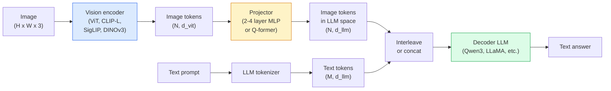

# 视觉-语言模型 —— ViT-MLP-LLM 范式

> 视觉编码器把图像转换成 token，MLP 投影器（projector）把这些 token 映射到 LLM 的嵌入空间，剩下的交给语言模型。这个范式——ViT-MLP-LLM——就是 2026 年所有生产级 VLM 的共同结构。

**Type:** Learn + Use
**Languages:** Python
**Prerequisites:** Phase 4 Lesson 14 (ViT), Phase 4 Lesson 18 (CLIP), Phase 7 Lesson 02 (Self-Attention)
**Time:** ~75 minutes

## 学习目标

- 说出 ViT-MLP-LLM 架构，并解释三个组件各自的作用
- 从参数量、上下文长度和基准测试表现三个维度对比 Qwen3-VL、InternVL3.5、LLaVA-Next 和 GLM-4.6V
- 解释 DeepStack：为什么多层级 ViT 特征比单一末层特征能带来更紧密的视觉-语言对齐
- 在生产环境中用跨模态错误率（Cross-Modal Error Rate, CMER）度量 VLM 幻觉，并依据该信号采取行动

## 问题背景

CLIP（第 4 阶段第 18 课）为图像和文本提供了一个共享嵌入空间，足以支撑零样本分类和检索。但它回答不了"这张图里有几辆红色的车？"——因为 CLIP 不生成文本，它只计算相似度分数。

视觉-语言模型（Vision-Language Model, VLM）——Qwen3-VL、InternVL3.5、LLaVA-Next、GLM-4.6V——把一个 CLIP 系的图像编码器接到一个完整的语言模型上。模型看到一张图像加一个问题，然后生成答案。到 2026 年，开源 VLM 在多模态基准（MMMU、MMBench、DocVQA、ChartQA、MathVista、OSWorld）上已经追平甚至超越 GPT-5 和 Gemini-2.5-Pro。

这三件套（ViT、投影器、LLM）是标准结构。各模型之间的差异在于：用哪个 ViT、哪种投影器、哪个 LLM，以及训练数据和对齐配方。一旦理解了这个范式，替换任何一个组件都是机械化的操作。

## 核心概念

### ViT-MLP-LLM 架构



1. **视觉编码器** —— 一个预训练的 ViT（CLIP-L/14、SigLIP、DINOv3，或其微调变体），产出 patch token。
2. **投影器** —— 一个小模块（2-4 层 MLP，或 Q-former），把视觉 token 映射到 LLM 的嵌入维度。大部分微调工作都发生在这里。
3. **LLM** —— 一个 decoder-only 语言模型（Qwen3、Llama、Mistral、GLM、InternLM），按序列读入视觉 + 文本 token，生成文本。

原则上三个组件都可以训练。实践中，视觉编码器和 LLM 大多保持冻结，只训练投影器——用很低的成本就能撬动几十亿参数的能力。

### DeepStack

朴素的投影方案只用 ViT 的最后一层。DeepStack（Qwen3-VL）从 ViT 的多个深度采样特征并堆叠起来。深层携带高层语义，浅层携带细粒度的空间和纹理信息。把两者一起喂给 LLM，就缩小了"图像里有什么"（语义）和"具体在哪里"（空间定位）之间的差距。

### 三阶段训练

现代 VLM 分阶段训练：

1. **对齐（Alignment）** —— 冻结 ViT 和 LLM，只在图像-描述对上训练投影器。教会投影器把视觉空间映射到语言空间。
2. **预训练（Pre-training）** —— 全部解冻，在大规模图文交错数据（5 亿对以上）上训练。构建模型的视觉知识。
3. **指令微调（Instruction tuning）** —— 在精选的（图像、问题、答案）三元组上微调。教会模型对话行为和任务格式。正是这一步把"懂视觉的语言模型"变成可用的助手。

大多数 LoRA 微调针对的是第 3 阶段，用一个小规模的标注数据集。

### 模型家族对比（2026 年初）

| 模型 | 参数量 | 视觉编码器 | LLM | 上下文 | 优势 |
|-------|--------|----------------|-----|---------|-----------|
| Qwen3-VL-235B-A22B (MoE) | 235B（22B 激活） | 自研 ViT + DeepStack | Qwen3 | 256K | 通用 SOTA，GUI 智能体 |
| Qwen3-VL-30B-A3B (MoE) | 30B（3B 激活） | 自研 ViT + DeepStack | Qwen3 | 256K | 更小的 MoE 替代方案 |
| Qwen3-VL-8B (dense) | 8B | 自研 ViT | Qwen3 | 128K | 生产环境稠密模型默认选择 |
| InternVL3.5-38B | 38B | InternViT-6B | Qwen3 + GPT-OSS | 128K | MMBench / MMVet 表现强 |
| InternVL3.5-241B-A28B | 241B（28B 激活） | InternViT-6B | Qwen3 | 128K | 与 GPT-4o 不相上下 |
| LLaVA-Next 72B | 72B | SigLIP | Llama-3 | 32K | 开放，易于微调 |
| GLM-4.6V | ~70B | 自研 | GLM | 64K | 开源，OCR 能力强 |
| MiniCPM-V-2.6 | 8B | SigLIP | MiniCPM | 32K | 适合端侧部署 |

### 视觉智能体

Qwen3-VL-235B 在 OSWorld 上达到全球顶尖水平——这是一个针对**视觉智能体（visual agent）**操作 GUI（桌面、移动端、网页）的基准。模型看到一张截图，理解界面，然后输出动作（点击、输入、滚动）。配合工具调用，它能端到端完成常见的桌面任务。2026 年大多数 "AI PC" 演示的底层跑的就是这套东西。

### 智能体能力 + RoPE 变体

VLM 需要知道一帧画面在视频中的**时间位置**。Qwen3-VL 从 T-RoPE（时间旋转位置编码）演进到了**基于文本的时间对齐**——把显式的时间戳文本 token 与视频帧交错排列。模型看到的是 "`<timestamp 00:32>` 帧, 提示词"，从而能够推理时间关系。

### 对齐问题

爬取数据集中有 12% 的图文对包含未完全立足于图像内容的描述。在这种数据上训练的 VLM 会悄无声息地学会幻觉——凭空捏造物体、读错数字、虚构关系。在生产环境中，这是最主要的失效模式。

Skywork.ai 引入了**跨模态错误率（Cross-Modal Error Rate, CMER）**来跟踪它：

```
CMER = fraction of outputs where the text confidence is high but the image-text similarity (via a CLIP-family checker) is low
```

CMER 高意味着模型在自信地说一些没有图像依据的话。在他们的部署中，监控 CMER 并把它当作生产 KPI，使幻觉率下降了约 35%。诀窍不是"修模型"，而是"把高 CMER 的输出路由给人工审核"。

### 用 LoRA / QLoRA 微调

对大多数团队来说，全量微调一个 70B 的 VLM 遥不可及。在注意力层 + 投影器层上做 LoRA（秩 16-64），或者用 4-bit 基座权重做 QLoRA，单张 A100 / H100 就能放下。成本：5,000-50,000 条样本，100-5,000 美元的算力，2-10 小时的训练时间。

### 空间推理仍然薄弱

当前 VLM 在空间推理基准（上下、左右、计数、距离）上的得分只有 50-60%。如果你的用例依赖"哪个物体在哪个物体上面"这类判断，务必重点验证——通用 VLM 在这方面的表现低于人类水平。对于纯空间任务，优于 VLM 的替代方案有：专用的关键点/姿态估计器、深度模型，或者对检测框几何做后处理的检测模型。

## 从零实现

### 第 1 步：投影器

这是你最常需要训练的部分。2-4 层带 GELU 的 MLP。

```python
import torch
import torch.nn as nn


class Projector(nn.Module):
    def __init__(self, vit_dim=768, llm_dim=4096, hidden=4096):
        super().__init__()
        self.net = nn.Sequential(
            nn.Linear(vit_dim, hidden),
            nn.GELU(),
            nn.Linear(hidden, llm_dim),
        )

    def forward(self, x):
        return self.net(x)
```

输入是一个 `(N_patches, d_vit)` 的 token 张量，输出是 `(N_patches, d_llm)`。LLM 把输出的每一行都当作一个普通 token 处理。

### 第 2 步：端到端组装 ViT-MLP-LLM

一个最小 VLM 前向传播的骨架。真实代码会用 `transformers`；这里展示的是概念性结构。

```python
class MinimalVLM(nn.Module):
    def __init__(self, vit, projector, llm, image_token_id):
        super().__init__()
        self.vit = vit
        self.projector = projector
        self.llm = llm
        self.image_token_id = image_token_id  # placeholder token in text prompt

    def forward(self, image, input_ids, attention_mask):
        # 1. vision features
        vision_tokens = self.vit(image)                     # (B, N_patches, d_vit)
        vision_embeds = self.projector(vision_tokens)       # (B, N_patches, d_llm)

        # 2. text embeddings
        text_embeds = self.llm.get_input_embeddings()(input_ids)  # (B, M, d_llm)

        # 3. replace image placeholder tokens with vision embeds
        merged = self._merge(text_embeds, vision_embeds, input_ids)

        # 4. run LLM
        return self.llm(inputs_embeds=merged, attention_mask=attention_mask)

    def _merge(self, text_embeds, vision_embeds, input_ids):
        out = text_embeds.clone()
        expected = vision_embeds.size(1)
        for b in range(input_ids.size(0)):
            positions = (input_ids[b] == self.image_token_id).nonzero(as_tuple=True)[0]
            if len(positions) != expected:
                raise ValueError(
                    f"batch item {b} has {len(positions)} image tokens but vision_embeds has {expected} patches."
                    " Every sample in the batch must be pre-padded to the same number of image placeholder tokens.")
            out[b, positions] = vision_embeds[b]
        return out
```

文本中的 `<image>` 占位 token 会被真实的图像嵌入替换——LLaVA、Qwen-VL 和 InternVL 用的都是同一套模式。

### 第 3 步：计算 CMER

一个轻量级的运行时检查。

```python
import torch.nn.functional as F


def cross_modal_error_rate(image_emb, text_emb, text_confidence, sim_threshold=0.25, conf_threshold=0.8):
    """
    image_emb, text_emb: embeddings of image and generated text (normalised internally)
    text_confidence:     mean per-token probability in [0, 1]
    Returns:             fraction of high-confidence outputs with low image-text alignment
    """
    image_emb = F.normalize(image_emb, dim=-1)
    text_emb = F.normalize(text_emb, dim=-1)
    sim = (image_emb * text_emb).sum(dim=-1)        # cosine similarity
    high_conf_low_sim = (text_confidence > conf_threshold) & (sim < sim_threshold)
    return high_conf_low_sim.float().mean().item()
```

把 CMER 当作生产 KPI。按端点、按提示词类型、按客户分别监控。CMER 上升说明模型开始在某个输入分布上产生幻觉。

### 第 4 步：玩具 VLM 分类器（可运行）

演示投影器确实能训起来。输入伪造的 "ViT 特征"，由一个微型 LLM 式的 token 预测类别。

```python
class ToyVLM(nn.Module):
    def __init__(self, vit_dim=32, llm_dim=64, num_classes=5):
        super().__init__()
        self.projector = Projector(vit_dim, llm_dim, hidden=64)
        self.head = nn.Linear(llm_dim, num_classes)

    def forward(self, vision_tokens):
        projected = self.projector(vision_tokens)
        pooled = projected.mean(dim=1)
        return self.head(pooled)
```

在合成的（特征，类别）对上，不到 200 步就能拟合——足以证明投影器范式有效。

## 生产实践

2026 年生产团队使用 VLM 的三种方式：

- **托管 API** —— OpenAI Vision、Anthropic Claude Vision、Google Gemini Vision。零基础设施投入，但有供应商风险。
- **开源自托管** —— 通过 `transformers` 和 `vllm` 部署 Qwen3-VL 或 InternVL3.5。完全可控，前期投入更高。
- **领域微调** —— 加载 Qwen2.5-VL-7B 或 LLaVA-1.6-7B，在 5k-50k 条自有样本上做 LoRA，再用 `vllm` 或 `TGI` 提供服务。

```python
from transformers import AutoProcessor, AutoModelForVision2Seq
import torch
from PIL import Image

model_id = "Qwen/Qwen3-VL-8B-Instruct"
processor = AutoProcessor.from_pretrained(model_id)
model = AutoModelForVision2Seq.from_pretrained(model_id, torch_dtype=torch.bfloat16, device_map="auto")

messages = [{
    "role": "user",
    "content": [
        {"type": "image", "image": Image.open("plot.png")},
        {"type": "text", "text": "What does this chart show?"},
    ],
}]
inputs = processor.apply_chat_template(messages, add_generation_prompt=True, tokenize=True, return_dict=True, return_tensors="pt").to("cuda")
generated = model.generate(**inputs, max_new_tokens=256)
answer = processor.decode(generated[0][inputs["input_ids"].shape[1]:], skip_special_tokens=True)
```

`apply_chat_template` 隐藏了 `<image>` 占位符的分词细节；嵌入合并由模型在内部完成。

## 交付产物

本课产出：

- `outputs/prompt-vlm-selector.md` —— 根据精度、延迟、上下文长度和预算，在 Qwen3-VL / InternVL3.5 / LLaVA-Next / API 之间做选型。
- `outputs/skill-cmer-monitor.md` —— 生成为生产 VLM 端点接入跨模态错误率监控的代码，含按端点划分的仪表盘和告警阈值。

## 练习

1. **（简单）** 在任意一个开源 VLM 上，用三种提示词（"这是什么？"、"数一下物体数量"、"描述这个场景"）跑 5 张图像。人工把每个回答标为正确 / 部分正确 / 幻觉，算出一个初版的类 CMER 比率。
2. **（中等）** 用 LoRA（秩 16）在目标领域的 500 张带描述图像上微调 Qwen2.5-VL-3B 或 LLaVA-1.6-7B。对比零样本和微调后的 MMBench 式准确率。
3. **（困难）** 把 VLM 的图像编码器从默认的 SigLIP/CLIP 换成 DINOv3。只重新训练投影器（LLM 和 DINOv3 均冻结）。测量稠密预测任务（计数、空间推理）是否有提升。

## 关键术语

| 术语 | 人们怎么说 | 实际含义 |
|------|----------------|----------------------|
| ViT-MLP-LLM | "VLM 范式" | 视觉编码器 + 投影器 + 语言模型；2026 年所有 VLM 的结构 |
| 投影器（Projector） | "桥梁" | 把视觉 token 映射到 LLM 嵌入空间的 2-4 层 MLP（或 Q-former） |
| DeepStack | "Qwen3-VL 的特征技巧" | 堆叠多层级 ViT 特征，而非只取最后一层 |
| 图像 token | "<image> 占位符" | 文本流中的特殊 token，会被投影后的视觉嵌入替换 |
| CMER | "幻觉 KPI" | 跨模态错误率；文本置信度高但图文相似度低时该值升高 |
| 视觉智能体 | "会点击的 VLM" | 通过工具调用操作 GUI（OSWorld、移动端、网页）的 VLM |
| Q-former | "固定数量 token 的桥" | BLIP-2 式投影器，产出固定数量的视觉查询 token |
| 对齐 / 预训练 / 指令微调 | "三阶段" | 标准的 VLM 训练流水线 |

## 延伸阅读

- [Qwen3-VL Technical Report (arXiv 2511.21631)](https://arxiv.org/abs/2511.21631)
- [InternVL3.5 Advancing Open-Source Multimodal Models (arXiv 2508.18265)](https://arxiv.org/html/2508.18265v1)
- [LLaVA-Next series](https://llava-vl.github.io/blog/2024-05-10-llava-next-stronger-llms/)
- [BentoML: Best Open-Source VLMs 2026](https://www.bentoml.com/blog/multimodal-ai-a-guide-to-open-source-vision-language-models)
- [MMMU: Multi-discipline Multimodal Understanding benchmark](https://mmmu-benchmark.github.io/)
- [VLMs in manufacturing (Robotics Tomorrow, March 2026)](https://www.roboticstomorrow.com/story/2026/03/when-machines-learn-to-see-like-experts-the-rise-of-vision-language-models-in-manufacturing/26335/)
