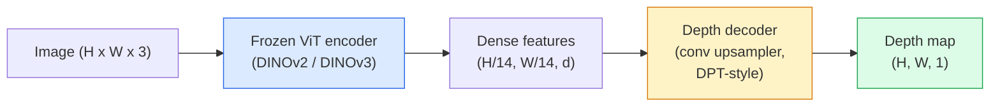

# 单目深度与几何估计

> 深度图（depth map）是一张单通道图像，每个像素值表示该点到相机的距离。过去，如果没有双目立体视觉或 LiDAR，从单帧 RGB 图像预测深度几乎不可能。到了 2026 年，一个冻结的 ViT 编码器加一个轻量级解码头，就能把误差控制在与真值相差几个百分点以内。

**Type:** Build + Use
**Languages:** Python
**Prerequisites:** Phase 4 Lesson 14 (ViT), Phase 4 Lesson 17 (Self-Supervised Vision), Phase 4 Lesson 07 (U-Net)
**Time:** ~60 minutes

## 学习目标

- 区分相对深度与度量深度，并说明各生产级模型（MiDaS、Marigold、Depth Anything V3、ZoeDepth）分别解决的是哪一种
- 使用 Depth Anything V3（DINOv2 骨干网络）在无需任何标定的情况下，对任意单张图像预测深度
- 解释为什么单张图像也能估计深度（透视线索、纹理梯度、学习到的先验），以及它无法恢复什么（绝对尺度、被遮挡的几何结构）
- 利用深度图和针孔相机内参，把 2D 检测结果提升为 3D 点

## 问题背景

深度是 2D 计算机视觉中缺失的那个维度。给定 RGB 图像，你知道物体出现在图像平面的哪个位置，却不知道它们离相机有多远。深度传感器（双目相机、LiDAR、ToF）可以直接解决这个问题，但它们昂贵、易损、量程有限。

单目深度估计（monocular depth estimation）——从单帧 RGB 图像预测深度——曾经只能产出模糊、不可靠的结果。到 2026 年，大规模预训练编码器改变了这一点：Depth Anything V3 使用冻结的 DINOv2 骨干网络，生成的深度图能够泛化到室内、室外、医学影像和卫星图像等多种领域。Marigold 把深度估计重新表述为条件扩散问题。ZoeDepth 则直接回归真实的度量距离。

深度还是连接 2D 检测与 3D 理解的桥梁：把检测框内的像素乘以深度，就能把 2D 物体提升为 3D 点云。这正是所有 AR 遮挡系统、所有避障流水线，以及所有"拿起杯子"类机器人的核心。

## 核心概念

### 相对深度与度量深度

- **相对深度（relative depth）**——有序的 `z` 值，但没有真实世界的单位。"像素 A 比像素 B 更近，但距离的比例没有锚定到米。"
- **度量深度（metric depth）**——到相机的绝对距离，以米为单位。要求模型学习过图像线索与真实距离之间的统计关系。

MiDaS 和 Depth Anything V3 输出相对深度。Marigold 输出相对深度。ZoeDepth、UniDepth 和 Metric3D 输出度量深度。度量深度模型对相机内参敏感；相对深度模型则不敏感。

### 编码器-解码器模式



Depth Anything V3 冻结编码器，只训练 DPT 风格的解码器。编码器提供丰富的特征；解码器把这些特征插值回原图分辨率并回归出深度。

### 为什么单张图像就能估计深度

一张 2D 图像包含许多与深度相关的单目线索：

- **透视**——3D 空间中的平行线在 2D 图像中会汇聚。
- **纹理梯度**——远处的表面纹理更小、更密集。
- **遮挡顺序**——更近的物体会遮挡更远的物体。
- **尺寸恒常性**——已知尺寸的物体（汽车、行人）提供了大致的尺度参照。
- **大气透视**——室外场景中，远处的物体看起来更朦胧、更偏蓝。

在数十亿张图像上训练过的 ViT 会内化这些线索。只要数据足够多、骨干网络足够强，单目深度无需任何显式的 3D 监督就能达到不错的精度。

### 单目深度做不到的事

- **绝对度量尺度**——在没有内参或场景中没有已知物体的情况下无法恢复。网络可以预测"杯子比勺子远一倍"，却不知道杯子是在 1 米还是 10 米之外。
- **被遮挡的几何结构**——椅子的背面是看不见的，无法可靠地推断出来。
- **真正无纹理或高反射的表面**——镜子、玻璃、纯色墙面。网络会给出看似合理但实际错误的深度。

### 2026 年的 Depth Anything V3

- 编码器为原版 DINOv2 ViT-L/14（冻结）。
- DPT 解码器。
- 在来自多种来源的带位姿图像对上训练（除光度一致性外，无需显式深度监督）。
- 可从**任意数量的视觉输入（无论是否已知相机位姿）**预测空间一致的几何结构。
- 在单目深度、任意视角几何、视觉渲染、相机位姿估计等任务上均为 SOTA。

2026 年需要深度估计时，这就是可以直接拿来用的模型。

### Marigold——用扩散模型估计深度

Marigold（Ke et al., CVPR 2024）把深度估计重新表述为条件式图像到图像的扩散问题。条件输入：RGB。目标输出：深度图。骨干网络使用预训练的 Stable Diffusion 2 U-Net。输出的深度图在物体边缘处异常锐利。代价是：推理比前馈式模型慢（需要 10-50 步去噪）。

### 相机内参与针孔相机模型

把带有深度 `d` 的像素 `(u, v)` 提升为相机坐标系下的 3D 点 `(X, Y, Z)`：

```
fx, fy, cx, cy = camera intrinsics
X = (u - cx) * d / fx
Y = (v - cy) * d / fy
Z = d
```

内参可以来自 EXIF 元数据、标定板，或单目内参估计器（Perspective Fields、UniDepth）。即使没有内参，你也可以假设 60-70° 的视场角（FOV）和位于图像中心附近的主点来渲染点云——可用于可视化，但不能用于测量。

### 评估

两个标准指标：

- **AbsRel**（绝对相对误差）：`mean(|d_pred - d_gt| / d_gt)`。越低越好。生产级模型在 0.05-0.1。
- **delta < 1.25**（阈值精度）：满足 `max(d_pred/d_gt, d_gt/d_pred) < 1.25` 的像素比例。越高越好。SOTA 模型在 0.9 以上。

对于相对深度模型（Depth Anything V3、MiDaS），评估时需使用这两个指标的尺度-平移不变（scale-and-shift invariant）版本。

## 从零实现

### 第 1 步：深度评估指标

```python
import torch

def abs_rel_error(pred, target, mask=None):
    if mask is not None:
        pred = pred[mask]
        target = target[mask]
    return (torch.abs(pred - target) / target.clamp(min=1e-6)).mean().item()


def delta_accuracy(pred, target, threshold=1.25, mask=None):
    if mask is not None:
        pred = pred[mask]
        target = target[mask]
    ratio = torch.maximum(pred / target.clamp(min=1e-6), target / pred.clamp(min=1e-6))
    return (ratio < threshold).float().mean().item()
```

评估前务必先把无效深度像素（零值、NaN、饱和值）用掩码屏蔽掉。

### 第 2 步：尺度-平移对齐

对于相对深度模型，计算指标前要先把预测值对齐到真值。用最小二乘拟合 `a * pred + b = target`：

```python
def align_scale_shift(pred, target, mask=None):
    if mask is not None:
        p = pred[mask]
        t = target[mask]
    else:
        p = pred.flatten()
        t = target.flatten()
    A = torch.stack([p, torch.ones_like(p)], dim=1)
    coeffs, *_ = torch.linalg.lstsq(A, t.unsqueeze(-1))
    a, b = coeffs[:2, 0]
    return a * pred + b
```

评估 MiDaS / Depth Anything 时，先运行 `align_scale_shift`，再运行 `abs_rel_error`。

### 第 3 步：把深度提升为点云

```python
import numpy as np

def depth_to_point_cloud(depth, intrinsics):
    H, W = depth.shape
    fx, fy, cx, cy = intrinsics
    v, u = np.meshgrid(np.arange(H), np.arange(W), indexing="ij")
    z = depth
    x = (u - cx) * z / fx
    y = (v - cy) * z / fy
    return np.stack([x, y, z], axis=-1)


depth = np.random.uniform(0.5, 4.0, (240, 320))
intr = (320.0, 320.0, 160.0, 120.0)
pc = depth_to_point_cloud(depth, intr)
print(f"point cloud shape: {pc.shape}  (H, W, 3)")
```

一个函数，覆盖所有 3D 提升类应用。可以把点云导出为 `.ply`，用 MeshLab 或 CloudCompare 打开查看。

### 第 4 步：用合成深度场景做冒烟测试

```python
def synthetic_depth(size=96):
    yy, xx = np.meshgrid(np.arange(size), np.arange(size), indexing="ij")
    # Floor: linear gradient from near (top) to far (bottom)
    depth = 1.0 + (yy / size) * 4.0
    # Box in the middle: closer
    mask = (np.abs(xx - size / 2) < size / 6) & (np.abs(yy - size * 0.6) < size / 6)
    depth[mask] = 2.0
    return depth.astype(np.float32)


gt = torch.from_numpy(synthetic_depth(96))
pred = gt + 0.3 * torch.randn_like(gt)  # simulated prediction
aligned = align_scale_shift(pred, gt)
print(f"before align  absRel = {abs_rel_error(pred, gt):.3f}")
print(f"after align   absRel = {abs_rel_error(aligned, gt):.3f}")
```

### 第 5 步：Depth Anything V3 的使用方法（参考）

```python
import torch
from transformers import pipeline
from PIL import Image

pipe = pipeline(task="depth-estimation", model="LiheYoung/depth-anything-v2-large")

image = Image.open("street.jpg").convert("RGB")
out = pipe(image)
depth_np = np.array(out["depth"])
```

三行代码搞定。`out["depth"]` 是 PIL 灰度图；做数值计算前先转成 numpy 数组。如果要用 Depth Anything V3，等其发布后换一下模型 id 即可，API 不变。

## 生产实践

- **Depth Anything V3**（Meta AI / ByteDance, 2024-2026）——相对深度的默认选择。生产环境中速度最快的 ViT-large 骨干模型。
- **Marigold**（ETH, 2024）——视觉质量最高，推理慢。
- **UniDepth**（ETH, 2024）——度量深度，同时估计相机内参。
- **ZoeDepth**（Intel, 2023）——度量深度；较老但依然可靠。
- **MiDaS v3.1**——传统方案，但很稳定；适合作为对比基线。

典型集成模式：

1. RGB 帧到达。
2. 深度模型生成深度图。
3. 检测器输出检测框。
4. 借助深度把检测框中心点提升到 3D；如有点云数据则与之融合。
5. 下游应用：AR 遮挡、路径规划、物体尺寸估计、替代双目立体视觉。

实时场景下，Depth Anything V2 Small（INT8 量化）在消费级 GPU 上以 518x518 分辨率可达到约 30 fps。

## 交付产物

本课产出：

- `outputs/prompt-depth-model-picker.md`——根据延迟要求、度量/相对深度需求和场景类型，在 Depth Anything V3、Marigold、UniDepth、MiDaS 之间做选型。
- `outputs/skill-depth-to-pointcloud.md`——一个从深度图构建点云的技能，正确处理相机内参并支持导出为 `.ply`。

## 练习

1. **（简单）** 用 Depth Anything V2 处理你书桌的任意 10 张照片。把深度保存为灰度 PNG 并检查。找出一个深度预测明显有误的物体，并解释单目线索为何在它上面失效。
2. **（中等）** 给定 Depth Anything V2 输出的 RGB + 深度，提升为点云并用 `open3d` 渲染。对比两个场景（室内/室外），记录哪个看起来更可信。
3. **（困难）** 拍摄五组图像对，每组之间仅有一个已知物体的位置不同（例如瓶子向相机移近了 30 cm）。用 UniDepth 对两张图分别预测度量深度。报告预测出的距离差与真实 30 cm 的对比。

## 关键术语

| 术语 | 大家怎么说 | 实际含义 |
|------|----------------|----------------------|
| 单目深度 | "单图深度" | 从单帧 RGB 图像估计深度，不依赖双目或 LiDAR |
| 相对深度 | "有序深度" | 有序的 z 值，没有真实世界单位 |
| 度量深度 | "绝对距离" | 以米为单位的深度；需要标定或用度量监督训练的模型 |
| AbsRel | "绝对相对误差" | |d_pred - d_gt| / d_gt 的均值；标准深度指标 |
| Delta 精度 | "delta < 1.25" | 预测值与真值偏差在 25% 以内的像素比例 |
| 针孔相机 | "fx, fy, cx, cy" | 用于把 (u, v, d) 提升为 (X, Y, Z) 的相机模型 |
| DPT | "Dense Prediction Transformer" | 架在冻结 ViT 编码器之上、基于卷积的深度解码器 |
| DINOv2 骨干网络 | "它能成的原因" | 自监督特征，无需深度标签即可跨领域泛化 |

## 延伸阅读

- [Depth Anything V3 paper page](https://depth-anything.github.io/) —— 基于 DINOv2 编码器的 SOTA 单目深度
- [Marigold (Ke et al., CVPR 2024)](https://marigoldmonodepth.github.io/) —— 基于扩散模型的深度估计
- [UniDepth (Piccinelli et al., 2024)](https://arxiv.org/abs/2403.18913) —— 带内参估计的度量深度
- [MiDaS v3.1 (Intel ISL)](https://github.com/isl-org/MiDaS) —— 相对深度的经典基线
- [DINOv3 blog post (Meta)](https://ai.meta.com/blog/dinov3-self-supervised-vision-model/) —— 提升深度估计精度的编码器家族
