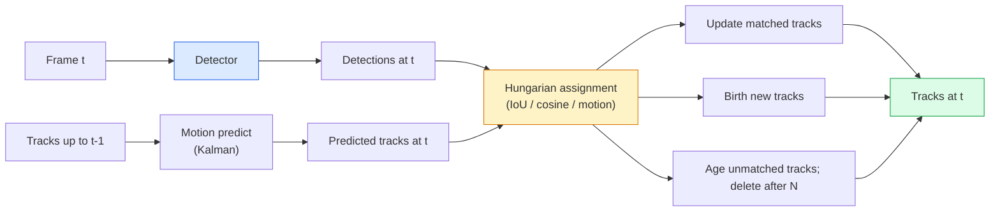

# 多目标跟踪与视频记忆

> 跟踪 = 检测 + 关联。每一帧都做检测，再把这一帧的检测结果按 ID 匹配到上一帧的轨迹上。

**Type:** Build
**Languages:** Python
**Prerequisites:** Phase 4 Lesson 06 (YOLO Detection), Phase 4 Lesson 08 (Mask R-CNN), Phase 4 Lesson 24 (SAM 3)
**Time:** ~60 minutes

## 学习目标

- 区分基于检测的跟踪（tracking-by-detection）与基于查询的跟踪（query-based tracking），并说出各算法家族的名字（SORT、DeepSORT、ByteTrack、BoT-SORT、SAM 2 记忆跟踪器、SAM 3.1 Object Multiplex）
- 从零实现 IoU + 匈牙利算法（Hungarian assignment），完成经典的基于检测的跟踪
- 解释 SAM 2 的记忆库（memory bank），以及它为什么比基于 IoU 的关联更能应对遮挡
- 读懂三个跟踪指标（MOTA、IDF1、HOTA），并能针对具体场景选出该看哪一个

## 问题背景

检测器告诉你单帧画面里物体在哪儿。跟踪器告诉你第 `t` 帧的某个检测结果与第 `t-1` 帧的某个检测结果是不是同一个物体。没有这一步，你就无法统计穿过某条线的物体数量，无法在遮挡中持续跟住一个球，也无法知道"4 号车已经在这条车道上待了 8 秒"。

跟踪是所有面向视频的产品的基础能力：体育分析、安防监控、自动驾驶、医学视频分析、野生动物监测、商标曝光统计。这些场景共享同一套核心构件：逐帧检测器、运动模型（卡尔曼滤波器或更复杂的模型）、关联步骤（在 IoU / 余弦相似度 / 学习特征上跑匈牙利算法），以及轨迹生命周期管理（新建、更新、消亡）。

2026 年出现了两种新范式：**SAM 2 基于记忆的跟踪**（用特征记忆取代运动模型关联）和 **SAM 3.1 Object Multiplex**（同一概念的多个实例共享一份记忆）。本课先走一遍经典技术栈，再讲基于记忆的方法。

## 核心概念

### 基于检测的跟踪



2026 年你能遇到的每一个跟踪器都是这套循环的变体。差异在于：

- **SORT**（2016）：卡尔曼滤波器 + IoU 匈牙利匹配。简单、快，没有外观模型。
- **DeepSORT**（2017）：SORT + 每条轨迹一个基于 CNN 的外观特征（ReID 嵌入）。处理轨迹交叉的能力更好。
- **ByteTrack**（2021）：把低置信度检测作为第二阶段参与关联；不需要外观特征，却是 MOT17 上的顶尖选手。
- **BoT-SORT**（2022）：Byte + 相机运动补偿 + ReID。
- **StrongSORT / OC-SORT** —— ByteTrack 的后继者，运动和外观建模更强。

### 一段话讲清卡尔曼滤波器

卡尔曼滤波器（Kalman filter）为每条轨迹维护一个状态 `(x, y, w, h, dx, dy, dw, dh)` 及其协方差。每一帧先用匀速运动模型做**预测（predict）**，再用匹配到的检测结果做**更新（update）**。预测的不确定性越高，更新时就越信任检测结果。这样既能得到平滑的轨迹，也能让轨迹在短暂遮挡（1-5 帧）中延续下去。

所有经典跟踪器的运动预测步骤都用卡尔曼滤波器。

### 匈牙利算法

给定一个 `M x N` 代价矩阵（轨迹 x 检测），找出总代价最小的一一对应分配。代价通常取 `1 - IoU(track_bbox, detection_bbox)`，或外观特征余弦相似度的负值。时间复杂度为 O((M+N)^3)；当 M、N 不超过约 1000 时，用 `scipy.optimize.linear_sum_assignment` 在 Python 里跑足够快。

### ByteTrack 的关键想法

标准跟踪器会丢掉低置信度检测（< 0.5）。ByteTrack 把它们留下来当**第二阶段候选**：先把轨迹与高置信度检测匹配，没匹配上的轨迹再用略宽松的 IoU 阈值去匹配低置信度检测。这能找回短暂遮挡，减少人群附近的 ID 切换。

### SAM 2 基于记忆的跟踪

SAM 2 处理视频的方式是为每个实例维护一个时空特征的**记忆库（memory bank）**。在某一帧上给出提示（点击、框、文本），它就把该实例编码进记忆。在后续帧中，记忆与新帧特征做交叉注意力，解码器输出同一实例在新帧中的掩码。

没有卡尔曼滤波器，没有匈牙利匹配。关联隐含在记忆注意力操作里。

优点：

- 对大范围遮挡鲁棒（记忆能跨很多帧保持实例身份）。
- 与 SAM 3 的文本提示结合后支持开放词表（open-vocabulary）。
- 不需要单独的运动模型。

缺点：

- 多目标跟踪时比 ByteTrack 慢。
- 记忆库会不断增长，受限于上下文窗口。

### SAM 3.1 Object Multiplex

此前的 SAM 2 / SAM 3 跟踪给每个实例单独维护一个记忆库。50 个物体就是 50 份记忆库。Object Multiplex（2026 年 3 月）把它们合并成一份共享记忆，配合**每实例查询 token**。计算成本随实例数量呈次线性增长。

Multiplex 是 2026 年人群跟踪的新默认方案：演唱会人群、仓库工人、交通路口。

### 必须知道的三个指标

- **MOTA（Multi-Object Tracking Accuracy，多目标跟踪准确率）** —— 1 - (FN + FP + ID 切换数) / GT。按错误类型加权；是一个把检测失败和关联失败混在一起的单一指标。
- **IDF1（ID F1）** —— ID 精确率与召回率的调和平均。专门衡量每条真值轨迹随时间保持自身 ID 的能力。对 ID 切换敏感的任务用它比 MOTA 更合适。
- **HOTA（Higher Order Tracking Accuracy，高阶跟踪准确率）** —— 可分解为检测准确率（DetA）和关联准确率（AssA）。2020 年以来的社区标准，最全面。

安防监控（关注"谁是谁"）：报 IDF1。体育分析（统计传球次数）：报 HOTA。一般性学术对比：报 HOTA。

## 从零实现

### 第 1 步：基于 IoU 的代价矩阵

```python
import numpy as np


def bbox_iou(a, b):
    """
    a, b: (N, 4) arrays of [x1, y1, x2, y2].
    Returns (N_a, N_b) IoU matrix.
    """
    ax1, ay1, ax2, ay2 = a[:, 0], a[:, 1], a[:, 2], a[:, 3]
    bx1, by1, bx2, by2 = b[:, 0], b[:, 1], b[:, 2], b[:, 3]
    inter_x1 = np.maximum(ax1[:, None], bx1[None, :])
    inter_y1 = np.maximum(ay1[:, None], by1[None, :])
    inter_x2 = np.minimum(ax2[:, None], bx2[None, :])
    inter_y2 = np.minimum(ay2[:, None], by2[None, :])
    inter = np.clip(inter_x2 - inter_x1, 0, None) * np.clip(inter_y2 - inter_y1, 0, None)
    area_a = (ax2 - ax1) * (ay2 - ay1)
    area_b = (bx2 - bx1) * (by2 - by1)
    union = area_a[:, None] + area_b[None, :] - inter
    return inter / np.clip(union, 1e-8, None)
```

### 第 2 步：极简 SORT 风格跟踪器

为简洁起见省略了匀速卡尔曼滤波 —— 这里只用简单的 IoU 关联；生产环境中卡尔曼预测必不可少。Python 的 `sort` 包提供了完整版本。

```python
from scipy.optimize import linear_sum_assignment


class Track:
    def __init__(self, tid, bbox, frame):
        self.id = tid
        self.bbox = bbox
        self.last_frame = frame
        self.hits = 1

    def update(self, bbox, frame):
        self.bbox = bbox
        self.last_frame = frame
        self.hits += 1


class SimpleTracker:
    def __init__(self, iou_threshold=0.3, max_age=5):
        self.tracks = []
        self.next_id = 1
        self.iou_threshold = iou_threshold
        self.max_age = max_age

    def step(self, detections, frame):
        if not self.tracks:
            for d in detections:
                self.tracks.append(Track(self.next_id, d, frame))
                self.next_id += 1
            return [(t.id, t.bbox) for t in self.tracks]

        track_boxes = np.array([t.bbox for t in self.tracks])
        det_boxes = np.array(detections) if len(detections) else np.empty((0, 4))

        iou = bbox_iou(track_boxes, det_boxes) if len(det_boxes) else np.zeros((len(track_boxes), 0))
        cost = 1 - iou
        cost[iou < self.iou_threshold] = 1e6

        matched_track = set()
        matched_det = set()
        if cost.size > 0:
            row, col = linear_sum_assignment(cost)
            for r, c in zip(row, col):
                if cost[r, c] < 1.0:
                    self.tracks[r].update(det_boxes[c], frame)
                    matched_track.add(r); matched_det.add(c)

        for i, d in enumerate(det_boxes):
            if i not in matched_det:
                self.tracks.append(Track(self.next_id, d, frame))
                self.next_id += 1

        self.tracks = [t for t in self.tracks if frame - t.last_frame <= self.max_age]
        return [(t.id, t.bbox) for t in self.tracks]
```

60 行代码。输入逐帧检测结果，输出逐帧轨迹 ID。真实系统会再加上卡尔曼预测、ByteTrack 的第二阶段重匹配以及外观特征。

### 第 3 步：合成轨迹测试

```python
def synthetic_frames(num_frames=20, num_objects=3, H=240, W=320, seed=0):
    rng = np.random.default_rng(seed)
    starts = rng.uniform(20, 200, size=(num_objects, 2))
    velocities = rng.uniform(-5, 5, size=(num_objects, 2))
    frames = []
    for f in range(num_frames):
        dets = []
        for i in range(num_objects):
            cx, cy = starts[i] + f * velocities[i]
            dets.append([cx - 10, cy - 10, cx + 10, cy + 10])
        frames.append(dets)
    return frames


tracker = SimpleTracker()
for f, dets in enumerate(synthetic_frames()):
    tracks = tracker.step(dets, f)
```

三个沿直线运动的物体应该在全部 20 帧中始终保持各自的 ID。

### 第 4 步：ID 切换指标

```python
def count_id_switches(tracks_per_frame, gt_per_frame):
    """
    tracks_per_frame:  list of list of (track_id, bbox)
    gt_per_frame:      list of list of (gt_id, bbox)
    Returns number of ID switches.
    """
    prev_assignment = {}
    switches = 0
    for tracks, gts in zip(tracks_per_frame, gt_per_frame):
        if not tracks or not gts:
            continue
        t_boxes = np.array([b for _, b in tracks])
        g_boxes = np.array([b for _, b in gts])
        iou = bbox_iou(g_boxes, t_boxes)
        for g_idx, (gt_id, _) in enumerate(gts):
            j = iou[g_idx].argmax()
            if iou[g_idx, j] > 0.5:
                t_id = tracks[j][0]
                if gt_id in prev_assignment and prev_assignment[gt_id] != t_id:
                    switches += 1
                prev_assignment[gt_id] = t_id
    return switches
```

这是一个简化的、与 IDF1 思路相近的指标：统计一个真值物体被分配的预测轨迹 ID 变化了多少次。真正的 MOTA / IDF1 / HOTA 工具在 `py-motmetrics` 和 `TrackEval` 里。

## 生产实践

2026 年的生产级跟踪器：

- `ultralytics` —— 内置 YOLOv8 + ByteTrack / BoT-SORT。`results = model.track(source, tracker="bytetrack.yaml")`。默认之选。
- `supervision`（Roboflow）—— ByteTrack 封装外加标注工具。
- SAM 2 / SAM 3.1 —— 通过 `processor.track()` 做基于记忆的跟踪。
- 自建技术栈：检测器（YOLOv8 / RT-DETR）+ `sort-tracker` / `OC-SORT` / `StrongSORT`。

选型指南：

- 30+ fps 下的行人 / 车辆 / 箱体：**ultralytics 配 ByteTrack**。
- 人群中同一类别的大量实例：**SAM 3.1 Object Multiplex**。
- 重度遮挡但外观可辨识：**DeepSORT / StrongSORT**（ReID 特征）。
- 体育 / 复杂交互场景：**BoT-SORT** 或学习式跟踪器（MOTRv3）。

## 交付产物

本课产出：

- `outputs/prompt-tracker-picker.md` —— 根据场景类型、遮挡模式和延迟预算，在 SORT / ByteTrack / BoT-SORT / SAM 2 / SAM 3.1 之间做选型。
- `outputs/skill-mot-evaluator.md` —— 编写一套完整的评估框架，基于真值轨迹计算 MOTA / IDF1 / HOTA。

## 练习

1. **（简单）** 用上面的合成跟踪器分别跑 3、10、30 个物体。报告每种情况下的 ID 切换次数。找出纯 IoU 关联从哪里开始失效。
2. **（中等）** 在关联之前加一步匀速卡尔曼预测。证明短暂遮挡（2-3 帧）不再导致 ID 切换。
3. **（困难）** 集成 SAM 2 的记忆跟踪器（通过 `transformers`）作为另一个跟踪器后端。在一段 30 秒的人群视频上同时运行 SimpleTracker 和 SAM 2，比较两者的 ID 切换次数；对 5 个显著的人手工标注真值 ID。

## 关键术语

| 术语 | 大家怎么说 | 实际含义 |
|------|----------------|----------------------|
| 基于检测的跟踪 | "先检测再关联" | 逐帧检测器 + 在 IoU / 外观特征上跑匈牙利匹配 |
| 卡尔曼滤波器 | "运动预测" | 线性动力学 + 协方差，给出平滑的轨迹预测并应对遮挡 |
| 匈牙利算法 | "最优分配" | 求解最小代价二分图匹配问题；`scipy.optimize.linear_sum_assignment` |
| ByteTrack | "低置信度第二轮" | 把未匹配的轨迹与低置信度检测重新匹配，以找回短暂遮挡 |
| DeepSORT | "SORT + 外观" | 增加 ReID 特征做跨帧匹配；更好地保持 ID |
| 记忆库 | "SAM 2 的诀窍" | 跨帧存储的每实例时空特征；用交叉注意力取代显式关联 |
| Object Multiplex | "SAM 3.1 共享记忆" | 单一共享记忆配每实例查询，实现快速多目标跟踪 |
| HOTA | "现代跟踪指标" | 分解为检测准确率和关联准确率；社区标准 |

## 延伸阅读

- [SORT (Bewley et al., 2016)](https://arxiv.org/abs/1602.00763) —— 最精简的基于检测的跟踪论文
- [DeepSORT (Wojke et al., 2017)](https://arxiv.org/abs/1703.07402) —— 加入外观特征
- [ByteTrack (Zhang et al., 2022)](https://arxiv.org/abs/2110.06864) —— 低置信度第二轮匹配
- [BoT-SORT (Aharon et al., 2022)](https://arxiv.org/abs/2206.14651) —— 相机运动补偿
- [HOTA (Luiten et al., 2020)](https://arxiv.org/abs/2009.07736) —— 可分解的跟踪指标
- [SAM 2 video segmentation (Meta, 2024)](https://ai.meta.com/sam2/) —— 基于记忆的跟踪器
- [SAM 3.1 Object Multiplex (Meta, March 2026)](https://ai.meta.com/blog/segment-anything-model-3/)
