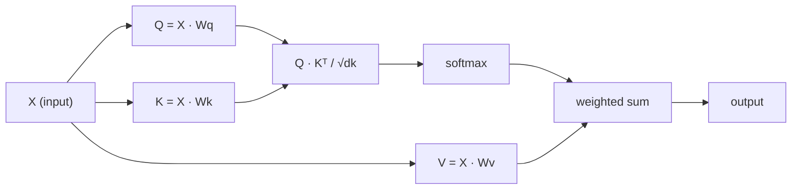

# 从零实现自注意力

> 注意力就是一张查找表：每个词都在问"谁对我重要？"——而答案是学出来的。

**Type:** Build
**Languages:** Python
**Prerequisites:** Phase 3 (Deep Learning Core), Phase 5 Lesson 10 (Sequence-to-Sequence)
**Time:** ~90 minutes

## 学习目标

- 仅用 NumPy 从零实现缩放点积自注意力（scaled dot-product self-attention），包括 query/key/value 投影和 softmax 加权求和
- 构建多头注意力（multi-head attention）层：拆分注意力头、并行计算注意力、再拼接结果
- 追踪注意力矩阵如何捕捉 token 之间的关系，并解释为什么除以 sqrt(d_k) 能避免 softmax 饱和
- 应用因果掩码（causal mask），把双向注意力变成自回归（解码器风格）注意力

## 问题背景

RNN 一次只处理一个 token。等你处理到第 50 个 token 时，第 1 个 token 的信息已经被压缩了 50 次。长距离依赖被挤进一个固定大小的隐藏状态里——这是一个瓶颈，再多的 LSTM 门控也无法彻底解决。

2014 年的 Bahdanau 注意力论文给出了解法：让解码器回看编码器的每个位置，并自行决定哪些位置对当前这一步重要。但它仍然是挂在 RNN 上的附加组件。2017 年的 "Attention Is All You Need" 论文提出了一个更尖锐的问题：如果注意力是*唯一*的机制会怎样？不要循环，不要卷积，只用注意力。

自注意力让序列中的每个位置在一次并行计算中关注所有其他位置。这正是 Transformer 快速、可扩展、占据主导地位的原因。

## 核心概念

### 数据库查找类比

可以把注意力看作一种"软"数据库查找：

```
Traditional database:
  Query: "capital of France"  -->  exact match  -->  "Paris"

Attention:
  Query: "capital of France"  -->  similarity to ALL keys  -->  weighted blend of ALL values
```

每个 token 都会生成三个向量：

- **Query（Q）**："我在找什么？"
- **Key（K）**："我包含什么？"
- **Value（V）**："如果我被选中，我能提供什么信息？"

一个 query 与所有 key 的点积产生注意力分数。分数高意味着"这个 key 与我的 query 匹配"。这些分数为 value 加权，输出就是 value 的加权和。

### Q、K、V 的计算

每个 token 的嵌入会经过三个可学习的权重矩阵投影：

```
Input embeddings (sequence of n tokens, each d-dimensional):

  X = [x1, x2, x3, ..., xn]       shape: (n, d)

Three weight matrices:

  Wq  shape: (d, dk)
  Wk  shape: (d, dk)
  Wv  shape: (d, dv)

Projections:

  Q = X @ Wq    shape: (n, dk)      each token's query
  K = X @ Wk    shape: (n, dk)      each token's key
  V = X @ Wv    shape: (n, dv)      each token's value
```

对单个 token 来说，直观图示如下：

```
             Wq
  x_i ------[*]------> q_i    "What am I looking for?"
       |
       |     Wk
       +----[*]------> k_i    "What do I contain?"
       |
       |     Wv
       +----[*]------> v_i    "What do I offer?"
```

### 注意力矩阵

拿到所有 token 的 Q、K、V 之后，注意力分数构成一个矩阵：

```
Scores = Q @ K^T    shape: (n, n)

              k1    k2    k3    k4    k5
        +-----+-----+-----+-----+-----+
   q1   | 2.1 | 0.3 | 0.1 | 0.8 | 0.2 |   <- how much q1 attends to each key
        +-----+-----+-----+-----+-----+
   q2   | 0.4 | 1.9 | 0.7 | 0.1 | 0.3 |
        +-----+-----+-----+-----+-----+
   q3   | 0.2 | 0.6 | 2.3 | 0.5 | 0.1 |
        +-----+-----+-----+-----+-----+
   q4   | 0.9 | 0.1 | 0.4 | 1.7 | 0.6 |
        +-----+-----+-----+-----+-----+
   q5   | 0.1 | 0.3 | 0.2 | 0.5 | 2.0 |
        +-----+-----+-----+-----+-----+

Each row: one token's attention over the entire sequence
```

逐个观察每个 query 扫过所有 key 的过程：每一行给所有 token 打分，softmax 把分数变成权重，上下文向量就是 value 的加权混合。

```figure
attention-matrix
```

### 为什么要缩放？

点积的大小会随维度 dk 增长。如果 dk = 64，点积可能达到几十，把 softmax 推入梯度消失的区域。解决办法：除以 sqrt(dk)。

```
Scaled scores = (Q @ K^T) / sqrt(dk)
```

这样可以把数值保持在 softmax 能产生有效梯度的范围内。

### Softmax 把分数变成权重

Softmax 把每一行的原始分数转换成概率分布：

```
Raw scores for q1:   [2.1, 0.3, 0.1, 0.8, 0.2]
                            |
                         softmax
                            |
Attention weights:   [0.52, 0.09, 0.07, 0.14, 0.08]   (sums to ~1.0)
```

现在每个 token 都有一组权重，表示它应该关注其他每个 token 多少。

### Value 的加权求和

每个 token 的最终输出是所有 value 向量的加权和：

```
output_i = sum( attention_weight[i][j] * v_j  for all j )

For token 1:
  output_1 = 0.52 * v1 + 0.09 * v2 + 0.07 * v3 + 0.14 * v4 + 0.08 * v5
```

### 完整流程



一行公式：

```
Attention(Q, K, V) = softmax( Q @ K^T / sqrt(dk) ) @ V
```

```figure
softmax-attention-scaling
```

## 从零实现

### 第 1 步：从零实现 softmax

Softmax 把原始 logits 转换成概率。先减去最大值以保证数值稳定性。

```python
import numpy as np

def softmax(x):
    shifted = x - np.max(x, axis=-1, keepdims=True)
    exp_x = np.exp(shifted)
    return exp_x / np.sum(exp_x, axis=-1, keepdims=True)

logits = np.array([2.0, 1.0, 0.1])
print(f"logits:  {logits}")
print(f"softmax: {softmax(logits)}")
print(f"sum:     {softmax(logits).sum():.4f}")
```

### 第 2 步：缩放点积注意力

核心函数。接收 Q、K、V 矩阵，返回注意力输出和权重矩阵。

```python
def scaled_dot_product_attention(Q, K, V):
    dk = Q.shape[-1]
    scores = Q @ K.T / np.sqrt(dk)
    weights = softmax(scores)
    output = weights @ V
    return output, weights
```

### 第 3 步：带可学习投影的自注意力类

一个完整的自注意力模块，其中 Wq、Wk、Wv 权重矩阵采用类 Xavier 缩放初始化。

```python
class SelfAttention:
    def __init__(self, d_model, dk, dv, seed=42):
        rng = np.random.default_rng(seed)
        scale = np.sqrt(2.0 / (d_model + dk))
        self.Wq = rng.normal(0, scale, (d_model, dk))
        self.Wk = rng.normal(0, scale, (d_model, dk))
        scale_v = np.sqrt(2.0 / (d_model + dv))
        self.Wv = rng.normal(0, scale_v, (d_model, dv))
        self.dk = dk

    def forward(self, X):
        Q = X @ self.Wq
        K = X @ self.Wk
        V = X @ self.Wv
        output, weights = scaled_dot_product_attention(Q, K, V)
        return output, weights
```

### 第 4 步：在一个句子上运行

为一个句子构造假的嵌入，观察注意力权重。

```python
sentence = ["The", "cat", "sat", "on", "the", "mat"]
n_tokens = len(sentence)
d_model = 8
dk = 4
dv = 4

rng = np.random.default_rng(42)
X = rng.normal(0, 1, (n_tokens, d_model))

attn = SelfAttention(d_model, dk, dv, seed=42)
output, weights = attn.forward(X)

print("Attention weights (each row: where that token looks):\n")
print(f"{'':>6}", end="")
for token in sentence:
    print(f"{token:>6}", end="")
print()

for i, token in enumerate(sentence):
    print(f"{token:>6}", end="")
    for j in range(n_tokens):
        w = weights[i][j]
        print(f"{w:6.3f}", end="")
    print()
```

### 第 5 步：用 ASCII 热力图可视化注意力

把注意力权重映射成字符，快速得到一个直观视图。

```python
def ascii_heatmap(weights, tokens, chars=" ░▒▓█"):
    n = len(tokens)
    print(f"\n{'':>6}", end="")
    for t in tokens:
        print(f"{t:>6}", end="")
    print()

    for i in range(n):
        print(f"{tokens[i]:>6}", end="")
        for j in range(n):
            level = int(weights[i][j] * (len(chars) - 1) / weights.max())
            level = min(level, len(chars) - 1)
            print(f"{'  ' + chars[level] + '   '}", end="")
        print()

ascii_heatmap(weights, sentence)
```

## 生产实践

PyTorch 的 `nn.MultiheadAttention` 做的正是我们刚刚实现的东西，外加多头拆分和输出投影：

```python
import torch
import torch.nn as nn

d_model = 8
n_heads = 2
seq_len = 6

mha = nn.MultiheadAttention(embed_dim=d_model, num_heads=n_heads, batch_first=True)

X_torch = torch.randn(1, seq_len, d_model)

output, attn_weights = mha(X_torch, X_torch, X_torch)

print(f"Input shape:            {X_torch.shape}")
print(f"Output shape:           {output.shape}")
print(f"Attention weight shape: {attn_weights.shape}")
print(f"\nAttn weights (averaged over heads):")
print(attn_weights[0].detach().numpy().round(3))
```

关键区别：多头注意力并行运行多个注意力函数，每个头有自己的 Q、K、V 投影，维度为 dk = d_model / n_heads，最后拼接结果。这让模型可以同时关注不同类型的关系。

## 交付产物

本课产出：

- `outputs/prompt-attention-explainer.md` —— 一个用数据库查找类比讲解注意力机制的提示词

## 练习

1. 修改 `scaled_dot_product_attention`，让它接受一个可选的掩码矩阵，在 softmax 之前把某些位置设为负无穷（这正是因果/解码器掩码的工作方式）
2. 从零实现多头注意力：把 Q、K、V 拆成 `n_heads` 份，分别计算注意力，拼接结果，再通过最终的权重矩阵 Wo 投影
3. 取两个长度相同但内容不同的句子，输入同一个 SelfAttention 实例，比较它们的注意力模式。哪些变了？哪些没变？

## 关键术语

| 术语 | 通俗说法 | 实际含义 |
|------|----------------|----------------------|
| Query（Q） | "提问向量" | 输入的一个可学习投影，表示该 token 在寻找什么信息 |
| Key（K） | "标签向量" | 一个可学习投影，表示该 token 包含什么信息，用来与 query 进行匹配 |
| Value（V） | "内容向量" | 一个可学习投影，承载真正的信息，按注意力分数进行聚合 |
| 缩放点积注意力 | "注意力公式" | softmax(QK^T / sqrt(dk)) @ V——缩放可以防止高维下的 softmax 饱和 |
| 自注意力 | "token 既看自己也看别人" | Q、K、V 都来自同一个序列的注意力，让每个位置都能关注所有其他位置 |
| 注意力权重 | "关注程度" | 对各位置的概率分布，由缩放点积经 softmax 得到 |
| 多头注意力 | "并行注意力" | 用不同的投影并行运行多个注意力函数，再拼接结果，得到更丰富的表示 |

## 延伸阅读

- [Attention Is All You Need (Vaswani et al., 2017)](https://arxiv.org/abs/1706.03762) —— Transformer 原始论文
- [The Illustrated Transformer (Jay Alammar)](https://jalammar.github.io/illustrated-transformer/) —— 对完整架构最好的可视化讲解
- [The Annotated Transformer (Harvard NLP)](https://nlp.seas.harvard.edu/annotated-transformer/) —— 带逐行讲解的 PyTorch 实现
