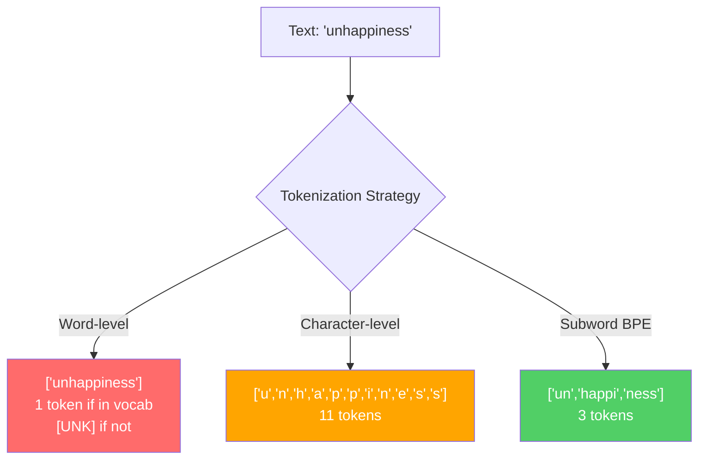
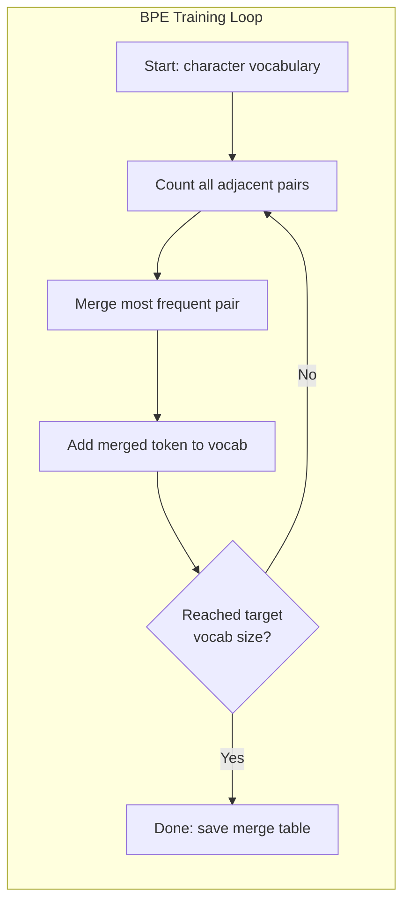
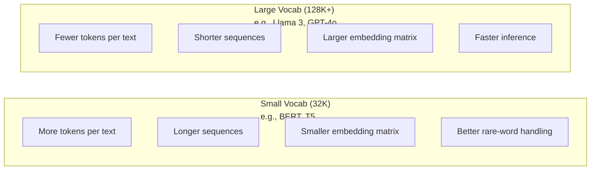

# 分词器：BPE、WordPiece、SentencePiece

> 你的 LLM 并不会读英文。它读的是整数。这些整数究竟承载意义还是浪费意义，由分词器决定。

**Type:** Build
**Languages:** Python
**Prerequisites:** Phase 05 (NLP Foundations)
**Time:** ~90 minutes

## 学习目标

- 从零实现 BPE、WordPiece 和 Unigram 分词算法，并比较它们的合并策略
- 解释词表大小如何影响模型效率：词表太小会产生过长的序列，太大则浪费嵌入参数
- 分析不同语言和代码上的分词产物，找出特定分词器在哪些场景下会失效
- 使用 tiktoken 和 sentencepiece 库对文本进行分词，并检查生成的 token ID

## 问题背景

你的 LLM 不会读英文。它不会读任何语言。它读的是数字。

"Hello, world!" 与 [15496, 11, 995, 0] 之间的鸿沟，就是分词器（tokenizer）。每个单词、每个空格、每个标点符号都必须先转换成整数，模型才能处理。这个转换过程并不是中立的，它会把一些假设固化进模型，之后再也无法撤销。

如果分词器做得不好，模型就会浪费容量去用多个 token 编码常见词。"unfortunately" 会变成四个 token 而不是一个。对于多音节词密集的文本，你的 128K 上下文窗口实际上缩水了 75%。而如果做得好，同样的上下文窗口能容纳两倍的信息量。"这个模型擅长写代码"和"这个模型一碰 Python 就卡壳"之间的差异，往往就取决于分词器是怎么训练的。

你对 GPT-4 或 Claude 的每一次 API 调用都按 token 计费。模型生成的每个 token 都消耗算力。表示同样的输出所需的 token 越少，端到端推理就越快。分词不是预处理，它是架构本身。

## 核心概念

### 三种失败的方案（和一种胜出的方案）

把文本转换成数字有三种显而易见的方法。其中两种在大规模场景下行不通。

**词级分词（word-level tokenization）**按空格和标点切分。"The cat sat" 变成 ["The", "cat", "sat"]。简单。但 "tokenization" 怎么办？"GPT-4o" 呢？或者像 "Geschwindigkeitsbegrenzung" 这样的德语复合词呢？词级分词需要一个庞大的词表才能覆盖所有语言的所有单词。一旦遇到词表外的词，你就会得到可怕的 `[UNK]` token——这是模型在说"我完全不知道这是什么"。光是英语就有超过一百万种词形。再加上代码、URL、科学记数法和另外 100 种语言，你需要的词表是无限大的。

**字符级分词（character-level tokenization）**走向另一个极端。"hello" 变成 ["h", "e", "l", "l", "o"]。词表极小（几百个字符），永远不会出现未知 token。但序列会变得极长。一个本来只需 10 个词级 token 的句子，会变成 50 个字符级 token。模型必须自己学会 "t"、"h"、"e" 放在一起表示 "the"——把宝贵的注意力容量浪费在人类三岁就掌握的东西上。

**子词分词（subword tokenization）**找到了最佳平衡点。常见词保持完整："the" 是一个 token。罕见词分解成有意义的片段："unhappiness" 变成 ["un", "happi", "ness"]。词表规模保持可控（3 万到 12.8 万个 token），序列保持简短。未知 token 基本消失，因为任何单词都可以由子词片段拼出来。

每一个现代 LLM 都使用子词分词。GPT-2、GPT-4、BERT、Llama 3、Claude——无一例外。问题只在于选用哪种算法。



### BPE：字节对编码

BPE（Byte Pair Encoding，字节对编码）是一种被改造用于分词的贪心压缩算法。它的思想简单到能写在一张卡片上。

从单个字符开始。统计训练语料中所有相邻的字符对。把出现频率最高的一对合并成一个新 token。重复这个过程，直到达到目标词表大小。

```figure
tokenizer-bpe
```

下面是 BPE 在一个只包含 "lower"、"lowest"、"newest" 三个单词的微型语料上的运行过程：

```
Corpus (with word frequencies):
  "lower"  x5
  "lowest" x2
  "newest" x6

Step 0 -- Start with characters:
  l o w e r       (x5)
  l o w e s t     (x2)
  n e w e s t     (x6)

Step 1 -- Count adjacent pairs:
  (e,s): 8    (s,t): 8    (l,o): 7    (o,w): 7
  (w,e): 13   (e,r): 5    (n,e): 6    ...

Step 2 -- Merge most frequent pair (w,e) -> "we":
  l o we r        (x5)
  l o we s t      (x2)
  n e we s t      (x6)

Step 3 -- Recount and merge (e,s) -> "es":
  l o we r        (x5)
  l o we s t      (x2)    <- 'es' only forms from 'e'+'s', not 'we'+'s'
  n e we s t      (x6)    <- wait, the 'e' before 'we' and 's' after 'we'

Actually tracking this precisely:
  After "we" merge, remaining pairs:
  (l,o): 7   (o,we): 7   (we,r): 5   (we,s): 8
  (s,t): 8   (n,e): 6    (e,we): 6

Step 3 -- Merge (we,s) -> "wes" or (s,t) -> "st" (tied at 8, pick first):
  Merge (we,s) -> "wes":
  l o we r        (x5)
  l o wes t       (x2)
  n e wes t       (x6)

Step 4 -- Merge (wes,t) -> "west":
  l o we r        (x5)
  l o west        (x2)
  n e west        (x6)

...continue until target vocab size reached.
```

合并表（merge table）就是分词器本身。要编码新文本，只需按学习时的顺序依次应用各次合并。训练语料决定了哪些合并会存在，而这个选择会永久地塑造模型所看到的世界。



### 字节级 BPE（GPT-2、GPT-3、GPT-4）

标准 BPE 在 Unicode 字符上操作。字节级 BPE（byte-level BPE）则直接在原始字节（0-255）上操作。这样基础词表恰好是 256 个，能处理任何语言或编码，且永远不会产生未知 token。

GPT-2 首创了这种方法。基础词表覆盖所有可能的字节，BPE 合并在此之上叠加。OpenAI 的 tiktoken 库实现了字节级 BPE，对应的词表大小如下：

- GPT-2：50,257 个 token
- GPT-3.5/GPT-4：约 100,256 个 token（cl100k_base 编码）
- GPT-4o：200,019 个 token（o200k_base 编码）

### WordPiece（BERT）

WordPiece 看起来和 BPE 很相似，但选择合并对的方式不同。它不依据原始频率，而是最大化训练数据的似然：

```
BPE merge criterion:      count(A, B)
WordPiece merge criterion: count(AB) / (count(A) * count(B))
```

BPE 问的是："哪一对出现得最频繁？" WordPiece 问的是："哪一对共同出现的频率超出了随机预期？"这个细微的差别会产生不同的词表。WordPiece 偏好那些共现"出人意料"的合并，而不仅仅是频繁的合并。

WordPiece 还用 "##" 前缀来标记接续的子词：

```
"unhappiness" -> ["un", "##happi", "##ness"]
"embedding"   -> ["em", "##bed", "##ding"]
```

"##" 前缀表明这个片段是上一个 token 的延续。BERT 使用词表大小为 30,522 的 WordPiece。各 BERT 变体——DistilBERT 也是如此；RoBERTa 的分词器实际上是 BPE，但 BERT 本身用的是 WordPiece。

### SentencePiece（Llama、T5）

SentencePiece 把输入当作原始的 Unicode 字符流来处理，包括空白字符在内。没有预分词步骤，没有任何关于词边界的语言相关规则。这使它真正做到了语言无关——它适用于中文、日文、泰文等不用空格分隔单词的语言。

SentencePiece 支持两种算法：
- **BPE 模式**：与标准 BPE 相同的合并逻辑，直接应用于原始字符序列
- **Unigram 模式**：从一个很大的词表出发，迭代地删除对整体似然影响最小的 token。这是 BPE 的反向操作——靠剪枝而非合并。

Llama 2 使用词表为 32,000 的 SentencePiece BPE。T5 使用词表为 32,000 的 SentencePiece Unigram。注意：Llama 3 已改用基于 tiktoken 的字节级 BPE 分词器，词表为 128,256。

### 词表大小的权衡

这是一个有可测量后果的真实工程决策。



来看具体数字。对于一个 128K 的词表配 4,096 维嵌入，仅嵌入矩阵就有 128,000 x 4,096 = 5.24 亿个参数。换成 32K 词表则是 1.31 亿个参数。单是分词器的选择就带来了 4 亿参数的差距。

但更大的词表对文本的压缩更激进。同一段英文文本用 32K 词表需要 100 个 token，用 128K 词表可能只需 70 个。这意味着生成时的前向传播次数减少 30%。对于一个服务数百万请求的模型来说，这是算力成本的直接下降。

趋势很明确：词表正越来越大。GPT-2 用 50,257，GPT-4 约 100K，Llama 3 用 128K，GPT-4o 用 200K。

| 模型 | 词表大小 | 分词器类型 | 平均每个英文单词的 token 数 |
|-------|-----------|----------------|---------------------------|
| BERT | 30,522 | WordPiece | ~1.4 |
| GPT-2 | 50,257 | 字节级 BPE | ~1.3 |
| Llama 2 | 32,000 | SentencePiece BPE | ~1.4 |
| GPT-4 | ~100,256 | 字节级 BPE | ~1.2 |
| Llama 3 | 128,256 | 字节级 BPE（tiktoken） | ~1.1 |
| GPT-4o | 200,019 | 字节级 BPE | ~1.0 |

### 多语言税

主要在英文上训练的分词器对其他语言非常不友好。在 GPT-2 的分词器中，韩语文本平均每个词要消耗 2-3 个 token，中文可能更糟。这意味着对韩语用户来说，可用的上下文窗口实际上只有英语用户的一半——付同样的价钱，得到的信息密度却更低。

这正是 Llama 3 把词表从 32K 扩大到 128K（翻了四倍）的原因。把更多 token 分配给非英语文字，意味着各语言之间更公平的压缩率。

```figure
tokenizer-tradeoff
```

## 从零实现

### 第 1 步：字符级分词器

从最基础的开始。字符级分词器把每个字符映射到它的 Unicode 码点。不需要训练，没有未知 token，只是一个直接的映射。

```python
class CharTokenizer:
    def encode(self, text):
        return [ord(c) for c in text]

    def decode(self, tokens):
        return "".join(chr(t) for t in tokens)
```

"hello" 变成 [104, 101, 108, 108, 111]。每个字符都是一个独立的 token。这是我们后续要改进的基线。

### 第 2 步：从零实现 BPE 分词器

真正的实现来了。我们在原始字节上训练（和 GPT-2 一样），统计字节对，合并出现最频繁的那一对，并按顺序记录每一次合并。合并表就是分词器。

```python
from collections import Counter

class BPETokenizer:
    def __init__(self):
        self.merges = {}
        self.vocab = {}

    def _get_pairs(self, tokens):
        pairs = Counter()
        for i in range(len(tokens) - 1):
            pairs[(tokens[i], tokens[i + 1])] += 1
        return pairs

    def _merge_pair(self, tokens, pair, new_token):
        merged = []
        i = 0
        while i < len(tokens):
            if i < len(tokens) - 1 and tokens[i] == pair[0] and tokens[i + 1] == pair[1]:
                merged.append(new_token)
                i += 2
            else:
                merged.append(tokens[i])
                i += 1
        return merged

    def train(self, text, num_merges):
        tokens = list(text.encode("utf-8"))
        self.vocab = {i: bytes([i]) for i in range(256)}

        for i in range(num_merges):
            pairs = self._get_pairs(tokens)
            if not pairs:
                break
            best_pair = max(pairs, key=pairs.get)
            new_token = 256 + i
            tokens = self._merge_pair(tokens, best_pair, new_token)
            self.merges[best_pair] = new_token
            self.vocab[new_token] = self.vocab[best_pair[0]] + self.vocab[best_pair[1]]

        return self

    def encode(self, text):
        tokens = list(text.encode("utf-8"))
        for pair, new_token in self.merges.items():
            tokens = self._merge_pair(tokens, pair, new_token)
        return tokens

    def decode(self, tokens):
        byte_sequence = b"".join(self.vocab[t] for t in tokens)
        return byte_sequence.decode("utf-8", errors="replace")
```

训练循环是 BPE 的核心：统计字节对，合并胜出者，重复。每次合并都会减少总的 token 数。经过 `num_merges` 轮之后，词表从 256（基础字节）增长到 256 + num_merges。

编码时必须严格按照学习时的顺序应用合并。这很关键。如果第 1 次合并产生了 "th"，第 5 次合并产生了 "the"，那么编码时必须先执行第 1 次合并，"the" 才能在第 5 次合并中由 "th" + "e" 拼出来。

解码是逆过程：在词表中查找每个 token ID，拼接字节，再按 UTF-8 解码。

### 第 3 步：编码与解码往返测试

```python
corpus = (
    "The cat sat on the mat. The cat ate the rat. "
    "The dog sat on the log. The dog ate the frog. "
    "Natural language processing is the study of how computers "
    "understand and generate human language. "
    "Tokenization is the first step in any NLP pipeline."
)

tokenizer = BPETokenizer()
tokenizer.train(corpus, num_merges=40)

test_sentences = [
    "The cat sat on the mat.",
    "Natural language processing",
    "tokenization pipeline",
    "unhappiness",
]

for sentence in test_sentences:
    encoded = tokenizer.encode(sentence)
    decoded = tokenizer.decode(encoded)
    raw_bytes = len(sentence.encode("utf-8"))
    ratio = len(encoded) / raw_bytes
    print(f"'{sentence}'")
    print(f"  Tokens: {len(encoded)} (from {raw_bytes} bytes) -- ratio: {ratio:.2f}")
    print(f"  Roundtrip: {'PASS' if decoded == sentence else 'FAIL'}")
```

压缩率告诉你分词器的效率有多高。0.50 的压缩率意味着分词器把文本压缩到了原始字节数一半的 token 数。数值越低越好。在训练语料上，压缩率会很好看；在分布外的文本上，比如 "unhappiness"（语料中没出现过），压缩率会变差——对于没见过的模式，分词器会退化到字符级编码。

### 第 4 步：与 tiktoken 对比

```python
import tiktoken

enc = tiktoken.get_encoding("cl100k_base")

texts = [
    "The cat sat on the mat.",
    "unhappiness",
    "Hello, world!",
    "def fibonacci(n): return n if n < 2 else fibonacci(n-1) + fibonacci(n-2)",
    "Geschwindigkeitsbegrenzung",
]

for text in texts:
    our_tokens = tokenizer.encode(text)
    tiktoken_tokens = enc.encode(text)
    tiktoken_pieces = [enc.decode([t]) for t in tiktoken_tokens]
    print(f"'{text}'")
    print(f"  Our BPE:   {len(our_tokens)} tokens")
    print(f"  tiktoken:  {len(tiktoken_tokens)} tokens -> {tiktoken_pieces}")
```

tiktoken 使用的算法和我们一模一样，只不过是在数百 GB 的文本上训练，进行了 100,000 次合并。算法完全相同，差别只在训练数据和合并次数。你那个在一段文字上做了 40 次合并的分词器，自然比不过 tiktoken 在海量语料上的 10 万次合并。但机制是一样的。

### 第 5 步：词表分析

```python
def analyze_vocabulary(tokenizer, test_texts):
    total_tokens = 0
    total_chars = 0
    token_usage = Counter()

    for text in test_texts:
        encoded = tokenizer.encode(text)
        total_tokens += len(encoded)
        total_chars += len(text)
        for t in encoded:
            token_usage[t] += 1

    print(f"Vocabulary size: {len(tokenizer.vocab)}")
    print(f"Total tokens across all texts: {total_tokens}")
    print(f"Total characters: {total_chars}")
    print(f"Avg tokens per character: {total_tokens / total_chars:.2f}")

    print(f"\nMost used tokens:")
    for token_id, count in token_usage.most_common(10):
        token_bytes = tokenizer.vocab[token_id]
        display = token_bytes.decode("utf-8", errors="replace")
        print(f"  Token {token_id:4d}: '{display}' (used {count} times)")

    unused = [t for t in tokenizer.vocab if t not in token_usage]
    print(f"\nUnused tokens: {len(unused)} out of {len(tokenizer.vocab)}")
```

这段代码揭示了词表中的 Zipf 分布（Zipf distribution）。少数 token 占据主导地位（空格、"the"、"e"），而大多数 token 很少被使用。生产级分词器会针对这种分布做优化——常见模式获得短的 token ID，罕见模式则用更长的表示。

## 生产实践

你从零写的 BPE 能用了。现在来看看生产级工具长什么样。

### tiktoken（OpenAI）

```python
import tiktoken

enc = tiktoken.get_encoding("cl100k_base")

text = "Tokenizers convert text to integers"
tokens = enc.encode(text)
print(f"Tokens: {tokens}")
print(f"Pieces: {[enc.decode([t]) for t in tokens]}")
print(f"Roundtrip: {enc.decode(tokens)}")
```

tiktoken 用 Rust 编写并提供 Python 绑定，每秒可编码数百万个 token。同样的 BPE 算法，工业级的实现。

### Hugging Face tokenizers

```python
from tokenizers import Tokenizer
from tokenizers.models import BPE
from tokenizers.trainers import BpeTrainer
from tokenizers.pre_tokenizers import ByteLevel

tokenizer = Tokenizer(BPE())
tokenizer.pre_tokenizer = ByteLevel()

trainer = BpeTrainer(vocab_size=1000, special_tokens=["<pad>", "<eos>", "<unk>"])
tokenizer.train(["corpus.txt"], trainer)

output = tokenizer.encode("The cat sat on the mat.")
print(f"Tokens: {output.tokens}")
print(f"IDs: {output.ids}")
```

Hugging Face 的 tokenizers 库底层也是 Rust 实现。它能在几秒内于 GB 级语料上完成 BPE 训练。训练你自己的模型时，用的就是它。

### 加载 Llama 的分词器

```python
from transformers import AutoTokenizer

tokenizer = AutoTokenizer.from_pretrained("meta-llama/Llama-3.1-8B")

text = "Tokenizers are the unsung heroes of LLMs"
tokens = tokenizer.encode(text)
print(f"Token IDs: {tokens}")
print(f"Tokens: {tokenizer.convert_ids_to_tokens(tokens)}")
print(f"Vocab size: {tokenizer.vocab_size}")

multilingual = ["Hello world", "Hola mundo", "Bonjour le monde"]
for text in multilingual:
    ids = tokenizer.encode(text)
    print(f"'{text}' -> {len(ids)} tokens")
```

Llama 3 的 128K 词表对非英语文本的压缩效果明显优于 GPT-2 的 50K 词表。你可以亲自验证——把同一句话用多种语言编码，数一数 token 数量。

## 交付产物

本课产出 `outputs/prompt-tokenizer-analyzer.md`——一个可复用的提示词，用于分析任意文本与模型组合的分词效率。给它一段文本样本，它会告诉你哪个模型的分词器处理得最好。

## 练习

1. 修改 BPE 分词器，使其在每一步合并时打印词表。观察 "t" + "h" 如何变成 "th"，再观察 "th" + "e" 如何变成 "the"。追踪常见英文单词是如何一片一片被拼装出来的。

2. 给 BPE 分词器添加特殊 token（`<pad>`、`<eos>`、`<unk>`）。把它们的 ID 设为 0、1、2，并相应地移动其他所有 token 的 ID。实现一个预分词步骤，在运行 BPE 之前先按空白字符切分。

3. 实现 WordPiece 的合并准则（用似然比代替频率）。在同一语料上用相同的合并次数分别训练 BPE 和 WordPiece。比较得到的两个词表——哪一个产生的子词在语言学上更有意义？

4. 构建一个多语言分词效率基准。准备英语、西班牙语、中文、韩语、阿拉伯语各 10 个句子，用 tiktoken（cl100k_base）分别分词，测量平均每字符 token 数。量化每种语言的"多语言税"。

5. 在更大的语料上训练你的 BPE 分词器（下载一篇 Wikipedia 文章）。调整合并次数，使压缩率在同一文本上与 tiktoken 的差距控制在 10% 以内。这会迫使你理解语料规模、合并次数和压缩质量之间的关系。

## 关键术语

| 术语 | 人们常说 | 实际含义 |
|------|----------------|----------------------|
| Token | "一个单词" | 模型词表中的一个单元——可以是字符、子词、单词，或多词块 |
| BPE | "某种压缩算法" | 字节对编码（Byte Pair Encoding）——迭代地合并出现最频繁的相邻 token 对，直到达到目标词表大小 |
| WordPiece | "BERT 的分词器" | 类似 BPE，但合并准则是最大化似然比 count(AB)/(count(A)*count(B))，而非原始频率 |
| SentencePiece | "一个分词器库" | 语言无关的分词器，直接在原始 Unicode 上操作而无需预分词，支持 BPE 和 Unigram 两种算法 |
| 词表大小 | "它认识多少个词" | 唯一 token 的总数：GPT-2 是 50,257，BERT 是 30,522，Llama 3 是 128,256 |
| Fertility（生育率） | "不像分词术语" | 平均每个单词对应的 token 数——衡量分词器在各语言上的效率（1.0 为完美，3.0 意味着模型要多干三倍的活） |
| 字节级 BPE | "GPT 的分词器" | 在原始字节（0-255）而非 Unicode 字符上运行的 BPE，保证对任何输入都不会出现未知 token |
| 合并表 | "分词器文件" | 训练中学到的有序合并对列表——它就是分词器本身，且顺序至关重要 |
| 预分词 | "按空格切分" | 在子词分词之前应用的规则：空白切分、数字分离、标点处理 |
| 压缩率 | "分词器的效率" | 生成的 token 数除以输入字节数——越低意味着压缩越好、推理越快 |

## 延伸阅读

- [Sennrich et al., 2016 -- "Neural Machine Translation of Rare Words with Subword Units"](https://arxiv.org/abs/1508.07909)——将 BPE 引入 NLP 的开创性论文，把一个 1994 年的压缩算法变成了现代分词的基石
- [Kudo & Richardson, 2018 -- "SentencePiece: A simple and language independent subword tokenizer"](https://arxiv.org/abs/1808.06226)——语言无关的分词方案，让多语言模型变得切实可行
- [OpenAI tiktoken repository](https://github.com/openai/tiktoken)——Rust 编写、带 Python 绑定的生产级 BPE 实现，被 GPT-3.5/4/4o 使用
- [Hugging Face Tokenizers documentation](https://huggingface.co/docs/tokenizers)——具备 Rust 级性能的生产级分词器训练工具
