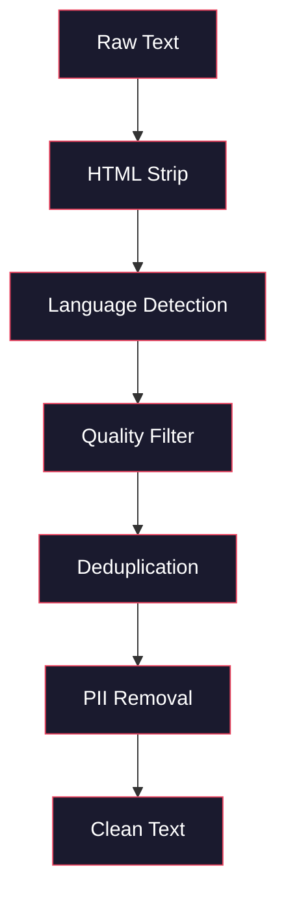
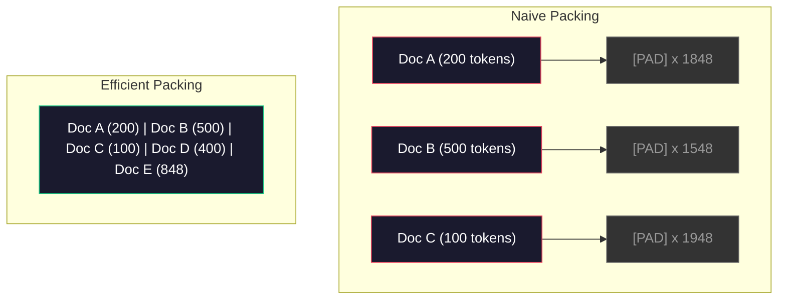

# 预训练数据管线

> 模型是一面镜子。你喂给它什么数据，它就反射什么。喂进去垃圾，它就会以完美的流畅度把垃圾反射回来。

**Type:** Build
**Languages:** Python
**Prerequisites:** Phase 10, Lessons 01-02 (Tokenizers, Building a Tokenizer)
**Time:** ~90 minutes

## 学习目标

- 构建一条流式数据管线，对 TB 级文本进行分词、切块、混洗（shuffle）和分批，而无需将全部数据加载进内存
- 实现真实预训练管线中使用的数据质量过滤器（去重、语言检测、内容过滤）
- 创建定长训练序列，并正确处理注意力掩码与文档边界
- 对管线吞吐量做性能分析，确保数据加载器跟得上 GPU 的训练速度

## 问题背景

你已经有了分词器。现在你需要数据。

不是一个数据集，也不是一个 CSV 文件。而是 TB 级的文本——经过清洗、去重、质量过滤，分词成定长序列，并以随机化批次的形式快速供给，快到让你的 8 卡 GPU 集群永远不用等待下一个批次。

大多数人以为训练 LLM 的关键在于模型架构。并非如此。Llama 3 用了 15.6 万亿个 token，GPT-3 用了 3000 亿个，DeepSeek-V2 用了 8.1 万亿个。这三者的架构大体相同：堆叠的 Transformer 模块，由注意力层和前馈层组成。输出质量的差异，绝大部分来自数据。

DeepMind 的 Chinchilla 论文把这件事讲得很精确。在给定的计算预算下，模型参数量与训练 token 数之间存在一个最优比例。Chinchilla 表明，2022 年的大多数模型都严重训练不足——相对于它们见过的数据量，参数太多了。一个在 1.4 万亿 token 上训练的 70B 参数模型（Chinchilla 最优配置），表现优于一个在 3000 亿 token 上训练的 280B 模型（Gopher）。

你的数据管线决定了模型学到的是语言，还是噪声。

## 核心概念

### 数据从哪里来

每个大语言模型都在多种来源混合的数据上训练。对大多数实验室来说，确切的配比是严格保密的，但我们已知的信息足以理解这些类别。

| 来源 | 规模 | 质量 | 使用者 |
|--------|------|---------|---------|
| Common Crawl | 原始数据约 250 TB | 低（需要重度过滤） | GPT-3、Llama、多数开源模型 |
| Wikipedia | 约 20 GB | 高 | 所有主流 LLM |
| GitHub 代码 | 1 TB 以上 | 中（大量重复和死代码） | StarCoder、CodeLlama、DeepSeek-Coder |
| 书籍（BookCorpus、Pile） | 约 100 GB | 高 | GPT-2、GPT-3、早期模型 |
| 学术论文（arXiv、S2ORC） | 约 100 GB | 对 STEM 领域质量高 | Llama、Galactica |
| StackOverflow、Reddit | 约 100 GB | 中 | Llama、Falcon |
| 精选网页数据（C4、RefinedWeb） | 约 5 TB | 中高（已预过滤） | T5、Falcon |

Llama 3 公开了它的数据配比：大约 50% 网页数据、25% 代码、13% 书籍和学术论文、8% 数学数据、4% 多语言网页数据。总量为 15.6 万亿 token，来自超过 5 TB 的原始文本。

配比和总量同样重要。网页数据太多，模型就成了 Reddit 复读机；代码太少，它就不会编程；数学太少，它的推理能力就不行。把这个配比调对，是训练 LLM 最难的环节之一，而且没有公式可循——只能靠实验和评估。

### 数据清洗

原始网页数据非常脏。一份典型的 Common Crawl 转储包含：

- HTML 标签和 JavaScript
- 模板化的页眉、页脚、导航菜单
- 重复页面（完全重复与近似重复）
- 机器生成的垃圾内容
- 个人身份信息（PII）
- 低质量文本（关键词列表、SEO 垃圾）
- 以文本形式编码的非文本内容

清洗不是可选项。它决定了模型是生成连贯的段落，还是输出混杂着商品列表的 HTML 标签。



每个步骤消除一类噪声：

**HTML 剥离：** 去掉所有标记，只保留可见的文本内容。`trafilatura` 或 `readability` 这类库可以在丢弃导航栏、广告和模板内容的同时，把正文提取出来。

**语言检测：** 使用 fastText 的语言识别模型（lid.176.bin）对每个文档分类，只保留目标语言。一篇被判为英语但置信度低于 0.8 的文档，多半不是干净的英语。

**质量过滤：** 这里开始变得有意思。RefinedWeb（Falcon 背后的数据集）使用基于困惑度（perplexity）的过滤器：先在 Wikipedia 上训练一个小语言模型，然后给每个文档打分。困惑度高意味着文档与 Wikipedia 风格差异大——很可能是垃圾内容、关键词列表或机器生成的文本。困惑度超过阈值的文档会被剔除。

**去重：** 影响最大的单个清洗步骤。Common Crawl 中存在海量重复页面——法律免责声明、Cookie 提示、服务条款。在重复数据上训练既浪费算力，还可能让模型逐字记住并复述特定段落。

**PII 移除：** 姓名、邮箱地址、电话号码、社会安全号码。对结构化 PII 用基于正则表达式的检测，对上下文中的人名用 NER 模型。

### 用 MinHash 去重

精确去重很简单：给每个文档做哈希，删除重复项。但近似重复才是真正的难题。同一篇新闻文章的两份副本，只是周围的广告略有不同，就是近似重复——内容 95% 相同，但逐字节比较并不一致。

MinHash + 局部敏感哈希（Locality-Sensitive Hashing，LSH）可以高效解决这个问题。


思路如下：

1. **Shingling（分片）：** 把每个文档转换为 n-gram 集合（例如词级或字符级的 5-gram）。"the quick brown fox" 按 3 词分片得到 {"the quick brown", "quick brown fox"}。

2. **MinHash：** 对每个文档的分片集合，计算 k 个哈希值。每个哈希值是在不同哈希函数下所有分片哈希的最小值。这样就得到一个定长的「签名」，可以近似估计任意两个文档之间的 Jaccard 相似度。

3. **LSH：** 按 MinHash 签名的分段（band）把文档归入桶中。落在同一个桶里的文档是近似重复的候选对。这样就避免了两两全量比较——只需比较候选对。

4. **校验：** 对每个候选对计算精确的 Jaccard 相似度。若相似度超过阈值（通常为 0.8），就删除其中一份。

Llama 团队报告称，去重大约移除了他们 38% 的网页数据。这不是个小数字——Common Crawl 中超过三分之一的内容是重复或近似重复的。

### 序列打包

模型期望定长的输入序列，而文档长度各不相同：有的 50 个 token，有的 50,000 个 token。

朴素做法：把每个文档都填充到最大序列长度。这会在对学习毫无贡献的填充 token 上浪费巨量计算。

更好的做法：把多个文档打包进同一条序列，用序列结束 token 分隔。一条 2048 token 的序列可能包含三个短文档，文档之间以 [EOS] token 连接。



注意力掩码必须设置正确。在同一条打包序列内，文档 A 的 token 不应该对文档 B 的 token 做注意力计算。这需要块对角（block-diagonal）注意力掩码。

长文档会在序列边界处被截断或切分成块。切分点很重要：在句子中间切分会迫使模型看到不完整的表达。一些管线会尽量把切分点对齐到段落或句子边界。

### Chinchilla 扩展定律

在固定计算预算 C（以 FLOPs 计）下，最优模型规模 N 和数据集规模 D 满足：

```
N_opt ~ C^0.5
D_opt ~ C^0.5
```

实践中这意味着模型规模和数据集规模应该大致同比例扩展。参数量增加 10 倍的模型，需要大约 10 倍的训练 token 才能达到相同的损失。

| 模型 | 参数量 | 训练 Token 数 | 是否 Chinchilla 最优？ |
|-------|-----------|----------------|-------------------|
| GPT-3 | 175B | 300B | 否（训练不足 3-4 倍） |
| Chinchilla | 70B | 1.4T | 是（按设计如此） |
| Llama 2 | 70B | 2T | 过度训练（有意为之） |
| Llama 3 | 70B | 15T | 严重过度训练 |

Llama 3 是故意违反 Chinchilla 定律的。Meta 发现，在更多数据上过度训练——远超计算最优比例——能得到推理表现更好的模型。额外的训练成本只需付一次，而更小的模型在部署服务时会一直更便宜。这种做法有时被称为「推理最优（inference-optimal）」扩展策略，自 2024 年以来已成为业界标准。

## 从零实现

### 第 1 步：文本清洗

剥离 HTML、归一化空白字符、移除非文本内容。我们用一份公有领域文本（Project Gutenberg）作为小语料库。

```python
import re

def clean_text(text):
    text = re.sub(r"<[^>]+>", "", text)
    text = re.sub(r"http\S+", "", text)
    text = re.sub(r"[^\x20-\x7E\n]", "", text)
    text = re.sub(r"\n{3,}", "\n\n", text)
    text = re.sub(r" {2,}", " ", text)
    return text.strip()

def quality_filter(text, min_words=50, max_ratio_caps=0.3, max_ratio_special=0.1):
    words = text.split()
    if len(words) < min_words:
        return False
    caps_ratio = sum(1 for w in words if w.isupper()) / len(words)
    if caps_ratio > max_ratio_caps:
        return False
    special_chars = sum(1 for c in text if not c.isalnum() and not c.isspace())
    if special_chars / max(len(text), 1) > max_ratio_special:
        return False
    return True
```

这个质量过滤器能抓住 SEO 垃圾（全大写）、机器生成的噪声（特殊字符比例过高）和占位短页（太短）。仅这三项检查，就能从网页爬取数据中剔除多到令人惊讶的垃圾。

### 第 2 步：MinHash 去重

从零实现 MinHash。不需要外部库——只用 `hashlib`。

```python
import hashlib
from collections import defaultdict

def get_shingles(text, k=5):
    words = text.lower().split()
    if len(words) < k:
        return set()
    return {" ".join(words[i:i+k]) for i in range(len(words) - k + 1)}

def minhash_signature(shingles, num_hashes=128):
    signature = []
    for i in range(num_hashes):
        min_hash = float("inf")
        for shingle in shingles:
            h = int(hashlib.sha256(f"{i}:{shingle}".encode()).hexdigest(), 16)
            min_hash = min(min_hash, h)
        signature.append(min_hash)
    return signature

def lsh_buckets(signature, bands=16):
    rows_per_band = len(signature) // bands
    buckets = []
    for b in range(bands):
        start = b * rows_per_band
        band_data = tuple(signature[start:start + rows_per_band])
        bucket_hash = hashlib.md5(str(band_data).encode()).hexdigest()
        buckets.append((b, bucket_hash))
    return buckets

def deduplicate(documents, threshold=0.8, num_hashes=128, bands=16):
    signatures = []
    shingle_sets = []
    for doc in documents:
        shingles = get_shingles(doc)
        shingle_sets.append(shingles)
        signatures.append(minhash_signature(shingles, num_hashes))

    bucket_map = defaultdict(list)
    for doc_idx, sig in enumerate(signatures):
        for band_id, bucket_hash in lsh_buckets(sig, bands):
            bucket_map[(band_id, bucket_hash)].append(doc_idx)

    duplicate_pairs = set()
    for bucket_docs in bucket_map.values():
        if len(bucket_docs) < 2:
            continue
        for i in range(len(bucket_docs)):
            for j in range(i + 1, len(bucket_docs)):
                duplicate_pairs.add((bucket_docs[i], bucket_docs[j]))

    removed = set()
    for i, j in duplicate_pairs:
        if i in removed or j in removed:
            continue
        s1, s2 = shingle_sets[i], shingle_sets[j]
        if not s1 or not s2:
            continue
        jaccard = len(s1 & s2) / len(s1 | s2)
        if jaccard >= threshold:
            removed.add(j)

    return [doc for idx, doc in enumerate(documents) if idx not in removed], len(removed)
```

`num_hashes=128` 和 `bands=16` 这两个参数控制精确率与召回率的权衡。哈希数越多，相似度估计越准确；band 数越多，召回率越高（抓到更多重复），但误报也越多。这组取值对典型的网页文本效果很好。

### 第 3 步：分词并打包序列

把清洗、去重后的文本分词，并打包成定长的训练序列。

```python
def tokenize_corpus(documents, tokenizer):
    all_tokens = []
    for doc in documents:
        tokens = tokenizer.encode(doc)
        all_tokens.extend(tokens)
        all_tokens.append(tokenizer.eos_id)
    return all_tokens

def pack_sequences(token_ids, seq_length, pad_id=0):
    sequences = []
    attention_masks = []
    for i in range(0, len(token_ids), seq_length):
        seq = token_ids[i:i + seq_length]
        mask = [1] * len(seq)
        if len(seq) < seq_length:
            pad_count = seq_length - len(seq)
            seq = seq + [pad_id] * pad_count
            mask = mask + [0] * pad_count
        sequences.append(seq)
        attention_masks.append(mask)
    return sequences, attention_masks
```

### 第 4 步：用于训练的 DataLoader

按随机顺序产出打包序列的批次。这是训练循环要消费的东西。

```python
import random

class PreTrainingDataLoader:
    def __init__(self, sequences, attention_masks, batch_size, shuffle=True):
        self.sequences = sequences
        self.attention_masks = attention_masks
        self.batch_size = batch_size
        self.shuffle = shuffle

    def __len__(self):
        return (len(self.sequences) + self.batch_size - 1) // self.batch_size

    def __iter__(self):
        indices = list(range(len(self.sequences)))
        if self.shuffle:
            random.shuffle(indices)
        for start in range(0, len(indices), self.batch_size):
            batch_idx = indices[start:start + self.batch_size]
            batch_seqs = [self.sequences[i] for i in batch_idx]
            batch_masks = [self.attention_masks[i] for i in batch_idx]
            yield batch_seqs, batch_masks
```

### 第 5 步：数据集统计

计算真正重要的数字：总 token 数、唯一 token 数、压缩比、文档长度分布。

```python
from collections import Counter

def compute_statistics(documents, token_ids, sequences, tokenizer_vocab_size):
    total_chars = sum(len(d) for d in documents)
    total_tokens = len(token_ids)
    unique_tokens = len(set(token_ids))
    compression_ratio = total_chars / total_tokens

    doc_lengths = [len(d.split()) for d in documents]
    avg_doc_length = sum(doc_lengths) / max(len(doc_lengths), 1)
    max_doc_length = max(doc_lengths) if doc_lengths else 0
    min_doc_length = min(doc_lengths) if doc_lengths else 0

    token_counts = Counter(token_ids)
    top_tokens = token_counts.most_common(10)

    non_pad_tokens = sum(sum(1 for t in seq if t != 0) for seq in sequences)
    total_positions = sum(len(seq) for seq in sequences)
    utilization = non_pad_tokens / max(total_positions, 1)

    stats = {
        "total_documents": len(documents),
        "total_characters": total_chars,
        "total_tokens": total_tokens,
        "unique_tokens": unique_tokens,
        "vocab_utilization": unique_tokens / tokenizer_vocab_size,
        "compression_ratio": compression_ratio,
        "avg_doc_length_words": avg_doc_length,
        "max_doc_length_words": max_doc_length,
        "min_doc_length_words": min_doc_length,
        "num_sequences": len(sequences),
        "sequence_utilization": utilization,
        "top_10_tokens": top_tokens,
    }
    return stats
```

压缩比反映了分词器在这份语料上的效率。英文文本通常压缩到每个 token 约 3-4 个字符。如果你看到每个 token 只有 1.5 个字符，说明分词器切得太碎；如果达到 8 个以上，说明它学到了非常领域特定的合并规则。

序列利用率告诉你打包序列中有多少是真实数据、多少是填充。低于 90% 意味着打包效率不高——你在填充 token 上浪费算力。

## 生产实践

### 与 HuggingFace Datasets 对比

通过 HuggingFace 的 datasets 库加载同一份语料，对比管线速度。

```python
from datasets import load_dataset
from transformers import AutoTokenizer

ds = load_dataset("wikitext", "wikitext-2-raw-v1", split="train")
tokenizer = AutoTokenizer.from_pretrained("meta-llama/Meta-Llama-3-8B")

import time

start = time.time()
tokenized = ds.map(
    lambda x: tokenizer(x["text"], truncation=True, max_length=2048),
    batched=True,
    num_proc=4,
)
hf_time = time.time() - start
total_tokens = sum(len(t) for t in tokenized["input_ids"])
print(f"HuggingFace: {total_tokens:,} tokens in {hf_time:.2f}s ({total_tokens/hf_time:,.0f} tokens/sec)")
```

HuggingFace 管线底层使用 Rust 实现的分词器，并在 4 核上并行处理。你的纯 Python 管线会慢 10-50 倍。这个差距正是生产团队使用编译型分词器的原因。算法是一样的，差别在于实现语言。

## 交付产物

本课产出一个用于在 LLM 训练管线中验证和调试数据质量的提示词。参见 `outputs/prompt-data-quality-checker.md`。

## 练习

1. **简单：** 用一个简单的启发式方法（字符集分析）给清洗管线加上语言检测。只保留英文文档，并统计有多少文档被移除。
2. **中等：** 在 MinHash 近似去重之外，再实现基于 SHA-256 哈希的精确去重。在一份网页爬取语料上比较两种方法各自抓到的重复数量。
3. **困难：** 构建一个基于困惑度的质量过滤器。在 Wikipedia 文本上训练一个小型 bigram 语言模型，按困惑度给每个文档打分，并剔除得分最差的 20%。比较在过滤后与未过滤数据上训练时的模型输出质量。

## 关键术语

| 术语 | 人们常说的 | 实际含义 |
|------|----------------|----------------------|
| Common Crawl | 「整个互联网」 | 一个每月爬取全网的非营利组织——原始数据约 250TB，是大多数 LLM 训练数据的起点 |
| MinHash | 「某种哈希技巧」 | 一种用定长签名估计集合间 Jaccard 相似度的技术——使大规模近似重复检测成为可能 |
| LSH | 「局部敏感哈希」 | 一种把相似条目归入同一个桶的方法——把两两比较从 O(n^2) 降到近线性 |
| 序列打包 | 「拼接文档」 | 把多个文档装进定长序列并设置正确的注意力掩码——消除填充浪费 |
| Chinchilla 扩展 | 「用更多数据训练」 | 在固定计算预算下，最优性能要求模型规模与训练 token 数大致同比例扩展 |
| Fertility | 「每个词多少 token」 | 平均每个词对应的 token 数——GPT-4 中英语约 1.3，非拉丁文字更高 |
| 数据配比 | 「选训练数据」 | 代码、文本、数学、多语言数据之间的比例——没有公式，只能靠实验 |
| 困惑度过滤器 | 「质量打分」 | 用一个小语言模型给文档打分——困惑度高意味着文本与干净的参照数据差异大 |
| 去重 | 「删除副本」 | 消除完全重复和近似重复的文档——通常能移除原始网页数据的 30-40% |
| 注意力掩码 | 「该看哪些 token」 | 一个二值掩码，防止打包序列中的注意力跨越文档边界 |

## 延伸阅读

- [Hoffmann et al., 2022 -- Training Compute-Optimal Large Language Models (Chinchilla)](https://arxiv.org/abs/2203.15556) -- 这篇论文改变了我们对数据规模的认知
- [Penedo et al., 2023 -- The RefinedWeb Dataset for Falcon LLM](https://arxiv.org/abs/2306.01116) -- 如何把 Common Crawl 过滤成高质量数据
- [Touvron et al., 2023 -- Llama 2: Open Foundation and Fine-Tuned Chat Models](https://arxiv.org/abs/2307.09288) -- Llama 2 的数据管线细节
- [Lee et al., 2022 -- Deduplicating Training Data Makes Language Models Better](https://arxiv.org/abs/2107.06499) -- 去重为什么比你想的更重要
- [Broder, 1997 -- On the Resemblance and Containment of Documents](https://ieeexplore.ieee.org/document/666900) -- MinHash 的原始论文
- [Meta, 2024 -- Llama 3 Technical Report](https://arxiv.org/abs/2407.21783) -- 15.6T token、数据配比、过滤管线
