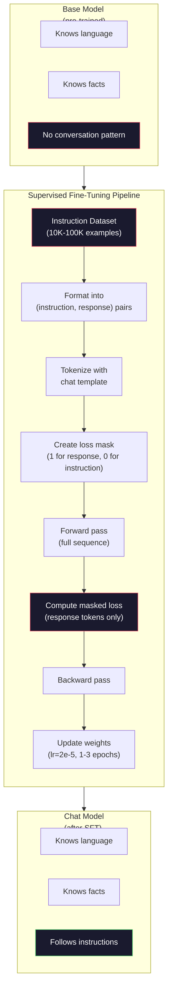

# 指令微调（SFT）

> 基座模型只会预测下一个 token，仅此而已。它不会遵循指令、不会回答问题，也不会拒绝有害请求。SFT 是从「token 预测器」到「实用助手」之间的桥梁。你聊过的每一个模型——Claude、GPT、Llama Chat——都经历过这一步。

**Type:** Build
**Languages:** Python (with numpy)
**Prerequisites:** Phase 10, Lesson 04 (Pre-Training a Mini GPT)
**Time:** ~90 minutes

## 学习目标

- 实现监督微调（Supervised Fine-Tuning, SFT），把一个基座语言模型转变为能遵循指令的助手
- 使用包含 system、user、assistant 角色的聊天模板格式化训练数据，并对非 assistant token 屏蔽损失
- 解释为什么 SFT 是必要的：基座模型只会续写文本，而不会回答问题
- 通过在保留指令集上对比基座模型与微调后模型的回复，评估 SFT 的质量

## 问题背景

你在第 04 课训练了一个模型。它能根据一段序列预测下一个 token。喂给它 "The transformer architecture"，它可能会续写 "has revolutionized natural language processing."。对一个「下一 token 预测器」来说，这已经很不错了。

现在换个试法：喂给它 "What is the capital of France?"。基座模型并不会回答 "Paris."，它只会延续模式。它可能输出 "What is the capital of Germany? What is the capital of Spain?"，因为它从包含问题列表的文档中学到了这种模式；也可能输出 "is a question that many people ask"，因为这是一个合理的下一 token 续写。模型没有「回答」的概念，它只懂「续写」。

这就是 GPT-3（基座模型，2020 年 6 月发布）与 ChatGPT（指令微调模型，2022 年 11 月发布）之间的差距。同样的架构，同样的预训练。差别在于 2 万到 10 万条精心编写的（指令，回复）数据对，教会了模型遵循对话模式。

Stanford Alpaca 证明了你并不需要上百万条样本。2023 年 3 月，他们仅用 52,000 条由 GPT-3.5 生成的指令-回复对微调了 Llama 7B。总成本：600 美元。得到的聊天机器人能遵循指令、回答问题、进行对话。虽然不如 ChatGPT，但考虑到只花了 600 美元和几小时训练，效果惊人地接近。

Meta 的 Llama 2 Chat 在初始 SFT 阶段只用了约 27,000 条高质量样本。关键洞察是：质量比数量更重要。由熟练标注员撰写的 27,000 条样本，胜过从互联网上抓取的 100 万条嘈杂样本。

## 核心概念

### SFT 究竟做了什么

监督微调延续了预训练中相同的训练循环——前向传播、计算损失、反向传播、更新权重——但用的是另一种数据。不再是原始文本，而是结构化的对话：

```json
{
  "system": "You are a helpful assistant.",
  "user": "What is the capital of France?",
  "assistant": "The capital of France is Paris."
}
```

模型早就知道巴黎是法国的首都——这是它在预训练阶段从 Wikipedia、教科书和网页中学到的。SFT 不会教模型新的事实，它教的是新的*行为*：看到问题就给出回答，看到指令就给出完成结果，看到有害请求就给出拒绝。

可以这样理解：预训练赋予模型知识，SFT 赋予模型规矩。

### 数据格式

业界主要有三种格式。它们编码的信息相同——谁说了什么——只是分隔方式不同。

**Alpaca 格式**（Stanford，2023 年 3 月）：

```json
{
  "instruction": "Summarize the following article in 3 sentences.",
  "input": "The European Central Bank raised interest rates...",
  "output": "The ECB increased rates by 25 basis points..."
}
```

简单且应用广泛。`input` 字段是可选的——许多指令不需要额外的上下文。Stanford 以这种格式发布了 52,000 条由 GPT-3.5 生成、花费 600 美元的样本，由此掀起了开源指令微调的浪潮。

**ShareGPT 格式**（社区，2023 年）：

```json
{
  "conversations": [
    {"from": "system", "value": "You are a helpful assistant."},
    {"from": "human", "value": "What causes tides?"},
    {"from": "gpt", "value": "Tides are caused by the gravitational pull of the Moon..."},
    {"from": "human", "value": "How often do they occur?"},
    {"from": "gpt", "value": "Most coastal areas experience two high tides and two low tides per day..."}
  ]
}
```

支持多轮对话。按惯例，"from" 字段使用 "human" 和 "gpt"，与实际使用的模型无关。Vicuna 就是在 70,000 条从用户分享的 ChatGPT 聊天记录中抓取的 ShareGPT 对话上训练的。

**ChatML 格式**（OpenAI 提出，被许多开源模型采用）：

```
<|im_start|>system
You are a helpful assistant.<|im_end|>
<|im_start|>user
What is the capital of France?<|im_end|>
<|im_start|>assistant
The capital of France is Paris.<|im_end|>
```

使用特殊 token（`<|im_start|>`、`<|im_end|>`）来分隔角色。这些 token 会在微调时加入分词器的词表。Qwen、Yi 以及许多其他模型都使用 ChatML。

三种格式做的是同一件事：告诉模型「这是指令，这是回复，学会这个模式」。

### 为什么有效

模型在预训练阶段已经掌握了语言。它见过数十亿条「问题后面跟着答案」「指令后面跟着完成结果」以及人与人之间对话的样本。这些模式早已编码进了权重之中。

SFT 把这种潜在能力聚焦起来。模型不再需要根据上下文猜测自己应该回答问题还是续写文档，SFT 直接在对话模式上做显式训练。几千条样本之后，模型就学会了：看到 assistant 角色标记，就生成一段有帮助的回复。

这就是为什么 27,000 条样本就够了。你不是在教模型英语，也不是在教它世界知识。你只是在教它一个简单的行为：响应指令。知识本来就在那里。

### 掩码损失

这是 SFT 中最重要的技术细节，而大多数教程都跳过了它。

预训练时，损失在每个 token 上都要计算，模型学习预测序列中的每一个下一 token。而 SFT 时，只在*回复* token 上计算损失。指令 token 仅作为上下文存在，模型不会因为没「预测」对它们而受到惩罚。

为什么？因为你不希望模型学会*生成*指令，你希望它学会*响应*指令。如果在指令 token 上也计算损失，你就是在训练模型去预测 "What is the capital of France?"，仿佛提问的是它自己。这不仅浪费梯度信号，还可能让模型对自己的角色产生混淆。

实践中，你需要创建一个损失掩码（loss mask）：回复 token 为 1，指令 token 为 0。在求平均之前，把逐 token 损失乘以这个掩码。

```
Tokens:    [SYS] You are helpful [USER] What is the capital? [ASST] Paris is the capital [EOS]
Loss mask:   0    0    0     0      0     0   0  0     0       1     1    1   1     1      1
```

只有 `[ASST]` 之后的 token 才参与损失计算。前向传播时模型看到完整对话（它需要指令才能生成正确的回复），但权重更新只取决于它预测回复的好坏。

### 训练超参数

SFT 的超参数与预训练截然不同。你不是在从零开始训练，而是在调整一个已经能工作的模型。

| 参数 | 预训练（Llama 2 7B） | SFT（Llama 2 Chat） |
|-----------|---------------------------|---------------------|
| 学习率 | 3e-4（峰值） | 2e-5 |
| Epoch 数 | 1（数据只过一遍） | 2 |
| 批大小 | 400 万 token | 64 条样本 |
| 预热步数 | 2,000 | 0-100 |
| 权重衰减 | 0.1 | 0.0-0.1 |
| 数据规模 | 2 万亿 token | 27,000 条样本 |

SFT 的学习率比预训练低 15 倍。这一点至关重要。微调时如果学习率过高，会摧毁预训练学到的知识——模型「忘掉」之前学的东西，转而过拟合到小规模微调数据集上。这就是灾难性遗忘。

两个 epoch 意味着模型把每条训练样本看两遍。在小数据集上超过 3 个 epoch 会导致死记硬背——模型开始逐字复述训练样本，而不是泛化。

### 灾难性遗忘

微调可能摧毁模型的通用能力。在指令遵循数据上训练过久，模型会失去写代码、做数学、创作文本的能力。它会变得非常擅长训练数据的特定格式，而在其他所有事情上一塌糊涂。

三种缓解手段：

1. **低学习率。** 1e-5 到 5e-5。更小的更新幅度意味着对预训练特征的破坏更少。

2. **短训练。** 1-3 个 epoch。在模型过拟合之前停下。

3. **混入预训练数据。** Llama 2 Chat 在 SFT 数据集中混入了一小部分（2-5%）原始预训练数据。这在模型学习指令遵循新行为的同时「提醒」它保持通用能力。

### 真实数字

在单张 NVIDIA A100 80GB GPU 上，用 10,000 条高质量指令对微调一个 7B 模型大约需要 1 小时。算一笔账：

- 10,000 条样本 x 平均 512 token = 512 万 token
- 2 个 epoch = 共 1,024 万 token
- A100 微调 7B 模型的吞吐量：约 3,000 token/秒
- 1,024 万 / 3,000 ≈ 3,400 秒 ≈ 57 分钟

对于我们的迷你 GPT（4 层、128 维），训练几乎瞬间完成。重点是理解机制，而不是规模。



## 从零实现

### 第 1 步：指令数据集

创建一个合成的指令数据集。在生产环境中，Scale AI、Anthropic 等公司会雇佣人工标注员来撰写这些数据。我们用程序生成，以演示数据格式。

```python
import numpy as np

INSTRUCTION_DATA = [
    {
        "instruction": "What is the capital of France?",
        "response": "The capital of France is Paris."
    },
    {
        "instruction": "Explain gravity in one sentence.",
        "response": "Gravity is the force that attracts objects with mass toward each other."
    },
    {
        "instruction": "Write a haiku about the ocean.",
        "response": "Waves crash on the shore, salt and foam beneath the sun, endless blue expanse."
    },
    {
        "instruction": "What is 15 multiplied by 7?",
        "response": "15 multiplied by 7 is 105."
    },
    {
        "instruction": "Name three programming languages.",
        "response": "Three programming languages are Python, Rust, and TypeScript."
    },
    {
        "instruction": "Summarize photosynthesis.",
        "response": "Photosynthesis converts sunlight, water, and carbon dioxide into glucose and oxygen."
    },
    {
        "instruction": "What year did World War II end?",
        "response": "World War II ended in 1945."
    },
    {
        "instruction": "Define machine learning.",
        "response": "Machine learning is a field where algorithms learn patterns from data to make predictions."
    },
]
```

8 条样本确实很少——Stanford Alpaca 用了 52,000 条。但无论是 8 条还是 52,000 条，机制完全相同：分词、加掩码、只在回复上计算损失。

### 第 2 步：用聊天模板分词

把指令-回复对转换成带特殊角色标记的 token 序列。这些标记告诉模型指令在哪里结束、回复从哪里开始。

```python
SPECIAL_TOKENS = {
    "INST_START": 253,
    "INST_END": 254,
    "RESP_START": 255,
}


def tokenize_instruction_pair(instruction, response, vocab_size=256):
    inst_tokens = list(instruction.encode("utf-8"))
    resp_tokens = list(response.encode("utf-8"))

    inst_tokens = [min(t, vocab_size - 4) for t in inst_tokens]
    resp_tokens = [min(t, vocab_size - 4) for t in resp_tokens]

    tokens = (
        [SPECIAL_TOKENS["INST_START"]]
        + inst_tokens
        + [SPECIAL_TOKENS["INST_END"]]
        + [SPECIAL_TOKENS["RESP_START"]]
        + resp_tokens
    )

    return tokens


def create_loss_mask(tokens):
    mask = np.zeros(len(tokens), dtype=np.float32)
    in_response = False

    for i, token in enumerate(tokens):
        if token == SPECIAL_TOKENS["RESP_START"]:
            in_response = True
            continue
        if in_response:
            mask[i] = 1.0

    return mask
```

损失掩码在指令 token 上全为 0，在回复 token 上全为 1。`RESP_START` token 本身的掩码也是 0，因为它是分隔符，不属于回复内容。

### 第 3 步：掩码交叉熵损失

就是标准的交叉熵，再乘上损失掩码。只有回复 token 会贡献梯度。

```python
def masked_cross_entropy_loss(logits, targets, loss_mask):
    batch, seq_len, vocab_size = logits.shape
    logits_flat = logits.reshape(-1, vocab_size)
    targets_flat = targets.reshape(-1)
    mask_flat = loss_mask.reshape(-1)

    max_logits = logits_flat.max(axis=-1, keepdims=True)
    log_softmax = logits_flat - max_logits - np.log(
        np.exp(logits_flat - max_logits).sum(axis=-1, keepdims=True)
    )

    per_token_loss = -log_softmax[np.arange(len(targets_flat)), targets_flat]

    masked_loss = per_token_loss * mask_flat
    num_response_tokens = mask_flat.sum()
    if num_response_tokens == 0:
        return 0.0
    loss = masked_loss.sum() / num_response_tokens

    return loss
```

注意分母是 `num_response_tokens` 而不是 `seq_len`。如果按总序列长度求平均，较长的指令会稀释梯度信号。按回复 token 数求平均，能保证无论指令多长，每个回复 token 的权重都相同。

### 第 4 步：SFT 训练循环

复用第 04 课的 MiniGPT。训练循环与预训练几乎一样，只是加上了指令格式化和掩码损失。

```python
import sys
import os
sys.path.insert(0, os.path.join(os.path.dirname(__file__), "..", "..", "04-pre-training-mini-gpt", "code"))
from main import MiniGPT, LayerNorm, FeedForward, MultiHeadAttention, TransformerBlock, Embedding


def sft_train(model, dataset, num_epochs=2, lr=2e-5, seq_len=64):
    formatted_data = []
    for example in dataset:
        tokens = tokenize_instruction_pair(example["instruction"], example["response"])
        mask = create_loss_mask(tokens)
        formatted_data.append((tokens, mask))

    print(f"SFT Training: {len(formatted_data)} examples, {num_epochs} epochs, lr={lr}")
    print(f"Total tokens: {sum(len(t) for t, _ in formatted_data):,}")
    print()

    losses = []

    for epoch in range(num_epochs):
        epoch_loss = 0.0
        num_batches = 0

        indices = np.random.permutation(len(formatted_data))

        for idx in indices:
            tokens, mask = formatted_data[idx]

            if len(tokens) < 3:
                continue
            if len(tokens) > seq_len:
                tokens = tokens[:seq_len]
                mask = mask[:seq_len]

            input_ids = np.array(tokens[:-1]).reshape(1, -1)
            target_ids = np.array(tokens[1:]).reshape(1, -1)
            loss_mask = np.array(mask[1:]).reshape(1, -1)

            logits = model.forward(input_ids)
            loss = masked_cross_entropy_loss(logits, target_ids, loss_mask)

            batch_size, s_len, v_size = logits.shape
            probs = np.exp(logits - logits.max(axis=-1, keepdims=True))
            probs = probs / probs.sum(axis=-1, keepdims=True)
            dlogits = probs.copy()
            dlogits[np.arange(batch_size)[:, None], np.arange(s_len), target_ids] -= 1.0

            mask_expanded = loss_mask[:, :, np.newaxis]
            num_resp = loss_mask.sum()
            if num_resp > 0:
                dlogits = dlogits * mask_expanded / num_resp

            for block in model.blocks:
                block.ffn.W1 -= lr * np.random.randn(*block.ffn.W1.shape) * 0.01
                block.ffn.W2 -= lr * np.random.randn(*block.ffn.W2.shape) * 0.01
                block.ffn.b1 -= lr * np.random.randn(*block.ffn.b1.shape) * 0.01
                block.ffn.b2 -= lr * np.random.randn(*block.ffn.b2.shape) * 0.01

            epoch_loss += loss
            num_batches += 1
            losses.append(loss)

        avg_loss = epoch_loss / max(num_batches, 1)
        print(f"Epoch {epoch + 1}/{num_epochs} | Avg Loss: {avg_loss:.4f}")

    return model, losses
```

学习率为 2e-5，与 Llama 2 Chat 一致。对比预训练用的 3e-4——小了 15 倍。梯度是带掩码的：指令 token 产生的梯度为零，只有回复 token 在推动权重更新。

### 第 5 步：对比基座模型与 SFT 模型

SFT 的全部意义在于行为改变。我们通过检查模型对指令格式输入与原始文本续写的不同反应来衡量它。

```python
def generate_response(model, prompt_tokens, max_new_tokens=50, temperature=0.8):
    tokens = list(prompt_tokens)
    seq_len = model.embedding.pos_embed.shape[0]

    for _ in range(max_new_tokens):
        context = np.array(tokens[-seq_len:]).reshape(1, -1)
        logits = model.forward(context)
        next_logits = logits[0, -1, :]

        next_logits = next_logits / max(temperature, 1e-8)
        probs = np.exp(next_logits - next_logits.max())
        probs = probs / probs.sum()
        probs = np.clip(probs, 1e-10, 1.0)
        probs = probs / probs.sum()

        next_token = np.random.choice(len(probs), p=probs)
        tokens.append(int(next_token))

    return tokens


def evaluate_instruction_following(model, instructions):
    print("Evaluating instruction following:")
    print("-" * 50)

    for instruction in instructions:
        tokens = (
            [SPECIAL_TOKENS["INST_START"]]
            + [min(t, 252) for t in list(instruction.encode("utf-8"))]
            + [SPECIAL_TOKENS["INST_END"]]
            + [SPECIAL_TOKENS["RESP_START"]]
        )

        output = generate_response(model, tokens, max_new_tokens=30, temperature=0.6)
        response_start = len(tokens)
        response_tokens = output[response_start:]
        response_bytes = bytes([t for t in response_tokens if t < 128])
        response_text = response_bytes.decode("utf-8", errors="replace")

        print(f"  Q: {instruction}")
        print(f"  A: {response_text[:80]}")
        print()
```

在只有 8 条样本的小模型上，回复内容不会有什么实际意义，这是预料之中的。重要的是*结构*：模型学会了在回复标记之后生成输出，而不是继续生成更多指令。

### 第 6 步：度量灾难性遗忘

对比 SFT 前后模型的下一 token 预测能力。如果 SFT 损害了通用能力，模型在原始文本上的损失会上升。

```python
def measure_forgetting(model, test_text, seq_len=64):
    tokens = np.array(list(test_text.encode("utf-8")[:512]))

    total_loss = 0.0
    num_windows = 0

    for start in range(0, len(tokens) - seq_len - 1, seq_len):
        input_ids = tokens[start:start + seq_len].reshape(1, -1)
        target_ids = tokens[start + 1:start + seq_len + 1].reshape(1, -1)

        logits = model.forward(input_ids)

        batch, s_len, vocab_size = logits.shape
        logits_flat = logits.reshape(-1, vocab_size)
        targets_flat = target_ids.reshape(-1)

        max_logits = logits_flat.max(axis=-1, keepdims=True)
        log_softmax = logits_flat - max_logits - np.log(
            np.exp(logits_flat - max_logits).sum(axis=-1, keepdims=True)
        )

        loss = -log_softmax[np.arange(len(targets_flat)), targets_flat].mean()
        total_loss += loss
        num_windows += 1

    return total_loss / max(num_windows, 1)
```

在真实的微调中，你应该在整个训练过程中持续追踪这个指标。如果原始文本损失上升超过 10-15%，说明你的 SFT 太激进了——应该降低学习率或减少 epoch 数。

## 生产实践

### 完整 SFT 流程演示

```python
if __name__ == "__main__":
    np.random.seed(42)

    test_text = """The transformer architecture processes sequences through self-attention.
Each layer applies multi-head attention followed by a feedforward network.
Residual connections and layer normalization stabilize deep networks.
The model learns to predict the next token given all previous tokens."""

    print("=" * 70)
    print("INSTRUCTION TUNING (SFT) DEMO")
    print("=" * 70)
    print()

    model = MiniGPT(
        vocab_size=256, embed_dim=128, num_heads=4,
        num_layers=4, max_seq_len=128, ff_dim=512
    )
    print(f"Model: {model.count_parameters():,} parameters")
    print(f"Config: 4 layers, 4 heads, 128 dims (mini GPT from Lesson 04)")
    print()

    print("PRE-SFT: Measuring base model loss on raw text")
    base_loss = measure_forgetting(model, test_text)
    print(f"  Base model loss: {base_loss:.4f}")
    print()

    print("=" * 70)
    print("SFT TRAINING")
    print("=" * 70)

    model, losses = sft_train(
        model, INSTRUCTION_DATA, num_epochs=3, lr=2e-5, seq_len=128
    )

    print()
    print("POST-SFT: Measuring fine-tuned model loss on raw text")
    sft_loss = measure_forgetting(model, test_text)
    print(f"  SFT model loss: {sft_loss:.4f}")
    print(f"  Change: {((sft_loss - base_loss) / base_loss * 100):+.1f}%")
    if abs(sft_loss - base_loss) / base_loss < 0.15:
        print("  Minimal forgetting (< 15% change)")
    else:
        print("  Significant forgetting detected")
    print()

    print("=" * 70)
    print("INSTRUCTION FOLLOWING EVALUATION")
    print("=" * 70)
    print()

    test_instructions = [
        "What is the capital of France?",
        "Name a programming language.",
        "Define gravity.",
    ]
    evaluate_instruction_following(model, test_instructions)

    print("=" * 70)
    print("DATA FORMAT EXAMPLES")
    print("=" * 70)
    print()

    for i, example in enumerate(INSTRUCTION_DATA[:3]):
        tokens = tokenize_instruction_pair(example["instruction"], example["response"])
        mask = create_loss_mask(tokens)
        resp_count = int(mask.sum())
        total_count = len(tokens)
        print(f"  Example {i + 1}: {total_count} tokens, {resp_count} response tokens ({resp_count/total_count:.0%} of sequence)")
        print(f"    Instruction: {example['instruction']}")
        print(f"    Response: {example['response']}")
        print()

    print("=" * 70)
    print("TRAINING LOSS CURVE")
    print("=" * 70)
    print()

    if losses:
        window = max(1, len(losses) // 5)
        for i in range(0, len(losses), window):
            chunk = losses[i:i + window]
            avg = sum(chunk) / len(chunk)
            print(f"  Steps {i:3d}-{i + len(chunk) - 1:3d}: avg loss = {avg:.4f}")
```

## 交付产物

本课产出 `outputs/prompt-sft-data-curator.md`——一个帮你设计和筛选 SFT 指令数据集的提示词。给定一个目标能力（代码生成、数学、对话），它会生成一份数据收集计划，包含格式规范、质量标准和多样性要求。

## 练习

1. 增加系统提示词支持。修改 `tokenize_instruction_pair`，使其接受一条系统消息并拼接在指令之前。创建 5 条使用不同系统提示词（"You are a poet"、"You are a math tutor"）的样本，并验证模型在训练中确实看到了不同的系统提示词。

2. 实现数据混合。编写一个函数，接收一个 SFT 数据集和一个原始文本语料，生成训练批次，其中 5% 是原始文本样本（不加掩码），95% 是指令对（加掩码）。训练 3 个 epoch，并与纯 SFT 训练对比遗忘指标。

3. 构建数据质量评分器。对每条指令-回复对计算：(a) 回复的 token 长度，(b) 指令与回复的长度比，(c) 词汇多样性（不重复 token 数 / 总 token 数）。过滤掉回复长度小于 10 个 token 或多样性低于 0.3 的样本，展示过滤对最终损失的影响。

4. 实现多轮对话训练。扩展分词逻辑以处理 3 轮对话（user-assistant-user-assistant-user-assistant）。损失掩码应覆盖全部三个 assistant 轮次。通过打印一条样本的 token 与掩码对齐关系来验证掩码的正确性。

5. 对比学习率。用 lr=1e-4、lr=2e-5、lr=1e-6 分别训练同一个模型三次，画出损失曲线。1e-4 的曲线应该初期下降迅速但最终损失更高（过拟合）；1e-6 的曲线应该几乎不动；2e-5 应该恰到好处。

## 关键术语

| 术语 | 人们怎么说 | 实际含义 |
|------|----------------|----------------------|
| SFT | 「在对话数据上微调」 | 监督微调（Supervised Fine-Tuning）：在（指令，回复）对上继续训练，只在回复 token 上计算损失 |
| 指令微调 | 「教模型遵循指令」 | 在显式的指令-回复对上训练，让基座模型学会对话模式，而不是新知识 |
| 损失掩码 | 「忽略提示词部分」 | 将指令 token 的损失置零，使梯度只来自回复 token 的预测 |
| ChatML | 「聊天标记语言」 | 一种使用 `<\|im_start\|>` 和 `<\|im_end\|>` 分隔符标记对话数据中说话者角色的 token 格式 |
| Alpaca 格式 | 「Stanford 的格式」 | 一种包含 instruction/input/output 字段的 JSON 格式，用于 52K 条由 GPT-3.5 生成、花费 600 美元的样本 |
| 灾难性遗忘 | 「模型变笨了」 | 微调摧毁预训练能力：梯度更新用任务特定模式覆盖了通用知识 |
| 权重绑定 | 「共享嵌入」 | 输入 token 嵌入与输出预测头共用同一个矩阵，节省参数并提升一致性 |
| 聊天模板 | 「提示词的格式化方式」 | 把一段对话结构化呈现给模型的特定 token 序列（角色标记、分隔符） |

## 延伸阅读

- [Ouyang et al., 2022 -- "Training language models to follow instructions with human feedback" (InstructGPT)](https://arxiv.org/abs/2203.02155) -- OpenAI 提出指令微调 + RLHF 的开山之作
- [Taori et al., 2023 -- "Stanford Alpaca: An Instruction-following LLaMA Model"](https://github.com/tatsu-lab/stanford_alpaca) -- 花 600 美元生成 52K 条指令样本，证明 SFT 在小数据集上同样有效
- [Touvron et al., 2023 -- "Llama 2: Open Foundation and Fine-Tuned Chat Models"](https://arxiv.org/abs/2307.09288) -- Meta 基于 27K 条高质量样本的 SFT + RLHF 流程
- [Chiang et al., 2023 -- "Vicuna: An Open-Source Chatbot Impressing GPT-4"](https://lmsys.org/blog/2023-03-30-vicuna/) -- 在 70K 条 ShareGPT 对话上训练
- [Zhou et al., 2023 -- "LIMA: Less Is More for Alignment"](https://arxiv.org/abs/2305.11206) -- 证明 1,000 条精心筛选的样本可以媲美在更大数据集上的 SFT
