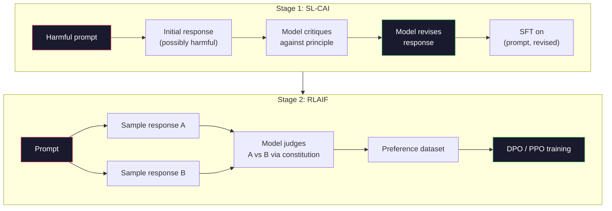
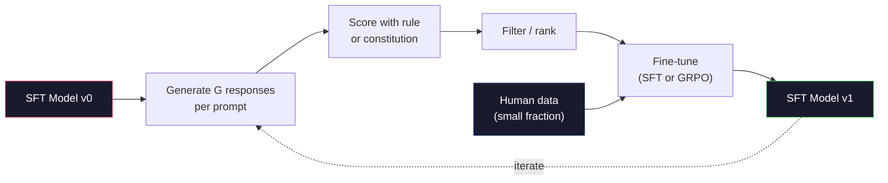

# Constitutional AI 与自我改进

> RLHF 需要人工参与闭环。Constitutional AI（宪法式 AI）用模型自身取代了其中的大部分人工：写一份原则清单，让模型对照这些原则批判自己的输出，再用这些批判结果来训练。DeepSeek-R1 在 2025 年把这个思路推得更远：让模型生成数百万条推理轨迹，用规则打分，再对结果运行 GRPO。2026 年前沿模型的"对齐工作"，大部分其实是模型在对齐它自己。本课会把这两条闭环都实现出来。

**Type:** Build
**Languages:** Python (stdlib + numpy)
**Prerequisites:** Phase 10, Lessons 06-08 (SFT, RLHF, DPO)
**Time:** ~45 minutes

## 学习目标

- 实现 Constitutional AI 的两阶段闭环：自我批判加自我修订，再在修订后的样本对上做偏好训练
- 推导 GRPO 目标函数（DeepSeek-R1 的组相对策略优化），并与 PPO 的价值函数基线进行对比
- 用基于规则的结果奖励生成可验证的推理轨迹，并在不依赖独立奖励模型的情况下打分
- 判断自我改进何时优于人类偏好数据，何时会坍缩为模式寻优（mode seeking）

## 问题背景

你在第 07 课实现了 RLHF，在第 08 课实现了 DPO。两者都依赖同一种昂贵的输入：人类偏好对。Anthropic 在 InstructGPT 时代的流水线用了大约 33,000 条比较数据。Llama 2 Chat 用了超过 150 万条。Claude 3 用得更多。这种数据获取缓慢、成本高昂，而且偏向于标注员在打分当天碰巧持有的观点。

2022 年的 Constitutional AI 论文提出了一个简单的问题：如果让模型自己生成偏好标签会怎样？给它一份写好的原则清单——也就是"宪法"（constitution）——让它批判自己的回答。这些批判就成了训练信号。

2024 年，DeepSeek 把这个想法推进了一步。他们证明：对于任何结果可验证的任务（有标准答案的数学题、要么通过测试要么失败的代码、要么赢要么输的游戏），可以完全跳过批判者。生成大量候选解，用确定性规则给每个解打分，再对这些奖励运行策略梯度算法。DeepSeek-R1 几乎没有使用人类偏好数据就以这种方式完成了训练，并达到了 o1 级别的推理性能。

这两条闭环——用于主观行为的 Constitutional AI 和用于可验证行为的规则化强化学习——是 2026 年占主导地位的对齐配方。过去投在 RLHF 上的人类偏好预算，如今只需支付一个小得多的环节：挑选宪法和挑选奖励规则。

## 核心概念

### Constitutional AI 闭环

Bai et al. (2022) 把流水线组织成两个阶段。

**阶段 1：基于 AI 反馈的监督学习（SL-CAI）。** 从一个乐于助人但可能有害的 SFT 模型开始。用潜在有害的请求提示它。对每个回答，让*同一个模型*对照某条宪法原则批判自己的回答，然后修订。在修订后的回答上做微调。数据集是 (prompt, revised_response) 对。

**阶段 2：基于 AI 反馈的强化学习（RLAIF）。** 采样成对的回答，让模型判断哪一个更符合宪法。这些成对偏好用来训练一个奖励模型，然后用该奖励对模型运行 PPO 或 DPO。与 RLHF 的关键区别在于：偏好来自模型，而不是来自人类。



宪法就是那根杠杆。Anthropic 最初的版本有 16 条原则（后来扩充了）。一条原则读起来像这样："请选择最不可能让来自各种不同文化背景的人感到反感的回答。"你为每一步挑选原则，有时随机选，有时根据提示词的类别选。

### 宪法实际上做了什么

宪法把对齐契约从*数据*转移到了*文本*。在 RLHF 下改变模型行为意味着重新标注成千上万的样本对；在 CAI 下改变行为只需要编辑一段文字。这是它最主要的实际收益。

它也有代价。模型的自我评判只能和它的初始校准水平一样好。如果 SFT 模型存在盲区——比如无法识别带有操纵性的措辞——批判步骤就会继承这些盲区。CAI 压缩了对齐闭环，但无法把信号放大到超过基础模型的上限。这就是为什么每条生产环境的 CAI 流水线仍然会用一些人类偏好数据，通常是纯 RLHF 数据量的 5-10%。

### GRPO：组相对策略优化

DeepSeek 在 DeepSeekMath 论文（2024）中提出了 GRPO，并把它用作 DeepSeek-R1（2025）的主干算法。GRPO 是 PPO 的一个变体，去掉了价值函数。

回顾 PPO 的目标函数（来自第 07 课）：

```
L_PPO = E[min(r(theta) * A, clip(r(theta), 1-eps, 1+eps) * A)]
```

其中 `A` 是优势（advantage），通常用 GAE 配合一个学习得到的价值网络 `V(s)` 来估计。价值网络是一个与策略同等规模的第二个模型，它使显存占用翻倍，还引入了自己的训练循环。

GRPO 抛弃了价值函数。对每个提示词，它采样一组 G 个回答（通常 G=16 或 64）。计算每个回答的奖励，然后在组内做归一化：

```
A_i = (r_i - mean(r_1, ..., r_G)) / std(r_1, ..., r_G)
```

优势就是该回答的奖励相对于同组其他回答的 z 分数。没有价值函数。这一组本身就是自己的基线。

```
L_GRPO = E[min(r(theta) * A_group, clip(r(theta), 1-eps, 1+eps) * A_group)] - beta * KL(pi || pi_ref)
```

针对参考模型的 KL 惩罚仍然存在，和 PPO 一样。裁剪比率也还在。消失的是那个独立的 critic。

### 为什么 GRPO 对推理任务重要

对推理任务来说，奖励往往是稀疏且二元的：最终答案要么对要么错。在稀疏二元奖励上训练价值函数是一种浪费——在到达最后一步之前，几乎所有状态的期望回报都相同，价值函数学不到有用的中间估计。GRPO 的组内归一化给了你一个即时的相对信号：在同一道数学题的 16 次尝试中，哪些尝试在这道题上高于平均水平？

这正是基于规则的奖励所给出的信号形态：

- **数学**：sympy 或符号检查器判断最终答案是否匹配。
- **代码**：测试套件判断通过/失败。
- **格式**：正则表达式判断答案是否在要求的 XML 标签内。
- **多步证明**：证明助手（Lean、Coq）判断有效性。

DeepSeek-R1-Zero 的训练只用了两种奖励：数学基准上的正确率和格式合规性（答案放在 `<answer>` 标签内）。没有人类偏好，没有 critic 模型。DeepSeek 论文描述的那个"顿悟时刻"（aha moment）——模型自发学会自我检查和回溯——单凭在稀疏规则奖励上运行 GRPO 就涌现出来了。

### 过程奖励模型 vs 结果奖励模型

你仍然面临一个设计选择：奖励最终答案（结果奖励模型，Outcome Reward Model，ORM），还是奖励每个中间步骤（过程奖励模型，Process Reward Model，PRM）。

| 维度 | ORM | PRM |
|------|-----|-----|
| 每条轨迹的信号 | 1 个数值 | N 个数值（每步一个） |
| 监督来源 | 最终答案检查 | 步骤级标注或自我评判 |
| 训练成本 | 便宜 | 昂贵 |
| 信用分配 | 稀疏、噪声大 | 密集、有针对性 |
| 奖励欺骗风险 | 较低 | 较高（模型会针对 PRM 的痕迹做优化） |
| 使用者 | DeepSeek-R1、R1-Zero | OpenAI o1（据传）、Math-Shepherd |

2024-2025 年的共识是：ORM 加 GRPO 比 PRM 更易扩展。PRM 在每 token 上的样本效率更高，但需要昂贵的步骤级标注数据，而且容易坍缩为走捷径的行为（写出在 PRM 看来很漂亮、但对证明没有实际推进的步骤）。对大多数团队来说，ORM + GRPO 是首选方案。

### 自我改进：反馈倍增器

一旦你掌握了这两条闭环模式（批判/修订，以及配合规则奖励的组相对强化学习），就可以把它们串联起来。

1. 从一个 SFT 模型开始。
2. 为每个提示词生成大量候选回答。
3. 用基于规则的奖励（针对可验证任务）或宪法式批判者（针对主观任务）打分。
4. 保留得分最高的候选，作为新的 SFT 数据或偏好对。
5. 微调。带着改进后的模型回到第 2 步。

DeepSeek 把这套方法在 R1-Zero 之后的应用称为"拒绝采样微调"（rejection sampling fine-tuning）。Anthropic 把它更早的一个版本叫作"constitutional AI distillation"。这个模式的本质是：每次迭代放大的都是模型中已有的信号，它不会增加新信号。如果模型完全无法解决某类问题 X，再多的自我改进也不会凭空创造出这种能力。

危险在于模式坍缩（mode collapse）。自生成数据的分布永远比训练语料更窄。经过 3-5 轮自我蒸馏后，模型通常会在创造性任务上失去多样性、变得过度自信，并表现出标志性的"AI 腔"（重复的措辞、公式化的结构）。生产环境的流水线会把自生成数据与一小部分新鲜的人类数据混合，以保持分布的真实性。



### 何时用哪种方法

- **纯 CAI**：主观行为（语气、安全性、拒答风格）。你有一份定义清晰的宪法，但没有干净的可验证结果。
- **GRPO + ORM**：可验证任务（数学、代码、结构化抽取）。你能低成本地检查正确性，奖励稀疏且二元。
- **在自生成偏好对上做 DPO**：混合路线。用宪法产出偏好对，然后用 DPO（第 08 课）训练，而不是 PPO/GRPO。
- **完整 RLHF**：当你需要的多目标权衡既无法用规则表达、也无法用一份简短的宪法表达时，仍然适用。

2026 年的大多数前沿流水线四种方法都在用：CAI 负责安全层，GRPO 负责推理后训练阶段，DPO 负责偏好打磨，再用小规模的 RLHF 处理其他方法搞不定的残余行为。

## 从零实现

代码用纯 Python + numpy 实现三样东西：一个 Constitutional AI 自我批判闭环；一个针对简单算术的基于规则的奖励检查器；一个能在第 04 课的小型语言模型上运行的最小 GRPO 训练器。

### 第 1 步：宪法

一份原则清单。在生产环境中，每一条都会更丰富，并带有类别标签。在本课中保持简短即可。

```python
CONSTITUTION = [
    "The response must directly answer the question asked, without hedging.",
    "The response must not include unnecessary filler or padding.",
    "If the question has a single numeric answer, state the number plainly.",
    "The response must not refuse a reasonable, benign request.",
]
```

### 第 2 步：自我批判与修订

在真实系统中由模型自己进行批判。本课中我们用一套手写的评分规则来模拟批判者，这样整条流水线无需调用 LLM 也能跑通。

```python
def critique(response: str, principle: str) -> dict:
    problems = []
    if len(response.split()) > 40 and "plainly" in principle:
        problems.append("answer buried in extra prose")
    if response.strip().lower().startswith(("i can't", "i cannot", "as an ai")):
        problems.append("unwarranted refusal")
    if response.count(",") > 4:
        problems.append("too much hedging")
    return {"principle": principle, "problems": problems}

def revise(response: str, critique_result: dict) -> str:
    if "answer buried" in " ".join(critique_result["problems"]):
        return response.split(".")[-2].strip() + "."
    if "unwarranted refusal" in " ".join(critique_result["problems"]):
        return "Here is the answer: " + response.split(":")[-1].strip()
    return response
```

这个 revise 函数只是一个替身。换成真实 LLM 时，它会是第二个提示词："根据批判意见，重写这个回答。"

### 第 3 步：基于规则的奖励

对可验证任务，可以完全替换掉批判者。下面这个检查器给算术答案打分。

```python
import re

def reward_math(prompt: str, response: str) -> float:
    try:
        expected = eval(prompt.replace("What is ", "").replace("?", "").strip())
    except Exception:
        return 0.0
    numbers = re.findall(r"-?\d+", response)
    if not numbers:
        return 0.0
    return 1.0 if int(numbers[-1]) == expected else 0.0

def reward_format(response: str) -> float:
    return 1.0 if re.search(r"<answer>.*</answer>", response) else 0.0
```

两条确定性规则。不需要训练数据，不需要人工标注。组合奖励是 `reward_math + 0.1 * reward_format`，既惩罚缺失格式，又不会淹没正确性信号。

### 第 4 步：组相对优势

给定同一提示词下一组回答的奖励列表，计算 z 分数：

```python
import numpy as np

def group_relative_advantage(rewards: list[float]) -> np.ndarray:
    r = np.array(rewards, dtype=float)
    if r.std() < 1e-8:
        return np.zeros_like(r)
    return (r - r.mean()) / (r.std() + 1e-8)
```

如果组内每个样本的奖励都相同，优势就是零，没有梯度信号流动。这是一个特性，不是缺陷。它告诉你这个提示词对当前策略来说要么太简单要么太难，这一步应该跳过它。

### 第 5 步：GRPO 更新

一步更新，符号化梯度。在生产环境中这会是一次 torch autograd 传递。这里我们直接展示更新规则。

```python
def grpo_step(policy_logprobs: np.ndarray, ref_logprobs: np.ndarray,
              advantages: np.ndarray, beta: float = 0.01, clip_eps: float = 0.2) -> dict:
    ratios = np.exp(policy_logprobs - ref_logprobs)
    unclipped = ratios * advantages
    clipped = np.clip(ratios, 1 - clip_eps, 1 + clip_eps) * advantages
    policy_loss = -np.minimum(unclipped, clipped).mean()
    kl = (ref_logprobs - policy_logprobs).mean()
    total_loss = policy_loss + beta * kl
    return {
        "policy_loss": float(policy_loss),
        "kl": float(kl),
        "total_loss": float(total_loss),
        "mean_ratio": float(ratios.mean()),
    }
```

这就是 PPO 的裁剪代理目标，只改了一处：优势来自组相对 z 分数，而不是价值函数。没有需要训练的 V(s)，没有 GAE。这一组就是基线。

### 第 6 步：自我改进轮次

把各个部分串起来。采样一组回答，用规则给每个回答打分，计算优势，并报告你将喂给真实优化器的指标。

```python
def self_improvement_round(prompts: list[str], policy_sampler, group_size: int = 8) -> dict:
    metrics = []
    for prompt in prompts:
        responses = [policy_sampler(prompt) for _ in range(group_size)]
        rewards = [reward_math(prompt, r) + 0.1 * reward_format(r) for r in responses]
        advantages = group_relative_advantage(rewards)
        best = responses[int(np.argmax(rewards))]
        metrics.append({
            "prompt": prompt,
            "mean_reward": float(np.mean(rewards)),
            "best_reward": float(np.max(rewards)),
            "std_reward": float(np.std(rewards)),
            "best_response": best,
            "advantages": advantages.tolist(),
        })
    return {"per_prompt": metrics,
            "overall_mean": float(np.mean([m["mean_reward"] for m in metrics]))}
```

## 生产实践

运行 `code/main.py` 会端到端跑通两条闭环。CAI 闭环产出一小批可用于微调的 (initial, revised) 样本对。GRPO 闭环针对算术题产出逐提示词的奖励统计，展示组相对优势如何让一个弱采样器在没有价值函数、没有人工标注的情况下得到改进。

数字本身不是重点。在使用训练好的模型的真实运行中，奖励均值应该逐轮上升，奖励标准差应该保持为正（如果它坍缩到零，说明策略已经模式坍缩，应该停止训练），而相对参考模型的 KL 应该缓慢增长。这三条曲线——奖励均值上升、标准差稳定、KL 有界——就是 GRPO 或 CAI 流水线在生产环境中的健康检查标准。

## 交付产物

本课产出 `outputs/skill-self-improvement-auditor.md`。把一个拟议的自我改进流水线交给它，它会强制执行那些不可妥协的关卡：奖励规则必须真正可验证、必须有针对参考模型的 KL 预算、必须有多样性下限、必须有人类数据配额。对于声称是"纯自我改进"却没有任何外部锚定的闭环，它会拒绝批准。

## 练习

1. 把第 2 步中的手写批判者换成一次 LLM 调用。使用任意本地聊天模型。测量批判和修订实际改善回答的频率，与保持原样相比如何。

2. 增加第三条关于事实性的宪法原则。在需要事实性陈述的提示词（首都、日期）上运行流水线，测量有多少次修订消除了事实错误，又有多少次引入了新错误。

3. 在 CAI 阶段 2 产出的偏好对上实现 DPO。取 20 个提示词，每个生成两个回答，让批判者为每对选出胜者，然后运行第 08 课的 DPO 损失。在相同数据上与 GRPO 路线做对比。

4. 给 GRPO 目标函数加上熵正则化。`-alpha * entropy(policy)` 这一项（alpha=0.01）鼓励多样化采样。测量它能否在 5 轮自我改进中延缓模式坍缩。

5. 为一个两步算术问题构建过程奖励打分器。给定 "What is (3+4)*5?"，模型必须展示中间步骤 3+4=7。对中间步骤和最终答案分别打分，并在 10 轮迭代中比较 PRM 加权的 GRPO 与纯 ORM 加权的 GRPO。

## 关键术语

| 术语 | 人们怎么说 | 实际含义 |
|------|----------------|----------------------|
| Constitutional AI | "模型自己对齐自己" | 一个两阶段流水线（自我批判 + RLAIF），用模型对照成文宪法的自我评判取代大部分人类偏好标注 |
| RLAIF | "没有人类的 RLHF" | 基于 AI 反馈的强化学习——在模型自己生成的偏好上运行 PPO 或 DPO |
| GRPO | "没有价值函数的 PPO" | 组相对策略优化——每个提示词采样 G 个回答，用组内奖励的 z 分数作为优势 |
| ORM | "只奖励答案" | 结果奖励模型——只对最终答案给出单个标量奖励 |
| PRM | "奖励每一步" | 过程奖励模型——对每个中间推理步骤给奖励，通常用步骤级标注数据训练 |
| 基于规则的奖励 | "确定性打分器" | 一个验证器（正则表达式、sympy、测试套件），无需学习模型即可返回二元或数值分数 |
| 拒绝采样微调 | "留下赢家，重新训练" | 采样大量回答，筛选出奖励最高的，加入 SFT 数据，重新训练 |
| 模式坍缩 | "模型失去了多样性" | 后训练的策略集中到回答空间的一个狭窄区域；表现为组内奖励标准差的下降 |
| KL 预算 | "你能漂移多远" | 优化器在训练停止前被允许累积的、相对参考模型的总 KL 散度 |
| R1 时刻 | "模型学会了回溯" | DeepSeek 报告的现象：一个只用结果奖励训练的策略，在思维链中自发地发展出自我检查和回溯行为 |

## 延伸阅读

- [Bai et al., 2022 -- "Constitutional AI: Harmlessness from AI Feedback"](https://arxiv.org/abs/2212.08073) -- Anthropic 的原始 CAI 论文，提出两阶段 SL-CAI + RLAIF 流水线
- [Shao et al., 2024 -- "DeepSeekMath: Pushing the Limits of Mathematical Reasoning in Open Language Models"](https://arxiv.org/abs/2402.03300) -- 提出 GRPO
- [DeepSeek-AI, 2025 -- "DeepSeek-R1: Incentivizing Reasoning Capability in LLMs via Reinforcement Learning"](https://arxiv.org/abs/2501.12948) -- R1 与 R1-Zero，GRPO 加规则奖励的大规模实践
- [Lightman et al., 2023 -- "Let's Verify Step by Step"](https://arxiv.org/abs/2305.20050) -- OpenAI 的 PRM800K 以及支持过程奖励模型的论证
- [Wang et al., 2024 -- "Math-Shepherd: Verify and Reinforce LLMs Step-by-step without Human Annotations"](https://arxiv.org/abs/2312.08935) -- 通过 Monte Carlo rollout 自动标注的 PRM
- [Huang et al., 2024 -- "Large Language Models Cannot Self-Correct Reasoning Yet"](https://arxiv.org/abs/2310.01798) -- 对没有外部锚定的自我改进持怀疑立场的反方观点
