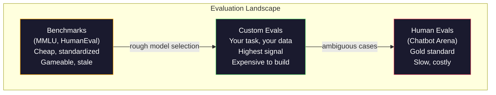
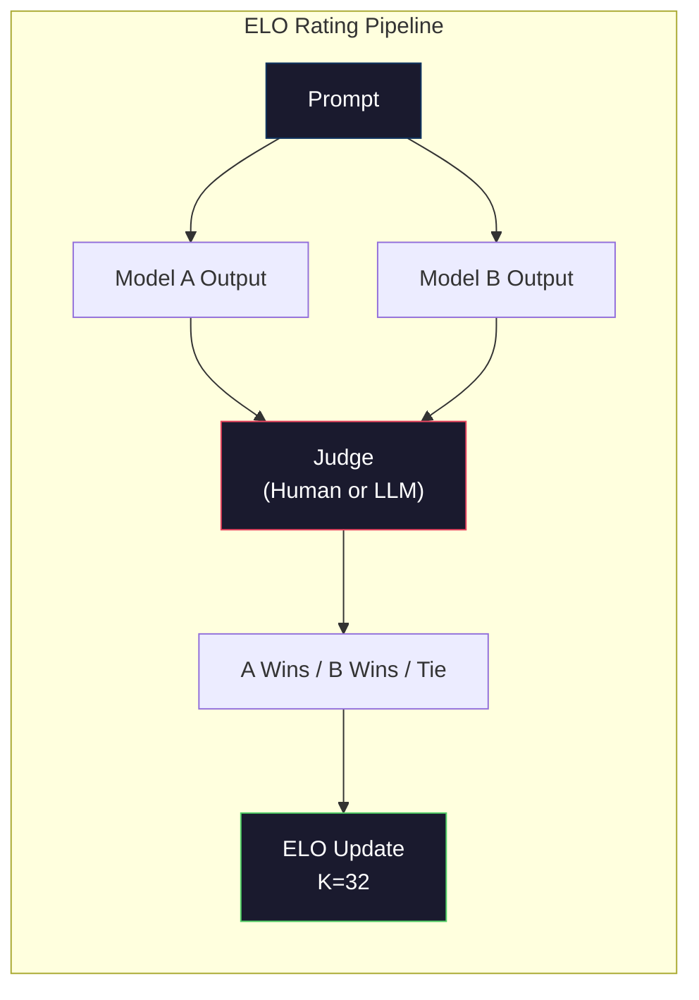

# 评估：基准测试、Evals 与 LM Harness

> 古德哈特定律（Goodhart's Law）：当一项度量变成目标时，它就不再是好的度量。每个前沿实验室都在"刷"基准测试。MMLU 分数不断上涨，模型却仍然数不清 "strawberry" 里有几个 R。唯一真正重要的评估，是你自己的评估——在你的任务上、用你的数据。

**Type:** Build
**Languages:** Python
**Prerequisites:** Phase 10, Lessons 01-05 (LLMs from Scratch)
**Time:** ~90 minutes

## 学习目标

- 构建一个自定义评估框架（evaluation harness），可对语言模型运行多选题和开放式基准测试
- 解释为什么标准基准（MMLU、HumanEval）会饱和，并失去区分前沿模型的能力
- 用恰当的指标实现任务专属评估：精确匹配（exact match）、F1、BLEU 以及 LLM 评审（LLM-as-judge）打分
- 设计针对你自身使用场景的自定义评估套件，而不是只依赖公开排行榜

## 问题背景

MMLU 于 2020 年发布，包含 57 个学科、共 15,908 道题目。三年之内，前沿模型就把它打到了饱和。GPT-4 得 86.4%，Claude 3 Opus 得 86.8%，Llama 3 405B 得 88.6%。排行榜被压缩到 3 个百分点的区间里，分数差异只是统计噪声，而非真实的能力差距。

与此同时，这些模型却在 10 岁小孩不假思索就能完成的任务上翻车。在 MMLU 上得到 88.7% 的 Claude 3.5 Sonnet，一开始数不出 "strawberry" 里有几个字母——这项任务不需要任何世界知识、不需要任何推理，只需要逐字符遍历。HumanEval 用 164 道题测试代码生成。模型在上面拿到 90% 以上的分数，写出的代码却依然会在任何初级开发者都能发现的边界情况上崩溃。

基准测试表现与真实世界可靠性之间的鸿沟，是 LLM 评估的核心问题。基准测试只能告诉你模型在基准测试上的表现。对于模型在你的具体任务上、用你的具体数据、在你的具体失败模式下会如何表现，它们几乎什么都说明不了。如果你在做客服机器人，MMLU 与你无关。如果你在做代码助手，HumanEval 只覆盖函数级生成——对于调试、重构、跨文件解释代码，它什么也说明不了。

你需要自定义评估。不是因为基准测试没用——它们对粗略的模型选型是有用的——而是因为最终的评估必须与你的部署环境完全一致。

## 核心概念

### 评估的版图

评估分为三类，各自的成本和信号质量不同。

**基准测试（Benchmarks）**是标准化测试套件。MMLU、HumanEval、SWE-bench、MATH、ARC、HellaSwag。你把模型跑一遍基准就能得到分数。优势是：所有人用同一份试卷，模型之间可以横向比较。劣势是：模型和训练数据对这些基准的污染越来越严重。实验室的训练数据里混入了基准题目，分数上涨，能力却未必。

**自定义评估（Custom evals）**是你为自己的具体使用场景构建的测试套件。你定义输入、期望输出和打分函数。法律文书摘要器就用法律文书评估，SQL 生成器就用你自己的数据库 schema 评估。构建成本高，但它们是唯一能预测生产环境表现的评估。

**人工评估（Human evals）**雇佣标注员，按有用性、正确性、流畅性、安全性等标准评判模型输出。对于自动打分失效的开放式任务，这是金标准。Chatbot Arena 已在 100 多个模型上收集了超过 200 万条人类偏好投票。缺点是成本（每次判断 0.10–2.00 美元）和速度（数小时到数天）。



### 基准测试为何失效

有三种机制让基准分数不再反映真实能力。

**数据污染（Data contamination）。**训练语料来自互联网爬取，而基准题目就放在互联网上，模型在训练时已经见过答案。这并不是传统意义上的作弊——实验室不会故意混入基准数据。但在网页规模的爬取下，想完全排除几乎不可能。

**应试训练（Teaching to the test）。**实验室会针对基准表现优化训练配比。如果训练混合数据中有 5% 是 MMLU 风格的多选题，模型就会学会题目格式和答案分布。MMLU 是四选一的多选题，模型学到答案在 A/B/C/D 上近似均匀分布，即使不知道答案也能从中得利。

**饱和（Saturation）。**当所有前沿模型在某个基准上都拿到 85–90% 时，这个基准就不再有区分度。剩下的 10–15% 题目可能本身有歧义、标注错误，或需要冷僻的领域知识。MMLU 从 87% 提升到 89%，可能只意味着模型多背下了两道偏题，而不是它变聪明了。

### 困惑度：快速体检

困惑度（Perplexity）衡量模型对一个 token 序列的"惊讶程度"。形式上，它是平均负对数似然的指数：

```
PPL = exp(-1/N * sum(log P(token_i | context)))
```

困惑度为 10，意味着模型在每个 token 位置上的不确定程度，平均相当于在 10 个选项中均匀随机选一个。数值越低越好。GPT-2 在 WikiText-103 上的困惑度约为 30，GPT-3 约为 20，Llama 3 8B 约为 7。

困惑度适合在同一测试集上比较不同模型，但它有盲区。一个模型可以靠擅长预测常见模式来获得低困惑度，却在罕见但重要的模式上一塌糊涂。它也完全无法反映指令遵循、推理能力或事实准确性。把它当作健全性检查，而不是最终结论。

### LLM 评审

用一个强模型来评估弱模型的输出。思路很简单：让 GPT-4o 或 Claude Sonnet 按正确性、有用性、安全性对回答打 1–5 分。用 GPT-4o-mini 每次判断的成本约 0.01 美元，而且与人类判断的一致性出奇地高——在大多数任务上约 80%。

打分提示词比模型本身更重要。模糊的提示词（"给这个回答打分"）产生的分数充满噪声；带评分细则（rubric）的结构化提示词（"答案事实正确且引用来源得 5 分，正确但无来源得 4 分，部分正确得 3 分……"）则能产生一致、可复现的分数。

失败模式：评审模型存在位置偏差（在成对比较中偏爱第一个回答）、冗长偏差（偏爱更长的回答）和自我偏好（GPT-4 给 GPT-4 的输出打分高于同等水平的 Claude 输出）。缓解手段：随机化顺序、按长度归一化、使用与被评估模型不同的评审模型。

### 基于成对比较的 ELO 评分

这就是 Chatbot Arena 的做法。把同一提示词下两个不同模型的回答展示给评判者，由人类（或 LLM 评审）选出更好的一个。从成千上万次这样的比较中，为每个模型计算 ELO 评分——与国际象棋使用的是同一套系统。

ELO 的优势：相对排名比绝对打分更可靠，能优雅地处理平局，而且收敛所需的比较次数少于对每个输出独立打分。截至 2026 年初，Chatbot Arena 的排名显示 GPT-4o、Claude 3.5 Sonnet 和 Gemini 1.5 Pro 在榜首的 ELO 分差不超过 20 分。



### 评估框架

**lm-evaluation-harness**（EleutherAI）：标准的开源评估框架，支持 200 多个基准。一条命令即可让任意 Hugging Face 模型跑 MMLU、HellaSwag、ARC 等。Open LLM Leaderboard 用的就是它。

**RAGAS**：专为 RAG 流水线设计的评估框架。衡量忠实度（答案是否与检索到的上下文一致？）、相关性（检索到的上下文是否与问题相关？）以及答案正确性。

**promptfoo**：面向提示工程的配置驱动评估工具。在 YAML 中定义测试用例，跑多个模型，得到通过/失败报告。适合对提示词做回归测试——确保改动提示词不会破坏已有用例。

### 构建自定义评估

对生产环境唯一重要的评估。流程如下：

1. **定义任务。**模型到底应该做什么？要精确。"回答问题"太模糊；"给定一封客户投诉邮件，提取产品名称、问题类别和情感倾向"才是可评估的任务。

2. **创建测试用例。**原型评估至少 50 条，生产环境至少 200 条。每条测试用例都是一个 (input, expected_output) 对。要包含边界情况：空输入、对抗性输入、有歧义的输入、其他语言的输入。

3. **定义打分方式。**结构化输出用精确匹配；文本相似度用 BLEU/ROUGE；开放式质量用 LLM 评审；抽取类任务用 F1。可以加权组合多个指标。

4. **自动化。**每次评估都能用一条命令跑完，没有任何手动步骤。结果存成便于随时间对比的格式。

5. **持续追踪。**孤立的评估分数没有意义，你需要趋势线。上次改提示词后分数提升了吗？换模型后回退了吗？把评估与提示词一起做版本管理。

| 评估类型 | 每次判断成本 | 与人类的一致性 | 最适用于 |
|-----------|------------------|----------------------|----------|
| 精确匹配 | ~$0 | 100%（在适用场景下） | 结构化输出、分类 |
| BLEU/ROUGE | ~$0 | ~60% | 翻译、摘要 |
| LLM 评审 | ~$0.01 | ~80% | 开放式生成 |
| 人工评估 | $0.10-$2.00 | 不适用（本身就是基准事实） | 有歧义、高风险的任务 |

```figure
perplexity-loss
```

## 从零实现

### 第 1 步：最小评估框架

先定义核心抽象。一个评估用例（eval case）包含输入、期望输出和一个可选的元数据字典。打分器（scorer）接收预测值和参考答案，返回 0 到 1 之间的分数。

```python
import json
from collections import Counter

class EvalCase:
    def __init__(self, input_text, expected, metadata=None):
        self.input_text = input_text
        self.expected = expected
        self.metadata = metadata or {}

class EvalSuite:
    def __init__(self, name, cases, scorers):
        self.name = name
        self.cases = cases
        self.scorers = scorers

    def run(self, model_fn):
        results = []
        for case in self.cases:
            prediction = model_fn(case.input_text)
            scores = {}
            for scorer_name, scorer_fn in self.scorers.items():
                scores[scorer_name] = scorer_fn(prediction, case.expected)
            results.append({
                "input": case.input_text,
                "expected": case.expected,
                "prediction": prediction,
                "scores": scores,
            })
        return results
```

### 第 2 步：打分函数

实现精确匹配、token 级 F1，以及一个模拟版的 LLM 评审打分器。

```python
def exact_match(prediction, expected):
    return 1.0 if prediction.strip().lower() == expected.strip().lower() else 0.0

def token_f1(prediction, expected):
    pred_tokens = set(prediction.lower().split())
    exp_tokens = set(expected.lower().split())
    if not pred_tokens or not exp_tokens:
        return 0.0
    common = pred_tokens & exp_tokens
    precision = len(common) / len(pred_tokens)
    recall = len(common) / len(exp_tokens)
    if precision + recall == 0:
        return 0.0
    return 2 * (precision * recall) / (precision + recall)

def llm_judge_simulated(prediction, expected):
    pred_words = set(prediction.lower().split())
    exp_words = set(expected.lower().split())
    if not exp_words:
        return 0.0
    overlap = len(pred_words & exp_words) / len(exp_words)
    length_penalty = min(1.0, len(prediction) / max(len(expected), 1))
    return round(overlap * 0.7 + length_penalty * 0.3, 3)
```

### 第 3 步：ELO 评分系统

实现带 ELO 更新的成对比较。这正是 Chatbot Arena 用来给模型排名的系统。

```python
class ELOTracker:
    def __init__(self, k=32, initial_rating=1500):
        self.ratings = {}
        self.k = k
        self.initial_rating = initial_rating
        self.history = []

    def _ensure_player(self, name):
        if name not in self.ratings:
            self.ratings[name] = self.initial_rating

    def expected_score(self, rating_a, rating_b):
        return 1 / (1 + 10 ** ((rating_b - rating_a) / 400))

    def record_match(self, player_a, player_b, outcome):
        self._ensure_player(player_a)
        self._ensure_player(player_b)

        ea = self.expected_score(self.ratings[player_a], self.ratings[player_b])
        eb = 1 - ea

        if outcome == "a":
            sa, sb = 1.0, 0.0
        elif outcome == "b":
            sa, sb = 0.0, 1.0
        else:
            sa, sb = 0.5, 0.5

        self.ratings[player_a] += self.k * (sa - ea)
        self.ratings[player_b] += self.k * (sb - eb)

        self.history.append({
            "a": player_a, "b": player_b,
            "outcome": outcome,
            "rating_a": round(self.ratings[player_a], 1),
            "rating_b": round(self.ratings[player_b], 1),
        })

    def leaderboard(self):
        return sorted(self.ratings.items(), key=lambda x: -x[1])
```

### 第 4 步：困惑度计算

用 token 概率计算困惑度。实践中这些概率来自模型的 logits，这里我们用一个概率分布来模拟。

```python
import numpy as np

def perplexity(log_probs):
    if not log_probs:
        return float("inf")
    avg_neg_log_prob = -np.mean(log_probs)
    return float(np.exp(avg_neg_log_prob))

def token_log_probs_simulated(text, model_quality=0.8):
    np.random.seed(hash(text) % 2**31)
    tokens = text.split()
    log_probs = []
    for i, token in enumerate(tokens):
        base_prob = model_quality
        if len(token) > 8:
            base_prob *= 0.6
        if i == 0:
            base_prob *= 0.7
        prob = np.clip(base_prob + np.random.normal(0, 0.1), 0.01, 0.99)
        log_probs.append(float(np.log(prob)))
    return log_probs
```

### 第 5 步：汇总结果

对一轮评估计算汇总统计量：均值、中位数、给定阈值下的通过率，以及按指标的分项明细。

```python
def summarize_results(results, threshold=0.8):
    all_scores = {}
    for r in results:
        for metric, score in r["scores"].items():
            all_scores.setdefault(metric, []).append(score)

    summary = {}
    for metric, scores in all_scores.items():
        arr = np.array(scores)
        summary[metric] = {
            "mean": round(float(np.mean(arr)), 3),
            "median": round(float(np.median(arr)), 3),
            "std": round(float(np.std(arr)), 3),
            "min": round(float(np.min(arr)), 3),
            "max": round(float(np.max(arr)), 3),
            "pass_rate": round(float(np.mean(arr >= threshold)), 3),
            "n": len(scores),
        }
    return summary

def print_summary(summary, suite_name="Eval"):
    print(f"\n{'=' * 60}")
    print(f"  {suite_name} Summary")
    print(f"{'=' * 60}")
    for metric, stats in summary.items():
        print(f"\n  {metric}:")
        print(f"    Mean:      {stats['mean']:.3f}")
        print(f"    Median:    {stats['median']:.3f}")
        print(f"    Std:       {stats['std']:.3f}")
        print(f"    Range:     [{stats['min']:.3f}, {stats['max']:.3f}]")
        print(f"    Pass rate: {stats['pass_rate']:.1%} (threshold >= 0.8)")
        print(f"    N:         {stats['n']}")
```

### 第 6 步：跑通完整流水线

把所有部分串起来。定义任务、创建测试用例、模拟两个模型、运行评估、根据成对比较计算 ELO，并打印排行榜。

```python
def demo_model_good(prompt):
    responses = {
        "What is the capital of France?": "Paris",
        "What is 2 + 2?": "4",
        "Who wrote Hamlet?": "William Shakespeare",
        "What language is PyTorch written in?": "Python and C++",
        "What is the boiling point of water?": "100 degrees Celsius",
    }
    return responses.get(prompt, "I don't know")

def demo_model_bad(prompt):
    responses = {
        "What is the capital of France?": "Paris is the capital city of France",
        "What is 2 + 2?": "The answer is four",
        "Who wrote Hamlet?": "Shakespeare",
        "What language is PyTorch written in?": "Python",
        "What is the boiling point of water?": "212 Fahrenheit",
    }
    return responses.get(prompt, "Unknown")

cases = [
    EvalCase("What is the capital of France?", "Paris"),
    EvalCase("What is 2 + 2?", "4"),
    EvalCase("Who wrote Hamlet?", "William Shakespeare"),
    EvalCase("What language is PyTorch written in?", "Python and C++"),
    EvalCase("What is the boiling point of water?", "100 degrees Celsius"),
]

suite = EvalSuite(
    name="General Knowledge",
    cases=cases,
    scorers={
        "exact_match": exact_match,
        "token_f1": token_f1,
        "llm_judge": llm_judge_simulated,
    },
)

results_good = suite.run(demo_model_good)
results_bad = suite.run(demo_model_bad)

print_summary(summarize_results(results_good), "Model A (concise)")
print_summary(summarize_results(results_bad), "Model B (verbose)")
```

"好"模型给出精确答案，"坏"模型给出冗长的改述。精确匹配会狠狠惩罚冗长的模型，而 token F1 和 LLM 评审则宽容得多。这说明了指标选择为何重要：同一个模型，换一种打分方式，看起来可能判若云泥。

### 第 7 步：ELO 锦标赛

在多轮比赛中对模型进行成对比较。

```python
elo = ELOTracker(k=32)

for case in cases:
    pred_a = demo_model_good(case.input_text)
    pred_b = demo_model_bad(case.input_text)

    score_a = token_f1(pred_a, case.expected)
    score_b = token_f1(pred_b, case.expected)

    if score_a > score_b:
        outcome = "a"
    elif score_b > score_a:
        outcome = "b"
    else:
        outcome = "tie"

    elo.record_match("model_a_concise", "model_b_verbose", outcome)

print("\nELO Leaderboard:")
for name, rating in elo.leaderboard():
    print(f"  {name}: {rating:.0f}")
```

### 第 8 步：困惑度对比

比较不同质量水平的"模型"的困惑度。

```python
test_text = "The quick brown fox jumps over the lazy dog in the garden"

for quality, label in [(0.9, "Strong model"), (0.7, "Medium model"), (0.4, "Weak model")]:
    log_probs = token_log_probs_simulated(test_text, model_quality=quality)
    ppl = perplexity(log_probs)
    print(f"  {label} (quality={quality}): perplexity = {ppl:.2f}")
```

## 生产实践

### lm-evaluation-harness（EleutherAI）

在任意模型上运行基准测试的标准工具。

```python
# pip install lm-eval
# Command line:
# lm_eval --model hf --model_args pretrained=meta-llama/Llama-3.1-8B --tasks mmlu --batch_size 8

# Python API:
# import lm_eval
# results = lm_eval.simple_evaluate(
#     model="hf",
#     model_args="pretrained=meta-llama/Llama-3.1-8B",
#     tasks=["mmlu", "hellaswag", "arc_easy"],
#     batch_size=8,
# )
# print(results["results"])
```

### promptfoo

面向提示工程的配置驱动评估。在 YAML 中定义测试，对多个提供商运行。

```yaml
# promptfoo.yaml
providers:
  - openai:gpt-4o-mini
  - anthropic:claude-3-haiku

prompts:
  - "Answer in one word: {{question}}"

tests:
  - vars:
      question: "What is the capital of France?"
    assert:
      - type: contains
        value: "Paris"
  - vars:
      question: "What is 2 + 2?"
    assert:
      - type: equals
        value: "4"
```

### 用 RAGAS 评估 RAG

```python
# pip install ragas
# from ragas import evaluate
# from ragas.metrics import faithfulness, answer_relevancy, context_precision
#
# result = evaluate(
#     dataset,
#     metrics=[faithfulness, answer_relevancy, context_precision],
# )
# print(result)
```

RAGAS 衡量的是通用评估遗漏的东西：模型的答案是否扎根于检索到的上下文，而不仅仅是在抽象意义上"正确"。

## 交付产物

本课产出 `outputs/prompt-eval-designer.md`——一个可复用的提示词，能为任意任务设计自定义评估套件。给它一段任务描述，它就会生成测试用例、打分函数和通过/失败阈值建议。

本课还产出 `outputs/skill-llm-evaluation.md`——一个决策框架，帮助你根据任务类型、预算和延迟要求选择合适的评估策略。

## 练习

1. 添加一个"一致性"打分器：将同一输入送入模型 5 次，统计输出一致的频率。在确定性输入上答案不一致，往往暴露出脆弱的提示词或过高的 temperature 设置。

2. 扩展 ELO 追踪器，支持多个评判函数（精确匹配、F1、LLM 评审）并对它们加权。比较当你重仓精确匹配与重仓 F1 时，排行榜会发生怎样的变化。

3. 为一个具体任务构建评估套件：将邮件分为 5 个类别。创建 100 条覆盖多样情形的测试用例，包括边界情况（可能属于多个类别的邮件、空邮件、其他语言的邮件）。衡量不同"模型"（基于规则、关键词匹配、模拟 LLM）的表现。

4. 实现污染检测：给定一组评估题目和一份训练语料，检查有多大比例的评估题目（或其近似改写）出现在训练数据中。研究者就是用这种方法审计基准的有效性。

5. 构建一个"模型 diff"工具。给定两个模型版本的评估结果，标出哪些具体测试用例改善了、哪些回退了、哪些保持不变。这相当于评估领域的代码 diff——对于理解一次改动究竟是帮了忙还是帮了倒忙至关重要。

## 关键术语

| 术语 | 大家的说法 | 真正的含义 |
|------|----------------|----------------------|
| MMLU | "那个基准测试" | Massive Multitask Language Understanding——57 个学科、15,908 道多选题，到 2025 年已被打到 88% 以上而饱和 |
| HumanEval | "代码评估" | OpenAI 出的 164 道 Python 函数补全题，只测试孤立的函数生成 |
| SWE-bench | "真实编程评估" | 来自 12 个 Python 仓库的 2,294 个 GitHub issue，衡量包括测试生成在内的端到端 bug 修复 |
| 困惑度（Perplexity） | "模型有多懵" | exp(-avg(log P(token_i given context)))——数值越低，说明模型给实际 token 分配的概率越高 |
| ELO 评分 | "模型界的国际象棋等级分" | 由成对胜负记录算出的相对水平评分，Chatbot Arena 用它给 100 多个模型排名 |
| LLM 评审 | "用 AI 给 AI 打分" | 强模型按评分细则给弱模型的输出打分，与人类评判的一致性约 80%，每次判断约 0.01 美元 |
| 数据污染 | "模型见过考题" | 训练数据中混入了基准题目，分数被抬高但真实能力并未提升 |
| 评估套件 | "一堆测试" | 一组带版本管理的 (input, expected_output, scorer) 三元组，用于衡量某项具体能力 |
| 通过率 | "答对的百分比" | 得分高于阈值的评估用例占比——比平均分更有行动指导意义，因为它衡量的是可靠性 |
| Chatbot Arena | "模型排名网站" | LMSYS 平台，积累了 200 多万条人类偏好投票，通过 ELO 评分产出最受信赖的 LLM 排行榜 |

## 延伸阅读

- [Hendrycks et al., 2021 -- "Measuring Massive Multitask Language Understanding"](https://arxiv.org/abs/2009.03300)——MMLU 论文，尽管已经饱和，仍是被引用最多的 LLM 基准
- [Chen et al., 2021 -- "Evaluating Large Language Models Trained on Code"](https://arxiv.org/abs/2107.03374)——OpenAI 的 HumanEval 论文，奠定了代码生成评估方法论
- [Zheng et al., 2023 -- "Judging LLM-as-a-Judge"](https://arxiv.org/abs/2306.05685)——对用 LLM 评估 LLM 的系统性分析，包含位置偏差和冗长偏差的研究结论
- [LMSYS Chatbot Arena](https://chat.lmsys.org/)——拥有 200 多万投票的众包模型对比平台，最受信赖的真实世界 LLM 排名
