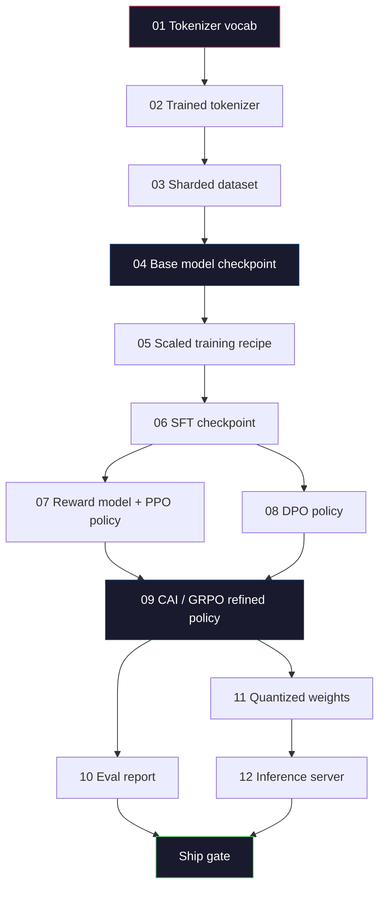
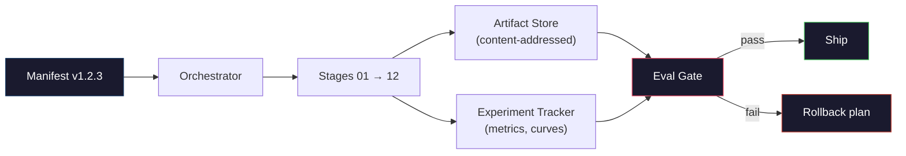

# 构建完整的 LLM 流水线

> 第 01 到 12 课的每一课都是同一条流水线中的一个阶段。本课就是把这些阶段串成一次端到端运行的脚手架：分词、预训练、扩展、SFT、对齐、评估、量化、部署。你不会在笔记本电脑上训练一个 70B 模型。你要产出的是编排层、清单（manifest）、评估闸门和回滚计划——这正是 2026 年前沿团队用来决定什么能上线的那一套东西。这是收官之作。

**Type:** Build
**Languages:** Python (stdlib)
**Prerequisites:** All Phase 10 lessons 01-12
**Time:** ~120 minutes

## 学习目标

- 将前十一课的内容（分词器、数据、预训练、扩展、SFT、RLHF、DPO、CAI、评估、量化、推理）组合成一份可复现的流水线规格说明
- 定义阶段之间的工件契约（artifact contract）：每个阶段消费什么、产出什么、下一个阶段如何校验输入
- 构建一个编排器，用于跟踪实验、计算工件哈希，并以评估阈值作为上线决策的闸门
- 设计回滚计划：哪些工件重跑成本低、哪些成本高，以及一个损坏的检查点会造成多大代价

## 问题背景

前面每一课各自都能跑通。分词器训练好了。小型 GPT 预训练完了。SFT 数据集组装好了。奖励模型训练好了。DPO 跑完了。评估指标测出来了。量化权重导出了。推理服务器也启动了。但每一个都是一个 notebook。每一个都有自己的约定、自己的输出路径、自己的随机种子。

前沿训练运行不是一个 notebook。Llama 3 405B 耗费了 3000 万 H100 小时，历时约 54 天。DeepSeek-V3 用了约 280 万 H800 小时。在这段时间里，一个损坏的检查点、一次数据污染、一次评估退化，就可能让团队损失一周的真实时间和一个月的 GPU 预算。团队能撑过这些靠的是流水线卫生（pipeline hygiene）：每个阶段都有确定性的输入、确定性的输出、一份清单、一个哈希、一道闸门。

这是收官之课。你不会在笔记本电脑上端到端地跑完这条流水线。你要编写的是协调各阶段的编排器、描述这次运行的清单、为上线决策把关的校验器，以及让第三方能凭一个文件重放你全部工作的重放计划。代码量很小；纪律性很重。

这套模式从 1 亿参数到 1 万亿参数都不需要改动。同样的四个组件——清单、编排器、评估闸门、工件存储——既能跑 Llama 3，也能跑你的业余 GPT。差别只在每个阶段配置里数字的大小，而不在流水线的形状。

## 核心概念

### 十二个阶段

Phase 10 的每一课都是一个阶段。下面是完整的依赖图。



阶段 07 和 08 可以并行运行。其余全部是硬性依赖。阶段 02（分词器）的一处改动会让所有下游工件失效。阶段 10（评估）的改动只会影响上线决策。

### 清单（Manifest）

清单是一个单一文件，对一次运行的描述完整到足以重放它。流水线产出的任何东西都不应依赖于清单之外的状态。这些字段很乏味，但缺一不可。

```
pipeline_version: 1.2.3
seed: 42
git_commit: a1b2c3d4
stages:
  01_tokenizer:
    recipe: bpe_32k
    input_hash: sha256:...
    output_hash: sha256:...
    wall_clock_sec: 3600
    cost_usd: 12
```

第 N 阶段的输出哈希就是第 N+1 阶段的输入哈希。任何偏差都会让流水线停下来。你就是靠这个尽早发现数据损坏的。这也是远在另一块大陆的同事验证自己的重放产出了与你相同工件的方式。

实践中，团队会使用一个小型 YAML schema，外加一个清单检查器，对比上一次成功运行的清单。任何超出预期字段（成本、耗时）的差异都是危险信号。

### 工件类型化

每个阶段的输出都是一个有类型的工件。不是一个目录大杂烩，不是一个 pickle，而是一个有已知 schema 的具名类型。

| 阶段 | 工件类型 | 关键字段 |
|-------|--------------|-----------|
| 01-02 | 分词器 | vocab.json、merges.txt、config.json、哈希 |
| 03 | 数据集 | shards[]、行数、token 数、去重统计 |
| 04-05 | 检查点 | weights.safetensors、config.json、优化器状态、步数 |
| 06 | SFT 模型 | 检查点 + SFT 配方 + 数据配比 |
| 07 | 奖励模型 | RM 检查点 + 偏好数据哈希 |
| 08-09 | 策略 | 检查点 + 参考模型哈希 + beta + 已消耗的 KL 预算 |
| 10 | 评估报告 | 基准分数 + 回归差异 + 评估数据哈希 |
| 11 | 量化模型 | 量化权重 + 校准数据 + 相对 FP16 的精度差 |
| 12 | 服务器规格 | 端点 + 模型哈希 + 配置 + 可观测性钩子 |

类型化能防住最常见的失败模式：把阶段 08 的输出当成阶段 06 的输入，让一个 DPO 训练的模型从 SFT 路径发布出去。类型化的工件加上类型化的阶段签名，把这类错误变成编译期失败，而不是第五天才暴露的失败。

### 评估闸门

上线不是"训练结束"。上线是"训练结束且评估闸门通过"。闸门在运行开始之前就要定义好。

```
gates:
  mmlu:      >= baseline + 0.5   # no regression
  humaneval: >= baseline + 1.0
  truthfulqa: >= baseline         # no drop
  safety_refusal_rate: <= 0.05
  kl_from_reference: <= 25.0
  cost_total_usd: <= 50000
```

每道闸门都是一个数值阈值。没有"看起来不错"式的闸门。没有主观签字放行。如果所有闸门都通过，该工件被标记为可上线。如果任何一道闸门失败，这次运行被搁置，等待指定审查人的显式覆盖（override），而这次覆盖本身也会记录到清单里。

有两道闸门能挡住绝大多数灾难。一道是*回归*闸门（新模型在核心基准上至少不能比旧模型差），它能抓住训练 bug。一道是 *KL 预算*闸门（对齐后的策略相对其参考模型的漂移不得超过 X），它能抓住对齐过火的问题。每条生产流水线两者都有。

### 编排器

一小段代码，负责读取清单、调度各阶段、跟踪工件，并在任何契约违规时停机。这不是 Airflow。这不是 Kubeflow。为了流水线卫生，你需要的是一个由你亲手写的、平平无奇的东西。

编排器的职责很窄：

1. 从清单解析出 DAG。
2. 对每个阶段，检查预期输出是否已以正确哈希存在（存在则跳过）。
3. 运行该阶段，捕获 stdout/stderr，测量耗时和成本。
4. 用下游阶段期望的输入哈希校验本阶段的输出哈希。
5. 失败时，写出一份记录了确切失败阶段的部分清单，并以非零退出码退出。

这就是 200 行 Python。它会长得像本课的 `code/main.py` 文件。在底层，真实的流水线会用 `torchrun` 或 `ray` 在集群上执行各个阶段，但编排器本身在一台机器上运行。

### 实验跟踪与工件存储

有两个外部系统为流水线提供支撑。

**实验跟踪器（wandb、neptune、mlflow）。** 按阶段记录损失曲线、评估指标、系统遥测。三周后你需要对比运行 A 和运行 B 时，去的就是跟踪器。团队几乎总是用托管的跟踪器来做这件事——自己造一个，浪费的是本该花在训练上的时间。

**工件存储（S3、R2、GCS）。** 用于检查点、数据集、分词器、评估报告的不可变对象存储。工件按哈希寻址，而不是按文件名。像 `latest.pt` 这样的文件名是个坑；`ckpt-7b-step-20000-sha256:abc123.safetensors` 才是一份契约。

编排器同时向两者写入。跟踪器是给看图表的人用的。工件存储是给下一个阶段查找输入用的。

### 成本核算

前沿训练运行带着一个美元数字。预算纪律体现在两个地方。

**运行前估算。** 从清单计算预期 FLOPs（预训练为 6 x 参数量 x token 数）、预期 GPU 小时数（FLOPs / 峰值吞吐 / 利用率），以及按当前租用价格折算的美元成本。如果估算超过预算闸门，流水线拒绝启动。

**运行中跟踪。** 逐阶段的耗时和成本会记入清单。每个阶段结束后检查剩余预算。如果某个阶段超支了，下一个阶段的闸门会用新的剩余预算来评估。你不该等到投资人打电话来才发现钱花光了。

Llama 3 公布的成本是 6100 万美元。DeepSeek-V3 公布的主预训练成本是 560 万美元。这个比值主要来自硬件效率加上混合专家（mixture-of-experts）——但具体成本之所以可见，是因为两个团队都按阶段而不是按整次运行来跟踪它。

### 可复现性 vs 确定性

这两者不是一回事。*可复现（Reproducible）*指相同的清单、相同的代码、相同的基础设施，产出一个下游指标等价的检查点。*确定性（Deterministic）*指逐比特一致的输出。

现代 LLM 训练是可复现的，但不是确定性的。分布式训练的归约顺序、GPU 内核的非确定性（cuBLAS、flash-attn）、混合精度的舍入，叠加起来会让两次运行的浮点数在 1e-5 量级上出现差异。对于最终指标来说这没问题——指标不会动。但如果你想靠逐比特对比来调试，这就是致命的。解法是记录每个阶段的输入哈希、输出哈希和核心指标——只要这些匹配，这次运行就算"复现"了，哪怕权重并非逐比特一致。



### 回滚计划

在运行开始之前，写下每个阶段失败时该怎么办。分三类。

- **重跑成本低**（小时级）：分词器、评估、量化、推理服务器。直接重跑。
- **中等**（天级）：SFT、DPO、CAI。保留基础模型；只重跑对齐阶段。
- **昂贵**（数周、数百万美元）：预训练。这里的回滚计划不是"重跑"，而是"使用最后一个完好的检查点，用修订后的数据重跑成本更低的下游阶段"。

因为阶段依赖是类型化且带哈希的，编排器可以自动计算回滚集合：让失败的阶段及其所有后代失效。阶段 06（SFT）失败会使 06、07、08、09、10、11、12 全部失效。阶段 11（量化）失败只会使 11 和 12 失效。提前写明这些，能避免团队在凌晨四点精疲力竭时临场即兴发挥。

### 2026 年观察到的生产配方

大多数前沿团队收敛到了同一套骨架。

- 分词器：128k BPE，带字节回退。在一个小而均衡的多语言切片上训练。
- 预训练：10-20T token，以网页加代码加合成数据为主。Muon 或 AdamW 优化器。FSDP2 或 DeepSpeed ZeRO-3。梯度检查点。BF16 权重，FP32 主权重。
- SFT：50 万到 200 万条指令对，人工与合成混合，并对评估集做严格去重。
- 对齐：DPO 或 CAI + GRPO。只有当偏好信号的维度复杂到 DPO 处理不了时才用 RLHF。
- 评估：MMLU-Pro、MATH、HumanEval+、GPQA、SWE-Bench Verified、LiveBench，外加一个公众永远看不到的私有保留集。
- 量化：服务用 4-bit GPTQ 或 AWQ，对精度差敏感的安全评估用 8-bit。
- 服务：vLLM、TensorRT-LLM 或自研。连续批处理。投机解码。KV 缓存逐出。

数字每六个月都在变。骨架不变。

```figure
beam-search
```

## 从零实现

本课的代码是一个编排器加一个清单检查器，而不是十二个训练脚本。每个阶段用一个占位实现来模拟，产出形状和哈希都正确的输出工件。把编排器端到端跑通，就能在烧 GPU 真金白银跑真实阶段之前，证明流水线的管路是通的。

完整实现见 `code/main.py`。关键部分：

- `Manifest` dataclass：流水线版本、种子、git 提交、各阶段、各闸门。
- `Stage` dataclass：名称、类型、输入（哈希）、输出（哈希）、耗时、成本。
- `Orchestrator.run()`：解析 DAG、调度阶段、校验哈希、更新清单。
- `EvalGate.check()`：读取阈值，与最新评估报告比较，返回通过/失败。
- `ArtifactStore`（内存桩实现）：按哈希存取，模拟 S3。
- `CostTracker`：逐阶段与累计成本，超过上限即停机。

`main.py` 中的流水线会运行十二个占位阶段，产出一份清单，并故意触发一次评估闸门失败，让你看到一次被搁置的运行长什么样。把每个占位实现换成对应课程里的真实训练脚本，你手里就是一条真实前沿流水线所使用的骨架。

## 生产实践

标准工作流就是三条命令。

```
python code/main.py plan    # validate manifest, compute cost estimate, print DAG
python code/main.py run     # execute stages, writing to manifest.out.yaml
python code/main.py gate    # read manifest.out.yaml, apply eval gates, ship-or-hold
```

每次都先跑 `plan`。大多数流水线 bug 在 plan 阶段就会暴露——缺失的闸门阈值、过期的哈希、预算超支。跑 `plan` 是免费的。跑 `run` 是昂贵的。把 bug 拦在便宜的一侧才省钱。

`gate` 的输出要么是 `SHIP`，要么是 `HOLD: <reason>`。被搁置的运行不是失败；它是一个决策点。指定的审查人要么覆盖放行（覆盖会被记录），要么批准回滚。

## 交付产物

本课产出 `outputs/skill-llm-pipeline-reviewer.md`。把一份候选流水线清单喂给它，它会检查所有契约：阶段类型、哈希链、闸门、回滚计划、成本估算。对于缺少评估闸门、KL 预算无上限、或评估数据与训练数据混用的清单，它会拒绝批准。

## 练习

1. 扩展编排器，支持阶段 07 和 08 的并行执行。使用标准库的 `concurrent.futures` 模块。确认最终清单记录了两个阶段的输出，且阶段 09 的输入哈希是两者的确定性组合。

2. 增加一道"污染检查"闸门。给定评估数据集哈希和训练数据集分片，计算重叠率（精确字符串匹配或 13-gram 匹配）。重叠率超过 0.1% 即闸门失败。喂给它一个被污染的训练集，确认闸门确实搁置了这次运行。

3. 从第一性原理实现一个成本估算器。对于阶段 04（预训练），按 6 x 参数量 x token 数估算 FLOPs，假设 H100 在 989 TFLOPs BF16 下的 MFU（模型 FLOPs 利用率）为 40%，价格为 $2.50/GPU 小时。给出 7B 模型训练 2T token 的成本估算。与公开的 Llama 2 数字对比。

4. 构建一次部分回滚。模拟阶段 09（CAI）失败，然后在保持 01-08 缓存不动的情况下重跑阶段 09 到 12。编排器应当按哈希识别出已缓存的工件并跳过它们。测量相对完整重跑节省的真实时间。

5. 增加可观测性。为每个阶段发出 OpenTelemetry span，属性包括参数量、已处理 token 数、损失和成本。把 span 输送到本地 collector。重点不是仪表盘；重点是每个阶段的健康状况都能从一个 trace ID 追溯到。

## 关键术语

| 术语 | 人们怎么说 | 实际含义 |
|------|----------------|----------------------|
| 清单（Manifest） | "配方文件" | 描述流水线版本、种子、各阶段配置和闸门阈值的 YAML 或 JSON——足以重放一次运行 |
| 内容寻址（Content-addressed） | "按哈希不按名字" | 工件按其内容的 SHA-256 存储，这样你永远不会把版本 A 和版本 B 搞混 |
| 评估闸门 | "上线标准" | 基准指标和安全分数上的数值阈值，工件必须全部通过才会被标记为可上线 |
| KL 预算 | "对齐漂移了多远" | 对各对齐阶段累计 KL(policy \|\| reference) 的上限，作为一道闸门强制执行 |
| MFU | "GPU 用上了多少" | 模型 FLOPs 利用率——实际达到的 FLOPs 除以理论峰值。70B 规模下典型值为 40%，7B 为 55% |
| 回滚计划 | "出问题了我们怎么办" | 为每个阶段预先写好的失败应对动作集合：重跑、回退、用修订输入重新训练 |
| 编排器 | "总指挥" | 读取清单、调度阶段、校验哈希、在任何契约违规时停机的那个进程 |
| 工件存储 | "存权重的带版本 S3" | 不可变的内容寻址对象存储——检查点、数据集、评估报告的唯一事实来源 |
| 可复现 | "重放得到相同指标" | 权重在比特层面不同，但下游指标等价——分布式 LLM 训练的现实目标 |
| 成本闸门 | "不能超过 X" | 运行前成本估算加运行中跟踪——估算超出预算时流水线拒绝启动 |

## 延伸阅读

- [Dubey et al., 2024 -- "The Llama 3 Herd of Models"](https://arxiv.org/abs/2407.21783) -- 对前沿流水线最详尽的公开描述，涵盖数据、训练、对齐、评估
- [DeepSeek-AI, 2024 -- "DeepSeek-V3 Technical Report"](https://arxiv.org/abs/2412.19437) -- 效率优先的流水线，成本约为 Llama 3 级别训练的十分之一
- [Kaplan et al., 2020 -- "Scaling Laws for Neural Language Models"](https://arxiv.org/abs/2001.08361) -- 最早的算力-数据-参数缩放关系
- [Hoffmann et al., 2022 -- "Training Compute-Optimal Large Language Models (Chinchilla)"](https://arxiv.org/abs/2203.15556) -- 对 Kaplan 的修正，重新校准了现代数据预算
- [PyTorch FSDP2 documentation](https://pytorch.org/docs/stable/fsdp.html) -- PyTorch 2.4+ 中取代 FSDP1 的分布式训练原语
- [Weights & Biases LLM Reports](https://wandb.ai/site/llms) -- 开源 LLM 运行的真实清单和实验跟踪器输出，可以直接当模板抄
