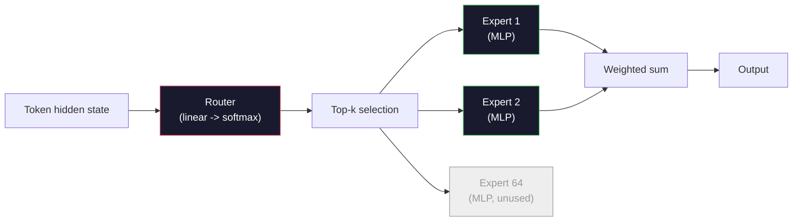

# 开放模型：架构逐一解读

> 你在第 04 课从零实现了一个 GPT-2 Small。2026 年的前沿开放模型与它同属一个家族，只是多了五六处具体改动：用 RMSNorm 替换 LayerNorm，用 SwiGLU 替换 GELU，用 RoPE 替换可学习位置编码，用 GQA 或 MLA 替换完整的 MHA，再加上大规模的混合专家（Mixture-of-Experts）。你已掌握的数学覆盖了它们的 95%。本课将并排阅读 Llama 3、DeepSeek-V3、Mixtral、Qwen 和 Gemma，精确指出每个架构在哪一行开始分叉。

**Type:** Learn
**Languages:** Python (stdlib)
**Prerequisites:** Phase 10, Lessons 04, 05, 12 (Pre-training, Scaling, Inference)
**Time:** ~45 minutes

## 学习目标

- 阅读 Llama 3、Mistral、Mixtral、Gemma 2、Qwen 2.5 和 DeepSeek-V3 的 config.json，并解释其中每个字段
- 说出每个模型相对于 GPT-2 Small 做了哪些具体的架构改动，并从第一性原理解释其动机
- 仅凭配置文件计算任意开放模型的参数量、KV 缓存大小和激活值内存
- 在给定延迟、内存和能力约束的前提下，为部署目标选出合适的开放模型

## 问题背景

在第 04 课里，你用 350 行 numpy 写出了一个 GPT-2 形态的模型。而 Llama 3 405B 有一份 200 页的技术报告。你的直觉会认为这是两种完全不同的东西。其实不是。那 200 页描述的是同一个对象，外加五六处有充分动机的修改，以及上千条关于规模化的实现细节。骨架——嵌入、Transformer 块、注意力、MLP、归一化、输出头——没有变。

本课就是一份 diff。对于每个主流开放模型家族，我们逐条列出它相对 GPT-2 改了什么、为什么改、代价是什么。学完之后，你拿到一张新模型的 model card，就能在脑中把它还原回 GPT-2 基线。

实际收益在于：当 Meta 发布 Llama 5、DeepSeek 发布 V4 时，你不需要建立新的心智模型。你只需看一眼配置，看看哪些熟知的旋钮动了，就知道下游会有什么影响。2026 年的架构是一个有限的工具箱，每个新模型只是选了一个不同的子集。

## 核心概念

### 不变的内核

所有自回归开放模型都共享：

- 词元嵌入矩阵（vocab_size x hidden_dim）。
- N 个解码器块的堆叠：归一化、自注意力、残差、归一化、MLP、残差。
- 最终归一化层和投影到 vocab_size 的线性输出头（通常与嵌入权重共享）。
- 因果掩码、下一词元交叉熵损失。

这就是骨架。剩下的都是旋钮。

### 真正在动的六个旋钮

纵观 2024-2026 年的所有前沿开放模型，被反复选择的就是这六个设计决策：

1. **归一化。** LayerNorm -> RMSNorm。
2. **位置编码。** 可学习绝对位置 -> RoPE（外加变体：YaRN、NTK）。
3. **激活函数。** GELU -> SwiGLU（或 GeGLU）。
4. **注意力头共享。** MHA -> GQA -> MQA -> MLA。
5. **稠密 vs 稀疏 MLP。** 稠密 -> 混合专家（Mixture-of-Experts）。
6. **Pre-norm 位置。** Pre-norm 保留，Post-norm 已被淘汰。

其余一切（学习率调度、数据配比、批大小、上下文长度）都属于训练配置，而非架构。就这六个旋钮。

### 旋钮 1：RMSNorm

LayerNorm 减去均值、除以标准差，再做缩放和平移。RMSNorm 只保留缩放：

```
RMSNorm(x) = x / sqrt(mean(x^2) + eps) * gamma
```

不减均值，没有偏置项，每个词元少一次矩阵运算。Zhang 和 Sennrich（2019）论证它在机器翻译上与 LayerNorm 持平，同时快 10%。所有现代开放模型都在用它。

代价：无。收益：吞吐量小幅提升，代码更简单。

### 旋钮 2：RoPE

GPT-2 的可学习位置嵌入是一张 1024 个槽位的查找表。位置 1025 就超出了表的范围，模型无法外推到训练长度之外。

旋转位置编码（Rotary Position Embedding, RoPE，Su et al. 2021）在注意力点积之前，对每对 Q 和 K 向量做成对旋转来注入位置信息。旋转角度是位置的确定性函数，因此没有任何可学习参数，也不会有耗尽的一天。配合缩放技巧（NTK 感知插值、YaRN），一个在 8k 上下文上训练的模型可以在推理时拉伸到 128k，精度损失不大。

```
q_rotated = rotate(q, angle(pos))
k_rotated = rotate(k, angle(pos))
score = q_rotated . k_rotated
```

每一个 Llama、Mistral、Qwen、DeepSeek 和 Gemma 都在用 RoPE。Gemma 2 采用混合方案（大部分层用 RoPE，其余层用局部滑动窗口注意力）。

### 旋钮 3：SwiGLU

GPT-2 的 MLP 是 `x -> gelu(xW1 + b1) -> (...)W2 + b2`。SwiGLU（Shazeer 2020）把激活函数换成了一个带门控的乘积：

```
SwiGLU(x) = (xW1) * sigmoid(xW1) * xV
```

两个并行的投影替代了一个，由 Swish 激活做门控。在每参数困惑度上的实证效果更强。Llama 2 率先采用，随后所有人跟进。MLP 的隐藏层大小通常设置成让总参数量与原始稠密 MLP 持平：如果 GPT-2 用 `ff_dim = 4 * hidden`，那么 SwiGLU 用 `ff_dim = (2/3) * 4 * hidden = 8/3 * hidden`。

### 旋钮 4：注意力头共享

GPT-2 用的是**多头注意力（Multi-Head Attention, MHA）**：每个头都有自己独立的 Q、K、V 投影。

**多查询注意力（Multi-Query Attention, MQA，Shazeer 2019）** 让所有头共享一份 K 和一份 V。KV 缓存缩小为原来的 1/num_heads，在典型模型上是 12 到 32 倍的削减。在困难基准上精度略有下降。

**分组查询注意力（Grouped-Query Attention, GQA，Ainslie et al. 2023）** 是折中方案：G 组 Q 头共享一份 K 和一份 V。Llama 3 8B 用的 GQA 有 32 个 Q 头和 8 个 KV 头（G=8），KV 缓存相比完整 MHA 缩小 4 倍。

**多头潜在注意力（Multi-Head Latent Attention, MLA，DeepSeek 2024）** 把 K 和 V 压缩进一个共享的低秩潜在向量，再逐头投影还原。进一步压缩 KV 缓存，同时保留每个头的表达能力。DeepSeek-V2 和 V3 的长上下文性能就依赖这一点。

| 方案 | KV 头数 | KV 缓存 | 精度 |
|--------|----------|----------|----------|
| MHA    | num_heads | 完整 | 最佳 |
| GQA    | num_groups（G < num_heads） | 缩小 num_heads / G 倍 | 接近 MHA |
| MQA    | 1 | 缩小 num_heads 倍 | 小幅下降 |
| MLA    | 潜在向量，逐头解压 | 比 MQA 更小 | 接近 MHA |

对于约 13B 参数以上的任何模型，GQA 或 MLA 实际上是必选项。在大规模下用完整 MHA 就是一场 KV 缓存灾难。

### 旋钮 5：混合专家

稠密 MLP 对每个词元都激活全部参数。MoE MLP 在每个块里有 K 个专家，由一个路由器为每个词元挑出前 k 个专家（通常 top-2）。只有这些专家的权重会对该词元做前向计算。

```
router_logits = xW_r
indices, weights = top_k(router_logits, k=2)
output = sum_i weights[i] * expert[indices[i]](x)
```

吸引力在于：你可以拥有 64 个 7B 大小的专家（总参数量巨大），但每个词元只运行其中 2 个（单词元计算量与稠密 7B 模型相当）。Mixtral 8x7B 总参数 47B，但每词元只激活 13B。DeepSeek-V3 总参数 671B，但每词元只激活 37B。



优点：计算量不变、参数更多、容量更强。缺点：专家的内存终归要有地方放（所以推理服务需要比同级稠密模型更多的 VRAM），路由器的负载均衡很难做好，而对齐阶段如何微调路由器本身就是一个研究方向。

### 旋钮 6：Pre-norm 保留

原始 Transformer 在每个子层之后做层归一化。GPT-2 之后的所有开放模型都把它放在每个子层*之前*。Pre-norm 在深层网络中明显更容易训练，这一点没有任何争议。

### 逐模型 Diff

下面这张表把以上一切落到实处。

| 模型 | 年份 | 总参数 | 激活参数 | 归一化 | 激活函数 | 位置编码 | 注意力 | MoE | 上下文 |
|-------|------|-------------|---------------|------|-----------|----------|-----------|-----|---------|
| GPT-2 Small | 2019 | 124M | 124M | LayerNorm | GELU | 可学习 | MHA（12 头） | 否 | 1k |
| Llama 3 8B | 2024 | 8B | 8B | RMSNorm | SwiGLU | RoPE | GQA（32/8） | 否 | 128k |
| Llama 3 70B | 2024 | 70B | 70B | RMSNorm | SwiGLU | RoPE | GQA（64/8） | 否 | 128k |
| Llama 3 405B | 2024 | 405B | 405B | RMSNorm | SwiGLU | RoPE | GQA（128/16） | 否 | 128k |
| Mistral 7B | 2023 | 7.2B | 7.2B | RMSNorm | SwiGLU | RoPE | GQA | 否 | 32k |
| Mixtral 8x7B | 2023 | 47B | 13B | RMSNorm | SwiGLU | RoPE | GQA | 是（8 专家，top-2） | 32k |
| Gemma 2 9B | 2024 | 9B | 9B | RMSNorm（pre+post） | GeGLU | RoPE + 滑动窗口 | GQA | 否 | 8k |
| Qwen 2.5 72B | 2024 | 72B | 72B | RMSNorm | SwiGLU | RoPE（YaRN） | GQA（64/8） | 否 | 128k |
| DeepSeek V2 236B | 2024 | 236B | 21B | RMSNorm | SwiGLU | RoPE | MLA | 是（160 专家，top-6） | 128k |
| DeepSeek V3 | 2024 | 671B | 37B | RMSNorm | SwiGLU | RoPE | MLA | 是（256 专家，top-8） | 128k |

逐列扫一遍：RMSNorm 是全员标配。SwiGLU 或它的近亲 GeGLU 是全员标配。RoPE 是全员标配。7B 以上的模型全用 GQA，除非被 MLA 取代。MoE 是顶级规模上的差异化因素。

### 读懂 config.json

Llama 3 8B 的配置：

```
{
  "hidden_size": 4096,
  "intermediate_size": 14336,
  "num_hidden_layers": 32,
  "num_attention_heads": 32,
  "num_key_value_heads": 8,
  "max_position_embeddings": 131072,
  "rope_theta": 500000.0,
  "rms_norm_eps": 1e-5,
  "vocab_size": 128256
}
```

每个字段都对应你已经实现过的东西。

- `hidden_size`：嵌入维度。
- `intermediate_size`：MLP 隐藏层大小（3.5 倍 hidden——SwiGLU 的算式）。
- `num_hidden_layers`：堆叠深度。
- `num_attention_heads`：Q 头数。
- `num_key_value_heads`：KV 头数（GQA）。
- `max_position_embeddings`：训练上下文长度。
- `rope_theta`：RoPE 基频。Meta 把默认的 10k 放大到 500k，以支持长上下文外推。
- `rms_norm_eps`：数值稳定性。
- `vocab_size`：词表大小。

仅凭这些字段，你就能算出总参数量、KV 缓存和峰值激活内存。具体公式见 `code/main.py`。

### 激活值内存预算

参数量超过几十亿之后，激活值会主导训练内存。预训练（开启梯度检查点）的经验法则：

```
activation_mem ~ batch_size * seq_len * hidden_size * num_layers * bytes_per_element
```

对 Llama 3 8B，batch 1、序列长度 8192、BF16、32 层、hidden 4096：开启检查点时仅激活值就约 8 GB，不开则 40 GB。这就是 flash-attention 和 ring-attention 重要的原因——它们重写注意力计算方式，让激活值装得下。

### KV 缓存预算

在最大上下文下做推理：

```
kv_cache = 2 * num_layers * num_kv_heads * head_dim * max_seq_len * bytes_per_element
```

Llama 3 8B 在 128k 上下文、BF16、head_dim = hidden / num_heads = 128 时：
`2 * 32 * 8 * 128 * 131072 * 2 = 17.2 GB` 每条序列。

8B 的权重在 BF16 下是 16 GB。单条 128k 序列的 KV 缓存比权重本身还大。这就是驱动 GQA、MLA 和 KV 缓存量化研究的内存压力。

### 各模型的适用场景

- **单张 80GB GPU，不碰 MoE**：Llama 3 8B、Mistral 7B、Gemma 2 9B。易于部署，工具链广泛。
- **单节点（8x80GB），需要大容量**：Llama 3 70B、Qwen 2.5 72B。稠密开放模型的最高能力档。
- **追求最强开放能力，接受 MoE 复杂度**：DeepSeek V3、Mixtral 8x22B。单位激活 FLOP 的能力最强。
- **长上下文需求**：Llama 3（RoPE 缩放下的 128k）、DeepSeek（MLA 优势）。
- **低延迟服务**：Gemma 2 9B（滑动窗口削减长上下文计算量）。

```figure
rmsnorm-vs-layernorm
```

## 从零实现

本课的代码是一个计算器。给定任意 config.json，它会按组件打印参数量、最大上下文下的 KV 缓存、SwiGLU MLP 比例，以及对架构的简短结论（稠密 / GQA / MLA / MoE）。

```python
config = {
    "hidden_size": 4096, "intermediate_size": 14336,
    "num_hidden_layers": 32, "num_attention_heads": 32,
    "num_key_value_heads": 8, "vocab_size": 128256,
    "max_position_embeddings": 131072,
}
```

脚本逐字段遍历架构，计算嵌入、注意力（含 GQA 削减）、MLP（含 SwiGLU 扩展）、层归一化和输出头的参数量，再计算给定上下文长度下的 KV 缓存，并打印一份摘要。

实现见 `code/main.py`。

## 生产实践

对脚本内置的 Llama 3 8B、Mistral 7B、Mixtral 8x7B 和 DeepSeek V3 配置运行计算器，比较各自的参数构成。注意 MoE 模型的总参数量远超稠密模型，但激活参数量往往更小。注意 DeepSeek V3 的 KV 缓存比 Llama 3 405B 还小，尽管它的总参数更多——这正是 MLA 的威力。

然后把你本地任意模型的配置填进去，读一读摘要，判断它能否装进你的 GPU。

## 交付产物

本课产出 `outputs/skill-open-model-picker.md`。给定一个部署目标（GPU 型号、VRAM、上下文长度、延迟预算）和一个任务画像（聊天、代码、推理、长上下文），它会推荐一个开放模型、一套第 11 课的量化方案和一套第 12 课的推理栈，并围绕六个架构旋钮给出明确的推理过程。

## 练习

1. 从 HuggingFace 读取 Qwen 2.5 72B 的配置。从零计算总参数量。与 HF 报告的数值对比，找出差异来自哪里（head dim 取整、KV 共享系数等）。

2. DeepSeek V3 使用 256 个专家、top-8 路由。计算激活专家与总专家的比例，并与 Mixtral 8x7B 的 8 选 top-2 对比。从稀疏（25%）到更稀疏（3%）的转变，对单位 FLOP 的容量意味着什么？

3. 计算 Llama 3 405B 在 128k 上下文下 FP8 和 BF16 的 KV 缓存。FP8 是 BF16 数值的一半。在单个 8xH100 节点上（每张 80GB，共 640GB，扣除权重内存）能并行服务多少条序列？

4. Gemma 2 交替使用全注意力层和滑动窗口注意力层。写出当一半层使用 4096 词元滑动窗口（而非全上下文）时的 KV 缓存公式。在 8k 总上下文下能省多少内存？

5. 找一个在本课写成之后发布的前沿开放模型。识别它选了六个旋钮中的哪些，以及它是否引入了第七个旋钮。新架构一发布，课程内容就会显得过时——目标是更新你的表格，而不是重建你的心智模型。

## 关键术语

| 术语 | 大家怎么说 | 实际含义 |
|------|----------------|----------------------|
| RMSNorm | 「去掉均值的 LayerNorm」 | 仅用均方根做归一化，外加一个可学习缩放——比 LayerNorm 更省，效果相当 |
| RoPE | 「旋转位置」 | 按位置决定的角度，对每个 Q 和 K 向量按二维成对旋转——配合缩放技巧可外推到训练长度之外 |
| SwiGLU | 「新的 MLP 激活函数」 | 带 Swish 的门控线性单元：`(xW1) * sigmoid(xW1) * xV`——2024 年之后所有开放模型的标配 |
| GQA | 「折中的注意力」 | 分组查询注意力：G 组 Q 头共享一份 K 和一份 V——压缩 KV 缓存又不像 MQA 那样掉精度 |
| MLA | 「DeepSeek 的注意力」 | 多头潜在注意力：把 K/V 压缩进共享低秩潜在向量，逐头解压——大模型中最小的 KV 缓存 |
| MoE | 「稀疏专家」 | 混合专家：每个块 N 个 MLP，路由器为每个词元挑 top-k——总参数巨大，激活参数很小 |
| Top-k 路由 | 「每个词元选 k 个专家」 | 路由器为每个专家打分，激活分数最高的 k 个——典型的 k 从 2（Mixtral）到 8（DeepSeek） |
| YaRN | 「拉伸 RoPE」 | Yet another RoPE extension——对旋转角度做插值，在推理时把上下文从 8k 扩展到 128k+ |
| 滑动窗口注意力 | 「别看所有东西」 | 每个词元只关注最近 W 个词元——把注意力开销限制在每词元 O(W)，Gemma 2 和早期 Mistral 在用 |
| 激活参数 | 「每个词元真正跑的部分」 | 对 MoE 模型而言，是每个词元前向计算实际经过的参数量（远小于总参数）——决定每词元的 FLOPs |

## 延伸阅读

- [Dubey et al., 2024 -- "The Llama 3 Herd of Models"](https://arxiv.org/abs/2407.21783) -- 稠密 Llama 3 家族的架构与训练参考
- [DeepSeek-AI, 2024 -- "DeepSeek-V3 Technical Report"](https://arxiv.org/abs/2412.19437) -- MLA 加无辅助损失负载均衡加 671B MoE
- [Jiang et al., 2024 -- "Mixtral of Experts"](https://arxiv.org/abs/2401.04088) -- MoE 开放模型的经典论文
- [Su et al., 2021 -- "RoFormer: Enhanced Transformer with Rotary Position Embedding"](https://arxiv.org/abs/2104.09864) -- RoPE 论文
- [Shazeer, 2020 -- "GLU Variants Improve Transformer"](https://arxiv.org/abs/2002.05202) -- SwiGLU、GeGLU 及其同类
- [Ainslie et al., 2023 -- "GQA: Training Generalized Multi-Query Transformer Models"](https://arxiv.org/abs/2305.13245) -- GQA 论文
- [Gemma 2 Team, 2024 -- "Gemma 2: Improving Open Language Models at a Practical Size"](https://arxiv.org/abs/2408.00118) -- 全注意力+滑动窗口混合方案、pre+post-norm
- [Qwen Team, 2024 -- "Qwen 2.5 Technical Report"](https://arxiv.org/abs/2412.15115) -- YaRN 上下文扩展与长上下文训练方案
