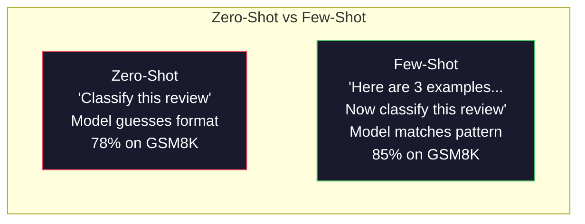
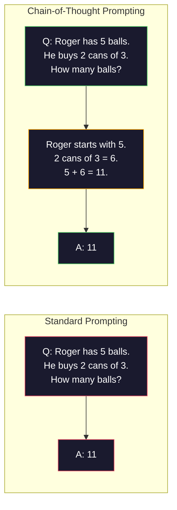
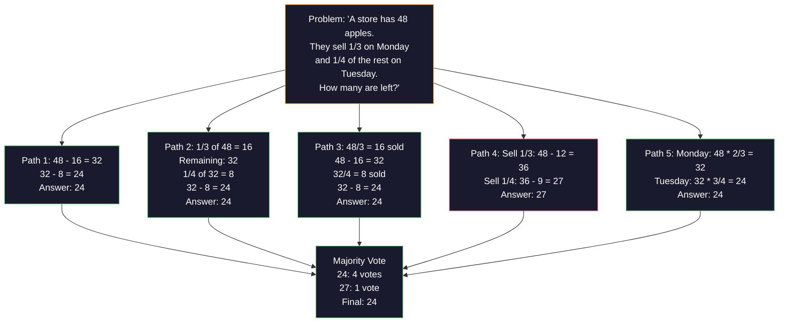
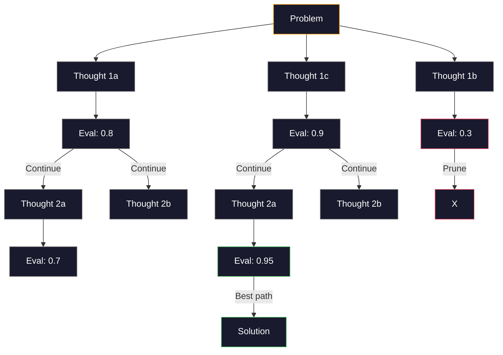
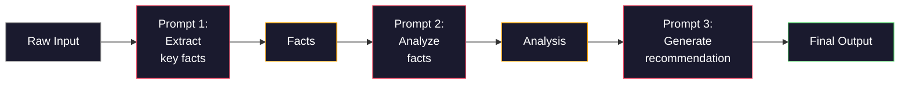

# Few-Shot、思维链与思维树

> 告诉模型做什么，是提示词；教模型怎么思考，才是工程。同一个模型、同一个任务、同一份数据，准确率从 78% 到 91% 的差距，靠的不是更好的模型，而是更好的推理策略。

**Type:** Build
**Languages:** Python
**Prerequisites:** Lesson 11.01 (Prompt Engineering)
**Time:** ~45 minutes

## 学习目标

- 实现少样本提示（few-shot prompting）：挑选并格式化示例演示，最大化任务准确率
- 应用思维链（chain-of-thought, CoT）推理，提升数学应用题等多步问题的准确率
- 构建一个思维树（tree-of-thought）提示词，探索多条推理路径并选出最优的一条
- 在标准基准上量化零样本、少样本与 CoT 之间的准确率差异

## 问题背景

你在做一个数学辅导应用。提示词写着："解这道应用题。"GPT-5 在 GSM8K（标准小学数学基准）上能答对 94%。你以为已经到顶了。其实没有——思维链还能再加 3-4 个百分点。

加上五个词——"Let's think step by step"——准确率跳到 91%。再加几个带解题过程的示例，达到 95%。同一个模型，同样的温度，同样的 API 成本。唯一的区别是：你给了模型一张草稿纸。

这不是什么取巧的把戏，而是推理的本质。人类不会一步跳到多步问题的答案，Transformer 也不会。当你强迫模型生成中间 token 时，这些 token 会成为下一个 token 的上下文。每一步推理喂给下一步。模型是真的在一步步"算"出答案。

但"一步步思考"只是起点，不是终点。如果采样五条推理路径再做多数投票呢？如果让模型探索一棵可能性之树，边评估边剪枝呢？如果把推理和工具调用交替进行呢？这些都不是空想，而是有论文、有实测提升的技术——这节课你会把它们全部亲手实现。

## 核心概念

### 零样本 vs 少样本：什么时候示例胜过指令

零样本提示只给模型任务描述，别无其他。少样本提示则先给出示例。

Wei et al. (2022) 在 8 个基准上做了对比。对于情感分类这类简单任务，零样本和少样本的差距不到 2%。对于多步算术、符号推理这类复杂任务，少样本能把准确率提高 10-25%。

直觉上，示例就是压缩后的指令。与其描述输出格式，不如直接展示；与其解释推理过程，不如直接演示。模型对示例做模式匹配，比理解抽象指令可靠得多。



**少样本占优的场景：** 对格式敏感的任务、分类、结构化抽取、领域专有术语，以及任何需要模型匹配特定模式的任务。

**零样本占优的场景：** 简单的事实性问答、示例反而会限制发挥的创意任务，以及找好示例比写好指令更难的任务。

### 示例选择：相似优于随机

示例并非生而平等。在分类任务上，选择与目标输入相似的示例比随机选择高出 5-15%（Liu et al., 2022）。三条原则：

1. **语义相似**：选嵌入空间中离输入最近的示例
2. **标签多样**：示例要覆盖所有输出类别
3. **难度匹配**：示例的复杂度要与目标问题相当

对大多数任务来说，最优示例数是 3-5 个。少于 3 个，模型没有足够的信号提取模式；多于 5 个，收益递减，还浪费上下文窗口的 token。如果是标签很多的分类任务，每个标签给一个示例。

### 思维链：给模型一张草稿纸

思维链（Chain-of-Thought, CoT）提示由 Google Brain 的 Wei et al. (2022) 提出。想法很简单：不要只向模型要答案，而是先让它展示推理步骤。



从机制上看为什么有效？Transformer 生成的每个 token 都会成为下一个 token 的上下文。没有 CoT 时，模型必须把全部推理压缩进单次前向传播的隐状态里。有了 CoT，模型把中间计算外化成 token，每个推理 token 都在延伸有效的计算深度。

**GSM8K 基准（小学数学，8.5K 道题）：**

| 模型 | 零样本 | 零样本 CoT | 少样本 CoT |
|-------|-----------|---------------|--------------|
| GPT-4o | 78% | 91% | 95% |
| GPT-5 | 94% | 97% | 98% |
| o4-mini（推理模型） | 97% | — | — |
| Claude Opus 4.7 | 93% | 97% | 98% |
| Gemini 3 Pro | 92% | 96% | 98% |
| Llama 4 70B | 80% | 89% | 94% |
| DeepSeek-V3.1 | 89% | 94% | 96% |

**关于推理模型的说明。** 像 OpenAI 的 o 系列（o3、o4-mini）和 DeepSeek-R1 这类模型，会在输出答案前在内部运行思维链。给推理模型再加一句 "Let's think step by step" 不仅多余，有时还会适得其反——它们已经做过了。

CoT 有两种形态：

**零样本 CoT**：在提示词末尾加上 "Let's think step by step"，不需要任何示例。Kojima et al. (2022) 证明，仅凭这一句话就能在算术、常识和符号推理任务上全面提升准确率。

**少样本 CoT**：提供包含推理步骤的示例。比零样本 CoT 更有效，因为模型能看到你期望的确切推理格式。

**CoT 会帮倒忙的场景**：简单的事实回忆（"法国的首都是哪里？"）、单步分类、速度比准确率更重要的任务。CoT 每次查询会多出 50-200 个推理 token 的开销。对于高吞吐、低复杂度的任务，这是白花钱。

### 自洽性：多次采样，一次投票

Wang et al. (2023) 提出了自洽性（self-consistency）。洞察在于：单条 CoT 路径可能包含推理错误，但如果采样 N 条独立的推理路径（温度 > 0），对最终答案做多数投票，错误会相互抵消。



在最初的 PaLM 540B 实验中，自洽性以 N=40 把 GSM8K 准确率从 56.5%（单条 CoT）提高到 74.4%。在 GPT-5 上提升很小（97% 到 98%），因为基础准确率已经饱和。这项技术在基础 CoT 准确率为 60-85% 的模型上最见效——单路径错误频繁出现但并不系统性，正是它的甜蜜区。对推理模型（o 系列、R1）来说，自洽性已被内置的内部采样所覆盖。

代价是：N 次采样意味着 N 倍的 API 成本和延迟。实践中，N=5 就能拿到大部分收益；N=3 是有意义投票的下限；对多数任务，N > 10 收益递减。

### 思维树：分支式探索

Yao et al. (2023) 提出了思维树（Tree-of-Thought, ToT）。CoT 沿着一条线性推理路径走到底，而 ToT 探索多个分支，先评估哪些最有希望，再继续推进。



ToT 由三个组件构成：

1. **思路生成**：产出多个候选的下一步
2. **状态评估**：给每个候选打分（评估器可以是 LLM 自己）
3. **搜索算法**：对树做 BFS 或 DFS，剪掉低分分支

在 Game of 24 任务（用 4 个数字通过四则运算凑出 24）上，GPT-4 用标准提示只能解出 7.3% 的题。用 CoT 反而降到 4.0%（搜索空间太宽，CoT 在这里帮了倒忙）。用 ToT，解出率达到 74%。

ToT 很昂贵。树中的每个节点都要一次 LLM 调用。分支因子为 3、深度为 3 的树最多需要 39 次 LLM 调用。只在搜索空间大但可评估的问题上使用它——规划、解谜、带约束的创意问题求解。

### ReAct：边想边做

Yao et al. (2022) 把推理轨迹和动作结合起来。模型在思考（生成推理）与行动（调用工具、搜索、计算）之间交替。

```mermaid
graph LR
    Q["Question:\nWhat is the\npopulation of the\ncountry where\nthe Eiffel Tower\nis located?"]
    T1["Thought: I need to\nfind which country\nhas the Eiffel Tower"]
    A1["Action: search\n'Eiffel Tower location'"]
    O1["Observation:\nParis, France"]
    T2["Thought: Now I need\nFrance's population"]
    A2["Action: search\n'France population 2024'"]
    O2["Observation:\n68.4 million"]
    T3["Thought: I have\nthe answer"]
    F["Answer:\n68.4 million"]

    Q --> T1 --> A1 --> O1 --> T2 --> A2 --> O2 --> T3 --> F

    style Q fill:#1a1a2e,stroke:#ffa500,color:#fff
    style T1 fill:#1a1a2e,stroke:#51cf66,color:#fff
    style A1 fill:#1a1a2e,stroke:#e94560,color:#fff
    style O1 fill:#1a1a2e,stroke:#808080,color:#fff
    style T2 fill:#1a1a2e,stroke:#51cf66,color:#fff
    style A2 fill:#1a1a2e,stroke:#e94560,color:#fff
    style O2 fill:#1a1a2e,stroke:#808080,color:#fff
    style T3 fill:#1a1a2e,stroke:#51cf66,color:#fff
    style F fill:#1a1a2e,stroke:#51cf66,color:#fff
```



在知识密集型任务上，ReAct 优于纯 CoT，因为它能把推理锚定在真实数据上。在 HotpotQA（多跳问答）上，GPT-4 配 ReAct 的精确匹配率是 35.1%，纯 CoT 只有 29.4%。它真正的威力在于推理错误能被观察结果纠正——模型可以在执行过程中随时更新计划。

ReAct 是现代 AI 智能体的基石。所有智能体框架（LangChain、CrewAI、AutoGen）都实现了某种"思考-行动-观察"循环的变体。完整的智能体你会在 Phase 14 构建，这节课只讲提示模式本身。

### 结构化提示：XML 标签、分隔符、标题

提示词变复杂后，结构能防止模型混淆各个部分。三种做法：

**XML 标签**（在 Claude 上效果最好，在其他模型上也很可靠）：
```
<context>
You are reviewing a pull request.
The codebase uses TypeScript and React.
</context>

<task>
Review the following diff for bugs, security issues, and style violations.
</task>

<diff>
{diff_content}
</diff>

<output_format>
List each issue with: file, line, severity (critical/warning/info), description.
</output_format>
```

**Markdown 标题**（通用）：
```
## Role
Senior security engineer at a fintech company.

## Task
Analyze this API endpoint for vulnerabilities.

## Input
{api_code}

## Rules
- Focus on OWASP Top 10
- Rate each finding: critical, high, medium, low
- Include remediation steps
```

**分隔符**（最简但有效）：
```
---INPUT---
{user_text}
---END INPUT---

---INSTRUCTIONS---
Summarize the above in 3 bullet points.
---END INSTRUCTIONS---
```

### 提示链：顺序分解

有些任务对单个提示词来说太复杂。提示链（prompt chaining）把任务拆成多步，前一个提示的输出作为下一个提示的输入。



链式提示胜过单个提示，有三个原因：

1. **每一步更简单**：模型每次只处理一个聚焦的任务，不必同时兼顾所有事情
2. **中间输出可检查**：可以在步骤之间验证和纠正
3. **不同步骤可用不同模型**：抽取用便宜的模型，推理用贵的模型

### 性能对比

| 技术 | 适用场景 | GSM8K 准确率（GPT-5） | API 调用次数 | Token 开销 | 复杂度 |
|-----------|----------|------------------------|-----------|----------------|------------|
| 零样本 | 简单任务 | 94% | 1 | 无 | 极低 |
| 少样本 | 格式匹配 | 96% | 1 | 200-500 tokens | 低 |
| 零样本 CoT | 快速提升推理 | 97% | 1 | 50-200 tokens | 极低 |
| 少样本 CoT | 单次调用最高准确率 | 98% | 1 | 300-600 tokens | 低 |
| 自洽性（N=5） | 高风险推理 | 98.5% | 5 | 5 倍 token 成本 | 中 |
| 推理模型（o4-mini） | CoT 的直接替代 | 97% | 1 | 隐藏（内部 2-10 倍） | 极低 |
| 思维树 | 搜索/规划类问题 | N/A（Game of 24 上 74%） | 10-40+ | 10-40 倍 token 成本 | 高 |
| ReAct | 基于知识的推理 | N/A（HotpotQA 上 35.1%） | 3-10+ | 不定 | 高 |
| 提示链 | 复杂多步任务 | 96%（流水线） | 2-5 | 2-5 倍 token 成本 | 中 |

选哪种技术取决于三个因素：准确率要求、延迟预算、成本容忍度。对大多数生产系统来说，少样本 CoT 加一个 3 采样自洽性兜底，能覆盖 90% 的场景。

## 从零实现

我们要构建一个数学问题求解器，把少样本提示、思维链推理和自洽性投票整合到一条流水线里，然后为难题加上思维树。

完整实现在 `code/advanced_prompting.py`。以下是关键组件。

### 第一步：少样本示例库

第一个组件管理少样本示例，并为给定问题挑选最相关的几个。

```python
GSM8K_EXAMPLES = [
    {
        "question": "Janet's ducks lay 16 eggs per day. She eats three for breakfast every morning and bakes muffins for her friends every day with four. She sells every egg at the farmers' market for $2. How much does she make every day at the farmers' market?",
        "reasoning": "Janet's ducks lay 16 eggs per day. She eats 3 and bakes 4, using 3 + 4 = 7 eggs. So she has 16 - 7 = 9 eggs left. She sells each for $2, so she makes 9 * 2 = $18 per day.",
        "answer": "18"
    },
    ...
]
```

每个示例由三部分组成：问题、推理链和最终答案。推理链正是把普通少样本示例变成 CoT 少样本示例的关键。

### 第二步：思维链提示词构建器

提示词构建器把系统消息、带推理链的少样本示例和目标问题组装成一个完整提示。

```python
def build_cot_prompt(question, examples, num_examples=3):
    system = (
        "You are a math problem solver. "
        "For each problem, show your step-by-step reasoning, "
        "then give the final numerical answer on the last line "
        "in the format: 'The answer is [number]'."
    )

    example_text = ""
    for ex in examples[:num_examples]:
        example_text += f"Q: {ex['question']}\n"
        example_text += f"A: {ex['reasoning']} The answer is {ex['answer']}.\n\n"

    user = f"{example_text}Q: {question}\nA:"
    return system, user
```

格式约束（"The answer is [number]"）至关重要。没有它，自洽性就无法从多个采样中提取并比较答案。

### 第三步：自洽性投票

采样 N 条推理路径，取多数答案。

```python
def self_consistency_solve(question, examples, client, model, n_samples=5):
    system, user = build_cot_prompt(question, examples)

    answers = []
    reasonings = []
    for _ in range(n_samples):
        response = client.chat.completions.create(
            model=model,
            messages=[
                {"role": "system", "content": system},
                {"role": "user", "content": user}
            ],
            temperature=0.7
        )
        text = response.choices[0].message.content
        reasonings.append(text)
        answer = extract_answer(text)
        if answer is not None:
            answers.append(answer)

    vote_counts = Counter(answers)
    best_answer = vote_counts.most_common(1)[0][0] if vote_counts else None
    confidence = vote_counts[best_answer] / len(answers) if best_answer else 0

    return best_answer, confidence, reasonings, vote_counts
```

温度 0.7 很重要。温度为 0.0 时，N 个采样会完全相同，投票就失去了意义。你需要足够的随机性来产生多样的推理路径，但又不能多到让模型输出胡言乱语。

### 第四步：思维树求解器

对于线性推理失效的问题，ToT 探索多种解法并评估哪个方向最有希望。

```python
def tree_of_thought_solve(question, client, model, breadth=3, depth=3):
    thoughts = generate_initial_thoughts(question, client, model, breadth)
    scored = [(t, evaluate_thought(t, question, client, model)) for t in thoughts]
    scored.sort(key=lambda x: x[1], reverse=True)

    for current_depth in range(1, depth):
        next_thoughts = []
        for thought, score in scored[:2]:
            extensions = extend_thought(thought, question, client, model, breadth)
            for ext in extensions:
                ext_score = evaluate_thought(ext, question, client, model)
                next_thoughts.append((ext, ext_score))
        scored = sorted(next_thoughts, key=lambda x: x[1], reverse=True)

    best_thought = scored[0][0] if scored else ""
    return extract_answer(best_thought), best_thought
```

评估器本身就是一次 LLM 调用。你问模型："在 0.0 到 1.0 的范围内，这条推理路径解决该问题的希望有多大？"这正是 ToT 的核心洞察——模型评估自己的部分解。

### 第五步：完整流水线

流水线用一套升级策略把所有技术串起来。

```python
def solve_with_escalation(question, examples, client, model):
    system, user = build_cot_prompt(question, examples)
    single_response = call_llm(client, model, system, user, temperature=0.0)
    single_answer = extract_answer(single_response)

    sc_answer, confidence, _, _ = self_consistency_solve(
        question, examples, client, model, n_samples=5
    )

    if confidence >= 0.8:
        return sc_answer, "self_consistency", confidence

    tot_answer, _ = tree_of_thought_solve(question, client, model)
    return tot_answer, "tree_of_thought", None
```

升级逻辑是：先尝试便宜的（单次 CoT）。如果自洽性置信度低于 0.8（5 个采样中达成一致的少于 4 个），就升级到 ToT。这在成本与准确率之间取得平衡——大多数问题廉价解决，难题获得更多算力。

## 生产实践

### 配合 LangChain

LangChain 内置了提示词模板和输出解析支持，能简化少样本与 CoT 模式：

```python
from langchain_core.prompts import FewShotPromptTemplate, PromptTemplate
from langchain_openai import ChatOpenAI

example_prompt = PromptTemplate(
    input_variables=["question", "reasoning", "answer"],
    template="Q: {question}\nA: {reasoning} The answer is {answer}."
)

few_shot_prompt = FewShotPromptTemplate(
    examples=examples,
    example_prompt=example_prompt,
    suffix="Q: {input}\nA: Let's think step by step.",
    input_variables=["input"]
)

llm = ChatOpenAI(model="gpt-4o", temperature=0.7)
chain = few_shot_prompt | llm
result = chain.invoke({"input": "If a train travels 120 km in 2 hours..."})
```

LangChain 还提供 `ExampleSelector` 类，按语义相似度挑选示例：

```python
from langchain_core.example_selectors import SemanticSimilarityExampleSelector
from langchain_openai import OpenAIEmbeddings

selector = SemanticSimilarityExampleSelector.from_examples(
    examples,
    OpenAIEmbeddings(),
    k=3
)
```

### 配合 DSPy

DSPy 把提示策略当作可优化的模块。你不必手工打磨 CoT 提示词，只需定义一个签名（signature），让 DSPy 来优化提示：

```python
import dspy

dspy.configure(lm=dspy.LM("openai/gpt-4o", temperature=0.7))

class MathSolver(dspy.Module):
    def __init__(self):
        self.solve = dspy.ChainOfThought("question -> answer")

    def forward(self, question):
        return self.solve(question=question)

solver = MathSolver()
result = solver(question="Janet's ducks lay 16 eggs per day...")
```

DSPy 的 `ChainOfThought` 会自动添加推理轨迹。`dspy.majority` 实现了自洽性：

```python
result = dspy.majority(
    [solver(question=q) for _ in range(5)],
    field="answer"
)
```

### 对比：从零实现 vs 框架

| 特性 | 从零实现（本课） | LangChain | DSPy |
|---------|--------------------------|-----------|------|
| 对提示格式的控制 | 完全 | 基于模板 | 自动 |
| 自洽性 | 手动投票 | 手动 | 内置（`dspy.majority`） |
| 示例选择 | 自定义逻辑 | `ExampleSelector` | `dspy.BootstrapFewShot` |
| 思维树 | 自定义树搜索 | 社区 chains | 无内置支持 |
| 提示词优化 | 手动迭代 | 手动 | 自动编译 |
| 最适合 | 学习、定制流水线 | 标准工作流 | 研究、优化 |

## 交付产物

这节课产出两个交付物。

**1. 推理链提示词**（`outputs/prompt-reasoning-chain.md`）：一份可直接用于生产的少样本 CoT + 自洽性提示词模板。换上你自己的示例和问题领域即可使用。

**2. CoT 模式选择技能**（`outputs/skill-cot-patterns.md`）：一套决策框架，根据任务类型、准确率要求和成本约束选择合适的推理技术。

## 练习

1. **量化差距**：取 10 道 GSM8K 题，分别用零样本、少样本、零样本 CoT、少样本 CoT 求解，记录各自的准确率。在你的模型上，哪种技术带来的提升最大？

2. **示例选择实验**：用同样 10 道题，对比随机选示例与手工挑选相似示例的效果，测量准确率差异。从哪一刻起，示例质量比示例数量更重要？

3. **自洽性成本曲线**：在 20 道 GSM8K 题上分别用 N=1、3、5、7、10 跑自洽性。画出准确率对成本（总 token 数）的曲线。在你的模型上，曲线的拐点在哪里？

4. **构建一个 ReAct 循环**：给流水线加一个计算器工具。当模型生成数学表达式时，用 Python 的 `eval()`（在沙箱里）执行并把结果反馈给模型。测量有工具支撑的推理是否优于纯 CoT。

5. **用 ToT 做创意任务**：把思维树求解器改造成创意写作任务："写一个既好笑又悲伤的六词故事。"用 LLM 当评估器。分支式探索是否比一次性生成产出更好的创意作品？

## 关键术语

| 术语 | 人们怎么说 | 实际含义 |
|------|----------------|----------------------|
| 少样本提示（Few-shot prompting） | "给它几个例子" | 在提示词中加入输入-输出演示，锚定模型的输出格式和行为 |
| 思维链（Chain-of-Thought） | "让它一步步思考" | 诱导模型生成中间推理 token，在产出最终答案前延伸其有效计算 |
| 自洽性（Self-Consistency） | "多跑几遍" | 在温度 > 0 下采样 N 条多样的推理路径，对最终答案做多数投票选出最常见的那个 |
| 思维树（Tree-of-Thought） | "让它探索各种选项" | 在推理分支上做结构化搜索，评估每个部分解，只扩展有希望的路径 |
| ReAct | "思考 + 工具调用" | 在"思考-行动-观察"循环中，把推理轨迹与外部动作（搜索、计算、API 调用）交替进行 |
| 提示链（Prompt chaining） | "拆成几步做" | 把复杂任务分解成顺序执行的多个提示，前一个的输出喂给下一个的输入 |
| 零样本 CoT（Zero-shot CoT） | "加一句 'think step by step' 就行" | 在提示词后附加一个推理触发短语，不给任何示例，依靠模型潜在的推理能力 |

## 延伸阅读

- [Chain-of-Thought Prompting Elicits Reasoning in Large Language Models](https://arxiv.org/abs/2201.11903) —— Wei et al. 2022。Google Brain 的 CoT 开山之作。核心结果见第 2-3 节。
- [Self-Consistency Improves Chain of Thought Reasoning in Language Models](https://arxiv.org/abs/2203.11171) —— Wang et al. 2023。自洽性论文。你需要的数字全在 Table 1。
- [Tree of Thoughts: Deliberate Problem Solving with Large Language Models](https://arxiv.org/abs/2305.10601) —— Yao et al. 2023。ToT 论文。第 4 节的 Game of 24 结果是最大亮点。
- [ReAct: Synergizing Reasoning and Acting in Language Models](https://arxiv.org/abs/2210.03629) —— Yao et al. 2022。现代 AI 智能体的奠基之作。第 3 节解释了"思考-行动-观察"循环。
- [Large Language Models are Zero-Shot Reasoners](https://arxiv.org/abs/2205.11916) —— Kojima et al. 2022。"Let's think step by step" 那篇论文。以它的简单程度而言，效果出人意料地好。
- [DSPy: Compiling Declarative Language Model Calls into Self-Improving Pipelines](https://arxiv.org/abs/2310.03714) —— Khattab et al. 2023。把提示工程视为编译问题。想超越手工提示工程的话值得一读。
- [OpenAI — Reasoning models guide](https://platform.openai.com/docs/guides/reasoning) —— 官方指南，讲解思维链何时变成内部的、按 token 计费的"推理"模式，何时还只是提示词层面的技巧。
- [Lightman et al., "Let's Verify Step by Step" (2023)](https://arxiv.org/abs/2305.20050) —— 过程奖励模型（PRM），对推理链的每一步打分；接替"只看结果"奖励的推理监督信号。
- [Snell et al., "Scaling LLM Test-Time Compute Optimally" (2024)](https://arxiv.org/abs/2408.03314) —— 对 CoT 长度、自洽性采样和 MCTS 的系统研究；当准确率比延迟更重要时，"一步步思考"的进阶方向。
