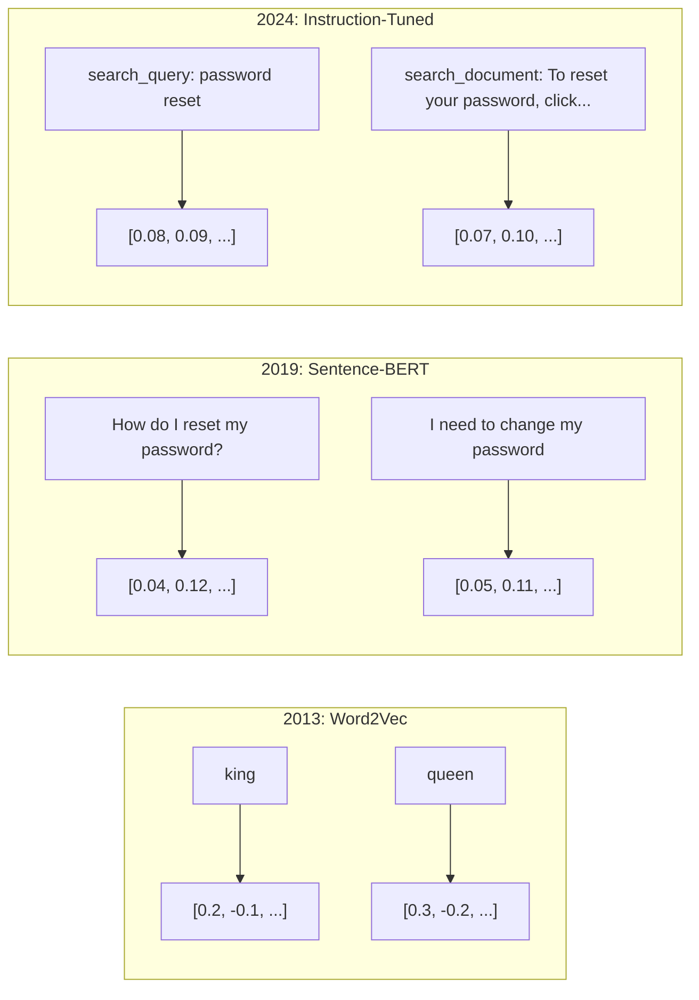
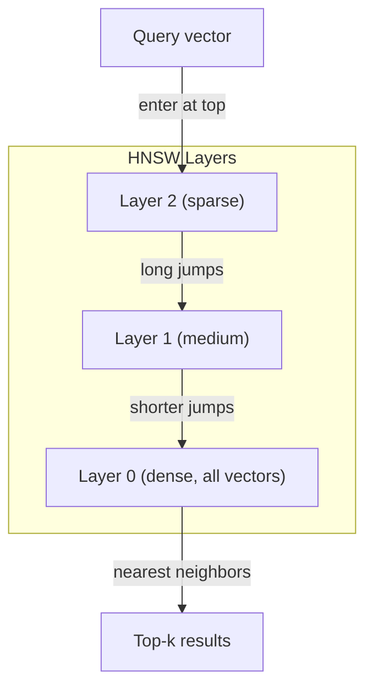
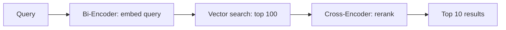

# 嵌入与向量表示

> 文本是离散的，数学是连续的。每当你让 LLM 查找「相似」文档、比较语义、或做超越关键词的搜索时，你依赖的都是连接这两个世界的一座桥梁。这座桥就是嵌入（embedding）。不理解嵌入，就谈不上理解现代 AI——你只是在用它而已。

**Type:** Build
**Languages:** Python
**Prerequisites:** Phase 11, Lesson 01 (Prompt Engineering)
**Time:** ~75 minutes
**Related:** Phase 5 · 22 (Embedding Models Deep Dive) covers dense vs sparse vs multi-vector, Matryoshka truncation, and per-axis model selection. This lesson focuses on the production pipeline (vector DBs, HNSW, similarity math). Read Phase 5 · 22 before picking a model.

## 学习目标

- 使用 API 服务商和开源模型生成文本嵌入，并计算它们之间的余弦相似度
- 解释为什么嵌入能解决关键词搜索无法处理的词汇不匹配问题
- 构建一个语义搜索索引，按语义而非精确关键词匹配来检索文档
- 用检索基准（precision@k、recall）评估嵌入质量，并为你的任务选出合适的嵌入模型

## 问题背景

你手上有 10,000 条客服工单。一位客户写道「my payment didn't go through」（我的付款没成功）。你需要找出相似的历史工单。关键词搜索能找到包含「payment」和「didn't go through」的工单，却会漏掉「transaction failed」（交易失败）、「charge was declined」（扣款被拒）和「billing error」（账单错误）。这些工单描述的是完全相同的问题，用词却截然不同。

这就是词汇不匹配（vocabulary mismatch）问题。人类语言中，同一件事有几十种说法。关键词搜索把每个词当作没有语义的独立符号，它无从知道「declined」和「didn't go through」指的是同一个概念。

你需要一种文本表示方式，让相似性由语义而非拼写决定。你需要一种方法，把「my payment didn't go through」和「transaction was declined」放进某个数学空间里彼此靠近的位置，同时把「my payment arrived on time」推到远处——尽管后者同样包含「payment」这个词。

这种表示就是嵌入。

## 核心概念

### 什么是嵌入？

嵌入是一个表示文本语义的浮点数稠密向量。「稠密」二字很关键——每个维度都携带信息，这与大多数维度为零的稀疏表示（词袋模型、TF-IDF）不同。

「The cat sat on the mat」会变成类似 `[0.023, -0.041, 0.087, ..., 0.012]` 的形式——一个由 768 到 3072 个数字组成的列表，长度取决于模型。这些数字编码了语义。你从不直接查看它们，你只比较它们。

### Word2Vec 的突破

2013 年，Google 的 Tomas Mikolov 及其同事发表了 Word2Vec。其核心洞察是：训练一个神经网络，用上下文预测某个词（或反过来用某个词预测上下文），那么隐藏层的权重就会成为有意义的向量表示。

那个著名的结果：

```
king - man + woman = queen
```

对词嵌入做向量运算能够捕捉语义关系。从「man」指向「woman」的方向，与从「king」指向「queen」的方向大致相同。正是在这一刻，整个领域意识到几何可以编码语义。

Word2Vec 产生 300 维向量。每个词只有一个向量，与上下文无关。「bank」在「river bank」（河岸）和「bank account」（银行账户）中的嵌入完全相同。这一局限推动了此后十年的研究。

### 从词到句子

词嵌入表示的是单个 token。生产系统需要嵌入整个句子、段落或文档。由此出现了四种方法：

**平均法（Averaging）**：取句子中所有词向量的均值。便宜、有损，对短文本效果意外地不错。但完全丢失了词序——「dog bites man」（狗咬人）和「man bites dog」（人咬狗）会得到完全相同的嵌入。

**CLS token**：Transformer 模型（BERT，2018）会输出一个特殊的 [CLS] token 嵌入来表示整个输入。比平均法好，但 [CLS] token 是为下一句预测任务训练的，并非为相似度而生。

**对比学习（Contrastive learning）**：显式地训练模型，把相似的文本对拉近、不相似的文本对推远。Sentence-BERT（Reimers & Gurevych，2019）采用这种方法，成为现代嵌入模型的基石。给定「How do I reset my password?」和「I need to change my password」，模型会学到这两句话应当拥有几乎一致的向量。

**指令微调嵌入（Instruction-tuned embeddings）**：最新的方法。E5、GTE 等模型接受任务前缀（"search_query:"、"search_document:"），告诉模型该生成哪种类型的嵌入。这让一个模型可以服务多种任务。



### 现代嵌入模型

市场已经收敛到少数几个生产级选项（MTEB 分数截至 2026 年初，MTEB v2）：

| 模型 | 提供方 | 维度 | MTEB | 上下文 | 每百万 token 成本 |
|-------|----------|-----------|------|---------|------------------|
| Gemini Embedding 2 | Google | 3072 (Matryoshka) | 67.7（检索） | 8192 | $0.15 |
| embed-v4 | Cohere | 1024 (Matryoshka) | 65.2 | 128K | $0.12 |
| voyage-4 | Voyage AI | 1024/2048 (Matryoshka) | 66.8 | 32K | $0.12 |
| text-embedding-3-large | OpenAI | 3072 (Matryoshka) | 64.6 | 8192 | $0.13 |
| text-embedding-3-small | OpenAI | 1536 (Matryoshka) | 62.3 | 8192 | $0.02 |
| BGE-M3 | BAAI | 1024（dense+sparse+ColBERT） | 63.0 多语言 | 8192 | 开放权重 |
| Qwen3-Embedding | Alibaba | 4096 (Matryoshka) | 66.9 | 32K | 开放权重 |
| Nomic-embed-v2 | Nomic | 768 (Matryoshka) | 63.1 | 8192 | 开放权重 |

MTEB（Massive Text Embedding Benchmark，大规模文本嵌入基准）v2 覆盖检索、分类、聚类、重排序、摘要等 100 多个任务，分数越高越好。到 2026 年，开放权重模型（Qwen3-Embedding、BGE-M3）在大多数维度上已追平或超越闭源托管模型。Gemini Embedding 2 在纯检索上领先；Voyage / Cohere 在特定领域（金融、法律、代码）领先。在做出选择之前，务必用你自己的查询做基准测试。

### 相似度度量

给定两个嵌入向量，衡量它们相似程度的方式有三种：

**余弦相似度（Cosine similarity）**：两个向量夹角的余弦值。取值范围从 -1（方向相反）到 1（方向相同）。忽略向量长度——一句 10 个词的句子和一篇 500 个词的文档，只要方向相同就能得到 1.0。90% 的应用场景默认用它。

```
cosine_sim(a, b) = dot(a, b) / (||a|| * ||b||)
```

**点积（Dot product）**：两个向量的原始内积。当向量已归一化（单位长度）时与余弦相似度完全等价，但计算更快。OpenAI 的嵌入是归一化的，因此点积和余弦给出的排序相同。

```
dot(a, b) = sum(a_i * b_i)
```

**欧氏距离（Euclidean / L2 distance）**：向量空间中的直线距离。越小越相似。对向量长度差异敏感。当空间中的绝对位置（而不只是方向）有意义时使用。

```
L2(a, b) = sqrt(sum((a_i - b_i)^2))
```

何时用哪种：

| 度量 | 适用场景 | 避免场景 |
|--------|----------|------------|
| 余弦相似度 | 比较长度不同的文本；大多数检索任务 | 向量长度本身携带信息时 |
| 点积 | 嵌入已归一化；追求极致速度 | 向量长度参差不齐时 |
| 欧氏距离 | 聚类；空间最近邻问题 | 比较长度悬殊的文档时 |

### 向量数据库与 HNSW

暴力相似度搜索要把查询向量与每个已存储向量逐一比较。100 万个 1536 维向量，意味着每次查询要做 15 亿次乘加运算。太慢了。

向量数据库用近似最近邻（Approximate Nearest Neighbor，ANN）算法解决这个问题。占主导地位的算法是 HNSW（Hierarchical Navigable Small World，分层可导航小世界图）：

1. 为向量构建一个多层图
2. 顶层稀疏——远距离簇之间的长程连接
3. 底层稠密——邻近向量之间的细粒度连接
4. 搜索从顶层开始，贪心地逐层下降、逐步精化
5. 以 O(log n) 而非 O(n) 的时间返回近似 top-k 结果

HNSW 用很小的精度损失（通常 95-99% 召回率）换取巨大的速度提升。在 1000 万向量规模下，暴力搜索需要数秒，HNSW 只需毫秒级。



生产可选方案：

| 数据库 | 类型 | 最适合 | 最大规模 |
|----------|------|----------|-----------|
| Pinecone | 托管 SaaS | 零运维的生产环境 | 数十亿级 |
| Weaviate | 开源 | 自托管、混合搜索 | 1 亿以上 |
| Qdrant | 开源 | 高性能、过滤查询 | 1 亿以上 |
| ChromaDB | 嵌入式 | 原型验证、本地开发 | 100 万 |
| pgvector | Postgres 扩展 | 已在使用 Postgres | 1000 万 |
| FAISS | 库 | 进程内、研究用途 | 10 亿以上 |

### 分块策略

文档太长，无法作为单个向量来嵌入。一份 50 页的 PDF 涵盖几十个主题——它的嵌入会变成所有内容的平均值，与任何具体内容都不相似。你需要把文档切分成块（chunk），逐块嵌入。

**固定大小分块（Fixed-size chunking）**：每 N 个 token 切一块，块之间重叠 M 个 token。简单、可预测，适合没有明确结构的文档。以 512 token 块、50 token 重叠为例：第 1 块是 token 0-511，第 2 块是 token 462-973。

**按句分块（Sentence-based chunking）**：在句子边界处切分，把句子逐个并入当前块，直到达到 token 上限。每块至少包含一个完整句子。比固定大小更好，因为不会把一个想法拦腰截断。

**递归分块（Recursive chunking）**：先尝试在最大的边界（章节标题）处切分；如果块仍然太大，再尝试段落边界，然后是句子边界，最后是字符上限。这就是 LangChain 的 `RecursiveCharacterTextSplitter`，对混合格式语料效果很好。

**语义分块（Semantic chunking）**：先嵌入每个句子，再把嵌入相似的连续句子归为一组。当嵌入相似度跌破阈值时，开启新的块。代价高（需要逐句单独嵌入），但产出的块语义最连贯。

| 策略 | 复杂度 | 质量 | 最适合 |
|----------|-----------|---------|----------|
| 固定大小 | 低 | 尚可 | 无结构文本、日志 |
| 按句分块 | 低 | 良好 | 文章、邮件 |
| 递归 | 中 | 良好 | Markdown、HTML、混合文档 |
| 语义 | 高 | 最佳 | 对检索质量要求极高的场景 |

大多数系统的甜点区间：256-512 token 的块，重叠 50 token。

### Bi-Encoder 与 Cross-Encoder

bi-encoder（双编码器）分别独立地嵌入查询和文档，然后比较向量。速度快——查询只需嵌入一次，再与预先算好的文档嵌入做比较。检索用的就是它。

cross-encoder（交叉编码器）把查询和文档拼成单个输入，输出一个相关性分数。速度慢——每个查询-文档对都要走一遍完整模型。但准确得多，因为它能同时对查询和文档的 token 做注意力计算。

生产中的固定套路：bi-encoder 检索出 top-100 候选，cross-encoder 把它们重排到 top-10。这就是「先检索后重排」（retrieve-then-rerank）流水线。



重排序模型：Cohere Rerank 3.5（每 1000 次查询 2 美元）、BGE-reranker-v2（免费、开源）、Jina Reranker v2（免费、开源）。

### Matryoshka 嵌入

传统嵌入是「全有或全无」的。一个 1536 维向量就要用满 1536 个浮点数，不重新训练就无法截断到 256 维。

Matryoshka 表示学习（Matryoshka Representation Learning，Kusupati et al., 2022）解决了这个问题。模型在训练时被约束为：前 N 个维度承载最重要的信息，就像俄罗斯套娃。把一个 1536 维的 Matryoshka 嵌入截断到 256 维会损失一些精度，但仍然可用。

OpenAI 的 text-embedding-3-small 和 text-embedding-3-large 通过 `dimensions` 参数支持 Matryoshka 截断。把 1536 维改为请求 256 维，存储成本降为 1/6，在 MTEB 基准上的精度损失大约只有 3-5%。

### 二值量化

一个以 float32 存储的 1536 维嵌入占用 6,144 字节。乘以 1000 万份文档：光是向量就要 61 GB。

二值量化（binary quantization）把每个浮点数压缩成 1 个比特：正值变 1，负值变 0。存储从 6,144 字节降到 192 字节——缩小 32 倍。相似度改用汉明距离（统计不同比特的数量）计算，CPU 一条指令就能完成。

检索召回率的损失大约在 5-10%。常见做法是：第一遍用二值量化在数百万向量上粗搜，再用全精度向量对 top-1000 重新打分。这样能以 1/32 的内存达到全精度 95% 以上的准确率。

```figure
cosine-similarity
```

## 从零实现

我们从零构建一个语义搜索引擎。不用向量数据库，不调外部嵌入 API，只用纯 Python 加 numpy 做数学计算。

### 第 1 步：文本分块

```python
def chunk_text(text, chunk_size=200, overlap=50):
    words = text.split()
    chunks = []
    start = 0
    while start < len(words):
        end = start + chunk_size
        chunk = " ".join(words[start:end])
        chunks.append(chunk)
        start += chunk_size - overlap
    return chunks


def chunk_by_sentences(text, max_chunk_tokens=200):
    sentences = text.replace("\n", " ").split(".")
    sentences = [s.strip() + "." for s in sentences if s.strip()]
    chunks = []
    current_chunk = []
    current_length = 0
    for sentence in sentences:
        sentence_length = len(sentence.split())
        if current_length + sentence_length > max_chunk_tokens and current_chunk:
            chunks.append(" ".join(current_chunk))
            current_chunk = []
            current_length = 0
        current_chunk.append(sentence)
        current_length += sentence_length
    if current_chunk:
        chunks.append(" ".join(current_chunk))
    return chunks
```

### 第 2 步：从零构建嵌入

我们用带 L2 归一化的 TF-IDF 实现一个简单的稠密嵌入。这不是神经网络嵌入，但遵循同样的契约：输入文本，输出固定长度向量，相似的文本产生相似的向量。

```python
import math
import numpy as np
from collections import Counter

class SimpleEmbedder:
    def __init__(self):
        self.vocab = []
        self.idf = []
        self.word_to_idx = {}

    def fit(self, documents):
        vocab_set = set()
        for doc in documents:
            vocab_set.update(doc.lower().split())
        self.vocab = sorted(vocab_set)
        self.word_to_idx = {w: i for i, w in enumerate(self.vocab)}
        n = len(documents)
        self.idf = np.zeros(len(self.vocab))
        for i, word in enumerate(self.vocab):
            doc_count = sum(1 for doc in documents if word in doc.lower().split())
            self.idf[i] = math.log((n + 1) / (doc_count + 1)) + 1

    def embed(self, text):
        words = text.lower().split()
        count = Counter(words)
        total = len(words) if words else 1
        vec = np.zeros(len(self.vocab))
        for word, freq in count.items():
            if word in self.word_to_idx:
                tf = freq / total
                vec[self.word_to_idx[word]] = tf * self.idf[self.word_to_idx[word]]
        norm = np.linalg.norm(vec)
        if norm > 0:
            vec = vec / norm
        return vec
```

### 第 3 步：相似度函数

```python
def cosine_similarity(a, b):
    dot = np.dot(a, b)
    norm_a = np.linalg.norm(a)
    norm_b = np.linalg.norm(b)
    if norm_a == 0 or norm_b == 0:
        return 0.0
    return float(dot / (norm_a * norm_b))


def dot_product(a, b):
    return float(np.dot(a, b))


def euclidean_distance(a, b):
    return float(np.linalg.norm(a - b))
```

### 第 4 步：暴力搜索的向量索引

```python
class VectorIndex:
    def __init__(self):
        self.vectors = []
        self.texts = []
        self.metadata = []

    def add(self, vector, text, meta=None):
        self.vectors.append(vector)
        self.texts.append(text)
        self.metadata.append(meta or {})

    def search(self, query_vector, top_k=5, metric="cosine"):
        scores = []
        for i, vec in enumerate(self.vectors):
            if metric == "cosine":
                score = cosine_similarity(query_vector, vec)
            elif metric == "dot":
                score = dot_product(query_vector, vec)
            elif metric == "euclidean":
                score = -euclidean_distance(query_vector, vec)
            else:
                raise ValueError(f"Unknown metric: {metric}")
            scores.append((i, score))
        scores.sort(key=lambda x: x[1], reverse=True)
        results = []
        for idx, score in scores[:top_k]:
            results.append({
                "text": self.texts[idx],
                "score": score,
                "metadata": self.metadata[idx],
                "index": idx
            })
        return results

    def size(self):
        return len(self.vectors)
```

### 第 5 步：语义搜索引擎

```python
class SemanticSearchEngine:
    def __init__(self, chunk_size=200, overlap=50):
        self.embedder = SimpleEmbedder()
        self.index = VectorIndex()
        self.chunk_size = chunk_size
        self.overlap = overlap

    def index_documents(self, documents, source_names=None):
        all_chunks = []
        all_sources = []
        for i, doc in enumerate(documents):
            chunks = chunk_text(doc, self.chunk_size, self.overlap)
            all_chunks.extend(chunks)
            name = source_names[i] if source_names else f"doc_{i}"
            all_sources.extend([name] * len(chunks))
        self.embedder.fit(all_chunks)
        for chunk, source in zip(all_chunks, all_sources):
            vec = self.embedder.embed(chunk)
            self.index.add(vec, chunk, {"source": source})
        return len(all_chunks)

    def search(self, query, top_k=5, metric="cosine"):
        query_vec = self.embedder.embed(query)
        return self.index.search(query_vec, top_k, metric)

    def search_with_scores(self, query, top_k=5):
        results = self.search(query, top_k)
        return [
            {
                "text": r["text"][:200],
                "source": r["metadata"].get("source", "unknown"),
                "score": round(r["score"], 4)
            }
            for r in results
        ]
```

### 第 6 步：比较相似度度量

```python
def compare_metrics(engine, query, top_k=3):
    results = {}
    for metric in ["cosine", "dot", "euclidean"]:
        hits = engine.search(query, top_k=top_k, metric=metric)
        results[metric] = [
            {"score": round(h["score"], 4), "preview": h["text"][:80]}
            for h in hits
        ]
    return results
```

## 生产实践

换成生产级嵌入 API 后，整体架构保持不变，只需要替换嵌入器：

```python
from openai import OpenAI

client = OpenAI()

def openai_embed(texts, model="text-embedding-3-small", dimensions=None):
    kwargs = {"model": model, "input": texts}
    if dimensions:
        kwargs["dimensions"] = dimensions
    response = client.embeddings.create(**kwargs)
    return [item.embedding for item in response.data]
```

用 OpenAI 做 Matryoshka 截断——同一个模型，更少的维度，更低的存储：

```python
full = openai_embed(["semantic search query"], dimensions=1536)
compact = openai_embed(["semantic search query"], dimensions=256)
```

256 维向量的存储只有原来的 1/6。对 1000 万份文档而言，是 10 GB 对 61 GB 的差距。在标准基准上精度损失大约为 3-5%。

用 Cohere 做重排序：

```python
import cohere

co = cohere.ClientV2()

results = co.rerank(
    model="rerank-v3.5",
    query="What is the refund policy?",
    documents=["Full refund within 30 days...", "No refunds after 90 days..."],
    top_n=3
)
```

不依赖任何 API 的本地嵌入：

```python
from sentence_transformers import SentenceTransformer

model = SentenceTransformer("BAAI/bge-small-en-v1.5")
embeddings = model.encode(["semantic search query", "another document"])
```

我们自己实现的 VectorIndex 类可以配合上述任何一种方案使用。换掉嵌入函数，保留搜索逻辑。

## 交付产物

本课产出：
- `outputs/prompt-embedding-advisor.md` —— 一个提示词，用于针对具体用例选择嵌入模型与策略
- `outputs/skill-embedding-patterns.md` —— 一个技能文档，教智能体如何在生产环境中高效使用嵌入

## 练习

1. **度量对比**：用余弦相似度、点积和欧氏距离，对示例文档运行同样的 5 个查询，记录每种度量的 top-3 结果。哪些查询下三种度量给出了不同结果？为什么？

2. **块大小实验**：分别用 50、100、200、500 词的块大小为示例文档建索引。每种配置下运行 5 个查询，记录 top-1 相似度分数。绘制块大小与检索质量的关系曲线，找出更大的块开始损害效果的拐点。

3. **Matryoshka 模拟**：构建一个产生 500 维向量的 SimpleEmbedder。分别截断到 50、100、200、500 维，测量每种截断下检索召回率的退化程度。这模拟了 Matryoshka 的行为，而无需真正的训练技巧。

4. **二值量化**：取搜索引擎中的嵌入，转成二值（正为 1，负为 0），并实现汉明距离搜索。把 top-10 结果与全精度余弦相似度的结果对比，测量重叠百分比。

5. **按句分块**：用 `chunk_by_sentences` 替换固定大小分块。运行同样的查询，比较检索分数。尊重句子边界是否改善了结果？

## 关键术语

| 术语 | 大家怎么说 | 实际含义 |
|------|----------------|----------------------|
| 嵌入（Embedding） | 「把文本变成数字」 | 一个稠密向量，几何上的邻近编码了语义上的相似 |
| Word2Vec | 「嵌入的鼻祖」 | 2013 年的模型，通过预测上下文词学习词向量；证明了向量运算能编码语义 |
| 余弦相似度 | 「两个向量有多像」 | 向量夹角的余弦值；1 = 方向相同，0 = 正交，-1 = 方向相反 |
| HNSW | 「快速向量搜索」 | 分层可导航小世界图——一种多层结构，实现 O(log n) 的近似最近邻搜索 |
| Bi-encoder | 「分开嵌入，快速比较」 | 把查询和文档独立编码成向量；支持预计算和快速检索 |
| Cross-encoder | 「慢但准的重排器」 | 把查询-文档对一起送进完整模型联合处理；精度更高，但无法预计算 |
| Matryoshka 嵌入 | 「可截断的向量」 | 训练时让前 N 个维度承载最重要信息的嵌入，支持可变长度存储 |
| 二值量化 | 「1 比特嵌入」 | 把浮点向量压缩成二值（只保留符号位），存储缩小 32 倍，用汉明距离搜索 |
| 分块（Chunking） | 「把文档切碎再嵌入」 | 把文档切成 256-512 token 的片段，使每段可以独立嵌入和检索 |
| 向量数据库 | 「嵌入的搜索引擎」 | 为存储向量和大规模近似最近邻搜索而优化的数据存储 |
| 对比学习 | 「靠比较来训练」 | 一种训练方法，把相似文本对的嵌入拉近、不相似文本对的嵌入推远 |
| MTEB | 「嵌入界的基准」 | Massive Text Embedding Benchmark——8 类任务、56 个数据集；比较嵌入模型的标准 |

## 延伸阅读

- Mikolov et al., "Efficient Estimation of Word Representations in Vector Space" (2013) —— Word2Vec 论文，以 king-queen 类比开启了嵌入革命
- Reimers & Gurevych, "Sentence-BERT: Sentence Embeddings using Siamese BERT-Networks" (2019) —— 如何为句子级相似度训练 bi-encoder，现代嵌入模型的基石
- Kusupati et al., "Matryoshka Representation Learning" (2022) —— 可变维度嵌入背后的技术，被 OpenAI 用于 text-embedding-3
- Malkov & Yashunin, "Efficient and Robust Approximate Nearest Neighbor using Hierarchical Navigable Small World Graphs" (2018) —— HNSW 论文，多数生产级向量搜索背后的算法
- OpenAI Embeddings Guide (platform.openai.com/docs/guides/embeddings) —— text-embedding-3 系列模型的实用参考，包括 Matryoshka 降维
- MTEB Leaderboard (huggingface.co/spaces/mteb/leaderboard) —— 实时基准榜单，跨任务、跨语言比较所有嵌入模型
- [Muennighoff et al., "MTEB: Massive Text Embedding Benchmark" (EACL 2023)](https://arxiv.org/abs/2210.07316) —— 定义了榜单所报告的 8 个任务类别（分类、聚类、配对分类、重排序、检索、STS、摘要、双语文本挖掘）的基准论文；在轻信任何单一 MTEB 分数之前先读它。
- [Sentence Transformers documentation](https://www.sbert.net/) —— bi-encoder 与 cross-encoder、池化策略，以及本课实现的「摄入-切分-嵌入-存储」RAG 流水线的权威参考。
