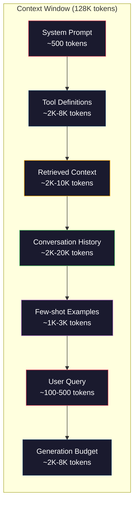
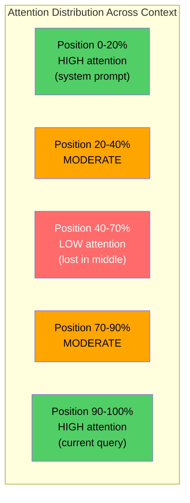
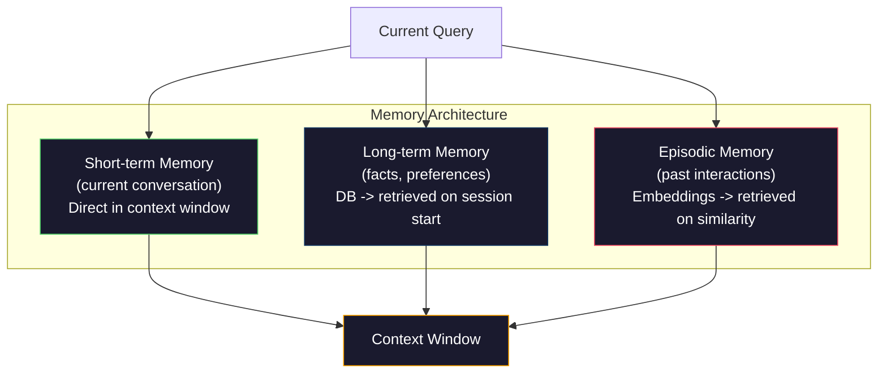

# 上下文工程：窗口、预算、记忆与检索

> 提示词工程只是一个子集，上下文工程才是全局。提示词（prompt）是你输入的一个字符串，而上下文（context）是进入模型窗口的一切：系统指令、检索到的文档、工具定义、对话历史、少样本示例，以及提示词本身。2026 年最优秀的 AI 工程师都是上下文工程师——他们决定什么进入窗口、什么被排除在外、以及以什么顺序排列。

**Type:** Build
**Languages:** Python
**Prerequisites:** Phase 10 (LLMs from Scratch), Phase 11 Lesson 01-02
**Time:** ~90 minutes
**Related:** Phase 11 · 15 (Prompt Caching) — the cache-friendly layout is an extension of context engineering. Phase 5 · 28 (Long-Context Evaluation) for how to measure lost-in-the-middle with NIAH/RULER.

## 学习目标

- 计算上下文窗口各组成部分的 token 预算（系统提示词、工具、历史、检索文档、生成余量）
- 实现上下文窗口管理策略：对话历史的截断、摘要和滑动窗口
- 对上下文组件进行优先级排序和位置编排，让模型的注意力最大程度集中在最相关的信息上
- 构建一个上下文组装器，根据查询类型和可用窗口空间动态分配 token

## 问题背景

Claude Opus 4.7 拥有 200K token 的上下文窗口（beta 版为 1M）。GPT-5 是 400K。Gemini 3 Pro 是 2M。Llama 4 号称 10M。这些数字听起来巨大无比——直到你真正把它们填满。

来看一个编程助手的真实开销分解。系统提示词：500 token。50 个工具的定义：8,000 token。检索到的文档：4,000 token。对话历史（10 轮）：6,000 token。当前用户查询：200 token。生成预算（最大输出）：4,000 token。合计：22,700 token。这才只占 128K 窗口的 18%。

但注意力并不随上下文长度线性扩展。一个处理 128K token 上下文的模型要付出平方级的注意力开销（原始 Transformer 为 O(n^2)，不过大多数生产模型采用了高效注意力变体）。更重要的是，检索准确率会下降。「大海捞针」（Needle in a Haystack）测试表明，模型很难找到放在长上下文中间位置的信息。Liu et al. (2023) 的研究显示，LLM 对放在长上下文开头和结尾的信息能以接近完美的准确率检索，但放在中间位置（上下文的 40-70% 处）的信息准确率会下降 10-20%。这种「中间遗忘」（lost-in-the-middle）效应在不同模型间程度不一，但影响所有现有架构。

实践层面的教训是：可用 200K token 不代表用满 200K token 就有效。一个精心筛选的 10K token 上下文，往往胜过一股脑塞进去的 100K token 上下文。上下文工程，就是在上下文窗口内最大化信噪比的学科。

你放进窗口的每一个 token，都挤占了一个本可以承载更相关信息的 token。每一个无关的工具定义、每一轮过时的对话、每一段答非所问的检索文本——每一个都让模型在任务上变得稍差一点。

## 核心概念

### 上下文窗口是稀缺资源

把上下文窗口当作内存（RAM），而不是磁盘。它快速且可直接访问，但容量有限。你装不下所有东西，必须做出取舍。



每个组件都在争夺空间。加入更多工具定义，留给对话历史的空间就更少；加入更多检索上下文，留给少样本示例的空间就更少。上下文工程就是分配这份预算、使任务表现最大化的艺术。

### 中间遗忘（Lost-in-the-Middle）

这是上下文工程中最重要的实证发现。模型对上下文开头和结尾的信息关注度更高，中间的信息得到的注意力分数较低，更容易被忽略。

Liu et al. (2023) 对此做了系统性测试。他们把一篇相关文档混在 20 篇无关文档中，放在不同位置并测量回答准确率。当相关文档排在第一或最后时，准确率为 85-90%；当它处在中间位置（20 篇中的第 10 篇）时，准确率降至 60-70%。

这带来直接的工程启示：

- 把最重要的信息放在最前面（系统提示词、关键指令）
- 把当前查询和最相关的上下文放在最后（近因偏置有帮助）
- 把上下文的中间区域当作优先级最低的地带
- 如果必须把信息放在中间，就在末尾把关键点重复一遍



### 上下文的组成部分

**系统提示词**：设定角色、约束和行为规则。它排在最前面，并且在各轮对话中保持不变。Claude Code 的系统提示词（包含工具定义和行为指令）大约占 6,000 token。务必精简——系统提示词里的每个词在每次 API 调用时都会重复一遍。

**工具定义**：每个工具增加 50-200 token（名称、描述、参数 schema）。50 个工具按每个 150 token 计算，就是 7,500 token——这还是在任何对话发生之前。动态工具选择——只纳入与当前查询相关的工具——可以把这部分开销削减 60-80%。

**检索上下文**：来自向量数据库的文档、搜索结果、文件内容。检索质量直接决定回答质量。糟糕的检索比不检索更糟——它用噪声填满窗口，还会主动误导模型。

**对话历史**：之前的每条用户消息和助手回复。随对话长度线性增长。一段 50 轮、每轮 200 token 的对话就是 10,000 token 的历史，其中大部分与当前查询无关。

**少样本示例**：演示期望行为的输入/输出对。两三个精挑细选的示例，往往比几千 token 的指令更能提升输出质量。但它们占空间。

**生成预算**：为模型回复预留的 token。如果你把窗口填到极限，模型就没有空间作答了。至少为生成预留 2,000-4,000 token。

### 上下文压缩策略

**历史摘要化**：与其逐字保留所有历史轮次，不如定期对对话做摘要。「我们讨论了 X，决定了 Y，用户想要 Z」——100 个 token 就能替代原本占 2,000 token 的 10 轮对话。当历史超过某个阈值（如 5,000 token）时触发摘要。

**相关性过滤**：用当前查询为每篇检索文档打分，丢弃低于阈值的文档。如果检索回 10 个片段但只有 3 个相关，就丢掉另外 7 个。3 个高度相关的片段胜过 10 个平庸的片段。

**工具裁剪**：对用户查询的意图做分类，只纳入与该意图相关的工具。代码问题不需要日历工具，日程问题不需要文件系统工具。这能把工具定义从 8,000 token 降到 1,000。

**递归摘要**：对超长文档分阶段摘要。先摘要每个章节，再对摘要做摘要。一份 50 页的文档变成一份 500 token 的精华，保住关键要点。

### 记忆系统

上下文工程横跨三个时间尺度。

**短期记忆**：当前对话。直接存放在上下文窗口中，随每轮对话增长，靠摘要和截断来管理。

**长期记忆**：跨对话持久存在的事实和偏好。「用户偏好 TypeScript」「项目使用 PostgreSQL」。存放在数据库中，会话开始时检索载入。Claude Code 把它存在 CLAUDE.md 文件里，ChatGPT 把它存在记忆功能里。

**情景记忆（episodic memory）**：可能与当前相关的特定历史交互。「上周二我们在 auth 模块调试过类似问题」。以嵌入形式存储，当前对话与过去某段情景匹配时被检索出来。



### 动态上下文组装

核心洞察：不同的查询需要不同的上下文。静态系统提示词 + 静态工具 + 静态历史是一种浪费。最好的系统会针对每个查询动态组装上下文。

1. 对查询意图进行分类
2. 选择相关工具（而不是全部工具）
3. 检索相关文档（而不是固定的文档集）
4. 纳入相关的历史轮次（而不是全部历史）
5. 添加与任务类型匹配的少样本示例
6. 按重要性排列所有内容：关键的放最前，重要的放最后，可有可无的放中间

这正是优秀 AI 应用与卓越 AI 应用的分水岭。模型是同一个，上下文才是差异所在。

## 从零实现

### 第 1 步：Token 计数器

无法度量就无法做预算。先构建一个简单的 token 计数器（用空白分词做近似，因为精确数值取决于分词器）。

```python
import json
import numpy as np
from collections import OrderedDict

def count_tokens(text):
    if not text:
        return 0
    return int(len(text.split()) * 1.3)

def count_tokens_json(obj):
    return count_tokens(json.dumps(obj))
```

### 第 2 步：上下文预算管理器

这是核心抽象。预算管理器追踪每个组件使用了多少 token 并强制执行限额。

```python
class ContextBudget:
    def __init__(self, max_tokens=128000, generation_reserve=4000):
        self.max_tokens = max_tokens
        self.generation_reserve = generation_reserve
        self.available = max_tokens - generation_reserve
        self.allocations = OrderedDict()

    def allocate(self, component, content, max_tokens=None):
        tokens = count_tokens(content)
        if max_tokens and tokens > max_tokens:
            words = content.split()
            target_words = int(max_tokens / 1.3)
            content = " ".join(words[:target_words])
            tokens = count_tokens(content)

        used = sum(self.allocations.values())
        if used + tokens > self.available:
            allowed = self.available - used
            if allowed <= 0:
                return None, 0
            words = content.split()
            target_words = int(allowed / 1.3)
            content = " ".join(words[:target_words])
            tokens = count_tokens(content)

        self.allocations[component] = tokens
        return content, tokens

    def remaining(self):
        used = sum(self.allocations.values())
        return self.available - used

    def utilization(self):
        used = sum(self.allocations.values())
        return used / self.max_tokens

    def report(self):
        total_used = sum(self.allocations.values())
        lines = []
        lines.append(f"Context Budget Report ({self.max_tokens:,} token window)")
        lines.append("-" * 50)
        for component, tokens in self.allocations.items():
            pct = tokens / self.max_tokens * 100
            bar = "#" * int(pct / 2)
            lines.append(f"  {component:<25} {tokens:>6} tokens ({pct:>5.1f}%) {bar}")
        lines.append("-" * 50)
        lines.append(f"  {'Used':<25} {total_used:>6} tokens ({total_used/self.max_tokens*100:.1f}%)")
        lines.append(f"  {'Generation reserve':<25} {self.generation_reserve:>6} tokens")
        lines.append(f"  {'Remaining':<25} {self.remaining():>6} tokens")
        return "\n".join(lines)
```

### 第 3 步：针对中间遗忘的重排序

实现重排序策略：最重要的条目放在首尾，最不重要的放在中间。

```python
def reorder_lost_in_middle(items, scores):
    paired = sorted(zip(scores, items), reverse=True)
    sorted_items = [item for _, item in paired]

    if len(sorted_items) <= 2:
        return sorted_items

    first_half = sorted_items[::2]
    second_half = sorted_items[1::2]
    second_half.reverse()

    return first_half + second_half

def score_relevance(query, documents):
    query_words = set(query.lower().split())
    scores = []
    for doc in documents:
        doc_words = set(doc.lower().split())
        if not query_words:
            scores.append(0.0)
            continue
        overlap = len(query_words & doc_words) / len(query_words)
        scores.append(round(overlap, 3))
    return scores
```

### 第 4 步：对话历史压缩器

对旧的对话轮次做摘要，回收 token 预算。

```python
class ConversationManager:
    def __init__(self, max_history_tokens=5000):
        self.turns = []
        self.summaries = []
        self.max_history_tokens = max_history_tokens

    def add_turn(self, role, content):
        self.turns.append({"role": role, "content": content})
        self._compress_if_needed()

    def _compress_if_needed(self):
        total = sum(count_tokens(t["content"]) for t in self.turns)
        if total <= self.max_history_tokens:
            return

        while total > self.max_history_tokens and len(self.turns) > 4:
            old_turns = self.turns[:2]
            summary = self._summarize_turns(old_turns)
            self.summaries.append(summary)
            self.turns = self.turns[2:]
            total = sum(count_tokens(t["content"]) for t in self.turns)

    def _summarize_turns(self, turns):
        parts = []
        for t in turns:
            content = t["content"]
            if len(content) > 100:
                content = content[:100] + "..."
            parts.append(f"{t['role']}: {content}")
        return "Previous: " + " | ".join(parts)

    def get_context(self):
        parts = []
        if self.summaries:
            parts.append("[Conversation Summary]")
            for s in self.summaries:
                parts.append(s)
        parts.append("[Recent Conversation]")
        for t in self.turns:
            parts.append(f"{t['role']}: {t['content']}")
        return "\n".join(parts)

    def token_count(self):
        return count_tokens(self.get_context())
```

### 第 5 步：动态工具选择器

只纳入与当前查询相关的工具。先做意图分类，再做过滤。

```python
TOOL_REGISTRY = {
    "read_file": {
        "description": "Read contents of a file",
        "tokens": 120,
        "categories": ["code", "files"],
    },
    "write_file": {
        "description": "Write content to a file",
        "tokens": 150,
        "categories": ["code", "files"],
    },
    "search_code": {
        "description": "Search for patterns in codebase",
        "tokens": 130,
        "categories": ["code"],
    },
    "run_command": {
        "description": "Execute a shell command",
        "tokens": 140,
        "categories": ["code", "system"],
    },
    "create_calendar_event": {
        "description": "Create a new calendar event",
        "tokens": 180,
        "categories": ["calendar"],
    },
    "list_emails": {
        "description": "List recent emails",
        "tokens": 160,
        "categories": ["email"],
    },
    "send_email": {
        "description": "Send an email message",
        "tokens": 200,
        "categories": ["email"],
    },
    "web_search": {
        "description": "Search the web for information",
        "tokens": 140,
        "categories": ["research"],
    },
    "query_database": {
        "description": "Run a SQL query on the database",
        "tokens": 170,
        "categories": ["code", "data"],
    },
    "generate_chart": {
        "description": "Generate a chart from data",
        "tokens": 190,
        "categories": ["data", "visualization"],
    },
}

def classify_intent(query):
    query_lower = query.lower()

    intent_keywords = {
        "code": ["code", "function", "bug", "error", "file", "implement", "refactor", "debug", "test"],
        "calendar": ["meeting", "schedule", "calendar", "appointment", "event"],
        "email": ["email", "mail", "send", "inbox", "message"],
        "research": ["search", "find", "what is", "how does", "explain", "look up"],
        "data": ["data", "query", "database", "chart", "graph", "analytics", "sql"],
    }

    scores = {}
    for intent, keywords in intent_keywords.items():
        score = sum(1 for kw in keywords if kw in query_lower)
        if score > 0:
            scores[intent] = score

    if not scores:
        return ["code"]

    max_score = max(scores.values())
    return [intent for intent, score in scores.items() if score >= max_score * 0.5]

def select_tools(query, token_budget=2000):
    intents = classify_intent(query)
    relevant = {}
    total_tokens = 0

    for name, tool in TOOL_REGISTRY.items():
        if any(cat in intents for cat in tool["categories"]):
            if total_tokens + tool["tokens"] <= token_budget:
                relevant[name] = tool
                total_tokens += tool["tokens"]

    return relevant, total_tokens
```

### 第 6 步：完整的上下文组装流水线

把所有部件接起来。给定一个查询，动态组装出最优上下文。

```python
class ContextEngine:
    def __init__(self, max_tokens=128000, generation_reserve=4000):
        self.budget = ContextBudget(max_tokens, generation_reserve)
        self.conversation = ConversationManager(max_history_tokens=5000)
        self.system_prompt = (
            "You are a helpful AI assistant. You have access to tools for "
            "code editing, file management, web search, and data analysis. "
            "Use the appropriate tools for each task. Be concise and accurate."
        )
        self.knowledge_base = [
            "Python 3.12 introduced type parameter syntax for generic classes using bracket notation.",
            "The project uses PostgreSQL 16 with pgvector for embedding storage.",
            "Authentication is handled by Supabase Auth with JWT tokens.",
            "The frontend is built with Next.js 15 using the App Router.",
            "API rate limits are set to 100 requests per minute per user.",
            "The deployment pipeline uses GitHub Actions with Docker multi-stage builds.",
            "Test coverage must be above 80% for all new modules.",
            "The codebase follows the repository pattern for data access.",
        ]

    def assemble(self, query):
        self.budget = ContextBudget(self.budget.max_tokens, self.budget.generation_reserve)

        system_content, _ = self.budget.allocate("system_prompt", self.system_prompt, max_tokens=1000)

        tools, tool_tokens = select_tools(query, token_budget=2000)
        tool_text = json.dumps(list(tools.keys()))
        tool_content, _ = self.budget.allocate("tools", tool_text, max_tokens=2000)

        relevance = score_relevance(query, self.knowledge_base)
        threshold = 0.1
        relevant_docs = [
            doc for doc, score in zip(self.knowledge_base, relevance)
            if score >= threshold
        ]

        if relevant_docs:
            doc_scores = [s for s in relevance if s >= threshold]
            reordered = reorder_lost_in_middle(relevant_docs, doc_scores)
            doc_text = "\n".join(reordered)
            doc_content, _ = self.budget.allocate("retrieved_context", doc_text, max_tokens=3000)

        history_text = self.conversation.get_context()
        if history_text.strip():
            history_content, _ = self.budget.allocate("conversation_history", history_text, max_tokens=5000)

        query_content, _ = self.budget.allocate("user_query", query, max_tokens=500)

        return self.budget

    def chat(self, query):
        self.conversation.add_turn("user", query)
        budget = self.assemble(query)
        response = f"[Response to: {query[:50]}...]"
        self.conversation.add_turn("assistant", response)
        return budget


def run_demo():
    print("=" * 60)
    print("  Context Engineering Pipeline Demo")
    print("=" * 60)

    engine = ContextEngine(max_tokens=128000, generation_reserve=4000)

    print("\n--- Query 1: Code task ---")
    budget = engine.chat("Fix the bug in the authentication module where JWT tokens expire too early")
    print(budget.report())

    print("\n--- Query 2: Research task ---")
    budget = engine.chat("What is the best approach for implementing vector search in PostgreSQL?")
    print(budget.report())

    print("\n--- Query 3: After conversation history builds up ---")
    for i in range(8):
        engine.conversation.add_turn("user", f"Follow-up question number {i+1} about the implementation details of the system")
        engine.conversation.add_turn("assistant", f"Here is the response to follow-up {i+1} with technical details about the architecture")

    budget = engine.chat("Now implement the changes we discussed")
    print(budget.report())

    print("\n--- Tool Selection Examples ---")
    test_queries = [
        "Fix the bug in auth.py",
        "Schedule a meeting with the team for Tuesday",
        "Show me the database query performance stats",
        "Search for best practices on error handling",
    ]

    for q in test_queries:
        tools, tokens = select_tools(q)
        intents = classify_intent(q)
        print(f"\n  Query: {q}")
        print(f"  Intents: {intents}")
        print(f"  Tools: {list(tools.keys())} ({tokens} tokens)")

    print("\n--- Lost-in-the-Middle Reordering ---")
    docs = ["Doc A (most relevant)", "Doc B (somewhat relevant)", "Doc C (least relevant)",
            "Doc D (relevant)", "Doc E (moderately relevant)"]
    scores = [0.95, 0.60, 0.20, 0.80, 0.50]
    reordered = reorder_lost_in_middle(docs, scores)
    print(f"  Original order: {docs}")
    print(f"  Scores:         {scores}")
    print(f"  Reordered:      {reordered}")
    print(f"  (Most relevant at start and end, least relevant in middle)")
```

## 生产实践

### Claude Code 的上下文策略

Claude Code 采用分层方式管理上下文。系统提示词包含行为规则和工具定义（约 6K token）。当你打开一个文件时，文件内容被注入到上下文中；当你执行搜索时，结果被加入进来；旧的对话轮次会被摘要。CLAUDE.md 提供跨会话持久的长期记忆。

关键的工程决策是：Claude Code 不会把你的整个代码库一股脑倒进上下文，而是按需检索相关文件。这就是上下文工程的实践形态。

### Cursor 的动态上下文加载

Cursor 把你的整个代码库索引为嵌入。当你输入查询时，它通过向量相似度检索最相关的文件和代码块，只有这些片段进入上下文窗口。一个 50 万行的代码库被压缩成 5-10 个最相关的代码块。

这就是那个模式：嵌入一切，按需检索，只纳入要紧的东西。

### ChatGPT 的记忆功能

ChatGPT 把用户偏好和事实存为长期记忆。每次对话开始时，相关记忆被检索出来并加入系统提示词。「用户偏好 Python」只花 5 个 token，却省下了跨对话反复重申指令的数百个 token。

### RAG 即上下文工程

检索增强生成（Retrieval-Augmented Generation, RAG）是被形式化的上下文工程。与其把知识塞进模型权重（训练）或系统提示词（静态上下文），不如在查询时检索相关文档并注入上下文窗口。整条 RAG 流水线——切块、嵌入、检索、重排序——存在的意义只有一个：把正确的信息放进上下文窗口。

## 交付产物

本课产出 `outputs/prompt-context-optimizer.md`——一个可复用的提示词，用于审计上下文组装策略并给出优化建议。把你的系统提示词、工具数量、平均历史长度和检索策略喂给它，它会识别 token 浪费并提出改进方案。

本课还产出 `outputs/skill-context-engineering.md`——一个决策框架，用于根据任务类型、上下文窗口大小和延迟预算来设计上下文组装流水线。

## 练习

1. 给 ContextBudget 类添加一个「token 浪费检测器」。它应标记占用超过 30% 预算的组件，并针对各组件类型给出相应的压缩策略建议（摘要历史、裁剪工具、对文档重排序）。

2. 为检索上下文实现语义去重。如果两篇检索文档的相似度超过 80%（按词重叠或嵌入的余弦相似度计算），只保留得分较高的那篇。测量这能回收多少 token 预算。

3. 构建一个「上下文回放」工具。给定一份对话记录，让它在 ContextEngine 中回放，并可视化预算分配如何逐轮变化。绘制各组件 token 用量随时间的变化曲线，找出上下文开始被压缩的那一轮。

4. 实现一个基于优先级的工具选择器。不再做二元的纳入/排除，而是为每个工具相对当前查询打一个相关性分数，按相关性降序纳入工具，直到工具预算用尽。比较纳入 5、10、20、50 个工具时的任务表现。

5. 构建一个多策略上下文压缩器。实现三种压缩策略（截断、摘要、关键句抽取），并在一组 20 篇文档上做基准测试。测量压缩比与信息保留度之间的权衡（压缩后的版本是否仍包含查询的答案？）。

## 关键术语

| 术语 | 大家怎么说 | 实际含义 |
|------|----------------|----------------------|
| 上下文窗口（Context window） | 「模型能读多少内容」 | 模型在单次前向计算中处理的 token 数（输入 + 输出）上限——GPT-5 为 400K，Claude Opus 4.7 为 200K（beta 版 1M），Gemini 3 Pro 为 2M |
| 上下文工程（Context engineering） | 「高级提示词工程」 | 决定什么进入上下文窗口、以什么顺序、以什么优先级的学科——涵盖检索、压缩、工具选择和记忆管理 |
| 中间遗忘（Lost-in-the-middle） | 「模型会忘掉中间的内容」 | 实证发现：LLM 对上下文开头和结尾关注度更高，放在中间的信息准确率会下降 10-20% |
| Token 预算（Token budget） | 「还剩多少 token」 | 对上下文窗口容量在各组件（系统提示词、工具、历史、检索、生成）间的显式分配，并设有各组件限额 |
| 动态上下文（Dynamic context） | 「按需加载内容」 | 基于意图分类、相关工具选择和检索结果，为每个查询差异化地组装上下文窗口 |
| 历史摘要化（History summarization） | 「压缩对话」 | 用简洁摘要替换逐字保留的旧对话轮次，在保留关键信息的同时降低 token 开销 |
| 工具裁剪（Tool pruning） | 「只放相关的工具」 | 对查询意图分类，只纳入匹配的工具定义，把工具 token 开销削减 60-80% |
| 长期记忆（Long-term memory） | 「跨会话记住东西」 | 存放在数据库、会话开始时检索的事实和偏好——CLAUDE.md、ChatGPT Memory 等系统 |
| 情景记忆（Episodic memory） | 「记住特定的过往事件」 | 以嵌入形式存储的过往交互，当当前查询与过去某次对话相似时被检索出来 |
| 生成预算（Generation budget） | 「留给答案的空间」 | 为模型输出预留的 token——如果上下文把窗口填满，模型就没有空间作答 |

## 延伸阅读

- [Liu et al., 2023 -- "Lost in the Middle: How Language Models Use Long Contexts"](https://arxiv.org/abs/2307.03172) —— 关于位置相关注意力的权威研究，表明模型难以利用长上下文中间位置的信息
- [Anthropic's Contextual Retrieval blog post](https://www.anthropic.com/news/contextual-retrieval) —— Anthropic 如何实现上下文感知的片段检索，将检索失败率降低 49%
- [Simon Willison's "Context Engineering"](https://simonwillison.net/2025/Jun/27/context-engineering/) —— 为这门学科命名、并将其与提示词工程区分开来的博客文章
- [LangChain documentation on RAG](https://python.langchain.com/docs/tutorials/rag/) —— 把检索增强生成作为上下文工程模式的实践实现
- [Greg Kamradt's Needle in a Haystack test](https://github.com/gkamradt/LLMTest_NeedleInAHaystack) —— 揭示各主流模型都存在位置相关检索失败的基准测试
- [Pope et al., "Efficiently Scaling Transformer Inference" (2022)](https://arxiv.org/abs/2211.05102) —— 为什么上下文长度决定内存和延迟，以及 KV 缓存、MQA、GQA 如何改变预算计算。
- [Agrawal et al., "SARATHI: Efficient LLM Inference by Piggybacking Decodes with Chunked Prefills" (2023)](https://arxiv.org/abs/2308.16369) —— 推理的两个阶段如何使长提示词在 TTFT 上昂贵而在 TPOT 上廉价；这是上下文填充权衡背后的事实依据。
- [Ainslie et al., "GQA: Training Generalized Multi-Query Transformer Models from Multi-Head Checkpoints" (EMNLP 2023)](https://arxiv.org/abs/2305.13245) —— 分组查询注意力（grouped-query attention）论文，在不损失质量的前提下把生产解码器的 KV 内存削减 8 倍。
