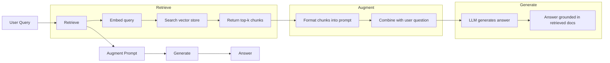
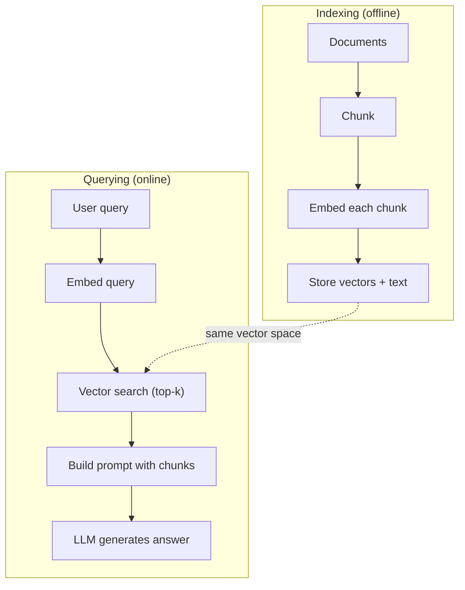

# RAG（检索增强生成）

> 你的 LLM 知道训练截止日期之前的一切，却对你公司的文档、你的代码库、上周的会议纪要一无所知。RAG 的解法是：检索相关文档并塞进提示词里。它是生产环境中部署最广泛的 AI 模式。如果这门课你只打算动手做一件事，那就做一条 RAG 流水线。

**Type:** Build
**Languages:** Python
**Prerequisites:** Phase 10 (LLMs from Scratch), Phase 11 Lessons 01-05
**Time:** ~90 minutes
**Related:** Phase 5 · 23（Chunking Strategies for RAG）讲解六种分块算法及各自的适用场景。Phase 5 · 22（Embedding Models Deep Dive）讲如何选择嵌入模型。Phase 11 · 07（Advanced RAG）讲混合检索、重排序和查询变换。

## 学习目标

- 构建一条完整的 RAG 流水线：文档加载、分块、嵌入、向量存储、检索与生成
- 使用向量数据库（ChromaDB、FAISS 或 Pinecone）实现语义搜索，并正确建立索引
- 解释在知识驱动的应用中为何 RAG 优于微调（成本、时效性、可溯源性）
- 用检索指标（精确率、召回率）和生成指标（忠实度、相关性）评估 RAG 质量

## 问题背景

你为公司搭建了一个聊天机器人。客户问："企业版套餐的退款政策是什么？"LLM 给出了一段关于典型 SaaS 退款政策的泛泛而谈。而真正的政策埋在一份 200 页的内部 wiki 里：企业客户享有 60 天退款窗口，按比例退款。LLM 从未见过这份文档。它不可能知道自己没被训练过的内容。

微调是一种解法：拿来 LLM，用内部文档训练它，再部署更新后的模型。这能行，但问题很严重。微调要花费数千美元的算力。文档一旦变更，模型立刻过时。你无法知道模型的答案出自哪个来源。如果公司下个月又收购了一条新产品线，你还得再微调一次。

RAG 是另一种解法：模型原封不动。问题进来时，在文档库中搜索相关段落，把它们粘贴到问题之前的提示词里，让模型基于这些段落作为上下文来回答。文档库几分钟就能更新。你能清楚看到检索到了哪些文档。模型本身始终不变。这就是 RAG 成为生产环境主流模式的原因：更便宜、更新鲜、更可审计，而且适用于任何 LLM。

## 核心概念

### RAG 模式

整个模式四步就能讲完：



查询 -> 检索 -> 增强提示词 -> 生成。每个 RAG 系统都遵循这个模式。生产级 RAG 系统之间的差异在于每一步的细节：怎么分块、怎么嵌入、怎么搜索，以及怎么构造提示词。

### 为什么 RAG 胜过微调

| 关注点 | 微调 | RAG |
|---------|------------|-----|
| 成本 | 每次训练 1,000-100,000 美元以上 | 每次查询 0.01-0.10 美元（嵌入 + LLM） |
| 时效性 | 不重新训练就会过时 | 重新索引文档，几分钟即可更新 |
| 可审计性 | 无法把答案追溯到来源 | 可以展示确切的检索段落 |
| 幻觉 | 依然会随意产生幻觉 | 答案有检索文档作为依据 |
| 数据隐私 | 训练数据被固化进权重 | 文档留在你自己的向量库中 |

微调永久性地改变模型权重。RAG 临时性地改变模型上下文。对大多数应用来说，临时上下文才是你想要的。

微调唯一占优的场景：你需要模型采用某种特定的风格、语气或推理模式，而这种效果仅靠提示词无法实现。对于事实性知识检索，RAG 每次都赢。

### 嵌入模型

嵌入（embedding）模型把文本转换成稠密向量。语义相近的文本在这个高维空间中产生彼此靠近的向量。"How do I reset my password?" 和 "I need to change my password" 几乎没有共同的词，却会产生几乎相同的向量。"The cat sat on the mat" 则会产生一个截然不同的向量。

常见嵌入模型（2026 年阵容——完整分析见 Phase 5 · 22）：

| 模型 | 维度 | 提供方 | 备注 |
|-------|-----------|----------|-------|
| text-embedding-3-small | 1536（Matryoshka） | OpenAI | 大多数场景下性价比最佳 |
| text-embedding-3-large | 3072（Matryoshka） | OpenAI | 精度更高，可截断到 256/512/1024 |
| Gemini Embedding 2 | 3072（Matryoshka） | Google | MTEB 检索榜首；8K 上下文 |
| voyage-4 | 1024/2048（Matryoshka） | Voyage AI | 提供领域变体（代码、金融、法律） |
| Cohere embed-v4 | 1024（Matryoshka） | Cohere | 多语言能力强，128K 上下文 |
| BGE-M3 | 1024（稠密 + 稀疏 + ColBERT） | BAAI（开放权重） | 一个模型输出三种视图 |
| Qwen3-Embedding | 4096（Matryoshka） | Alibaba（开放权重） | 开放权重中检索得分最高 |
| all-MiniLM-L6-v2 | 384 | 开放权重（Sentence Transformers） | 原型验证基线 |

在本课中，我们用 TF-IDF 自己实现一个简单的嵌入。不是因为生产系统会用 TF-IDF，而是因为它能把概念落到实处：文本进去，向量出来，相似的文本产生相似的向量。

### 向量相似度

给定两个向量，如何度量相似度？三种选择：

**余弦相似度（cosine similarity）**：两个向量夹角的余弦值。取值范围从 -1（方向相反）到 1（方向相同）。忽略模长，只关心方向。这是 RAG 的默认选择。

```
cosine_sim(a, b) = dot(a, b) / (||a|| * ||b||)
```

**点积（dot product）**：原始内积。模长更大的向量得分更高。当模长本身携带信息时有用（更长的文档可能更相关）。

```
dot(a, b) = sum(a_i * b_i)
```

**L2（欧氏）距离**：向量空间中的直线距离。距离越小越相似。对模长差异敏感。

```
L2(a, b) = sqrt(sum((a_i - b_i)^2))
```

余弦相似度是行业标准。它按模长做了归一化，所以能优雅地处理不同长度的文档。当有人说"向量搜索"时，几乎总是指余弦相似度。

### 分块策略

文档太长，无法作为单个向量嵌入。一份 50 页的 PDF 包含几十个主题，整体嵌入的效果可能很糟糕。所以要把文档切分成块（chunk），对每个块单独嵌入。

**固定大小分块**：每 N 个 token 切一刀。简单且可预测。512 token 的块加 50 token 重叠，意味着块 1 是 token 0-511，块 2 是 token 462-973，依此类推。重叠确保你不会在不巧的边界处把句子拦腰切断。

**语义分块**：在自然边界处切分。段落、章节或 markdown 标题。每个块都是一个语义连贯的单元。实现更复杂，但检索效果更好。

**递归分块**：先尝试在最大的边界（章节标题）处切分。如果某个章节仍然太大，就在段落边界处切分。如果某个段落仍然太大，就在句子边界处切分。这就是 LangChain RecursiveCharacterTextSplitter 的做法，实践中效果很好。

块大小比人们想象的更重要：

- 太小（64-128 token）：每个块缺乏上下文。"上个季度它增长了 15%"——不知道"它"指什么，这句话毫无意义。
- 太大（2048+ token）：每个块覆盖多个主题，稀释了相关性。当你搜索营收数据时，得到的块里 10% 在讲营收，90% 在讲人员编制。
- 最佳区间（256-512 token）：上下文足够自洽，主题又足够聚焦。

大多数生产级 RAG 系统使用 256-512 token 的块加 50 token 重叠。Anthropic 的 RAG 指南推荐的就是这个范围。

### 向量数据库

有了嵌入之后，你需要一个地方来存储和搜索它们。可选方案：

| 数据库 | 类型 | 适用场景 |
|----------|------|----------|
| FAISS | 库（进程内） | 原型验证、中小规模数据集 |
| Chroma | 轻量级数据库 | 本地开发、小规模部署 |
| Pinecone | 托管服务 | 无需运维负担的生产环境 |
| Weaviate | 开源数据库 | 自托管的生产环境 |
| pgvector | Postgres 扩展 | 已经在用 Postgres 的团队 |
| Qdrant | 开源数据库 | 高性能自托管 |

在本课中，我们实现一个简单的内存向量存储。它把向量存在一个列表里，做暴力余弦相似度搜索。这等价于使用扁平索引的 FAISS。它大概能撑到 100,000 个向量，再多就慢了。生产系统使用近似最近邻（ANN）算法（如 HNSW），可以在毫秒级搜索数百万向量。

### 完整流水线



索引阶段对每份文档运行一次（或在文档更新时运行）。查询阶段在每次用户请求时运行。在生产环境中，索引可能要花数小时处理数百万份文档，而查询必须在一秒之内响应。

### 真实数字

大多数生产级 RAG 系统使用这些参数：

- **k = 5 到 10**：每次查询检索的块数
- **块大小 = 256 到 512 token**，重叠 50 token
- **上下文预算**：每次查询 2,500-5,000 token 的检索内容
- **总提示词**：约 8,000-16,000 token（系统提示词 + 检索块 + 对话历史 + 用户查询）
- **嵌入维度**：384-3072，取决于模型
- **索引吞吐量**：使用 API 嵌入时每秒 100-1,000 份文档
- **查询延迟**：检索 50-200 毫秒，生成 500-3000 毫秒

```figure
rag-chunking
```

## 从零实现

### 第 1 步：文档分块

```python
def chunk_text(text, chunk_size=200, overlap=50):
    words = text.split()
    chunks = []
    start = 0
    while start < len(words):
        end = start + chunk_size
        chunk = " ".join(words[start:end])
        chunks.append(chunk)
        start += chunk_size - overlap
    return chunks
```

### 第 2 步：TF-IDF 嵌入

我们来构建一个简单的嵌入函数。TF-IDF（词频-逆文档频率，Term Frequency-Inverse Document Frequency）不是神经网络嵌入，但它能以一种捕捉词语重要性的方式把文本转换成向量。在某份文档中出现频繁的词获得更高的 TF；在整个语料库中罕见的词获得更高的 IDF。两者相乘得到一个向量，其中重要且有区分度的词具有高值。

```python
import math
from collections import Counter

def build_vocabulary(documents):
    vocab = set()
    for doc in documents:
        vocab.update(doc.lower().split())
    return sorted(vocab)

def compute_tf(text, vocab):
    words = text.lower().split()
    count = Counter(words)
    total = len(words)
    return [count.get(word, 0) / total for word in vocab]

def compute_idf(documents, vocab):
    n = len(documents)
    idf = []
    for word in vocab:
        doc_count = sum(1 for doc in documents if word in doc.lower().split())
        idf.append(math.log((n + 1) / (doc_count + 1)) + 1)
    return idf

def tfidf_embed(text, vocab, idf):
    tf = compute_tf(text, vocab)
    return [t * i for t, i in zip(tf, idf)]
```

### 第 3 步：余弦相似度搜索

```python
def cosine_similarity(a, b):
    dot = sum(x * y for x, y in zip(a, b))
    norm_a = math.sqrt(sum(x * x for x in a))
    norm_b = math.sqrt(sum(x * x for x in b))
    if norm_a == 0 or norm_b == 0:
        return 0.0
    return dot / (norm_a * norm_b)

def search(query_embedding, stored_embeddings, top_k=5):
    scores = []
    for i, emb in enumerate(stored_embeddings):
        sim = cosine_similarity(query_embedding, emb)
        scores.append((i, sim))
    scores.sort(key=lambda x: x[1], reverse=True)
    return scores[:top_k]
```

### 第 4 步：提示词构造

RAG 中的"增强"就发生在这里。把检索到的块格式化进提示词，要求 LLM 基于给定的上下文作答。

```python
def build_rag_prompt(query, retrieved_chunks):
    context = "\n\n---\n\n".join(
        f"[Source {i+1}]\n{chunk}"
        for i, chunk in enumerate(retrieved_chunks)
    )
    return f"""Answer the question based ONLY on the following context.
If the context doesn't contain enough information, say "I don't have enough information to answer that."

Context:
{context}

Question: {query}

Answer:"""
```

### 第 5 步：完整的 RAG 流水线

```python
class RAGPipeline:
    def __init__(self):
        self.chunks = []
        self.embeddings = []
        self.vocab = []
        self.idf = []

    def index(self, documents):
        all_chunks = []
        for doc in documents:
            all_chunks.extend(chunk_text(doc))
        self.chunks = all_chunks
        self.vocab = build_vocabulary(all_chunks)
        self.idf = compute_idf(all_chunks, self.vocab)
        self.embeddings = [
            tfidf_embed(chunk, self.vocab, self.idf)
            for chunk in all_chunks
        ]

    def query(self, question, top_k=5):
        query_emb = tfidf_embed(question, self.vocab, self.idf)
        results = search(query_emb, self.embeddings, top_k)
        retrieved = [(self.chunks[i], score) for i, score in results]
        prompt = build_rag_prompt(
            question, [chunk for chunk, _ in retrieved]
        )
        return prompt, retrieved
```

### 第 6 步：生成（模拟版）

在生产环境中，这一步应当调用 LLM API。在本课中，我们用"从检索上下文中抽取最相关句子"的方式模拟生成。

```python
def simple_generate(prompt, retrieved_chunks):
    query_words = set(prompt.lower().split("question:")[-1].split())
    best_sentence = ""
    best_score = 0
    for chunk in retrieved_chunks:
        for sentence in chunk.split("."):
            sentence = sentence.strip()
            if not sentence:
                continue
            words = set(sentence.lower().split())
            overlap = len(query_words & words)
            if overlap > best_score:
                best_score = overlap
                best_sentence = sentence
    return best_sentence if best_sentence else "I don't have enough information."
```

## 生产实践

换成真实的嵌入模型和 LLM，代码几乎不用改：

```python
from openai import OpenAI

client = OpenAI()

def embed(text):
    response = client.embeddings.create(
        model="text-embedding-3-small",
        input=text
    )
    return response.data[0].embedding

def generate(prompt):
    response = client.chat.completions.create(
        model="gpt-4o-mini",
        messages=[{"role": "user", "content": prompt}],
        temperature=0
    )
    return response.choices[0].message.content
```

或者用 Anthropic：

```python
import anthropic

client = anthropic.Anthropic()

def generate(prompt):
    response = client.messages.create(
        model="claude-sonnet-4-20250514",
        max_tokens=1024,
        messages=[{"role": "user", "content": prompt}]
    )
    return response.content[0].text
```

流水线本身完全相同。换掉嵌入函数，换掉生成函数。检索逻辑、分块、提示词构造——无论你用哪个模型，全都一模一样。

要让向量存储支撑更大规模，把暴力搜索替换成正经的向量数据库：

```python
import chromadb

client = chromadb.Client()
collection = client.create_collection("my_docs")

collection.add(
    documents=chunks,
    ids=[f"chunk_{i}" for i in range(len(chunks))]
)

results = collection.query(
    query_texts=["What is the refund policy?"],
    n_results=5
)
```

Chroma 在内部处理嵌入（默认使用 all-MiniLM-L6-v2），并把向量存进本地数据库。模式不变，只是换了管道。

## 交付产物

本课产出：
- `outputs/prompt-rag-architect.md` —— 一个用于针对具体场景设计 RAG 系统的提示词
- `outputs/skill-rag-pipeline.md` —— 一个教智能体如何构建和调试 RAG 流水线的技能

## 练习

1. 把 TF-IDF 嵌入换成简单的词袋（bag-of-words）方法（二值化：词出现为 1，不出现为 0）。在示例文档上比较检索质量。TF-IDF 应该更胜一筹，因为它给罕见词更高的权重。

2. 实验不同的块大小：在同一组文档上尝试 50、100、200、500 个词。对每种大小运行同样的 5 个查询，统计有多少查询在前 3 个结果中返回了相关的块。找出检索质量达到峰值的最佳区间。

3. 给每个块添加元数据（来源文档名、块的位置）。修改提示词模板加入来源标注，让 LLM 引用它的信息来源。

4. 实现一个简单的评估：给定 10 个问答对，把每个问题跑一遍 RAG 流水线，测量检索到的块中包含答案的比例。这就是 k 处的检索召回率（retrieval recall at k）。

5. 构建一个对话感知的 RAG 流水线：维护最近 3 轮对话的历史，将其与检索块一起放进提示词。先问定价问题，再用"那企业版呢？"这样的追问来测试。

## 关键术语

| 术语 | 人们怎么说 | 实际含义 |
|------|----------------|----------------------|
| RAG | "会读你文档的 AI" | 检索相关文档，把它们粘贴进提示词，生成一个有这些文档作为依据的答案 |
| 嵌入 | "把文本变成数字" | 文本的稠密向量表示，语义相近的文本产生相近的向量 |
| 向量数据库 | "AI 的搜索引擎" | 为存储向量和按相似度查找最近邻而优化的数据存储 |
| 分块 | "把文档切成小段" | 将文档切分为更小的片段（通常 256-512 token），使每个片段都能被独立嵌入和检索 |
| 余弦相似度 | "两个向量有多像" | 两个向量夹角的余弦值；1 = 方向相同，0 = 正交，-1 = 方向相反 |
| Top-k 检索 | "拿到 k 个最佳匹配" | 从向量库中返回与查询最相似的 k 个块 |
| 上下文窗口 | "LLM 一次能看多少文本" | LLM 单次请求能处理的最大 token 数；检索块必须装得进这个窗口 |
| 增强生成 | "用给定上下文作答" | 以检索文档为上下文来生成回答，而不是只依赖训练时学到的知识 |
| TF-IDF | "词语重要性打分" | 词频乘以逆文档频率；按词语在语料库中的区分度为其加权 |
| 索引 | "为搜索准备文档" | 对文档进行分块、嵌入和存储的离线过程，使其在查询时可被搜索 |

## 延伸阅读

- Lewis et al., "Retrieval-Augmented Generation for Knowledge-Intensive NLP Tasks" (2020) —— Facebook AI Research 的 RAG 原始论文，正式确立了"先检索后生成"的模式
- Anthropic 的 RAG 文档（docs.anthropic.com）—— 关于块大小、提示词构造和评估的实用指南
- Pinecone Learning Center, "What is RAG?" —— 用清晰的图示讲解 RAG 流水线，并涵盖生产环境的考量
- Sentence-BERT: Reimers & Gurevych (2019) —— all-MiniLM 系列嵌入模型背后的论文，展示了如何训练双编码器来做语义相似度
- [Karpukhin et al., "Dense Passage Retrieval for Open-Domain Question Answering" (EMNLP 2020)](https://arxiv.org/abs/2004.04906) —— DPR 论文，证明了稠密双编码器检索在开放域问答上击败 BM25，奠定了现代 RAG 检索器的范式。
- [LlamaIndex High-Level Concepts](https://docs.llamaindex.ai/en/stable/getting_started/concepts.html) —— 构建 RAG 流水线需要了解的主要概念：数据加载器、节点解析器、索引、检索器、响应合成器。
- [LangChain RAG tutorial](https://python.langchain.com/docs/tutorials/rag/) —— 另一种风格的编排框架；用可运行链（chain-of-runnables）的视角看同一个"先检索后生成"模式。
