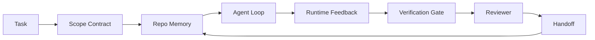

# 智能体工作台工程：为什么强大的模型依然会失败

> 仅有强大的模型还不够。可靠的智能体需要一个工作台：指令、状态、范围、反馈、验证、评审与交接。剥离这些界面，即使前沿模型产出的工作也无法安全交付。

**Type:** Learn + Build
**Languages:** Python (stdlib)
**Prerequisites:** Phase 14 · 01 (Agent Loop), Phase 14 · 26 (Failure Modes)
**Time:** ~45 minutes

## 学习目标

- 把模型能力与执行可靠性区分开。
- 说出决定智能体能否交付的七个工作台界面。
- 在一个小型仓库任务上，对比纯提示词运行与工作台引导运行。
- 产出一份故障模式报告，把每个缺失的界面映射到它引发的症状。

## 问题背景

你把一个前沿模型放进真实的代码仓库，让它添加输入校验。它打开了四个文件，写出看似合理的代码，宣布任务完成，然后停了下来。你运行测试，两个失败。还有一个与校验毫无关系的文件被改动了。没有任何记录说明这个智能体（agent）做了哪些假设、最先尝试了什么、还剩下什么没做。

模型对 Python 的理解没有错，错的是它对这项工作的理解。它不知道什么才算完成、允许在哪里写入、哪些测试是权威依据、下一个会话该如何接续。

这不是模型的 bug，而是工作台的 bug。围绕智能体的环境，缺少了那些把一次性生成变成可靠、可恢复的工程工作的部件。

## 核心概念

工作台（workbench）是任务执行期间包裹在模型外面的运行环境。它有七个界面（surface）：

| 界面 | 承载的内容 | 缺失时的故障 |
|---------|-----------------|----------------------|
| 指令 | 启动规则、禁止操作、完成定义 | 智能体只能猜测“交付”意味着什么 |
| 状态 | 当前任务、改动过的文件、阻塞项、下一步行动 | 每个会话都从零开始 |
| 范围 | 允许的文件、禁止的文件、验收标准 | 修改泄漏到无关代码中 |
| 反馈 | 捕获进循环的真实命令输出 | 智能体在收到 400 错误时仍宣布成功 |
| 验证 | 测试、lint、冒烟运行、范围检查 | “看起来不错”就进了 main 分支 |
| 评审 | 由不同角色进行的第二遍检查 | 构建者给自己的作业打分 |
| 交接 | 改了什么、为什么改、还剩什么 | 下一个会话重新发现一切 |

工作台独立于模型。你可以换掉模型而保留这些界面，却无法去掉这些界面还保住可靠性。



循环闭合在状态文件上，而不是聊天历史上。聊天是易失的，代码仓库才是权威记录（system of record）。

### 工作台与提示词工程

提示词告诉模型这一轮你想要什么。工作台告诉模型如何跨轮次、跨会话地完成工作。大多数智能体失败的故事，都是披着提示词工程外衣的工作台失败。

### 工作台与框架

框架给你一个运行时（LangGraph、AutoGen、Agents SDK）。工作台给智能体一个在该运行时之内工作的场所。两者都需要。本迷你专题讲的是后者。

### 从原语出发推理，而不是从厂商的分类体系出发

眼下关于“harness 工程”的文章很多。Addy Osmani、OpenAI、Anthropic、LangChain、Martin Fowler、MongoDB、HumanLayer、Augment Code、Thoughtworks、walkinglabs 的 awesome 列表，以及源源不断的 Medium 和 Hacker News 文章都在谈论它。它们对 harness 的边界是什么、哪些东西在范围之内、该用哪套词汇各执一词。我们不需要选边站。七个界面是一个 UX 层；每个工作台的底下，都是支撑任何可靠后端的同一组分布式系统原语（primitives）。

暂时撕掉“智能体”这个标签。一次智能体运行就是跨越时间、进程和机器的计算。要让它可靠，你需要的正是任何生产系统都需要的那些原语。

| 原语 | 它是什么 | 为智能体承载什么 |
|-----------|------------|------------------------------|
| 函数 | 有类型的处理器。尽可能保持纯函数。对自己的输入和输出负责。 | 一次工具调用、一条规则检查、一个验证步骤、一次模型调用 |
| Worker | 长期存活的进程，拥有一个或多个函数及其生命周期 | 构建者、评审者、验证者、一个 MCP 服务器 |
| 触发器 | 调用函数的事件源 | 智能体循环的一次迭代、HTTP 请求、队列消息、定时任务、文件变更、钩子 |
| 运行时 | 决定什么在哪里运行、用什么超时和资源的边界 | Claude Code 的进程、LangGraph 的运行时、一个 worker 容器 |
| HTTP / RPC | 调用方与 worker 之间的通信线路 | 工具调用协议、MCP 请求、模型 API |
| 队列 | 触发器与 worker 之间的持久缓冲区；背压、重试、幂等性 | 任务看板、反馈日志、评审收件箱 |
| 会话持久化 | 在崩溃、重启、模型更换后仍然存活的状态 | `agent_state.json`、检查点、KV 存储、代码仓库本身 |
| 授权策略 | 谁能以什么范围调用哪个函数 | 允许/禁止的文件、审批边界、MCP 能力列表 |

现在，把七个工作台界面映射到这些原语上。

- **指令** —— 策略 + 函数元数据。规则就是检查（函数）。路由器（`AGENTS.md`）是附着在运行时启动过程上的策略。
- **状态** —— 会话持久化。运行时在每一步读取的带键存储。文件、KV 或数据库都可以；重要的是持久化语义，而不是存储后端。
- **范围** —— 按任务划分的授权策略。允许/禁止的 glob 模式就是一份 ACL。需要审批的操作构成一个权限格（permission lattice）。
- **反馈** —— 写入队列的调用日志。每次 shell 调用都是一条记录，持久且可重放。
- **验证** —— 一个函数。对输入是确定性的。在任务收尾时触发。失败时默认拒绝（fail closed）。
- **评审** —— 一个独立的 worker，对构建者产物只有只读授权，对评审报告只有只写授权。
- **交接** —— 由会话结束触发器发出的持久记录。下一个会话的启动触发器读取它。

智能体循环本身就是一个 worker：消费事件（用户消息、工具结果、定时器滴答），调用函数（先是模型，然后是模型选中的工具），写入记录（状态、反馈），并发出触发器（验证、评审、交接）。没什么神秘的，和任务处理器是同一个形态。

### 流行模式到原语的翻译

每个流行的 harness 模式都可以还原为这八个原语。对照表如下。

| 厂商或社区模式 | 它实际上是什么 |
|------------------------------|--------------------|
| Ralph Loop（Claude Code、Codex、agentic_harness 一书）—— 当智能体试图提前停止时，把原始意图重新注入一个全新的上下文窗口 | 一个用干净上下文重新入队任务的触发器；会话持久化把目标传递下去 |
| 计划 / 执行 / 验证（PEV） | 三个 worker，各司一职，通过状态和阶段之间的队列通信 |
| Harness 与计算分离（OpenAI Agents SDK，2026 年 4 月）—— 把控制面与执行面拆开 | 控制面 / 数据面的重新表述。比“智能体”这个标签早了几十年 |
| Open Agent Passport（OAP，2026 年 3 月）—— 执行前对照声明式策略对每次工具调用进行签名和审计 | 由前置 worker 执行的授权策略，外加一个带签名的审计队列 |
| Guides 与 Sensors（Birgitta Böckeler / Thoughtworks）—— 前馈规则 + 反馈可观测性 | 授权策略 + 验证函数 + 可观测性追踪 |
| 渐进式压缩，五阶段（对 Claude Code 的逆向工程，2026 年 4 月） | 一个状态管理 worker，以类 cron 的方式在会话持久化上运行，把它控制在预算之内 |
| 钩子 / 中间件（LangChain、Claude Code）—— 拦截模型和工具调用 | 包裹在运行时调用路径上的触发器 + 函数 |
| 以 Markdown 编写、渐进式披露的技能（Anthropic、Flue） | 一个函数注册表，函数元数据按需即时加载进上下文 |
| 沙箱智能体（Codex、Sandcastle、Vercel Sandbox） | 计算面：拥有隔离文件系统、网络和生命周期的运行时 |
| MCP 服务器 | 通过稳定 RPC 暴露函数的 worker，能力列表即授权 |

表中的每一项，都是智能体社区抵达了一个在分布式系统里早有名字的原语，然后给它起了个新名字。作为营销标签很有用，作为工程词汇没有用。

### 实证数据怎么说

“harness 重于模型”的论断如今有了数据支撑。值得了解，因为它们也是反驳“等更聪明的模型就行了”的唯一诚实论据。

- Terminal Bench 2.0 —— 同一个模型，仅改变 harness，就把一个编码智能体从 30 名开外提升到第 5 名（LangChain，*Anatomy of an Agent Harness*）。
- Vercel —— 删掉了其智能体 80% 的工具；成功率从 80% 跃升到 100%（MongoDB）。
- Harvey —— 法律智能体仅靠 harness 优化就把准确率提高了一倍以上（MongoDB）。
- 88% 的企业 AI 智能体项目未能上线生产。失败集中在运行时层面，而不是推理层面（preprints.org，*Harness Engineering for Language Agents*，2026 年 3 月）。
- 一项 2025 年针对三个流行开源框架的基准研究报告了约 50% 的任务完成率；长上下文条件下 WebAgent 从 40-50% 崩跌到 10% 以下，主要原因是无限循环和目标丢失（2026 年初的多篇文章广泛报道）。

结论不是“harness 会永远胜出”。模型确实会随时间吸收 harness 的技巧。结论是：今天，承重的工程在模型周围，而不在模型内部；而承担这份重量的原语，正是每个生产系统从来都需要的那一套。

### 厂商文章的不足之处

这部分你不必客气。

- LangChain 的 *Anatomy of an Agent Harness* 列举了十一个组件——提示词、工具、钩子、沙箱、编排、记忆、技能、子智能体，以及一个运行时“傻循环”。它没有提到队列、作为部署单元的 worker、触发器语义、作为独立关注点的会话持久化，或者授权策略。它把 harness 当作一个可配置的对象，而不是一个需要部署的系统。
- Addy Osmani 的 *Agent Harness Engineering* 确立了 `Agent = Model + Harness` 的框架和棘轮模式（ratchet pattern），但没有说清 harness 是由什么构成的。它读起来是一种立场，而不是一份规格说明。
- Anthropic 和 OpenAI 在这些界面上挖得最深，但停留在自己的运行时之内。2026 年 4 月 Agents SDK 中的“harness 与计算分离”公告，是第一篇明确认可控制面 / 数据面拆分的厂商文章。这是一个原语级的想法，不是新想法。
- agentic_harness 一书把 harness 当作配置对象处理（Jaymin West 的 *Agentic Engineering* 第 6 章），书中最有力的一句话是“harness 是智能体系统中首要的安全边界”。那不过是授权策略的另一种说法。
- Hacker News 的讨论一再抵达同一个终点。2026 年 4 月的帖子 *The agent harness belongs outside the sandbox* 主张 harness 应该“更像一个位于一切之外的 hypervisor，基于上下文和用户来授权访问”。这同样是把授权策略作为一个独立的平面。

你不需要反对这些文章中的任何一篇，也能看出其中的缺口。它们在为一个已经存在的系统撰写 UX 描述，而我们在构建这个系统。系统建对了，七个界面会从原语中自然涌现；建错了，再怎么打磨 `AGENTS.md` 也补不上缺失的队列。

所以，当你在别处听到“harness 工程”时，把它翻译成原语：提示词和规则是策略和函数；脚手架是运行时；护栏是授权 + 验证；钩子是触发器；记忆是会话持久化；Ralph Loop 是重新入队；子智能体是 worker；沙箱是计算面。词汇会变，工程不会。工作台是面向智能体的 UX；而 harness——在能挺过下一轮厂商重新包装的那个意义上——就是函数、worker、触发器、运行时、队列、持久化和策略的正确组合。

## 从零实现

`code/main.py` 把一个小型仓库任务跑两遍。第一遍只用提示词，第二遍接入全部七个界面。同一个模型，同一个任务。脚本统计失败那一轮缺失了哪些界面，并打印一份故障模式报告。

这个仓库任务故意选得很小：给一个单文件的 FastAPI 风格处理器添加输入校验，并写一个能通过的测试。

运行它：

```
python3 code/main.py
```

输出：两轮运行的并排日志、一份汇总纯提示词运行情况的 `failure_modes.json`，以及对工作台运行的一行结论。

这个智能体是一个微型的基于规则的桩程序；重点在界面，不在模型。在本迷你专题的后续课程中，你将把每个界面重建为一个真实、可复用的产物。

## 生产实践

工作台界面早已存在于现实世界中的三个地方，哪怕没人这么称呼它们：

- **Claude Code、Codex、Cursor。** `AGENTS.md` 和 `CLAUDE.md` 是指令界面。斜杠命令是范围。钩子是验证。
- **LangGraph、OpenAI Agents SDK。** 检查点和会话存储是状态界面。Handoff 就是交接界面。
- **真实仓库上的 CI。** 测试、lint 和类型检查是验证。PR 模板是交接。CODEOWNERS 是评审。

工作台工程这门学科，就是把这些界面变得显式、可复用，而不是让每个团队各自重新发现它们。

## 交付产物

`outputs/skill-workbench-audit.md` 是一个可移植的技能，它审计现有仓库的七个工作台界面，报告哪些缺失、哪些不完整、哪些健康。把它放到任何智能体配置旁边，它会告诉你应该先修什么。

## 练习

1. 选一个你已经在运行智能体的仓库。给七个界面打分，从 0（缺失）到 2（健康）。你最薄弱的界面是哪个？
2. 扩展 `main.py`，让纯提示词运行也产出一个虚假的“成功”声明。验证验证关卡本可以拦住它。
3. 为你自己的产品增加第八个界面。论证它为什么不会坍缩进现有七个界面之一。
4. 换一个会幻觉出多余文件写入的桩智能体，重新运行脚本。哪个界面最先捕获它？
5. 把 Phase 14 · 26 中业界反复出现的五种故障模式映射到七个界面上。每个界面分别设计用来吸收哪种模式？

## 关键术语

| 术语 | 大家怎么说 | 它的真正含义 |
|------|----------------|------------------------|
| 工作台 | “那套配置” | 围绕模型构建的工程化界面，让工作变得可靠 |
| 界面 | “一份文档”或“一个脚本” | 一个有名字、机器可读的输入，智能体每一轮都会读取或写入 |
| 权威记录 | “笔记” | 当聊天历史消失后，智能体视为事实来源的文件 |
| 完成定义 | “验收” | 一份客观的、有文件支撑的清单，智能体无法造假 |
| 工作台审计 | “仓库就绪检查” | 在工作开始前对七个界面过一遍，标记缺失的部分 |

## 延伸阅读

把这些读物当作数据点，而不是权威。每一篇都是不完整的分类体系。在决定是否采纳任何概念之前，先把它翻译回原语（函数、worker、触发器、运行时、HTTP/RPC、队列、持久化、策略）。

厂商视角：

- [Addy Osmani, Agent Harness Engineering](https://addyosmani.com/blog/agent-harness-engineering/) — `Agent = Model + Harness` 与棘轮模式；基础设施部分着墨不足
- [LangChain, The Anatomy of an Agent Harness](https://blog.langchain.com/the-anatomy-of-an-agent-harness/) — 十一个组件：提示词、工具、钩子、编排、沙箱、记忆、技能、子智能体、运行时；遗漏了队列、部署和授权
- [OpenAI, Harness engineering: leveraging Codex in an agent-first world](https://openai.com/index/harness-engineering/) — Codex 团队对其运行时周边界面的看法
- [OpenAI, Unrolling the Codex agent loop](https://openai.com/index/unrolling-the-codex-agent-loop/) — 把智能体循环还原为一个套在函数调用上的 `while`
- [Anthropic, Effective harnesses for long-running agents](https://www.anthropic.com/engineering/effective-harnesses-for-long-running-agents) — 特定运行时之内的长程界面
- [Anthropic, Harness design for long-running application development](https://www.anthropic.com/engineering/harness-design-long-running-apps) — 应用层面的设计笔记
- [LangChain Deep Agents harness capabilities](https://docs.langchain.com/oss/python/deepagents/harness) — 运行时配置界面

有可用细节的实践者文章：

- [Martin Fowler / Birgitta Böckeler, Harness engineering for coding agent users](https://martinfowler.com/articles/harness-engineering.html) — guides（前馈）+ sensors（反馈）；最干净的控制论框架
- [HumanLayer, Skill Issue: Harness Engineering for Coding Agents](https://www.humanlayer.dev/blog/skill-issue-harness-engineering-for-coding-agents) — “这不是模型问题，是配置问题”
- [MongoDB, The Agent Harness: Why the LLM Is the Smallest Part of Your Agent System](https://www.mongodb.com/company/blog/technical/agent-harness-why-llm-is-smallest-part-of-your-agent-system) — 实证数据：Vercel 从 80% 到 100%，Harvey 准确率翻倍，Terminal Bench 从 30 名开外到前 5
- [Augment Code, Harness Engineering for AI Coding Agents](https://www.augmentcode.com/guides/harness-engineering-ai-coding-agents) — 以约束为先的实战讲解
- [Sequoia podcast, Harrison Chase on Context Engineering Long-Horizon Agents](https://sequoiacap.com/podcast/context-engineering-our-way-to-long-horizon-agents-langchains-harrison-chase/) — 运行时关切重于模型关切

书籍、论文与参考实现：

- [Jaymin West, Agentic Engineering — Chapter 6: Harnesses](https://www.jayminwest.com/agentic-engineering-book/6-harnesses) — 书籍篇幅的论述，把 harness 视为首要的安全边界
- [preprints.org, Harness Engineering for Language Agents (March 2026)](https://www.preprints.org/manuscript/202603.1756) — 以控制 / 能动性 / 运行时为框架的学术表述
- [walkinglabs/awesome-harness-engineering](https://github.com/walkinglabs/awesome-harness-engineering) — 涵盖上下文、评估、可观测性、编排的精选阅读列表
- [ai-boost/awesome-harness-engineering](https://github.com/ai-boost/awesome-harness-engineering) — 另一份精选列表（工具、评估、记忆、MCP、权限）
- [andrewgarst/agentic_harness](https://github.com/andrewgarst/agentic_harness) — 可用于生产的参考实现，带 Redis 记忆后端和评估套件
- [HKUDS/OpenHarness](https://github.com/HKUDS/OpenHarness) — 内置个人智能体的开源 agent harness

值得为其中的分歧（而非共识）一读的 Hacker News 帖子：

- [HN: Effective harnesses for long-running agents](https://news.ycombinator.com/item?id=46081704)
- [HN: Improving 15 LLMs at Coding in One Afternoon. Only the Harness Changed](https://news.ycombinator.com/item?id=46988596)
- [HN: The agent harness belongs outside the sandbox](https://news.ycombinator.com/item?id=47990675) — 主张把授权作为独立的平面

本课程内的交叉引用：

- Phase 14 · 23 — OpenTelemetry GenAI 规范：sensors 文献所指向的可观测性层
- Phase 14 · 26 — 七个界面所要吸收的故障模式目录
- Phase 14 · 27 — 位于授权策略原语层面的提示注入防御
- Phase 14 · 29 — 生产运行时（队列、事件、定时任务）：本课的原语在部署中的归宿
