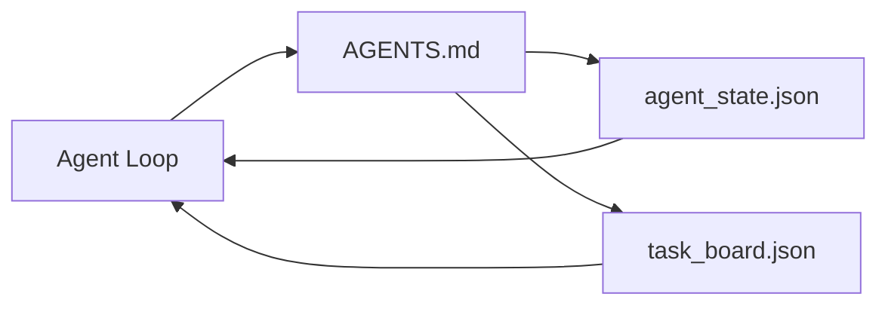

# 最小智能体工作台

> 最小可用的工作台只有三个文件：一个根指令路由、一个状态文件、一个任务看板。其余一切都在此之上分层叠加。如果一个仓库连这三个文件都承载不了，再强的模型也救不了它。

**Type:** Build
**Languages:** Python (stdlib)
**Prerequisites:** Phase 14 · 31 (Why Capable Models Still Fail)
**Time:** ~45 minutes

## 学习目标

- 定义构成最小可用工作台的三个文件。
- 解释为什么简短的根路由文件胜过冗长的单体 `AGENTS.md`。
- 构建一个智能体每轮都能读取、并在结束时写回的状态文件。
- 构建一个无需聊天记录也能支撑多会话工作的任务看板。

## 问题背景

大多数团队搭建工作台的方式，是写一个 3000 行的 `AGENTS.md` 然后宣告完工。模型加载它，忽略掉自己无法概括的部分，然后照旧在那些一直失败的地方失败。

你需要的恰恰相反。一个极小的根文件，只在相关时才把智能体路由到更深层的文件。智能体行动前读取、行动后写回的持久状态。一个能说明哪些任务在进行、哪些被阻塞、接下来做什么的任务看板。

三个文件。各司其职。每个都足够机器可读，以便日后演化成真正的系统。

## 核心概念



### AGENTS.md 是路由器，不是手册

一份好的 `AGENTS.md` 是简短的。它把智能体指向：

- 状态文件（你在哪里）。
- 任务看板（还剩什么）。
- 更深层的规则（位于 `docs/agent-rules.md`）。
- 验证命令（如何确认工作正常）。

更长的内容都放进更深层的文档，只在需要时加载。冗长的手册会被忽略，简短的路由会被遵循。

### agent_state.json 是权威记录（system of record）

状态包含：当前任务 id、改动过的文件、所做的假设、阻塞项，以及下一步动作。智能体每一轮都会读取它。下一个会话读取它，而不是重放聊天记录。

状态之所以放在文件里，是因为聊天记录不可靠。会话会中断，对话会被截断，而文件不会。

### task_board.json 是任务队列

任务看板记录每个任务，状态为 `todo | in_progress | done | blocked`。当状态为空时，它是智能体取活的队列；当你想知道智能体是否在正轨上时，它是你查看的队列。

看板上的每个任务都有 id、目标、负责人（`builder`、`reviewer` 或 `human`）和验收标准。看板刻意保持小巧：当它超过一屏时，你遇到的是规划问题，而不是看板问题。

### 三个文件是下限，不是上限

后续课程会加入范围契约、反馈运行器、验证门禁、评审清单和交接包。这里的三个文件是它们共同的前提。

## 从零实现

`code/main.py` 会在一个空仓库中写入最小工作台，并演示智能体的单轮运行：

1. 读取 `agent_state.json`。
2. 如果状态为空，从 `task_board.json` 中取出下一个任务。
3. 只改动范围内的一个文件。
4. 写回更新后的状态。

运行：

```
python3 code/main.py
```

脚本会在自身旁边创建 `workdir/`，铺设三个文件，运行一轮，并打印 diff。重新运行可以看到第二轮如何接续第一轮的进度。

## 生产实践

在生产环境的智能体产品里，同样的三个文件以不同的名字出现：

- **Claude Code：** 路由器用 `AGENTS.md` 或 `CLAUDE.md`，状态用 `.claude/state.json` 风格的存储，看板用 hooks。
- **Codex / Cursor：** 路由器是 workspace rules，状态是 session memory，看板是聊天侧边栏里排队的任务。
- **自建 Python 智能体：** 就是你刚写的这几个文件。

名字会变，形态不变。

## 实战中的生产模式

最小工作台要在真实 monorepo 中存活，需要在其之上叠加三种模式。它们彼此独立；按仓库的实际需要选用。

**嵌套 `AGENTS.md`，就近优先（nearest-wins）。** OpenAI 在其主仓库中放置了 88 个 `AGENTS.md` 文件，每个子组件一个。Codex、Cursor、Claude Code 和 Copilot 都会从当前工作文件向仓库根目录回溯，并把沿途找到的每个 `AGENTS.md` 拼接起来。子目录文件扩展根文件。Codex 额外支持 `AGENTS.override.md`，用替换代替扩展；这一覆盖机制是 Codex 特有的，跨工具协作时应避免使用。Augment Code 的测量结果是关键所在：最好的 `AGENTS.md` 文件带来的质量提升相当于从 Haiku 升级到 Opus；最差的则让输出比完全没有该文件还要糟。

**要拒绝的反模式——哪怕它们看起来像是覆盖更全。** 相互冲突的指令会让智能体悄无声息地从交互模式退化成贪婪模式（ICLR 2026 AMBIG-SWE：解决率从 48.8% 降到 28%）；要给优先级编号，而不是把指令平铺堆叠。无法验证的风格规则（如“遵循 Google Python Style Guide”）若没有配套的强制检查命令，智能体就会凭空捏造合规；每条风格规则都要配上确切的 lint 命令。把风格放在命令前面会埋没验证路径；命令在前，风格在后。面向人类而非智能体写作会浪费上下文预算；简洁本身就是一项特性。

**跨工具符号链接。** 用一个根文件加符号链接（`ln -s AGENTS.md CLAUDE.md`、`ln -s AGENTS.md .github/copilot-instructions.md`、`ln -s AGENTS.md .cursorrules`）就能让所有编码智能体共享同一份事实来源。Nx 的 `nx ai-setup` 能从单一配置出发，自动为 Claude Code、Cursor、Copilot、Gemini、Codex 和 OpenCode 完成这一设置。

## 交付产物

`outputs/skill-minimal-workbench.md` 可以为任何新仓库生成这套三文件工作台：一个为项目定制的 `AGENTS.md` 路由器、一个包含正确键的 `agent_state.json`，以及一个用当前待办事项初始化的 `task_board.json`。

## 练习

1. 给 `agent_state.json` 加一个 `last_run` 时间戳。如果文件超过 24 小时未更新，除非操作员确认，否则拒绝运行。
2. 给任务看板加一个 `priority` 字段，并修改取任务逻辑，始终选取优先级最高的 `todo`。
3. 把 `task_board.json` 迁移到 JSON Lines 格式，让每个任务占一行，使版本控制中的 diff 更干净。
4. 编写一个 `lint_workbench.py`，当 `AGENTS.md` 超过 80 行或引用了不存在的文件时报错退出。
5. 判断三个文件中丢失哪一个损失最大，并为你的选择辩护。

## 关键术语

| 术语 | 常见说法 | 实际含义 |
|------|----------------|------------------------|
| 路由器（Router） | `AGENTS.md` | 简短的根文件，把智能体指向更深层的文档和文件 |
| 状态文件（State file） | “笔记” | 机器可读的智能体进度记录，每轮写入 |
| 任务看板（Task board） | “待办清单” | 带状态、负责人和验收标准的 JSON 工作队列 |
| 权威记录（System of record） | “事实来源” | 聊天记录消失后，工作台视为权威的那个文件 |

## 延伸阅读

- [agents.md — the open spec](https://agents.md/) —— 已被 Cursor、Codex、Claude Code、Copilot、Gemini、OpenCode 采用
- [Augment Code, A good AGENTS.md is a model upgrade. A bad one is worse than no docs at all](https://www.augmentcode.com/blog/how-to-write-good-agents-dot-md-files) —— 量化测得的质量提升
- [Blake Crosley, AGENTS.md Patterns: What Actually Changes Agent Behavior](https://blakecrosley.com/blog/agents-md-patterns) —— 哪些经验上有效，哪些无效
- [Datadog Frontend, Steering AI Agents in Monorepos with AGENTS.md](https://dev.to/datadog-frontend-dev/steering-ai-agents-in-monorepos-with-agentsmd-13g0) —— 嵌套优先级的实践
- [Nx Blog, Teach Your AI Agent How to Work in a Monorepo](https://nx.dev/blog/nx-ai-agent-skills) —— 从单一来源生成六种工具的配置
- [The Prompt Shelf, AGENTS.md Best Practices: Structure, Scope, and Real Examples](https://thepromptshelf.dev/blog/agents-md-best-practices/) —— 经得起评审的章节排序
- [Anthropic, Claude Code subagents and session store](https://docs.anthropic.com/en/docs/agents-and-tools/claude-code/sub-agents)
- Phase 14 · 31 —— 这套最小配置所化解的失败模式
- Phase 14 · 34 —— 本课预告的持久状态 schema
