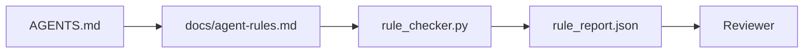

# 把智能体指令写成可执行的约束

> 写成散文的指令是愿望，写成约束的指令是测试。工作台（workbench）把每条规则变成智能体在运行时可以检查、评审者在事后可以验证的东西。

**Type:** Build
**Languages:** Python (stdlib)
**Prerequisites:** Phase 14 · 32 (Minimal Workbench)
**Time:** ~50 minutes

## 学习目标

- 把路由性质的说明文字和操作性规则分开。
- 将启动规则、禁止行为、完成定义、不确定性处理和审批边界表达为机器可检查的约束。
- 实现一个规则检查器，对一次运行按规则集打分。
- 让规则集对 diff 友好，使评审能看清改动了什么。

## 问题背景

典型的 `AGENTS.md` 读起来像入职文档。它告诉智能体「要小心」「要充分测试」「不确定就问」。三天后，智能体交付了一个没有任何测试的改动，写入了禁止目录，并且从未提问——因为它根本不知道界线在哪里。

指令只有在可操作时才有力量，停留在愿望层面时就是空话。解决办法是把规则写成工作台能解释、评审者能打分的形式。

## 核心概念

规则应当放在 `docs/agent-rules.md` 中，与简短的根路由文件分开。每条规则都有名称、类别和检查项。



### 五个类别覆盖绝大多数规则

| 类别 | 规则回答的问题 | 示例 |
|----------|---------------------------|---------|
| 启动（Startup） | 开始工作前什么必须成立？ | “状态文件存在且是新鲜的” |
| 禁止（Forbidden） | 什么绝对不能发生？ | “不要编辑 `scripts/release.sh`” |
| 完成定义（Definition of done） | 什么能证明任务完成了？ | “pytest 以 0 退出且验收行通过” |
| 不确定性（Uncertainty） | 不确定时智能体该做什么？ | “开一条问题记录，而不是靠猜” |
| 审批（Approval） | 什么需要人工审批？ | “任何新依赖、任何生产环境写入” |

一条不属于这五类之一的规则，通常意味着它应当被拆成两条。强制拆分。

### 规则是机器可读的

每条规则都有一个 slug、一个类别、一行描述，以及一个 `check` 字段，指向 `rule_checker.py` 中的某个函数。新增一条规则就意味着新增一个检查函数；检查器随工作台一起成长。

### 规则是 diff 友好的

规则集中在一个 markdown 文件中，每条规则占一个标题。重命名在 diff 中清晰可见。新规则放在所属类别的顶部。过时的规则直接删除，而不是注释掉——因为工作台才是事实来源（source of truth），而不是团队上个季度心情的聊天记录。

### 规则与框架护栏的关系

框架护栏（OpenAI Agents SDK guardrails、LangGraph interrupts）在运行时层面强制执行规则。本课中的规则集，则是这些护栏所实现的、人类可读可评审的契约。两者都需要：运行时在一轮交互中捕获违规，规则集证明运行时做的是对的事。

### 渐进式披露：给一张地图，而不是一部百科全书

`AGENTS.md` 之所以不断膨胀，是因为每次事故都会添一条规则，而没有任何事故会删掉一条。一年之后，文件长达两千行，智能体只读了第一屏，注意力预算耗尽，最终只按它被告知内容的一小部分行事。一份庞大的指令文件失败的原因，和一份四十页的入职文档失败的原因相同：读者只会粗略扫一遍，再也不会回到真正重要的那一段。

解法不是写一个更短的文件，而是写一个分层的文件。根路由文件保持足够短，短到每个会话都能读完，并且只放指针，不放别的。深度内容放在主题文件里，只有任务涉及时智能体才会加载。给智能体一张地图，而不是整部百科全书，让它自己走到需要的那一页。

```
AGENTS.md                  # router, < 50 lines: what this repo is, where to look, the 5 hard rules
docs/
  agent-rules.md           # the full rule set (this lesson)
  architecture.md          # loaded when the task touches module boundaries
  testing.md               # loaded when the task writes or runs tests
  deploy.md                # loaded only for release work, gated behind an approval rule
feature_list.json          # the backlog (Phase 14 · 36)
```

| 层级 | 所在位置 | 阅读时机 | 体量预算 |
|------|----------|-----------|-------------|
| 路由 | `AGENTS.md` | 每个会话，始终阅读 | 约 50 行以内 |
| 规则 | `docs/agent-rules.md` | 每个会话，启动时阅读 | 每个类别一屏 |
| 主题文档 | `docs/<topic>.md` | 仅当任务涉及该主题时 | 需要多深就多深 |

有两个测试可以保证分层不走样。可达性测试：智能体应当从路由文件出发最多两跳就能到达任意一条规则，因此路由文件必须用路径链接每个主题文档，而不是用文字描述它。新鲜度测试：路由文件足够短，短到评审者在每个 PR 上都会重读一遍——这是唯一能阻止它悄悄长回那部它本要取代的百科全书的办法。一个不再能解析的指针，比缺一条规则更糟糕，所以路由文件中的失效链接本身就是一次启动检查违规。

## 从零实现

`code/main.py` 提供：

- `agent-rules.md` 解析器，把规则加载到 dataclass 中。
- `rule_checker.py` 风格的检查函数，每个 `check` 引用对应一个。
- 一次演示性的智能体运行，违反两条规则，以及一轮把它们抓出来的检查。

运行：

```
python3 code/main.py
```

输出：解析后的规则集、运行轨迹、每条规则的通过/失败结果，以及保存在脚本旁边的 `rule_report.json`。

## 生产环境中的实践模式

三种模式决定了一套规则集是能维持一个季度，还是一周内就腐化。

**在编写时就标注严重级别。** 每条规则都带有 `severity`：`block`、`warn` 或 `info`。检查器报告全部三种；运行时只在 `block` 上拒绝执行。大多数团队早期会夸大严重级别，然后在截止日期压力下悄悄降级；在编写时就打标签，迫使校准在一开始完成。可以与验证关卡（Phase 14 · 38）配合：任何对 `block` 规则的覆盖都要签入 `overrides.jsonl` 审计日志。

**规则过期作为强制机制。** 每条规则都带一个 `expires_at` 日期（默认是编写后 90 天）。当一条未过期的规则连续 60 天零违规时，检查器会发出警告；下一次季度评审要么给出保留理由，要么降级为 `info`，要么删除。Cloudflare 的生产环境 AI Code Review 数据（2026 年 4 月，30 天内覆盖 5,169 个仓库的 131,246 次评审运行）显示：带显式过期机制的规则集每个仓库保持在 30 条以内；没有过期机制的则膨胀到 80 条以上，且大多数从未触发。

**Markdown 作为源文件，JSON 作为缓存。** `agent-rules.md` 是人工编写的文件；`agent-rules.lock.json` 是检查器在热路径上读取的缓存。锁文件由 pre-commit 钩子重新生成。Markdown 的 diff 便于评审；JSON 解析则不进入每一轮交互。这和 `package.json` / `package-lock.json`、`Cargo.toml` / `Cargo.lock` 是同一种形态。

## 生产实践

在生产环境中：

- Claude Code、Codex、Cursor 在会话开始时读取这些规则，并在拒绝某个动作时引用它们。检查器在 CI 中重新运行规则，捕捉无声的漂移。
- OpenAI Agents SDK guardrails 把同样的检查注册为输入和输出护栏。markdown 是文档界面；SDK 是运行时界面。
- 当运行中的某个节点违反规则时，LangGraph interrupts 会触发。中断处理器读取规则、询问人类，然后恢复执行。

规则集在这三者之间可以随意迁移，因为它本质上只是 markdown 加函数名。

## 交付产物

`outputs/skill-rule-set-builder.md` 会访谈项目负责人，把他们现有的散文式指令归入五个类别，并生成一份带版本的 `agent-rules.md` 和一个检查器桩代码。

## 练习

1. 如果你的产品确实需要，添加第六个类别。论证它为什么不能并入已有五类之一。
2. 扩展检查器，让规则可以携带严重级别（`block`、`warn`、`info`），并让报告相应地聚合。
3. 把检查器接入 CI：如果最近一次智能体运行中有 block 级规则失败，则使构建失败。
4. 给每条规则添加一个「过期」字段。90 天内没有检查失败的规则进入待评审状态。
5. 找一份真实的 `AGENTS.md`，把它重写成五类规则。其中有多少行是可操作的？有多少行只是愿望？

## 关键术语

| 术语 | 人们常说 | 实际含义 |
|------|----------------|------------------------|
| 操作性规则（Operational rule） | “一条真正的指令” | 工作台能在运行时检查的规则 |
| 愿望性规则（Aspirational rule） | “要小心” | 没有检查项的规则；要么删除，要么升级 |
| 完成定义（Definition of done） | “验收” | 任务完成的客观、有文件依据的证明 |
| Block 级严重度 | “硬规则” | 违规即停止运行；没有操作员介入无法消音 |
| 规则过期（Rule expiry） | “清理过时规则” | N 天内无失败记录的规则进入退役评审 |

## 延伸阅读

- [OpenAI Agents SDK guardrails](https://platform.openai.com/docs/guides/agents-sdk/guardrails)
- [LangGraph interrupts](https://langchain-ai.github.io/langgraph/how-tos/human_in_the_loop/breakpoints/)
- [Anthropic, Building Effective Agents](https://www.anthropic.com/research/building-effective-agents)
- [Rick Hightower, Agent RuleZ: A Deterministic Policy Engine](https://medium.com/@richardhightower/agent-rulez-a-deterministic-policy-engine-for-ai-coding-agents-9489e0561edf) —— 生产环境中的 block/warn/info 严重级别
- [Cloudflare, Orchestrating AI Code Review at Scale](https://blog.cloudflare.com/ai-code-review/) —— 13.1 万次评审运行，规则组合的经验教训
- [microservices.io, GenAI development platform — part 1: guardrails](https://microservices.io/post/architecture/2026/03/09/genai-development-platform-part-1-development-guardrails.html) —— 规则与 CI 之间的纵深防御
- [Type-Checked Compliance: Deterministic Guardrails (arXiv 2604.01483)](https://arxiv.org/pdf/2604.01483) —— 以 Lean 4 作为「规则即检查」的上限
- [logi-cmd/agent-guardrails](https://github.com/logi-cmd/agent-guardrails) —— 合并关卡实现：作用域、变异测试、违规预算
- Phase 14 · 32 —— 这套规则集所嵌入的最小工作台
- Phase 14 · 38 —— 消费规则报告的验证关卡
- Phase 14 · 39 —— 为规则合规性打分的评审智能体
