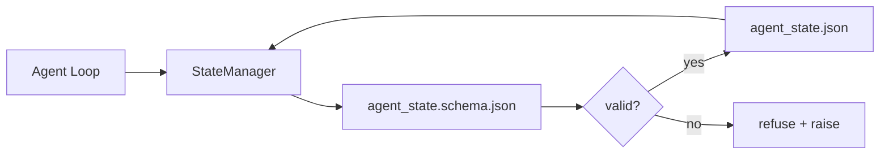

# 仓库记忆与持久化状态

> 聊天记录是易失的，仓库才是持久的。工作台（workbench）把智能体状态存放在版本化的文件中，这样下一个会话、下一个智能体、下一位评审者读到的都是同一份事实来源。

**Type:** Build
**Languages:** Python (stdlib + `jsonschema` optional)
**Prerequisites:** Phase 14 · 32 (Minimal Workbench)
**Time:** ~60 minutes

## 学习目标

- 界定哪些信息属于仓库记忆（repo memory），哪些属于聊天记录。
- 为 `agent_state.json` 和 `task_board.json` 编写 JSON Schema。
- 构建一个状态管理器，实现状态的加载、校验、变更与原子化持久化。
- 利用 schema 在坏写入污染工作台之前就将其拒绝。

## 问题背景

智能体结束一次会话，聊天窗口关闭。下一次会话开启时问该从哪里开始。模型说"让我看看文件"，结果读到过期的笔记，把已经完成的工作又做了一遍。更糟的情况是，它把一个已完工的文件重写了，因为没有任何东西告诉它这个文件已经完成。

工作台的解法是仓库记忆：状态以 JSON 文件的形式存放在仓库里，按 schema 写入，原子化持久化，并且在代码评审中 diff 友好。聊天只是一条转瞬即逝的信息流，仓库才是记录系统（system of record）。

## 核心概念



### 哪些内容属于仓库记忆

| 属于 | 不属于 |
|---------|-----------------|
| 当前活跃的任务 id | 原始聊天转录 |
| 本次会话触碰过的文件 | token 级的推理痕迹 |
| 智能体做出的假设 | "用户看起来很沮丧" |
| 未解决的阻塞项 | 采样得到的补全结果 |
| 下一步动作 | 厂商特定的模型 id |

判断标准是持久性：三个月后在一次 CI 重跑中，这条信息还有用吗？有用，进仓库；没用，归遥测（telemetry）。

### Schema 优先的状态

JSON Schema 就是契约。没有它，每个智能体都会发明新字段，每位评审者都要学习一种新的数据形状，每个 CI 脚本都得为历史版本写特殊处理。有了它，坏写入就是被拒绝的写入。

schema 覆盖以下内容：

- 必填键。
- 允许的 `status` 取值。
- 禁止的取值（例如数组不能为 `null`）。
- 模式约束（任务 id 必须匹配 `T-\d{3,}`）。
- 用于迁移的版本字段。

### 原子写入

状态写入必须能扛住部分失败：先写到临时文件，fsync，再重命名覆盖目标文件。状态文件是事实来源；一个写了一半的状态文件比没有文件更糟。

### 迁移

schema 发生变更时，要在升级 schema 的同时附带一个迁移脚本。状态文件携带 `schema_version` 字段；管理器拒绝加载来自它无法迁移的版本的文件。

## 从零实现

`code/main.py` 实现了：

- `agent_state.schema.json` 和 `task_board.schema.json`。
- 一个仅依赖标准库的校验器（JSON Schema 的子集：required、type、enum、pattern、items）。
- `StateManager.load`、`StateManager.update`、`StateManager.commit`，写入采用"临时文件 + 重命名"的原子方式。
- 一个演示程序：变更状态、持久化、重新加载，验证整个往返过程。

运行：

```
python3 code/main.py
```

脚本会写入 `workdir/agent_state.json` 和 `workdir/task_board.json`，在两个回合中对它们做变更，并在每一步打印校验后的状态。

## 实际生产中的模式

以下四个模式能把本课的最小实现，升级为一个多智能体 monorepo 能够长期依赖的方案。

**原子化的"临时文件 + 重命名"不是可选项。** 2026 年 3 月 Hive 项目的一份 bug 报告把这个失败模式记录得很清楚：`state.json` 通过 `write_text()` 写入，异常被捕获后静默吞掉。部分写入导致会话在恢复时读到损坏的状态，且没有任何信号。修复方式始终是：在目标文件所在目录用 `tempfile.mkstemp` 创建临时文件，写入，`fsync`，再 `os.replace`（在 POSIX 和 Windows 上都是原子重命名）。本课的 `atomic_write` 正是这么做的。

**为每个非幂等的工具调用加上幂等键（idempotency key）。** 如果智能体在调用工具之后、检查点记录结果之前崩溃，恢复时会重试该工具调用。对读操作是安全的；对发邮件、数据库插入、文件上传则很危险。模式是：在执行前把每个工具调用 ID 记录到 `pending_calls.jsonl`。重试时先检查该 ID；如果已存在，跳过调用并使用缓存的结果。Anthropic 和 LangChain 在 2026 年的指南中都强调了这一点；LangGraph 的 checkpointer 持久化待处理写入也是出于同样的原因。

**把大体积产物与状态分离。** 不要把 CSV、长篇转录或生成的文件存进 `agent_state.json`。把产物保存为独立文件（或上传到对象存储），状态里只保留路径。检查点保持小而快；产物则独立增长。

**事件溯源（event sourcing）用于审计，快照用于恢复。** 每次状态变更都追加到事件日志（`state.events.jsonl`）；周期性地把快照写入 `state.json`。恢复时先读快照，再重放快照时间戳之后的事件。这会多花一些磁盘空间，但可以让你逐字重放智能体的决策——在调试长程运行时不可或缺。Postgres 内部的 WAL 用的就是同样的结构。

**要么做 schema 迁移，要么拒绝加载。** `schema_version` 整数就是契约。当管理器加载到未知版本的文件时，拒绝读取。在升级 schema 的同时附带迁移脚本；`tools/migrate_state.py` 在每次启动时幂等地运行。

## 生产实践

在生产环境中：

- **LangGraph checkpointer。** 同样的思路，不同的存储。checkpointer 把图状态持久化到 SQLite、Postgres 或自定义后端。当 checkpointer 挂掉、你需要手工读取状态时，本课教的 schema 就是你要依靠的东西。
- **Letta memory blocks。** 带结构化 schema 的持久化记忆块（Phase 14 · 08）。同样的纪律，作用域换成了长期运行的角色。
- **OpenAI Agents SDK 的会话存储。** 可插拔后端，支持 schema 感知。本课的状态文件就相当于它的本地文件后端。

## 交付产物

`outputs/skill-state-schema.md` 会生成一对项目专属的 JSON Schema（state + board）、一个接入原子写入的 Python `StateManager`，以及一个迁移脚手架，保证下一次 schema 升级不会破坏工作台。

## 练习

1. 增加一个 `last_human_touch` 时间戳。在人类编辑后五秒内拒绝任何智能体写入。
2. 扩展校验器以支持 `oneOf`，使一个任务可以是构建任务或评审任务，二者各有不同的必填字段。
3. 增加 `schema_version` 字段，并编写从 v1 到 v2 的迁移（把 `blockers` 重命名为 `risks`）。
4. 把存储后端从本地文件换成 SQLite，但保持 `StateManager` 的 API 完全不变。
5. 让两个智能体以 50 ms 的写入竞争访问同一个状态文件。会出什么问题？原子重命名又是如何救场的？

## 关键术语

| 术语 | 人们的说法 | 实际含义 |
|------|----------------|------------------------|
| 仓库记忆（repo memory） | "笔记文件" | 存放在仓库受版本跟踪的文件中、受 schema 约束的状态 |
| Schema 优先 | "校验输入" | 在写入方之前先定义契约，拒绝偏移 |
| 原子写入 | "重命名一下就行" | 写临时文件、fsync、重命名，使部分失败无法造成损坏 |
| 迁移 | "升一下 schema" | 把 vN 状态转换为 v(N+1) 状态的脚本 |
| 记录系统（system of record） | "事实来源" | 工作台视为权威的那份产物 |

## 延伸阅读

- [JSON Schema specification](https://json-schema.org/specification.html)
- [LangGraph checkpointers](https://langchain-ai.github.io/langgraph/concepts/persistence/)
- [Letta memory blocks](https://docs.letta.com/concepts/memory)
- [Fast.io, AI Agent State Checkpointing: A Practical Guide](https://fast.io/resources/ai-agent-state-checkpointing/) —— 带幂等性的 schema 优先检查点方案
- [Fast.io, AI Agent Workflow State Persistence: Best Practices 2026](https://fast.io/resources/ai-agent-workflow-state-persistence/) —— 并发控制、TTL、事件溯源
- [Hive Issue #6263 — non-atomic state.json writes silently ignored](https://github.com/aden-hive/hive/issues/6263) —— 真实项目中的失败模式
- [eunomia, Checkpoint/Restore Systems: Evolution, Techniques, Applications](https://eunomia.dev/blog/2025/05/11/checkpointrestore-systems-evolution-techniques-and-applications-in-ai-agents/) —— 源自操作系统历史的 CR 原语在智能体中的应用
- [Indium, 7 State Persistence Strategies for Long-Running AI Agents in 2026](https://www.indium.tech/blog/7-state-persistence-strategies-ai-agents-2026/)
- [Microsoft Agent Framework, Compaction](https://learn.microsoft.com/en-us/agent-framework/agents/conversations/compaction) —— 厂商提供的检查点管理器
- Phase 14 · 08 —— 记忆块与睡眠时计算（sleep-time compute）
- Phase 14 · 32 —— 本课为其建立 schema 的三文件最小集
- Phase 14 · 40 —— 交接包（handoff packet）读取同一份 schema
