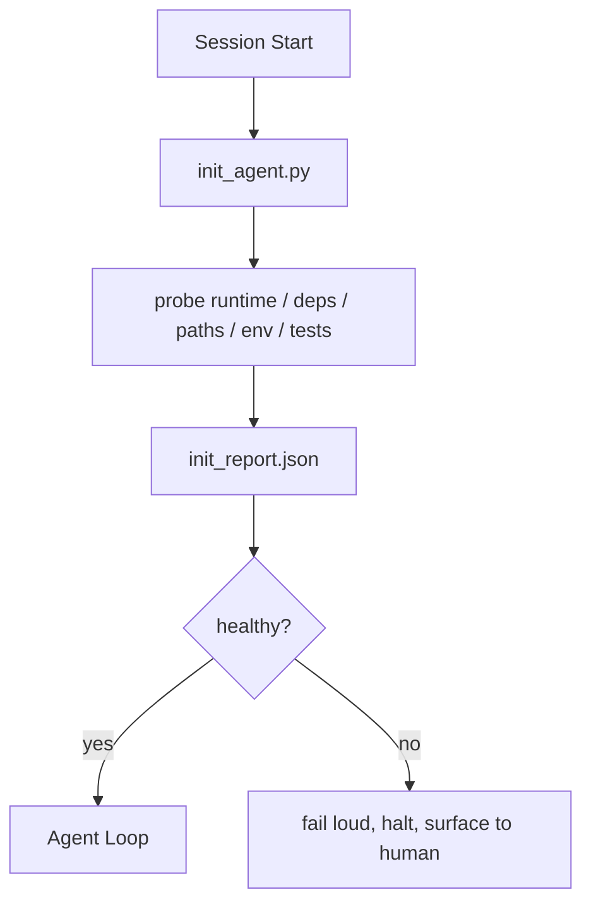

# 智能体初始化脚本

> 每个冷启动的会话都要交一笔税。智能体重复读同样的文件、重试同样的探测、重新摸索同样的路径。初始化脚本把这笔税一次付清，并把答案写进状态。

**Type:** Build
**Languages:** Python (stdlib)
**Prerequisites:** Phase 14 · 32 (Minimal Workbench), Phase 14 · 34 (Repo Memory)
**Time:** ~45 minutes

## 学习目标

- 识别哪些工作智能体不该在每个会话里重做一遍。
- 构建一个确定性的初始化脚本，探测运行时、依赖和仓库健康状况。
- 持久化探测结果，让智能体直接读取，而不是重新运行检查。
- 初始化失败时大声、快速地失败，并且只留一个排查入口。

## 问题背景

打开一个会话。智能体猜 Python 版本，猜测试命令，为了找到入口文件把仓库根目录列了五遍，尝试导入一个没装的包，再问用户配置文件在哪。等它做出第一个真正的修改时，一万个 token 已经花在了本该由一个脚本搞定的准备工作上。

解决办法是一个初始化脚本：在智能体做任何事之前先运行，并写出一份 `init_report.json`，供智能体在启动时读取。

## 核心概念



### 初始化脚本探测什么

| 探测项 | 为什么重要 |
|-------|----------------|
| 运行时版本 | Python 或 Node 版本不对会导致悄无声息的版本错误 bug |
| 依赖可用性 | 缺失的包留到后面再发现，代价是现在排查的十倍 |
| 测试命令 | 智能体必须知道怎么验证；命令缺失说明工作台已经坏了 |
| 仓库路径 | 硬编码路径会漂移；解析一次然后固定下来 |
| 环境变量 | 缺失 `OPENAI_API_KEY` 应该是一个失败面，而不是运行时谜题 |
| 状态与看板新鲜度 | 崩溃会话留下的过期状态是个隐患 |
| 最后已知良好提交 | 作为会话结束时交接 diff 的锚点 |

### 大声失败、快速失败、在一个地方失败

探测失败意味着停机并上报给人。没有「智能体自己会想办法」这回事。初始化的全部意义，就是在工作台坏掉时拒绝启动。

### 幂等性

连续运行两次。第二次运行除了刷新时间戳之外应该什么都不改。正是幂等性（idempotency）让你能把脚本接入 CI、钩子或任务前的斜杠命令。

### 初始化与启动规则的关系

规则（Phase 14 · 33）描述行动前必须为真的条件。初始化是确保这些规则可被检查的脚本。没有初始化的规则会沦为「小心点」；没有规则的初始化则是一场精致的失败。

## 从零实现

`code/main.py` 实现了 `init_agent.py`：

- 五个探测项：Python 版本、通过 `importlib.util.find_spec` 检查声明的依赖、测试命令可解析性、必需的环境变量、状态文件新鲜度。
- 每个探测返回 `(name, status, detail)`。
- 脚本写出包含全部探测结果的 `init_report.json`，并在任何阻断级（block-severity）探测失败时以非零状态退出。

运行它：

```
python3 code/main.py
```

脚本打印探测结果表格，写出 `init_report.json`，正常路径下以零状态退出，否则以非零状态退出并列出失败的探测项。

## 生产环境中的实战模式

三个模式把有用的初始化脚本和走过场的仪式区分开来。

**最后已知良好提交锚定。** 把当前提交与上次成功合并时写入的 `LKG` 文件做比对。如果 diff 超出预算（默认 50 个文件），就拒绝启动，要求人来批准新基线。Cloudflare 的 AI Code Review 正是用这种方式约束评审智能体的范围：每个评审会话都锚定在同一个最后已知良好提交上，绝不让漂移在会话间累积。

**带 TTL 的锁文件。** 在第一次探测全部通过后写出 `prereqs.lock`。后续运行在 N 小时内（默认 24 小时）信任这个锁，跳过昂贵的探测。初始化脚本先读锁；如果锁还新鲜且依赖清单的哈希匹配，就直接短路。这和 Docker 层缓存是同一个模式：幂等探测 + 内容哈希 = 跳过。

**热路径里不许有网络、不许有 LLM、不许有意外。** 初始化探测是确定性的管道工作。一个调用 LLM 来分类失败原因、或访问外部服务检查许可证的「探测」不是探测，而是工作流。如果某个探测在干跑（dry run）中超过三秒，就把它当作工作台异味处理：要么移出初始化，要么缓存它的结果。

## 生产实践

在生产环境中：

- **Claude Code 钩子。** `pre-task` 钩子调用初始化脚本，失败时拒绝启动智能体。
- **GitHub Actions。** 一个 `setup-agent` 作业运行初始化脚本；智能体作业依赖于它。
- **Docker 入口点。** 智能体容器在 exec 智能体运行时之前先运行初始化脚本；失败时日志会浮出水面。

初始化脚本是可移植的，因为它不调用任何特定框架。Bash、Make 或任务文件都可以包装它。

## 交付产物

`outputs/skill-init-script.md` 对项目进行访谈，把它的准备工作分类成探测项，并产出一个项目专属的 `init_agent.py`，外加一个在任何智能体步骤之前运行它的 CI 工作流。

## 练习

1. 添加一个探测：将当前提交与最后已知良好提交做 diff，如果变更超过 50 个文件就拒绝启动。
2. 让脚本写出 `prereqs.lock` 文件，并在锁超过七天时拒绝启动。
3. 添加 `--fix` 标志，自动安装缺失的开发依赖，但绝不在未经批准的情况下修改运行时依赖。
4. 把探测从硬编码函数迁移到 YAML 注册表。为这个权衡做辩护。
5. 给每个探测加上时间预算。运行超过三秒的探测就是工作台异味。

## 关键术语

| 术语 | 大家怎么说 | 实际含义 |
|------|----------------|------------------------|
| 探测（Probe） | 「一项检查」 | 一个返回 `(name, status, detail)` 的确定性函数 |
| 初始化报告 | 「准备阶段的输出」 | 写在状态文件旁边、包含探测结果的 JSON |
| 幂等 | 「可以安全重跑」 | 连续运行两次产生的报告除时间戳外完全一致 |
| 大声失败 | 「别吞掉错误」 | 停机并上报给人；不允许静默回退 |
| 准备税（Setup tax） | 「引导成本」 | 智能体每个会话花在重新发现显而易见之事上的 token |

## 延伸阅读

- [Anthropic, Effective harnesses for long-running agents](https://www.anthropic.com/engineering/effective-harnesses-for-long-running-agents)
- [GitHub Actions, composite actions for setup](https://docs.github.com/en/actions/sharing-automations/creating-actions/creating-a-composite-action)
- [microservices.io, GenAI dev platform: guardrails](https://microservices.io/post/architecture/2026/03/09/genai-development-platform-part-1-development-guardrails.html) — 作为初始化手段的 pre-commit + CI 检查
- [Augment Code, How to Build Your AGENTS.md (2026)](https://www.augmentcode.com/guides/how-to-build-agents-md) — 对初始化的预期
- [Codex Blog, Codex CLI Context Compaction](https://codex.danielvaughan.com/2026/03/31/codex-cli-context-compaction-architecture/) — 把会话启动视为压缩感知的初始化
- Phase 14 · 33 — 这个脚本所支撑的规则集
- Phase 14 · 34 — 这个脚本所初始化的状态文件
- Phase 14 · 38 — 初始化脚本所馈送的验证关卡
- Phase 14 · 40 — 消费初始化报告中最后已知良好提交的交接流程
