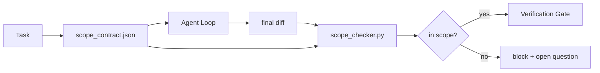

# 范围契约与任务边界

> 模型不知道工作在哪里结束。范围契约（scope contract）是一份按任务建立的文件，写明工作从哪里开始、到哪里结束，以及一旦越界如何回滚。这份契约把“不要越界”从一个愿望变成一项检查。

**Type:** Build
**Languages:** Python (stdlib)
**Prerequisites:** Phase 14 · 32 (Minimal Workbench), Phase 14 · 33 (Rules as Constraints)
**Time:** ~50 minutes

## 学习目标

- 编写一份范围契约：智能体在任务开始时读取它，验证器在任务结束时读取它。
- 指定允许文件、禁止文件、验收标准、回滚计划和审批边界。
- 实现一个范围检查器，将 diff 与契约比对并标记违规。
- 让范围蔓延（scope creep）变得可见、自动检测、可审查。

## 问题背景

智能体会蔓延。任务是“修复登录 bug”，但 diff 却改动了登录路由、邮件辅助函数、数据库驱动、README 和发布脚本。每一处改动在当时都有看似合理的理由，但合在一起，就成了一个与评审通过的版本不同的变更。

范围蔓延是智能体工作中最缺乏监控的失败模式，因为智能体会真诚地叙述每一步操作。解决之道不是更严格的提示词，而是一份落在磁盘上的契约——写明承诺了什么，再用一项检查把结果与承诺进行比对。

## 核心概念



### 范围契约包含哪些内容

| 字段 | 用途 |
|-------|---------|
| `task_id` | 关联看板上的任务 |
| `goal` | 一句话目标，评审者可以据此验证 |
| `allowed_files` | 智能体可以写入的 glob 模式 |
| `forbidden_files` | 智能体绝不能触碰（哪怕是无意间）的 glob 模式 |
| `acceptance_criteria` | 证明任务完成的测试命令或断言行 |
| `rollback_plan` | 一段话，操作者在需要中止时可以照此执行 |
| `approvals_required` | 超出范围、需要人类明确签字批准的操作 |

没有 `forbidden_files` 的契约是不完整的。负空间（negative space）占了契约的一半。

### 用 glob，而不是裸路径

真实仓库里文件会移动。把契约锚定在 glob 模式上（`app/**/*.py`、`tests/test_signup*.py`），这样会话之间的一次重构不会让契约失效。

### 回滚也是范围的一部分

列出回滚方式会迫使契约作者去思考可能出什么问题。一份无法回滚的契约，就是一份不该被批准的契约。

### 范围检查就是 diff 检查

智能体产出一个 diff。检查器读取这个 diff、允许的 glob、禁止的 glob，以及实际运行过的验收命令列表。每一处违规都是一条带标签的发现，验证关卡可以据此拒绝。

### 范围的两个高度：功能清单与任务契约

范围契约约束的是单个任务，而不是整个项目。智能体可以在登录修复任务的契约内做得一丝不苟，但下一轮仍然可能认定项目还需要一个设置页面、一个深色模式开关，再顺手重写路由。契约从未被问过哪些工作属于项目范围，它只回答了哪些文件属于任务范围。

第二个高度需要自己的原语：一个智能体在会话开始时读取的 `feature_list.json`。它是机器可读、有序排列的项目待办清单。智能体恰好挑选一个 `status` 为 `todo` 的功能，把它的 `id` 写进当前的范围契约，并且禁止在同一会话中启动第二个功能。“一次只做一个功能”不再是提示词里一句智能体可以自圆其说绕过去的话，而是变成它从磁盘上读到的值，以及关卡强制执行的检查。

```json
{
  "project": "knowledge-base",
  "active": "import-pdf",
  "features": [
    { "id": "import-pdf",   "status": "in_progress", "goal": "import a PDF into the library",        "done_when": "pytest tests/test_import.py && a sample PDF appears in the library view" },
    { "id": "full-text-search", "status": "todo",     "goal": "search document text and rank hits",   "done_when": "query returns ranked results with snippets" },
    { "id": "cite-answers", "status": "todo",         "goal": "answers carry source citations",        "done_when": "every answer renders at least one clickable citation" }
  ]
}
```

| 字段 | 用途 |
|-------|---------|
| `active` | 当前会话唯一可以触碰的功能；为空表示需要挑选一个并填入 |
| `features[].id` | 稳定的 slug，范围契约的 `task_id` 指向它 |
| `features[].status` | `todo`、`in_progress`、`done`、`blocked`；同一时刻只能有一个 `in_progress` |
| `features[].goal` | 一句话目标，评审者可以据此验证 |
| `features[].done_when` | 把 `in_progress` 翻转为 `done` 的验收条件 |

两条规则让这份清单真正承重，而不是装饰。第一，“至多一个 `in_progress`”这条不变量本身就是一项启动检查（Phase 14 · 33）：如果清单显示有两个，会话拒绝启动，直到人类解决冲突。第二，功能清单是文件而不是聊天消息，因为聊天会滚出上下文，而文件在会话之间、智能体之间持久存在。交接环节（Phase 14 · 40）会把已完成功能的状态写回 `done`，这样下一个会话打开的是一块准确的看板，而不是重新推导还剩什么没做。

契约与清单按最小权限原则组合，与下文描述的合并语义相同：任务契约的 `allowed_files` 必须落在当前活跃功能所涉及的范围之内，绝不能超出。

## 从零实现

`code/main.py` 实现了：

- `scope_contract.json` 模式（JSON Schema 的子集，glob 数组）。
- 一个 diff 解析器，把改动文件列表加上已运行命令列表转换为一个 `RunSummary`。
- 一个 `scope_check`，对照契约返回 `(violations, in_scope, off_scope)`。
- 两次演示运行：一次留在范围内，一次发生蔓延。检查器标记出蔓延，给出确切的文件和原因。

运行方式：

```
python3 code/main.py
```

输出：契约、两次运行、每次运行的判定结果，以及保存下来的 `scope_report.json`。

## 实战中的生产模式

一位实践“specsmaxxing”（在调用智能体之前先用 YAML 写好范围契约）的从业者报告：三周内“掉进兔子洞”的比例从 52% 降到 21%，期间没有更换智能体。是契约起了作用，不是模型。有三个模式让这一收益得以巩固。

**违规预算，而不是非黑即白的失败。** `agent-guardrails`（Claude Code、Cursor、Windsurf、Codex 通过 MCP 使用的开源合并关卡）为每个任务提供 `violationBudget`：预算内的轻微范围偏移以警告形式呈现；只有超出预算时合并关卡才会拒绝。配合 `violationSeverity: "error" | "warning"` 使用。这个预算正是“能落地的关卡”与“被讨厌它的团队禁用的关卡”之间的区别。

**按路径族区分严重程度的非对称性。** 对 `docs/**` 的越界写入通常是 `warn`；对 `scripts/**`、`migrations/**`、`config/prod/**` 的越界写入永远是 `block`。这种非对称性必须写在契约里而不是运行时里，因为它是项目特定的，并且会随任务变化。

**时间和网络预算与文件预算并列。** `time_budget_minutes` 字段限定墙钟时间；超时后运行时拒绝继续，除非重新获得批准。`network_egress` 主机名白名单可以防止智能体悄悄访问任务之外的外部 API。这些同样是范围的维度；文件 glob 是必要条件，但不充分。

**多契约合并语义（最小权限）。** 当两份范围契约同时生效时（例如一份项目级契约加一份任务级契约），合并规则是：`allowed_files` 取**交集**（两份契约都必须允许该路径），`forbidden_files` 取**并集**（任一契约都可以禁止），`time_budget_minutes` 取最严格值（最小值），`approvals_required` 累加。`network_egress` 为 `None` 表示不做约束，`[]` 表示全部拒绝，`[...]` 是白名单；合并时 `None` 服从另一方，两个列表取交集，全部拒绝保持全部拒绝。把这些规则写进契约模式中，让合并过程机械化、可审查。

## 生产实践

生产模式：

- **Claude Code 斜杠命令。** 一个 `/scope` 命令写出契约并将其固定为会话上下文。子智能体在行动前先读契约。
- **GitHub PR。** 把契约作为 JSON 文件放进 PR 描述，或作为入库的工件。CI 对合并 diff 运行范围检查器。
- **LangGraph 中断。** 范围违规触发一次中断；处理程序询问人类：是契约需要扩大，还是智能体需要收手。

契约随任务流转。任务关闭时，契约归档到 `outputs/scope/closed/` 下。

## 交付产物

`outputs/skill-scope-contract.md` 能根据任务描述生成范围契约，并附带一个支持 glob 的检查器，在 CI 中对每个智能体 diff 运行。

## 练习

1. 添加 `network_egress` 字段，列出允许访问的外部主机。拒绝触碰其他主机的运行。
2. 扩展检查器：对 `docs/**` 软失败，对 `scripts/**` 硬失败。说明这种非对称性的理由。
3. 让契约用一套静态规则（不用 LLM）从 `goal` 字段推导 `allowed_files`。遇到第一个边界情况时会出什么问题？
4. 添加 `time_budget_minutes`，一旦墙钟时间超出就拒绝继续。
5. 对同一个 diff 运行两份契约。两者同时生效时，正确的合并语义是什么？

## 关键术语

| 术语 | 常见说法 | 实际含义 |
|------|----------------|------------------------|
| 范围契约（scope contract） | “任务简报” | 按任务建立的 JSON，列出允许/禁止文件、验收标准、回滚计划 |
| 范围蔓延（scope creep） | “它顺便还改了……” | 同一任务中契约之外的文件发生了变更 |
| 回滚计划 | “我们可以回退” | 供操作者执行中止的一段话运行手册 |
| 审批边界 | “需要签字批准” | 契约中列明的、需要人类明确批准的操作 |
| diff 检查 | “路径审计” | 把改动文件与契约 glob 进行比对 |

## 延伸阅读

- [LangGraph human-in-the-loop interrupts](https://langchain-ai.github.io/langgraph/concepts/human_in_the_loop/)
- [OpenAI Agents SDK tool approval policies](https://platform.openai.com/docs/guides/agents-sdk)
- [logi-cmd/agent-guardrails — merge gates and scope validation](https://github.com/logi-cmd/agent-guardrails) —— 违规预算与严重程度分级
- [Dev|Journal, Preventing AI Agent Configuration Drift with Agent Contract Testing](https://earezki.com/ai-news/2026-05-05-i-built-a-tiny-ci-tool-to-keep-ai-agent-configs-from-drifting-in-my-repo/) —— 无外部依赖的 `--strict` 模式
- [Agentic Coding Is Not a Trap (production logs)](https://dev.to/jtorchia/agentic-coding-is-not-a-trap-i-answered-the-viral-hn-post-with-my-own-production-logs-33d9) —— specsmaxxing 实证数据：52% → 21%
- [OpenCode permission globs](https://opencode.ai/docs/agents/) —— 细粒度的按权限范围控制
- [Knostic, AI Coding Agent Security: Threat Models and Protection Strategies](https://www.knostic.ai/blog/ai-coding-agent-security) —— 把范围作为最小权限的一部分
- [Augment Code, AI Spec Template](https://www.augmentcode.com/guides/ai-spec-template) —— 三级边界体系（must/ask/never）
- Phase 14 · 27 —— 与范围锁配套的提示词注入防御
- Phase 14 · 33 —— 本契约按任务特化的那套规则集
- Phase 14 · 38 —— 检查器上报结果的验证关卡
