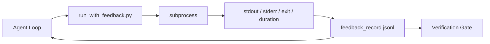

# 运行时反馈循环

> 看不到真实命令输出的智能体只能靠猜。反馈运行器（feedback runner）会把 stdout、stderr、退出码和耗时捕获成一条结构化记录，供下一轮读取。这样智能体就能基于事实做出反应，而不是基于自己对事实的预测。

**Type:** Build
**Languages:** Python (stdlib)
**Prerequisites:** Phase 14 · 32 (Minimal Workbench), Phase 14 · 35 (Init Script)
**Time:** ~50 minutes

## 学习目标

- 区分运行时反馈（runtime feedback）与可观测性遥测（observability telemetry）。
- 构建一个反馈运行器：封装 shell 命令并持久化结构化记录。
- 对大体积输出做确定性截断，让循环始终维持在 token 预算之内。
- 在反馈缺失时拒绝推进循环。

## 问题背景

智能体说"正在运行测试"。下一条消息说"所有测试通过"。而现实是：根本没有测试运行过。要么是智能体凭空想象了输出，要么是它运行了命令却从未读取结果，要么是它读取了结果却悄悄截掉了那行失败信息。

反馈运行器消除了这个落差。每条命令都经过运行器执行。每条记录都携带命令本身、捕获到的 stdout 和 stderr、退出码、真实耗时（wall-clock duration），以及智能体写下的一行备注。智能体在下一轮读取这条记录。验证关卡（verification gate）在任务结束时读取全部记录。

## 核心概念



### 反馈记录里有什么

| 字段 | 为什么重要 |
|-------|----------------|
| `command` | 精确的 argv，避免 shell 展开带来的意外 |
| `stdout_tail` | 最后 N 行，确定性截断 |
| `stderr_tail` | 最后 N 行，与 stdout 分开存放 |
| `exit_code` | 无歧义的成功信号 |
| `duration_ms` | 暴露缓慢的探测和失控的进程 |
| `started_at` | 用于回放的时间戳 |
| `agent_note` | 智能体写下的一行预期说明 |

### 截断是确定性的

一份 50 MB 的日志会摧毁整个循环。运行器对头部和尾部进行截断，并插入 `...truncated N lines...` 标记，整个过程是确定性的：同样的输出永远产生同样的记录。不做采样；智能体需要看到的部分（最终错误、最终摘要）保留在尾部。

### 反馈与遥测的区别

遥测（Phase 14 · 23，OTel GenAI 约定）面向跨时间回顾运行情况的人类运维者。反馈面向本次运行的下一轮。两者字段有重叠，但存放在不同文件中，保留策略也不同。

### 没有反馈就拒绝推进

如果运行器在捕获退出码之前出错，记录会携带 `exit_code: null` 和 `error: <reason>`。智能体循环必须拒绝在 `exit_code` 为 `null` 时声称成功。没有退出码，就没有进展。

## 从零实现

`code/main.py` 实现了：

- `run_with_feedback(command, agent_note)`：封装 `subprocess.run`，捕获 stdout/stderr/退出码/耗时，确定性截断，并追加写入 `feedback_record.jsonl`。
- 一个小型加载器，把 JSONL 流式读入一个 Python 列表。
- 一个演示程序，运行三条命令（成功、失败、缓慢）并打印每条命令的最后一条记录。

运行方式：

```
python3 code/main.py
```

输出：三条反馈记录追加到 `feedback_record.jsonl`，每条命令的最后一条记录内联打印出来。多次重跑后 tail 这个文件，可以看到循环在不断累积记录。

## 实战中的生产模式

三个模式能把这个运行器加固到可以上线的程度。

**在写入时脱敏，而不是在读取时。** 任何接触 stdout 或 stderr 的记录都可能泄露密钥。运行器在 JSONL 追加之前内置一道脱敏处理：剔除匹配 `^Bearer `、`password=`、`api[_-]?key=`、`AKIA[0-9A-Z]{16}`（AWS）、`xox[baprs]-`（Slack）的行。读取时脱敏是个隐患——攻击者拿到的正是磁盘上的那个文件。每季度根据生产运行时观察到的密钥格式审计一次脱敏规则。

**轮转策略，而不是单个文件。** 把 `feedback_record.jsonl` 限制在每个文件 1 MB；溢出时轮转为 `.1`、`.2`，丢弃 `.5`。智能体的循环只读取当前文件，因此运行时开销是有界的。CI 工件存储保留完整的轮转文件集。没有轮转，这个文件会成为每次加载器调用的瓶颈。

**为重试链记录父命令 id。** 每条记录都有 `command_id`；重试记录携带 `parent_command_id`，指向上一次尝试。审阅者的"失败尝试"列表（Phase 14 · 40）和验证关卡的审计都会沿着这条链追溯。没有这个关联，重试看起来就像彼此独立的成功，审计也会掩盖失败历史。

## 生产实践

生产中的应用模式：

- **Claude Code 的 Bash 工具。** 该工具已经捕获了 stdout、stderr、退出码和耗时。本课的运行器是它的框架无关等价物，适用于任何智能体产品。
- **LangGraph 节点。** 用运行器封装任何 shell 节点，让记录在图状态之外持久化。
- **CI 日志。** 把 JSONL 接入你的 CI 工件存储；审阅者无需重跑会话就能回放任意命令。

这个运行器是一层薄封装，却能在每次框架迁移中存活下来，因为记录的格式由它自己掌控。

## 交付产物

`outputs/skill-feedback-runner.md` 用于生成项目专属的 `run_with_feedback.py`，带有合适的截断预算、一个接入工作台的 JSONL 写入器，以及一个智能体每轮都会读取的加载器。

## 练习

1. 为每条记录添加 `cwd` 字段，使同一条命令在不同目录下运行时可以区分。
2. 添加一道 `redaction` 步骤，剔除匹配 `^Bearer ` 或 `password=` 的行。在一条固定的测试记录上验证。
3. 通过轮转为 `.1`、`.2` 文件，把 `feedback_record.jsonl` 的总大小限制在 1 MB。为你的轮转策略给出论证。
4. 添加 `parent_command_id`，让重试链可见：哪条命令产生的输出被下一条命令消费。
5. 把 JSONL 接入一个小型 TUI，高亮最近一次非零退出。列出这个 TUI 要在评审中真正有用必须展示的八个关键特性。

## 关键术语

| 术语 | 人们怎么说 | 实际含义 |
|------|----------------|------------------------|
| 反馈记录（feedback record） | "运行日志" | 包含命令、输出、退出码、耗时的结构化 JSONL 条目 |
| 尾部截断（tail truncation） | "裁剪日志" | 确定性的头部+尾部捕获，使记录控制在 token 预算内 |
| 空值拒绝（refuse-on-null） | "数据缺失就阻塞" | 当 `exit_code` 为 null 时循环绝不能推进 |
| 智能体备注（agent note） | "预期标签" | 智能体在读取结果之前写下的一行预测 |
| 反馈/遥测分离（telemetry split） | "两份日志文件" | 反馈给下一轮用，遥测给运维者用 |

## 延伸阅读

- [OpenTelemetry GenAI semantic conventions](https://opentelemetry.io/docs/specs/semconv/gen-ai/)
- [Anthropic, Effective harnesses for long-running agents](https://www.anthropic.com/engineering/effective-harnesses-for-long-running-agents)
- [Guardrails AI x MLflow — deterministic safety, PII, quality validators](https://guardrailsai.com/blog/guardrails-mlflow) — 把脱敏规则当作回归测试
- [Aport.io, Best AI Agent Guardrails 2026: Pre-Action Authorization Compared](https://aport.io/blog/best-ai-agent-guardrails-2026-pre-action-authorization-compared/) — 工具调用前/后的捕获
- [Andrii Furmanets, AI Agents in 2026: Practical Architecture for Tools, Memory, Evals, Guardrails](https://andriifurmanets.com/blogs/ai-agents-2026-practical-architecture-tools-memory-evals-guardrails) — 可观测性的各个切面
- Phase 14 · 23 — 遥测侧的 OTel GenAI 约定
- Phase 14 · 24 — 智能体可观测性平台（Langfuse、Phoenix、Opik）
- Phase 14 · 33 — 宣告完成之前必须有反馈的规则
- Phase 14 · 38 — 读取这份 JSONL 的验证关卡
