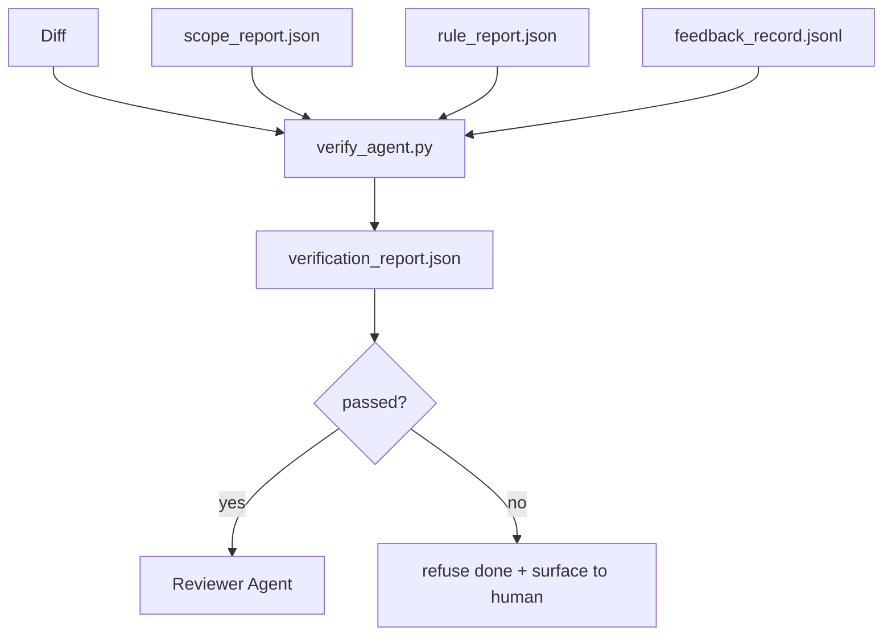

# 验证关卡

> 智能体无权把自己的工作标记为完成。验证关卡（verification gate）会读取范围契约、反馈日志、规则报告和 diff，回答一个唯一的问题：这个任务真的完成了吗？只要关卡说不，任务就没有完成，无论聊天里说了什么。

**Type:** Build
**Languages:** Python (stdlib)
**Prerequisites:** Phase 14 · 33 (Rules), Phase 14 · 36 (Scope), Phase 14 · 37 (Feedback)
**Time:** ~55 minutes

## 学习目标

- 把验证关卡定义为作用于工作台产物之上的确定性函数。
- 将规则报告、范围报告、反馈记录和 diff 综合成一个最终裁决。
- 输出一份评审智能体和 CI 都能读取的 `verification_report.json`。
- 凡有 block 级失败，一律拒绝推进任务，没有例外。

## 问题背景

智能体太容易宣称成功了。三种失败形态最为常见：

- "看起来没问题。"模型读了一遍自己的 diff，然后认定它是对的。
- "测试通过了。"说得言之凿凿，却没有任何测试实际运行过的记录。
- "验收达标。"验收标准被宽松解读到足以把"任何看起来像完成的东西"都算作完成。

工作台的解法是设置一个统一的验证关卡：它读取智能体已经产出的各项产物，由它来做裁决。关卡是确定性的。关卡纳入版本控制。关卡接入 CI。智能体无法贿赂它。

## 核心概念



### 关卡检查什么

| 检查项 | 来源产物 | 严重级别 |
|-------|-----------------|----------|
| 所有验收命令都已运行 | `feedback_record.jsonl` | block |
| 所有验收命令退出码均为零 | `feedback_record.jsonl` | block |
| 范围检查没有禁止写入 | `scope_report.json` | block |
| 范围检查没有越界写入 | `scope_report.json` | block 或 warn |
| 所有 block 级规则全部通过 | `rule_report.json` | block |
| 反馈记录中没有 `null` 退出码 | `feedback_record.jsonl` | block |
| 改动文件与 `scope.allowed_files` 匹配 | 两者 | warn |

`warn` 级发现会在裁决中加注说明；`block` 级发现则阻止 `passed: true`。

### 确定性，而非概率性

对同一组产物，关卡每次必须给出相同的裁决。不用 LLM 裁判。LLM 裁判属于评审侧（Phase 14 · 39），那里的目标是定性评估，而不是判定状态。

### 一份报告，一条路径

每次任务收尾，关卡只输出一份 `verification_report.json`，写入 `outputs/verification/<task_id>.json`。CI 消费的是同一路径。多个关卡各写各的路径，就会让事实来源（source of truth）分叉。

### 拒绝即拒绝，没有例外

block 级发现不能由智能体推翻。只能由人来推翻，并且要记录 `override_reason` 和 `overridden_by` 用户 id。这次推翻是一笔签名变更，而不是智能体的决定。

## 从零实现

`code/main.py` 实现了：

- 每种输入产物的加载器，全部用本地桩数据实现，使本课自包含。
- 一个 `verify(task_id, artifacts) -> VerdictReport` 纯函数。
- 一个打印器，逐项展示检查结果和最终的通过/不通过。
- 一个演示，包含三个任务场景：干净通过、范围蔓延、缺失验收。

运行：

```
python3 code/main.py
```

输出：三份裁决报告，各自保存在脚本旁边。

## 实战中的生产模式

四种模式把关卡从"又一个 lint 任务"提升为"最终裁决边界"。

**纵深防御，而非单一关卡。** pre-commit 钩子 → CI 状态检查 → 工具调用前鉴权钩子 → 合并前关卡。每一层都是确定性的，所以一层漏掉的失败会被下一层捕获。microservices.io 2026 年 3 月的 playbook 说得很明确：pre-commit 钩子之所以不可绕过，是因为它不像模型侧技能那样依赖智能体遵守指令。验证关卡位于 CI / 合并前这一层。

**确定性检查作防线，模型裁判只管细微之处。** Anthropic 2026 年的 Hybrid Norm 配对：可验证奖励（单元测试、schema 检查、退出码）回答"代码解决问题了吗？"——LLM 评分细则回答"代码是否可读、安全、合乎风格？"关卡跑前一类；评审者（Phase 14 · 39）跑后一类。把两者混在一起会让信号坍塌。

**签名的覆盖日志，而非 Slack 讨论串。** 每次推翻都会向 `outputs/verification/overrides.jsonl` 写入一行记录，包含：时间戳、发现项代码、理由、签名用户、当前 HEAD commit。运行时拒绝任何缺少签名的推翻操作；审计轨迹由 git 跟踪。这就是真正的推翻策略与推翻表演之间的分界线。

**覆盖率下限作为一等检查项。** 一份 `coverage_report.json` 喂给 `coverage_floor`（默认 80%）检查。如果实测覆盖率跌破下限，或比上次合并的下限低超过 1 个百分点，关卡即判失败。没有这项检查，智能体会悄悄删掉失败的测试，而验证报告依然一片绿。

**`--strict` 模式把 warn 升级为 block。** 对发布分支、阻断发版的 PR 或事故后排查，`--strict` 会把每个警告变成硬性失败。该标志按分支自愿启用，而不是全局默认，因为对一切都从严会侵蚀日常的工作流。

## 生产实践

生产模式：

- **CI 步骤。** 一个 `verify_agent` 作业用智能体的最终产物运行关卡。合并保护在没有 `passed: true` 时拒绝合并。
- **交接前钩子。** 智能体运行时在生成交接文档前调用关卡。没有绿色裁决，就没有交接。
- **人工排查。** 当智能体宣称成功而有人怀疑时，运维人员阅读这份报告。

关卡是工作台流程中的最终裁决边界。其余每一个环节都在它的上游。

## 交付产物

`outputs/skill-verification-gate.md` 把关卡接入一个具体项目：哪些验收命令喂给它、哪些规则是 block 级、哪些越界写入可以容忍、推翻审计日志如何存储。

## 练习

1. 增加一项 `coverage_floor` 检查：测试命令必须产出覆盖率至少 80% 的覆盖率报告。决定由哪个产物携带这个下限值。
2. 支持 `--strict` 模式，把每个 `warn` 升级为 `block`。写明哪些情况下严格模式才是正确的默认值。
3. 让关卡在 JSON 之外再生成一份 Markdown 摘要。论证哪些字段应该进入摘要。
4. 增加一项 `time_since_last_human_touch` 检查：任何在人类按键后 60 秒内被编辑的文件都免于越界标记。
5. 用你产品里真实的智能体 diff 跑一遍关卡。多少发现是真问题，多少是噪声？关卡还需要在哪里补强？

## 关键术语

| 术语 | 大家怎么说 | 实际含义 |
|------|----------------|------------------------|
| 验证关卡（verification gate） | "拦住事情的那道检查" | 作用于工作台产物的确定性函数，产出通过/不通过裁决 |
| block 级别 | "硬性失败" | 阻止 `passed: true` 且需要签名推翻的发现项 |
| 覆盖日志（override log） | "我们为什么放行" | 带理由和用户 id 的签名条目，由评审审计 |
| 验收命令 | "证据" | 一条 shell 命令，其零退出码就是 `done` 的定义 |
| 单一报告路径 | "事实来源" | `outputs/verification/<task_id>.json`，CI 与人共同消费 |

## 延伸阅读

- [Anthropic, Harness design for long-running application development](https://www.anthropic.com/engineering/harness-design-long-running-apps)
- [OpenAI Agents SDK guardrails](https://platform.openai.com/docs/guides/agents-sdk/guardrails)
- [microservices.io, GenAI dev platform: guardrails](https://microservices.io/post/architecture/2026/03/09/genai-development-platform-part-1-development-guardrails.html) — pre-commit 与 CI 之间的纵深防御
- [ICMD, The 2026 Playbook for Agentic AI Ops](https://icmd.app/article/the-2026-playbook-for-agentic-ai-ops-guardrails-costs-and-reliability-at-scale-1776661990431) — 审批关卡阶梯（草稿 → 审批 → 阈值内自动）
- [Type-Checked Compliance: Deterministic Guardrails (arXiv 2604.01483)](https://arxiv.org/pdf/2604.01483) — 以 Lean 4 作为确定性关卡的上界
- [logi-cmd/agent-guardrails — merge gate spec](https://github.com/logi-cmd/agent-guardrails) — 范围 + 变异测试关卡
- [Guardrails AI x MLflow](https://guardrailsai.com/blog/guardrails-mlflow) — 把确定性校验器用作 CI 评分器
- [Akira, Real-Time Guardrails for Agentic Systems](https://www.akira.ai/blog/real-time-guardrails-agentic-systems) — 工具调用前后关卡
- Phase 14 · 27 — 提示注入防御（关卡的对抗性搭档）
- Phase 14 · 36 — 本关卡所执行的范围契约
- Phase 14 · 37 — 本关卡所评分的反馈日志
- Phase 14 · 39 — 关卡交接给的评审智能体
