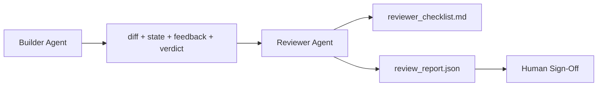

# 评审智能体：让构建者与评分者分离

> 写代码的智能体不能给自己的代码打分。评审者（reviewer）是第二个循环，使用不同的系统提示词、追求不同的目标，并且对构建者产出的一切只有只读权限。构建者与评审者之间的这道间隔，正是大部分可靠性的来源。

**Type:** Build
**Languages:** Python (stdlib)
**Prerequisites:** Phase 14 · 38 (Verification Gate)
**Time:** ~55 minutes

## 学习目标

- 说明为什么同一个智能体无法可靠地评审自己的工作。
- 构建一个评审智能体循环：读取构建者的产物，输出结构化的评审报告。
- 编写一份评审量规（rubric），对具体维度打分，而不是凭感觉。
- 把评审者接入工作台，让人工评审环节从一份真实的产物开始，而不是从零开始。

## 问题背景

你让智能体修一个 bug。它改了四个文件，跑了测试，报告说完成了。验证关卡（Phase 14 · 38）确认验收命令执行过、范围也没越界。关卡给出 `passed: true`。你合并了代码。两天后你发现，这次修复只解决了 bug 错误的那一半。

验收是必要条件，但不是充分条件。评审者要问的是验收无法回答的问题：这次改动解决的是正确的问题吗？它有没有在未声明的情况下扩大范围？那些本该被质疑的假设有没有被记录下来？工作台是否留在了下一个会话可以顺利接手的状态？

## 核心概念



### 评审量规

五个维度，每个维度按 0 到 2 分打分。

| 维度 | 问题 |
|-----------|----------|
| 问题契合度 | 改动解决的是任务原本陈述的问题，还是一个相近但不同的问题？ |
| 范围纪律 | 编辑是否限定在契约之内？如果扩大了契约，是不是有意为之并明确声明？ |
| 假设记录 | 所有隐藏假设是否都写在了可供评审的地方？ |
| 验证质量 | 验收命令是否真正证明了目标，还是只证明了一个弱化版本？ |
| 交接就绪度 | 下一个会话能否从当前状态干净地接手？ |

总分 10 分。低于 7 分为软失败（soft fail）；低于 5 分为硬失败（hard fail）。

### 评审者是一个独立角色，而不是一个独立模型

评审者可以和构建者使用同一个模型。纪律体现在角色分离上：不同的系统提示词、不同的输入、对 diff 没有写权限。立场的转变就是信号的转变。

### 评审者不能修改 diff

评审者读取 diff、状态、反馈和判定结果。它输出一份报告。它不会去修补 diff。如果报告说"修复这个问题"，那由下一个构建者回合来执行修复；评审者继续回到评审岗位。混淆角色就破坏了这道间隔。

### 评审量规与验证关卡的区别

关卡（Phase 14 · 38）检查的是确定性事实：验收命令是否执行、规则是否通过、范围是否守住。评审者做的是定性判断：这是不是该做的工作、有没有文档记录、交接是否可用。两者缺一不可。

## 从零实现

`code/main.py` 实现了：

- 一个 `ReviewerInputs` 数据类，打包评审者要读取的产物。
- 一个量规打分器，每个维度对应一个函数。本课中每个函数都是确定性的桩实现（stub）；真实实现会调用 LLM。
- 一个 `review_report.json` 写入器，包含五项得分、总分和判定结果（`pass`、`soft_fail`、`hard_fail`）。
- 两个演示用例：一次干净的改动，和一次"测试没错、问题改错了"的改动。

运行：

```
python3 code/main.py
```

输出：两份写入磁盘的评审报告，以及一张打印在控制台的各维度得分表。

## 生产环境中的实践模式

实证数据：Cloudflare 2026 年 4 月的 AI Code Review 系统在 30 天内，对 5,169 个仓库中的 48,095 个合并请求执行了 131,246 次评审。评审完成时间的中位数是 3 分 39 秒。最多七个专项评审者（安全、性能、代码质量、文档、发布管理、合规、Engineering Codex）在一个 Review Coordinator 之下并行运行，由协调者对发现去重并判定严重程度。最高档的模型只保留给协调者使用；专项评审者运行在更便宜的档位上。

让这套系统在规模化下成立的有四个模式。

**专项评审者池，而不是一个大而全的评审者。** 对单人维护的仓库，一个带五维度量规的评审者就够了。一旦代码库出现安全敏感面、性能敏感面和文档面，就要拆分成提示词更小的专项评审者。协调者负责去重；专项评审者从不跑完整量规。模型档位的分离也随之自然形成：便宜的专项评审者，昂贵的协调者。

**把偏差缓解当作设计要求，而不是后期优化。** LLM 评判者存在四种可复现的偏差（Adnan Masood，2026 年 4 月）：位置偏差（GPT-4 在 (A,B) 与 (B,A) 顺序上约 40% 不一致）、冗长偏差（更长的输出约有 15% 的分数虚高）、自我偏好（评判者偏爱同一模型家族的输出）、权威偏差（评判者对引用知名作者的内容评分偏高）。缓解措施：对两种顺序都评估，只统计两次一致的胜出；使用明确奖励简洁性的 1-4 分量表；在不同模型家族之间轮换评判者；评分前去掉作者署名。

**校准集，而不是凭感觉。** 准备一个包含 10-20 个历史任务、已知正确判定结果的集合。每次修改提示词后都在它上面重跑评审者。如果与历史记录的一致率低于 80%，量规就必须先修订，评审者才能上线。每个团队最终都会重新发现这条经验；不如一开始就这么做。

**与关卡形成混合规范。** 验证关卡（Phase 14 · 38）负责确定性检查（验收命令是否执行、测试是否通过、范围是否守住）。评审者负责语义检查（这是不是该做的工作、假设是否有记录、交接是否可用）。Anthropic 2026 年的指南对这种分工说得很明确：不要让评审者重复证明关卡已经证明过的事。

## 生产实践

生产模式：

- **Claude Code 子智能体。** 在构建者关闭任务后，由一个评审子智能体运行，把量规得分以评论形式发到 PR 上。
- **OpenAI Agents SDK 交接（handoff）。** 任务完成时构建者交接给评审者。评审者可以带着一份发现清单交回构建者，或上报给人类。
- **双模型配对。** 构建者运行在更快更便宜的模型上。评审者运行在更强的模型上，使用更小的上下文，专注于判断。

当人类无法亲自完成每一次评审时，评审者就是工作台长出的第二双眼睛。

## 交付产物

`outputs/skill-reviewer-agent.md` 会生成一份项目专属的评审量规、一个接到构建者产物上的评审智能体桩实现，以及与验证关卡的集成，让人工评审从一份写好的报告开始，而不是从一张白纸开始。

## 练习

1. 增加一个针对你的产品领域的第六个维度。论证它为什么不能被现有五个维度吸收。
2. 用两种不同的系统提示词（简洁版、详尽版）运行评审者。哪一种产出的报告更可能被人类读完？
3. 给每个维度加一个 `confidence` 字段。当最低维度的置信度低于 0.6 时，拒绝发布报告。
4. 构建一个校准集：10 份已知正确判定结果的历史任务收尾记录。在它们上面运行评审者。它在哪些地方与历史记录不一致？
5. 增加一个"索取更多证据"的机制：评审者可以在打分前要求构建者执行某个特定的测试。怎样设计回退（back-off）策略才能避免无限循环？

## 关键术语

| 术语 | 人们的叫法 | 实际含义 |
|------|----------------|------------------------|
| 评审量规 | "检查清单" | 五个维度、每项 0-2 分的打分体系，每个维度配一条写明的问题 |
| 软失败 | "需要修改" | 总分低于 7；构建者收到待处理的发现清单 |
| 硬失败 | "拒绝" | 总分低于 5 或任一维度为 0；停止并上报给人类 |
| 角色分离 | "换个提示词" | 同一个模型可以扮演两个角色；纪律在于输入和立场 |
| 置信度下限 | "别发布低信号报告" | 当量规结果不确定时，拒绝给出判定 |

## 延伸阅读

- [OpenAI Agents SDK handoffs](https://platform.openai.com/docs/guides/agents-sdk/handoffs)
- [Anthropic Claude Code subagents](https://docs.anthropic.com/en/docs/agents-and-tools/claude-code/sub-agents)
- [Cloudflare, Orchestrating AI Code Review at Scale](https://blog.cloudflare.com/ai-code-review/) — 7 个专项评审者 + 协调者的架构，30 天 13.1 万次评审
- [Agent-as-a-Judge: Evaluating Agents with Agents (OpenReview / ICLR)](https://openreview.net/forum?id=DeVm3YUnpj) — DevAI 基准，366 条层级化解决方案需求
- [Adnan Masood, Rubric-Based Evaluations and LLM-as-a-Judge: Methodologies, Biases, Empirical Validation](https://medium.com/@adnanmasood/rubric-based-evals-llm-as-a-judge-methodologies-and-empirical-validation-in-domain-context-71936b989e80) — 四种偏差及其缓解措施
- [MLflow, LLM-as-a-Judge Evaluation](https://mlflow.org/llm-as-a-judge) — 构建者/评估者分离的生产工具链
- [LangChain, How to Calibrate LLM-as-a-Judge with Human Corrections](https://www.langchain.com/articles/llm-as-a-judge) — 校准集工作流
- [Evidently AI, LLM-as-a-judge: a complete guide](https://www.evidentlyai.com/llm-guide/llm-as-a-judge)
- [Arize, LLM as a Judge — Primer and Pre-Built Evaluators](https://arize.com/llm-as-a-judge/)
- Phase 14 · 05 — Self-Refine 与 CRITIC（单智能体自我评审基线）
- Phase 14 · 30 — 评测驱动的智能体开发（校准集生成器）
- Phase 14 · 38 — 评审者所读取的验证关卡
- Phase 14 · 40 — 评审报告所汇入的交接包
