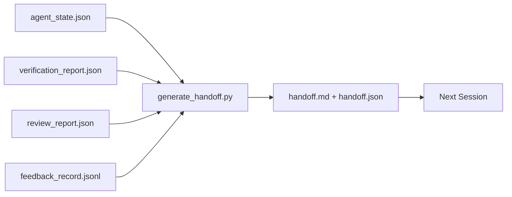

# 多会话交接

> 会话即将结束，但工作不会。交接包（handoff packet）正是那个把「智能体干了一个小时」变成「下一个会话第一分钟就能高效推进」的产物。要有意识地构建它，而不是事后才想起来补。

**Type:** Build
**Languages:** Python (stdlib)
**Prerequisites:** Phase 14 · 34 (Repo Memory), Phase 14 · 38 (Verification), Phase 14 · 39 (Reviewer)
**Time:** ~50 minutes

## 学习目标

- 识别每个交接包必备的七个字段。
- 从工作台产物自动生成交接包，而不是手写文字总结。
- 把庞大的反馈日志裁剪成适合交接包的摘要。
- 让下一个会话的第一步行动具有确定性。

## 问题背景

会话结束了。智能体说「很好，我们取得了进展」。下一个会话打开，下一个智能体问「我们上次进行到哪儿了？」第一个智能体的回答已经不在了。于是下一个智能体重新摸索、重新运行同样的命令、向人类重复提出同样的问题，花三十分钟才恢复到上一个会话最后三十秒的状态。

糟糕交接的代价，会在任务存续期间的每一个会话里反复支付。解决办法是在会话结束时自动生成一个交接包：改了什么、为什么改、尝试过什么、什么失败了、还剩什么、下次第一步做什么。

## 核心概念



### 每个交接包必备的七个字段

| 字段 | 它回答的问题 |
|-------|---------------------|
| `summary` | 用一段话概括做了什么 |
| `changed_files` | 一眼看清改动范围 |
| `commands_run` | 实际执行了哪些命令 |
| `failed_attempts` | 尝试过什么、为什么没有成功 |
| `open_risks` | 下个会话可能踩到的坑，附严重程度 |
| `next_action` | 下个会话要执行的第一个具体步骤 |
| `verdict_pointer` | 指向验证报告与评审报告的路径 |

`next_action` 是承重字段。一份只缺 `next_action`、其他都齐全的交接包，是状态报告，不是交接。

### 交接包是生成的，不是手写的

手写的交接，在艰难的一天里会被跳过。生成器读取工作台产物并输出交接包。智能体的职责是把工作台留在生成器能够总结的状态，而不是亲自去写总结。

### 两种形态：人类可读与机器可读

`handoff.md` 给人读，`handoff.json` 给下一个智能体加载。两者来自同一批源产物。如果两者出现分歧，以 JSON 为准。

### 反馈日志裁剪

完整的 `feedback_record.jsonl` 可能有几百条记录。交接包只携带最后 K 条，外加所有退出码非零的条目。下一个会话如有需要可以加载完整日志，但交接包本身保持小巧。

### 留下干净的状态

交接描述工作内容，干净的状态让工作可以续接，两者并不是一回事。如果下一个会话打开后面对的是应用了一半的 diff、智能体忘了删的临时文件、一个游离的分支、以及还没开始跑就报错的测试，那么再完美的 `handoff.md` 也一文不值。下一个智能体会把开场十分钟花在替上一个收拾残局，而不是继续构建，而且这笔代价会在任务存续期间的每个会话里不断累加。

所以会话并不在功能跑通时结束，而是在工作台进入「生成器能总结、下一个会话能信任」的状态时才结束。清理是一个独立的阶段，在交接之前执行；它是一项检查，而不是一种习惯，因为习惯正是艰难的一天里会被跳过的东西。

| 检查项 | 干净意味着 | 脏状态造成阻塞的原因 |
|-------|-------------|----------------------|
| 工作树 | 所有改动要么已提交，要么显式 stash 并附说明 | 应用一半的 diff 会被下一个智能体当成有意为之的工作 |
| 临时产物 | 没有遗留 `*.tmp`、草稿目录、调试打印或注释掉的代码块 | 杂散文件会污染 diff 和下一个智能体的心智模型 |
| 测试 | 全绿，或虽红但失败原因已写进 `open_risks` | 无人提及的红色测试是下个会话会一脚踩进去的陷阱 |
| 功能看板 | `feature_list.json` 的状态与现实一致（Phase 14 · 36） | 过期的看板会把下个会话派去做已经完成的工作 |
| 分支 | 位于预期分支，没有 detached HEAD，没有孤儿分支 | 分支不对意味着下个会话的第一个提交会落到错误的地方 |

清理阶段会输出一份记录阻塞问题的 `clean_state.json`；该列表为空，是交接生成器在写出交接包之前断言的前置条件。建立在脏工作树上的交接不是交接，而是一团被转手出去的烂摊子。这两个产物互相配对：清理证明工作台可以安全离开，交接证明下个会话知道从哪里开始。

## 从零实现

`code/main.py` 实现了：

- 一个加载器，把状态、验证结论、评审和反馈汇总成单个 `WorkbenchSnapshot`。
- 一个 `generate_handoff(snapshot) -> (markdown, payload)` 函数。
- 一个过滤器，挑出最后 K 条反馈条目以及所有退出码非零的条目。
- 一段演示运行，在脚本旁边写出 `handoff.md` 和 `handoff.json`。

运行：

```
python3 code/main.py
```

输出：打印出的交接正文，外加磁盘上的两个文件。

## 业界生产模式

Codex CLI、Claude Code 和 OpenCode 各自实现了不同的上下文压缩（compaction）方案；结构化交接包则架在这三者之上。

**压缩策略各不相同，交接包的 schema 不变。** Codex CLI 的 POST /v1/responses/compact 是服务端的不透明 AES 数据块（OpenAI 模型的快速路径）；回退方案是把本地生成的「交接摘要」以 `_summary` user 角色消息的形式追加进去。Claude Code 在上下文用量达到 95% 时执行五阶段渐进式压缩。OpenCode 采用基于时间戳的消息隐藏，外加一份由 LLM 生成、含 5 个标题的摘要。三种机制不同，需求相同：把必须在压缩中存活的内容序列化为一个可移植的产物。交接包就是这个产物。

**新会话交接不等于压缩。** 压缩是延长一个会话；交接是干净地关闭一个会话并开始下一个。Hermes Issue #20372（2026 年 4 月）的提法是对的：当就地压缩开始劣化时，智能体应该写一份紧凑的交接、结束会话、在全新上下文中继续。交接包正是让这次切换变得廉价的东西。错误做法是一直压缩直到质量崩溃；正确做法是为提前、干净的交接预留预算。

**每个分支和主题只保留一个活跃交接。** 多智能体协同的崩溃更多源自过期的交接，而不是糟糕的模型输出。务必包含 `branch`、`last_known_good_commit`，以及取值为 `active | superseded | archived` 的 `status`。过期的交接被归档；只有活跃的那一个驱动下一个会话。这正是「交接当笔记」与「交接当状态」之间的差别。

**在上下文用到 50-75% 之前收尾，而不是顶到上限。** 手写模式实践手册（CLAUDE.md + HANDOVER.md）报告称，会话在 50-75% 上下文预算时结束，效果优于撑到 95%。交接包生成器要在压缩伪影污染源状态之前干净地运行。上下文完整时写交接很便宜；模型已经开始迷失方向时再写就很昂贵。

## 生产实践

生产模式：

- **会话结束钩子。** 运行时在用户关闭聊天时触发生成器。交接包写入 `outputs/handoff/<session_id>/`。
- **PR 模板。** 生成器输出的 markdown 同时可以作为 PR 正文。评审者不必打开另外五个文件就能读完。
- **跨智能体交接。** 用一个产品（Claude Code）构建，用另一个（Codex）继续。交接包就是通用语（lingua franca）。

交接包小巧、规整、生成成本低。节省的成本随每个会话不断累积。

## 交付产物

`outputs/skill-handoff-generator.md` 产出一个针对项目产物路径调校的生成器、一个运行它的会话结束钩子，以及一份下一个智能体在启动时读取的 `handoff.json` schema。

## 练习

1. 增加一个 `assumptions_to_validate` 字段，列出构建者记录过、但评审者打分未超过 1 分的每一条假设。
2. 对失败运行与通过运行采用不同的反馈摘要裁剪方式，并为这种不对称性给出论证。
3. 加入一份「留给人类的问题」清单。一个问题要满足什么门槛才应进入交接包，而不是作为聊天消息发出？
4. 让生成器具备幂等性：运行两次产生完全相同的交接包。要做到这一点，哪些东西必须保持稳定？
5. 增加一个「下一会话前置条件」小节，精确列出下一个会话在行动之前必须加载的产物。

## 关键术语

| 术语 | 常见说法 | 实际含义 |
|------|----------------|------------------------|
| 交接包（Handoff packet） | 「会话总结」 | 携带七个字段的生成产物，同时有 markdown 和 JSON 两种形态 |
| 下一步行动（Next action） | 「第一件要做的事」 | 启动下一个会话的那个唯一具体步骤 |
| 反馈裁剪（Feedback trim） | 「日志摘要」 | 最后 K 条记录加上所有退出码非零的条目 |
| 状态报告（Status report） | 「我们做了什么」 | 缺少 `next_action` 的文档；有用，但不是交接 |
| 结论指针（Verdict pointer） | 「凭据」 | 指向验证报告与评审报告的路径，用于可追溯性 |

## 延伸阅读

- [Anthropic, Effective harnesses for long-running agents](https://www.anthropic.com/engineering/effective-harnesses-for-long-running-agents)
- [OpenAI Agents SDK handoffs](https://platform.openai.com/docs/guides/agents-sdk/handoffs)
- [Codex Blog, Codex CLI Context Compaction: Architecture, Configuration, Managing Long Sessions](https://codex.danielvaughan.com/2026/03/31/codex-cli-context-compaction-architecture/) — POST /v1/responses/compact 与本地回退方案
- [Justin3go, Shedding Heavy Memories: Context Compaction in Codex, Claude Code, OpenCode](https://justin3go.com/en/posts/2026/04/09-context-compaction-in-codex-claude-code-and-opencode) — 三家厂商的压缩机制对比
- [JD Hodges, Claude Handoff Prompt: How to Keep Context Across Sessions (2026)](https://www.jdhodges.com/blog/ai-session-handoffs-keep-context-across-conversations/) — CLAUDE.md + HANDOVER.md，50-75% 上下文预算
- [Mervin Praison, Managing Handoffs in Multi-Agent Coding Sessions: Fresh Context Without Losing Continuity](https://mer.vin/2026/04/managing-handoffs-in-multi-agent-coding-sessions-fresh-context-without-losing-continuity/) — 分布式系统视角
- [Hermes Issue #20372 — automatic fresh-session handoff when compression becomes risky](https://github.com/NousResearch/hermes-agent/issues/20372)
- [Hermes Issue #499 — Context Compaction Quality Overhaul](https://github.com/NousResearch/hermes-agent/issues/499) — Codex CLI 中面向交接的提示词
- [Microsoft Agent Framework, Compaction](https://learn.microsoft.com/en-us/agent-framework/agents/conversations/compaction)
- [OpenCode, Context Management and Compaction](https://deepwiki.com/sst/opencode/2.4-context-management-and-compaction)
- [LangChain, Context Engineering for Agents](https://www.langchain.com/blog/context-engineering-for-agents)
- Phase 14 · 34 — 生成器读取的状态文件
- Phase 14 · 38 — 交接包指向的验证结论
- Phase 14 · 39 — 打包进交接包的评审报告
