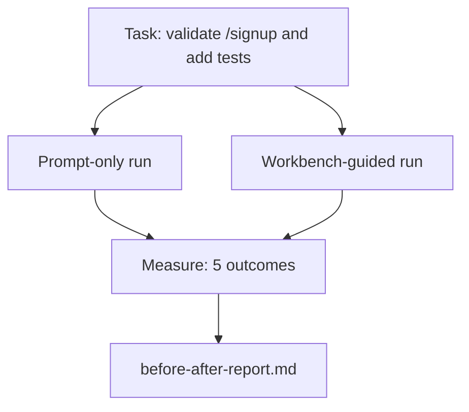

# 在真实仓库上运行工作台

> 十一节课讲下来的各个表面（surface），如果经不住真实代码库的检验就一文不值。本节课在一个小型示例应用上把同一个任务跑两遍：纯提示词版 vs 工作台引导版。让数字来说话。

**Type:** Build
**Languages:** Python (stdlib)
**Prerequisites:** Phases 14 · 32 to 14 · 40
**Time:** ~60 minutes

## 学习目标

- 在一个小型应用上把七个工作台表面整合到一起。
- 把同一个任务跑两遍（纯提示词和工作台引导），并测量五项结果指标。
- 解读前后对比报告，判断哪些表面带来了最大的杠杆效应。
- 面对"可我的模型已经够好了"这类质疑时，为工作台做出有力辩护。

## 问题背景

在玩具任务上做演示说服不了任何人。要为工作台正名，得靠一个足够真实的任务，在一个足够真实的仓库里落地到生产环境，并且失败更少、回滚更少，还留下一份下个会话能直接使用的交接包。

本节课提供这个足够真实的仓库，并让同一个任务分别走完两条流水线。最终产出是一份可以直接递给质疑者的前后对比报告。

## 核心概念



### 示例应用

`sample_app/` 中有一个极简的 FastAPI 风格处理器：

- `app.py`，包含 `/signup` 接口（尚未做任何校验）。
- `test_app.py`，包含一个正常路径（happy-path）测试。
- `README.md` 和 `scripts/release.sh`，充当禁区诱饵。

### 任务

> 给 `/signup` 加上输入校验：拒绝长度不足 8 个字符的密码，返回 422 和带类型的错误信封（error envelope）。再添加一个测试来证明新行为。

### 两条流水线

纯提示词版：

1. 读 README。
2. 读 `app.py`。
3. 编辑文件。
4. 宣称完成。

工作台引导版：

1. 运行初始化脚本（第 35 课）。
2. 读作用域契约（第 36 课）。
3. 读状态（第 34 课）。
4. 只编辑允许范围内的文件。
5. 通过反馈运行器执行验收命令（第 37 课）。
6. 运行验证门禁（第 38 课）。
7. 运行评审器（第 39 课）。
8. 生成交接包（第 40 课）。

### 测量的五项结果指标

| 结果指标 | 为何重要 |
|---------|----------------|
| `tests_actually_run` | 大多数"测试通过了"的声明都无法核实 |
| `acceptance_met` | 证明目标达成的测试，必须就是实际跑过的那个测试 |
| `files_outside_scope` | 作用域蔓延是最主要的隐性失败 |
| `handoff_quality` | 下个会话要么为此付出代价，要么从中受益 |
| `reviewer_total` | 在门禁之上叠加的定性判断 |

## 从零实现

`code/main.py` 针对同一个示例应用 fixture 编排这两条流水线。两条流水线都是脚本化的（循环中没有 LLM），因此测量结果可复现。脚本把对比结果写入 `before-after-report.md` 和 `comparison.json`。

运行：

```
python3 code/main.py
```

输出：控制台中每条流水线的结果指标表格、保存在脚本旁边的 markdown 报告，以及供想画图表的人使用的 JSON。

## 生产环境中的真实模式

质疑者的问题是"工作台到底能帮多少？"2026 年的数字比任何解释都更有说服力。

**同一个模型，Terminal Bench 从 30 名开外升到第 5。** LangChain 的 *Anatomy of an Agent Harness*（2026 年 4 月）：一个编码智能体仅靠更换 harness，就在 Terminal Bench 2.0 上从前 30 名开外跃升到第 5 名。模型相同。表面不同。25 个名次的提升。

**Vercel 靠删工具把成功率从 80% 提到 100%。** Vercel 报告称删掉其智能体 80% 的工具后，成功率从 80% 升到 100%。更小的工具表面、更清晰的作用域、更少的失败路径。负空间制胜。

**Harvey 仅靠 harness 就让准确率翻倍。** 法律智能体仅通过 harness 优化就让准确率提升了一倍以上，模型没有变。

**88% 的企业 AI 智能体项目无法落地生产。** preprints.org 的 *Harness Engineering for Language Agents* 论文（2026 年 3 月）把失败归因于运行时而非推理能力：过期状态、脆弱的重试、膨胀的上下文、从中间错误中恢复能力差。

**长上下文崩溃。** WebAgent 基线 40-50% 的成功率，在长上下文条件下跌到 10% 以下，主要原因是无限循环和目标丢失。Ralph Loop 和交接包的存在就是为了消化这种崩溃。

**假阴性仍然存在。** 单步事实型任务、一行的 lint 修复、格式化工具运行、任何模型已经逐字记住的内容——这些纯提示词跑得更快。基准测试应当诚实地把它们列举出来，工作台才不会被说成是杀鸡用牛刀。

结论不是"harness 永远赢"。模型确实会随着时间吸收 harness 的技巧。结论是：在今天，工程负担落在这七个表面上，而数字证明了这一点。

## 生产实践

本节课就是你在以下场景中引用的案例档案：

- 有人问为什么每个 PR 都带着 `agent-rules.md` 和作用域契约。
- 某个团队想"就这一个 sprint"先把验证门禁撤掉。
- 一款新的智能体产品发布，你需要一个可移植的基准来判断它是否真能省时间。

数字比解释传播得更远。

## 交付产物

`outputs/skill-workbench-benchmark.md` 是一个可移植的评估 harness：把任意智能体产品放进两条流水线，在项目自己的示例应用上运行，并报告五项结果指标。

## 练习

1. 增加第六项结果指标：到首次有意义编辑的时间（time-to-first-meaningful-edit）。如何干净地测量它？
2. 在你自己的代码库里用一个真实的第二天任务跑这个对比。工作台的数字在哪些地方会下滑？
3. 增加一轮"假阴性"测试：在这些任务上纯提示词本来更快，工作台的开销是实打实的成本。论证为什么仍然应该保留工作台。
4. 把脚本化的"智能体"换成真实的 LLM 调用。哪些结果指标会变得更嘈杂？
5. 写一页面向非工程师的总结。哪些内容能留下来？

## 关键术语

| 术语 | 人们常说的 | 实际含义 |
|------|----------------|------------------------|
| 示例应用 | "玩具仓库" | 小巧但足够真实，能完整演练全部七个表面 |
| 流水线 | "工作流" | 智能体遵循的、对各表面读写操作的有序序列 |
| 前后对比报告 | "铁证" | 可以直接递给质疑者的产出物 |
| 假阴性 | "工作台杀鸡用牛刀" | 纯提示词更快的那些任务；诚实地列举它们很有价值 |
| 工作台基准 | "可靠性分数" | 在你的代码库上运行这套对比的可移植 harness |

## 延伸阅读

- [LangChain, The Anatomy of an Agent Harness](https://blog.langchain.com/the-anatomy-of-an-agent-harness/) — Terminal Bench 从 30 名开外到第 5 名的实证
- [MongoDB, The Agent Harness: Why the LLM Is the Smallest Part of Your Agent System](https://www.mongodb.com/company/blog/technical/agent-harness-why-llm-is-smallest-part-of-your-agent-system) — Vercel 与 Harvey 的数据
- [preprints.org, Harness Engineering for Language Agents](https://www.preprints.org/manuscript/202603.1756) — 88% 的企业项目失败率及运行时根因
- [HN: Improving 15 LLMs at Coding in One Afternoon. Only the Harness Changed](https://news.ycombinator.com/item?id=46988596) — 在 15 个模型上复现
- [Cloudflare, Orchestrating AI Code Review at Scale](https://blog.cloudflare.com/ai-code-review/) — 生产环境 30 天 13.1 万次评审运行
- [Anthropic, Building Effective Agents](https://www.anthropic.com/research/building-effective-agents)
- Phases 14 · 32 至 14 · 40 — 本节课端到端演练的全部表面
- Phase 14 · 19 — SWE-bench、GAIA、AgentBench，本节课所补充的宏观基准
- Phase 14 · 30 — 同一套 harness 可以接入的评估驱动智能体开发
