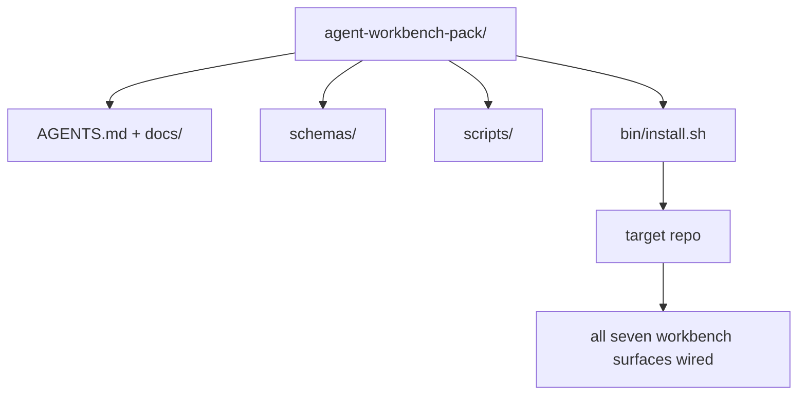

# 毕业项目：交付一个可复用的智能体工作台套件

> 这条迷你课程线以一个可以丢进任何仓库的套件收尾。十一节课讲过的各种工作面，被压缩进一个你可以 `cp -r` 的目录——第二天早上就能让智能体可靠地跑起来。这个毕业项目正是整套课程的核心产出。

**Type:** Build
**Languages:** Python (stdlib)
**Prerequisites:** Phases 14 · 31 to 14 · 41
**Time:** ~75 minutes

## 学习目标

- 把七个工作台工作面（surface）打包进一个可直接放入仓库的目录。
- 固定 schema、脚本和模板的版本，让新仓库拿到一个已知可用的基线。
- 添加一个安装脚本，以幂等方式铺设整个套件。
- 决定哪些内容进套件、哪些不进，并为每一处取舍给出理由。

## 问题背景

一个散落在 Google Doc、聊天记录和三个记不太清的脚本里的工作台，注定每个季度都要重建一次。解药是一个有版本管理的套件：一个仓库或目录，里面装着工作面、schema、脚本，以及一条命令就能完成的安装器。

这节课结束时，你会在磁盘上交付 `outputs/agent-workbench-pack/`，外加一个能把它放进任意目标仓库的 `bin/install.sh`。

## 核心概念



### 套件目录结构

```
outputs/agent-workbench-pack/
├── AGENTS.md
├── docs/
│   ├── agent-rules.md
│   ├── reliability-policy.md
│   ├── handoff-protocol.md
│   └── reviewer-rubric.md
├── schemas/
│   ├── agent_state.schema.json
│   ├── task_board.schema.json
│   └── scope_contract.schema.json
├── scripts/
│   ├── init_agent.py
│   ├── run_with_feedback.py
│   ├── verify_agent.py
│   └── generate_handoff.py
├── bin/
│   └── install.sh
└── README.md
```

### 哪些进套件，哪些不进

进：

- 各工作面的 schema。它们是契约。
- 上面列出的四个脚本。它们是运行时。
- 四份文档。它们是规则和评审标准。

不进：

- 项目专属的任务。任务属于目标仓库的任务板，不属于套件。
- 厂商 SDK 调用。套件与框架无关。
- 入职培训文案。套件应该放在团队现有入职材料的旁边，而不是塞进里面。

### 安装器

一个简短的 `bin/install.sh`（或 `bin/install.py`）：

1. 在没有 `--force` 时拒绝覆盖已存在的套件。
2. 把套件复制进目标仓库。
3. 如果存在 `.github/workflows/`，自动接入 CI。
4. 打印后续步骤：填写任务板、设置验收命令、运行初始化脚本。

### 版本管理

套件携带一个 `VERSION` 文件。需要迁移的 schema 变更和脚本变更提升主版本号；仅改文档则提升补丁版本号。目标仓库的 `agent_state.json` 会记录它初始化时所基于的套件版本。

## 从零实现

`code/main.py` 会在课程目录旁把套件组装进 `outputs/agent-workbench-pack/`，预置了这条迷你课程线前几节课的 schema 与脚本，以及你已经写好的文档。

运行它：

```
python3 code/main.py
```

脚本会复制并固定各个工作面，写入 README，打印套件目录树，并以零退出码结束。重复运行是幂等的。

## 生产环境中的真实模式

只有经得起 fork、更新和不友好的上游折腾，套件才有价值。四个模式让这一点成为可能。

**`VERSION` 是契约，不是营销文案。** 主版本号提升要求做状态迁移。次版本号提升要求重新跑一遍检查器。补丁版本号提升只涉及文档。安装器每次安装都会向目标仓库写入 `.workbench-version`；如果目标仓库的锁定版本与套件的 `VERSION` 不一致，`lint_pack.py` 会拒绝发布。`npm`、`Cargo` 和 `pyproject.toml` 正是靠这一套撑过了十年的变迁；换成智能体，规则也没有任何不同。

**跨工具分发的单一来源。** Nx 提供一条 `nx ai-setup` 命令，从单一配置铺设 `AGENTS.md`、`CLAUDE.md`、`.cursor/rules/`、`.github/copilot-instructions.md` 和一个 MCP 服务器。套件也应该这样做；安装器生成符号链接（`ln -s AGENTS.md CLAUDE.md`），让单一事实来源扇出到每一个编码智能体。为了偏向某个工具而 fork 套件，是一种失败模式。

**遇到非平凡状态就拒绝执行的 `uninstall.sh`。** 卸载套件绝不能删除用户的 `agent_state.json`、`task_board.json` 或 `outputs/`。卸载器只移除 schema、脚本、文档和 `AGENTS.md`（可用 `--keep-agents-md` 选择保留），并在状态文件存在任何未提交变更时拒绝继续。状态属于用户；套件不拥有它。

**技能即可发布物。SkillKit 式分发。** 套件以 SkillKit 技能的形式发布：`skillkit install agent-workbench-pack` 从单一来源把它铺设到 32 个 AI 智能体上。套件仓库是事实来源；SkillKit 是分发渠道。厂商锁定随之瓦解；七个工作面保持不变。

## 生产实践

套件有三种交付方式：

- **作为直接放入仓库的目录。** `cp -r outputs/agent-workbench-pack /path/to/repo`。
- **作为公开模板仓库。** fork 后自行定制，由 `VERSION` 控制漂移。
- **作为 SkillKit 技能。** 接入你的智能体产品，一条命令完成铺设。

套件是菜谱。每次安装是一份出餐。

## 交付产物

`outputs/skill-workbench-pack.md` 生成一个针对项目调优的套件：规则按团队历史打磨，作用域 glob 匹配仓库实际结构，评审标准的维度扩展出一条领域专属条目。

## 练习

1. 决定哪一份可选的第五号文档值得提升进规范套件。为这个取舍给出理由。
2. 用 Python 重写安装器并加上 `--dry-run` 选项。对比它与 bash 版本的使用体验。
3. 添加一个 `bin/uninstall.sh`，安全地移除套件，并在状态文件有非平凡历史时拒绝执行。什么算"非平凡"？
4. 添加一个 `lint_pack.py`，在套件偏离 `VERSION` 时报错。把它接入套件自己仓库的 CI。
5. 撰写从手搓工作台迁移到这个套件的迁移手册。哪种操作顺序能把停机时间降到最低？

## 关键术语

| 术语 | 人们怎么说 | 实际含义 |
|------|----------------|------------------------|
| 工作台套件 | "入门工具包" | 一个携带全部七个工作面、有版本管理的目录 |
| 安装器 | "安装脚本" | 以幂等方式铺设套件的 `bin/install.sh` |
| 套件版本 | "VERSION" | schema/脚本变更提升主版本号，仅改文档提升补丁版本号 |
| 即插即用套件 | "cp -r 就能用" | 第一天就能工作、无需逐仓库定制的套件 |
| 可 fork 模板 | "GitHub 模板" | GitHub "Use this template" 可以直接克隆的公开仓库 |

## 延伸阅读

- Phases 14 · 31 to 14 · 41 — 这个套件打包的全部工作面
- [SkillKit](https://github.com/rohitg00/skillkit) — 把这个技能安装到 32 个 AI 智能体上
- [Nx Blog, Teach Your AI Agent How to Work in a Monorepo](https://nx.dev/blog/nx-ai-agent-skills) — 覆盖六种工具的单一来源生成器
- [agents.md — the open spec](https://agents.md/) — 你的套件路由器必须实现的规范
- [HKUDS/OpenHarness](https://github.com/HKUDS/OpenHarness) — 与套件等价的参考实现
- [andrewgarst/agentic_harness](https://github.com/andrewgarst/agentic_harness) — 基于 Redis、带评测套件的参考实现
- [Augment Code, A good AGENTS.md is a model upgrade](https://www.augmentcode.com/blog/how-to-write-good-agents-dot-md-files) — 套件文档的质量标杆
- [Anthropic, Effective harnesses for long-running agents](https://www.anthropic.com/engineering/effective-harnesses-for-long-running-agents)
- [Anthropic, Harness design for long-running application development](https://www.anthropic.com/engineering/harness-design-long-running-apps)
- Phase 14 · 30 — 以评测驱动的智能体开发，消费这个套件的验证关卡
- Phase 14 · 41 — 这个套件所改进的前后对照基准
