# 通信协议

> 说不了同一种语言的智能体不是一个团队，而是一群对着虚空喊话的陌生人。

**Type:** Build
**Languages:** TypeScript
**Prerequisites:** Phase 14 (Agent Engineering), Lesson 16.01 (Why Multi-Agent)
**Time:** ~120 minutes

## 学习目标

- 实现 MCP 的工具发现与调用，让智能体能够使用外部服务器暴露的工具
- 构建 A2A 智能体卡片（Agent Card）和任务端点，让一个智能体可以通过 HTTP 把工作委派给另一个智能体
- 对比 MCP（工具访问）、A2A（智能体间协作）、ACP（企业审计）和 ANP（去中心化信任），并说明每个协议各自解决什么问题
- 在一个系统中串联多个协议：智能体通过 MCP 发现工具，通过 A2A 委派任务

## 问题背景

你把系统拆成了多个智能体：一个研究员、一个程序员、一个审查员。它们各自都很擅长本职工作。但现在你需要它们真正地相互交流。

你的第一反应很直接：传字符串。研究员返回一坨文本，程序员能怎么解析就怎么解析。这在程序员误解了一份研究摘要之前是可行的——直到两个智能体互相等待陷入死锁，或者你需要让不同团队开发的智能体协作时，"直接传字符串"的方案就彻底崩溃了。

这就是通信协议问题。如果智能体之间没有一份关于如何交换信息的共享契约，多智能体系统就会脆弱、无法审计，也不可能扩展到超出你亲手编写的那几个智能体之外。

AI 生态对此给出了四个协议，各自解决问题的一个切面：

- **MCP** 负责工具访问
- **A2A** 负责智能体间协作
- **ACP** 负责企业级可审计性
- **ANP** 负责去中心化身份与信任

这节课会讲得很深。你将阅读每个规范的真实线上格式（wire format），构建可运行的实现，并把四个协议连接成一个统一的系统。

## 核心概念

### 协议全景

可以把这四个协议看作分层结构，每一层回答一个不同的问题：

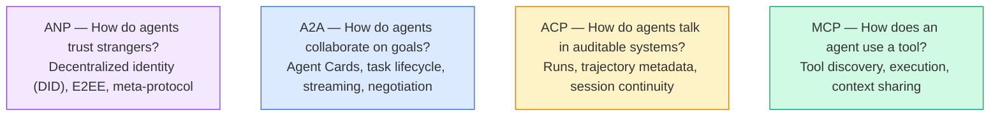

它们不是竞争对手。它们在不同的层级解决不同的问题。

### MCP（回顾）

MCP 在 Phase 13 已经深入讲过。快速回顾：MCP 标准化了 LLM 连接外部工具和数据源的方式。它是一个**客户端-服务器**协议，智能体（客户端）发现并调用服务器暴露的工具。

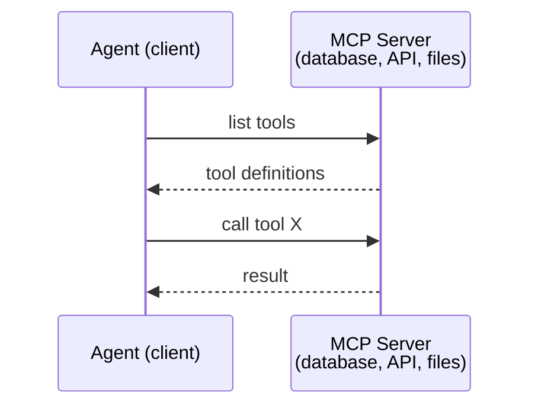

MCP 是**智能体到工具**的通信。它无法帮助智能体之间相互交流。

### A2A（Agent2Agent 协议）

**创建方：** Google（现归属 Linux Foundation，命名为 `lf.a2a.v1`）
**规范版本：** 1.0.0
**解决的问题：** 自治智能体之间如何协作、协商以及相互委派任务？

A2A 是**智能体点对点协作**的协议。MCP 把智能体连接到工具，而 A2A 把智能体连接到其他智能体。每个智能体在一个 well-known URL 发布一张**智能体卡片（Agent Card）**，其他智能体据此发现它、与它协商，并向它委派任务。

#### A2A 的工作方式

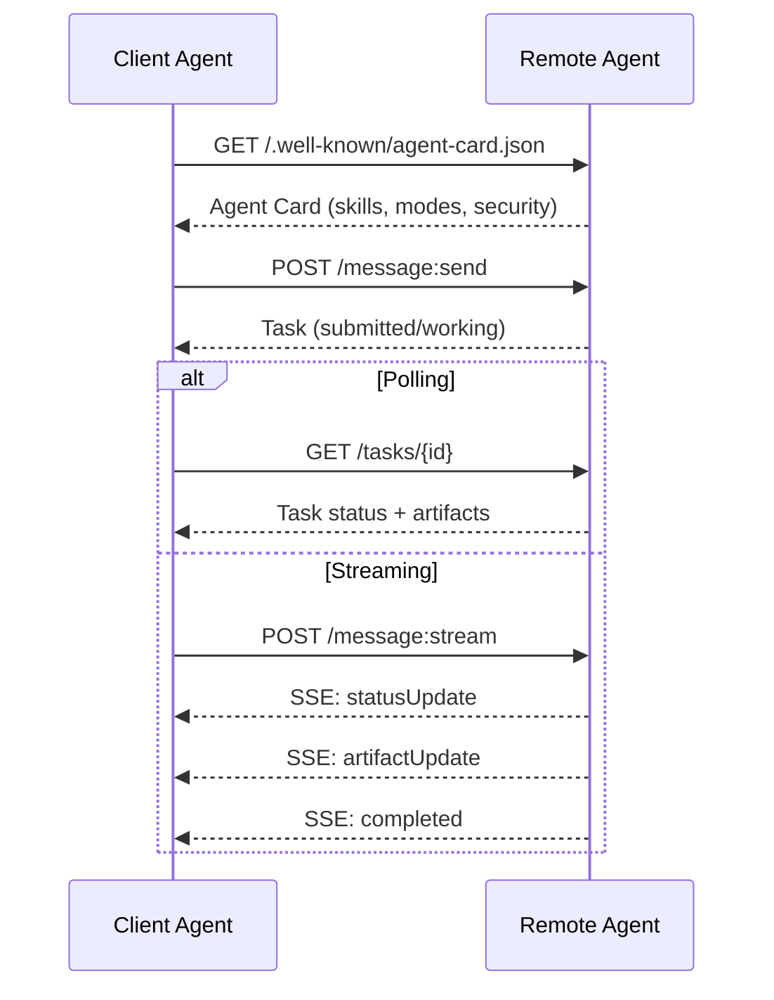

#### 真实的智能体卡片

这就是 A2A 智能体卡片在实际环境中的样子，通过 `GET /.well-known/agent-card.json` 提供：

```json
{
  "name": "Research Agent",
  "description": "Searches documentation and summarizes findings",
  "version": "1.0.0",
  "supportedInterfaces": [
    {
      "url": "https://research-agent.example.com/a2a/v1",
      "protocolBinding": "JSONRPC",
      "protocolVersion": "1.0"
    },
    {
      "url": "https://research-agent.example.com/a2a/rest",
      "protocolBinding": "HTTP+JSON",
      "protocolVersion": "1.0"
    }
  ],
  "provider": {
    "organization": "Your Company",
    "url": "https://example.com"
  },
  "capabilities": {
    "streaming": true,
    "pushNotifications": false
  },
  "defaultInputModes": ["text/plain", "application/json"],
  "defaultOutputModes": ["text/plain", "application/json"],
  "skills": [
    {
      "id": "web-research",
      "name": "Web Research",
      "description": "Searches the web and synthesizes findings",
      "tags": ["research", "search", "summarization"],
      "examples": ["Research the latest changes in React 19"]
    },
    {
      "id": "doc-analysis",
      "name": "Documentation Analysis",
      "description": "Reads and analyzes technical documentation",
      "tags": ["docs", "analysis"],
      "inputModes": ["text/plain", "application/pdf"],
      "outputModes": ["application/json"]
    }
  ],
  "securitySchemes": {
    "bearer": {
      "httpAuthSecurityScheme": {
        "scheme": "Bearer",
        "bearerFormat": "JWT"
      }
    }
  },
  "security": [{ "bearer": [] }]
}
```

需要注意的关键点：
- **Skills（技能）** 描述智能体能做什么。每个技能都有 ID、标签和支持的输入/输出 MIME 类型。客户端智能体就是据此判断这个远程智能体能否处理自己的请求。
- **supportedInterfaces** 列出多种协议绑定。同一个智能体可以同时支持 JSON-RPC、REST 和 gRPC。
- **安全机制**内置在卡片中。客户端在发出第一个请求之前就知道需要什么认证方式。

#### 任务生命周期

任务（Task）是 A2A 中的核心工作单元，会在一组明确定义的状态之间流转：

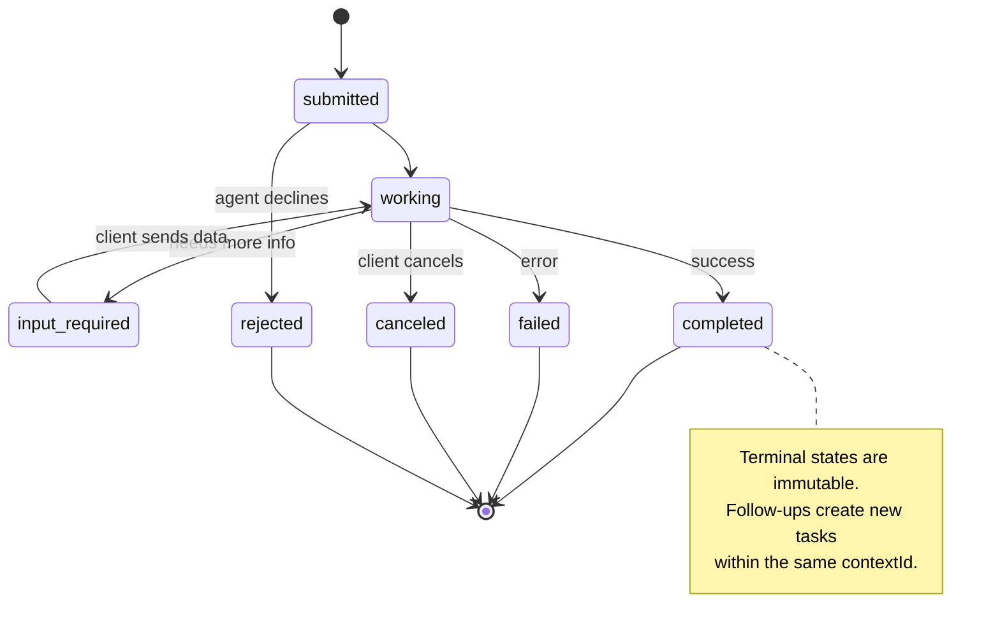

全部 8 个状态（规范中还定义了 `UNSPECIFIED` 作为哨兵值，此处省略）：

| 状态 | 是否终止态 | 含义 |
|---|---|---|
| `TASK_STATE_SUBMITTED` | 否 | 已确认接收，尚未开始处理 |
| `TASK_STATE_WORKING` | 否 | 正在处理中 |
| `TASK_STATE_INPUT_REQUIRED` | 否 | 智能体需要客户端提供更多信息 |
| `TASK_STATE_AUTH_REQUIRED` | 否 | 需要进行身份认证 |
| `TASK_STATE_COMPLETED` | 是 | 成功完成 |
| `TASK_STATE_FAILED` | 是 | 以错误结束 |
| `TASK_STATE_CANCELED` | 是 | 完成前被取消 |
| `TASK_STATE_REJECTED` | 是 | 智能体拒绝了该任务 |

任务一旦进入终止态就不可变，不再接收任何消息。后续工作会在同一个 `contextId` 下创建新任务。

#### 线上格式

A2A 使用 JSON-RPC 2.0。下面是一次真实的消息交换：

**客户端发送任务：**
```json
{
  "jsonrpc": "2.0",
  "id": 1,
  "method": "SendMessage",
  "params": {
    "message": {
      "messageId": "msg-001",
      "role": "ROLE_USER",
      "parts": [{ "text": "Research React 19 compiler features" }]
    },
    "configuration": {
      "acceptedOutputModes": ["text/plain", "application/json"],
      "historyLength": 10
    }
  }
}
```

**智能体以任务作答：**
```json
{
  "jsonrpc": "2.0",
  "id": 1,
  "result": {
    "task": {
      "id": "task-abc-123",
      "contextId": "ctx-xyz-789",
      "status": {
        "state": "TASK_STATE_COMPLETED",
        "timestamp": "2026-03-27T10:30:00Z"
      },
      "artifacts": [
        {
          "artifactId": "art-001",
          "name": "research-results",
          "parts": [{
            "data": {
              "findings": [
                "React 19 compiler auto-memoizes components",
                "No more manual useMemo/useCallback needed",
                "Compiler runs at build time, not runtime"
              ]
            },
            "mediaType": "application/json"
          }]
        }
      ]
    }
  }
}
```

**通过 SSE 流式传输：**
```text
POST /message:stream HTTP/1.1
Content-Type: application/json
A2A-Version: 1.0

data: {"task":{"id":"task-123","status":{"state":"TASK_STATE_WORKING"}}}

data: {"statusUpdate":{"taskId":"task-123","status":{"state":"TASK_STATE_WORKING","message":{"role":"ROLE_AGENT","parts":[{"text":"Searching documentation..."}]}}}}

data: {"artifactUpdate":{"taskId":"task-123","artifact":{"artifactId":"art-1","parts":[{"text":"partial findings..."}]},"append":true,"lastChunk":false}}

data: {"statusUpdate":{"taskId":"task-123","status":{"state":"TASK_STATE_COMPLETED"}}}
```

### ACP（Agent Communication Protocol）

**创建方：** IBM / BeeAI
**规范版本：** 0.2.0（OpenAPI 3.1.1）
**现状：** 正在 Linux Foundation 旗下并入 A2A
**解决的问题：** 智能体之间如何在具备完整可审计性、会话连续性和轨迹追踪的前提下通信？

ACP 是**面向企业的协议**。与许多概述文章的说法相反，ACP 并**不**使用 JSON-LD。它是一个用 OpenAPI 定义的、直截了当的 REST/JSON API。它的特别之处在于 **TrajectoryMetadata（轨迹元数据）**：每个智能体响应都可以附带一份详细日志，记录产生该响应的推理步骤和工具调用。

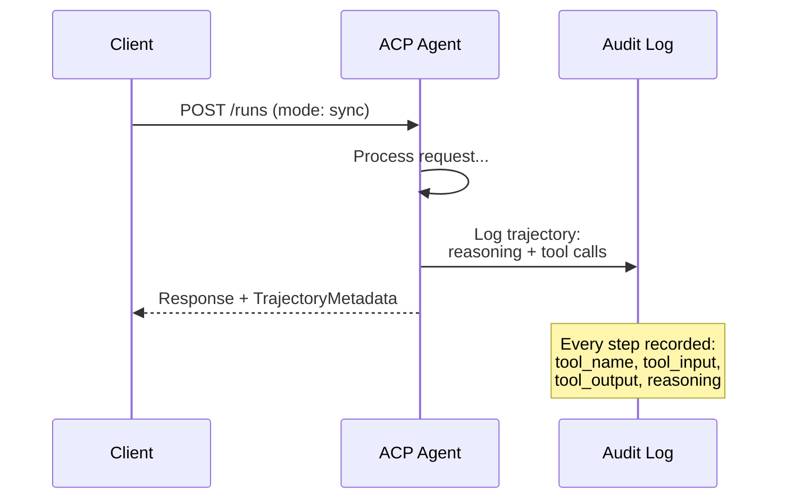

#### ACP 中的智能体发现

ACP 定义了四种发现方式：

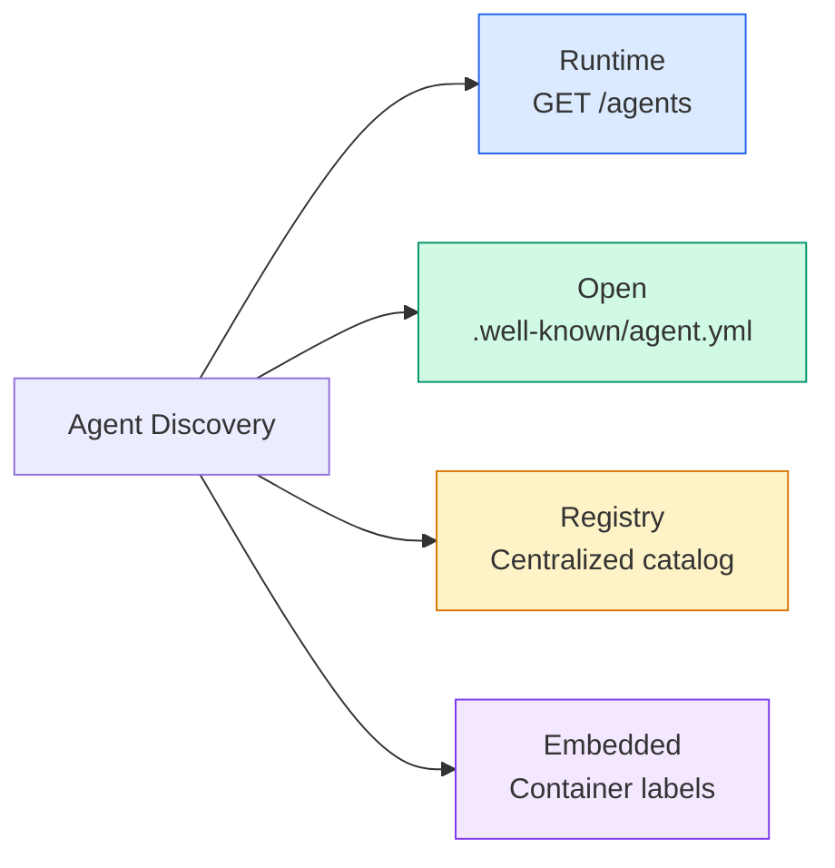

**AgentManifest** 比 A2A 的智能体卡片更简单：

```json
{
  "name": "summarizer",
  "description": "Summarizes documents with source citations",
  "input_content_types": ["text/plain", "application/pdf"],
  "output_content_types": ["text/plain", "application/json"],
  "metadata": {
    "tags": ["summarization", "RAG"],
    "framework": "BeeAI",
    "capabilities": [
      {
        "name": "Document Summarization",
        "description": "Condenses long documents into key points"
      }
    ],
    "recommended_models": ["llama3.3:70b-instruct-fp16"],
    "license": "Apache-2.0",
    "programming_language": "Python"
  }
}
```

#### Run 的生命周期

ACP 用 "Run" 而不是 "Task"。Run 是一次智能体执行，有三种模式：

| 模式 | 行为 |
|---|---|
| `sync` | 阻塞式。响应中直接包含完整结果。 |
| `async` | 立即返回 202。通过 `GET /runs/{id}` 轮询状态。 |
| `stream` | SSE 流。智能体工作过程中持续触发事件。 |

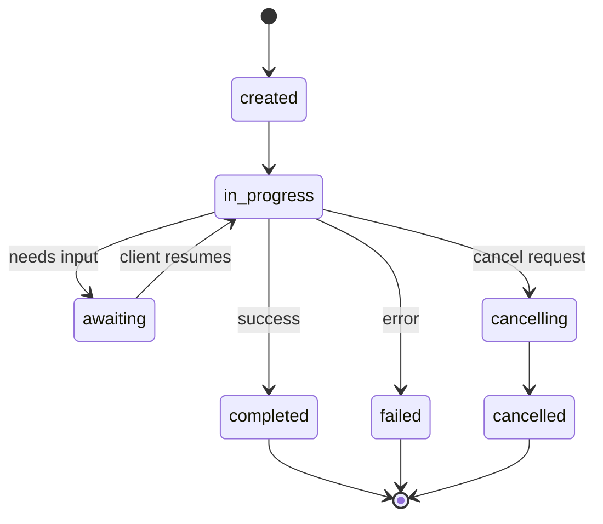

#### TrajectoryMetadata（审计轨迹）

这是 ACP 的核心差异化能力。每个消息片段都可以附带元数据，精确展示智能体做了什么：

```json
{
  "role": "agent/researcher",
  "parts": [
    {
      "content_type": "text/plain",
      "content": "The weather in San Francisco is 72F and sunny.",
      "metadata": {
        "kind": "trajectory",
        "message": "I need to check the weather for this location",
        "tool_name": "weather_api",
        "tool_input": { "location": "San Francisco, CA" },
        "tool_output": { "temperature": 72, "condition": "sunny" }
      }
    }
  ]
}
```

对于受监管行业来说，这是无价之宝。每个答案都附带一条可证明的推理链：调用了哪些工具、用了什么输入、得到了什么输出。没有黑箱。

ACP 还支持用于来源归属的 **CitationMetadata**：

```json
{
  "kind": "citation",
  "start_index": 0,
  "end_index": 47,
  "url": "https://weather.gov/sf",
  "title": "NWS San Francisco Forecast"
}
```

### ANP（Agent Network Protocol）

**创建方：** 开源社区（由 GaoWei Chang 发起）
**仓库：** [github.com/agent-network-protocol/AgentNetworkProtocol](https://github.com/agent-network-protocol/AgentNetworkProtocol)
**解决的问题：** 来自不同组织的智能体如何在没有中心权威机构的情况下相互信任？

ANP 是**去中心化身份协议**。它基于 W3C 去中心化标识符（Decentralized Identifiers，DID）和端到端加密来建立信任。在 A2A 中你通过已知端点发现智能体，而 ANP 让智能体能够以密码学方式证明自己的身份。

ANP 分三层：

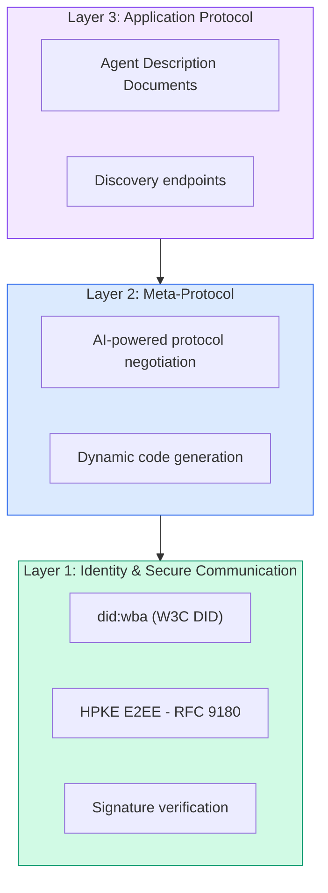

#### DID 文档（真实结构）

ANP 使用一种自定义 DID 方法 `did:wba`（Web-Based Agent）。DID `did:wba:example.com:user:alice` 会解析到 `https://example.com/user/alice/did.json`：

```json
{
  "@context": [
    "https://www.w3.org/ns/did/v1",
    "https://w3id.org/security/suites/jws-2020/v1",
    "https://w3id.org/security/suites/secp256k1-2019/v1"
  ],
  "id": "did:wba:example.com:user:alice",
  "verificationMethod": [
    {
      "id": "did:wba:example.com:user:alice#key-1",
      "type": "EcdsaSecp256k1VerificationKey2019",
      "controller": "did:wba:example.com:user:alice",
      "publicKeyJwk": {
        "crv": "secp256k1",
        "x": "NtngWpJUr-rlNNbs0u-Aa8e16OwSJu6UiFf0Rdo1oJ4",
        "y": "qN1jKupJlFsPFc1UkWinqljv4YE0mq_Ickwnjgasvmo",
        "kty": "EC"
      }
    },
    {
      "id": "did:wba:example.com:user:alice#key-x25519-1",
      "type": "X25519KeyAgreementKey2019",
      "controller": "did:wba:example.com:user:alice",
      "publicKeyMultibase": "z9hFgmPVfmBZwRvFEyniQDBkz9LmV7gDEqytWyGZLmDXE"
    }
  ],
  "authentication": [
    "did:wba:example.com:user:alice#key-1"
  ],
  "keyAgreement": [
    "did:wba:example.com:user:alice#key-x25519-1"
  ],
  "humanAuthorization": [
    "did:wba:example.com:user:alice#key-1"
  ],
  "service": [
    {
      "id": "did:wba:example.com:user:alice#agent-description",
      "type": "AgentDescription",
      "serviceEndpoint": "https://example.com/agents/alice/ad.json"
    }
  ]
}
```

需要注意的关键点：
- **密钥分离**是强制的。签名密钥（secp256k1）与加密密钥（X25519）相互独立。
- **`humanAuthorization`** 是 ANP 独有的。这些密钥在使用前需要人类显式批准（生物识别、密码、HSM）。资金转账等高风险操作走这条路径。
- **`keyAgreement`** 密钥用于 HPKE 端到端加密（RFC 9180）。
- **service** 部分链接到智能体描述（Agent Description）文档。

#### ANP 中的信任机制

ANP **不**使用信任网络（web-of-trust）或背书图。信任是双边的，按每次交互逐一验证：

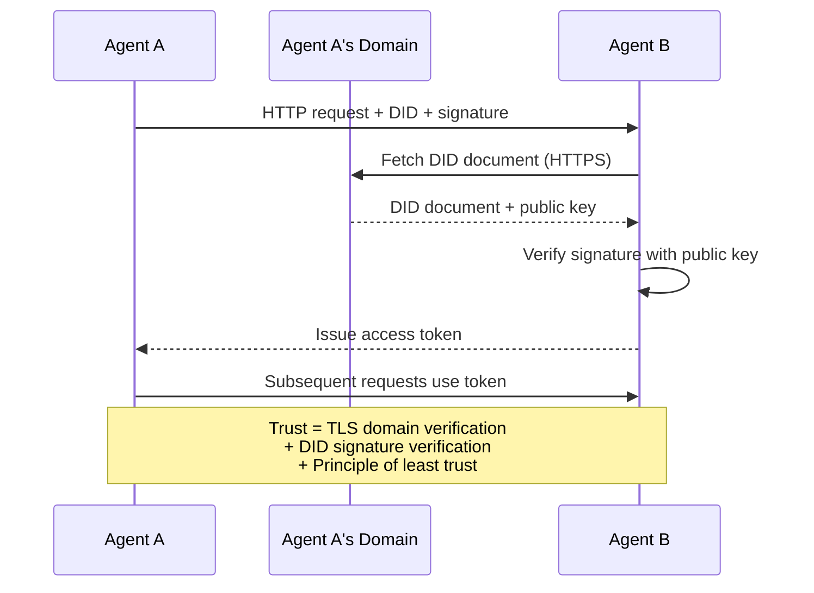

信任来自三个来源：
1. **域名级 TLS** 验证 DID 文档的托管方
2. **DID 密码学签名**验证智能体的身份
3. **最小信任原则**只授予最低限度的权限

这里没有基于流言传播（gossip）的信任扩散，也没有 PageRank 式的评分。你通过每个智能体的 DID 直接验证它。

#### 元协议协商

这是 ANP 最具新意的特性。当来自不同生态系统的两个智能体相遇时，它们不需要预先约定数据格式，而是用自然语言协商：

```json
{
  "action": "protocolNegotiation",
  "sequenceId": 0,
  "candidateProtocols": "I can communicate using:\n1. JSON-RPC with hotel booking schema\n2. REST with OpenAPI 3.1 spec\n3. Natural language over HTTP",
  "modificationSummary": "Initial proposal",
  "status": "negotiating"
}
```

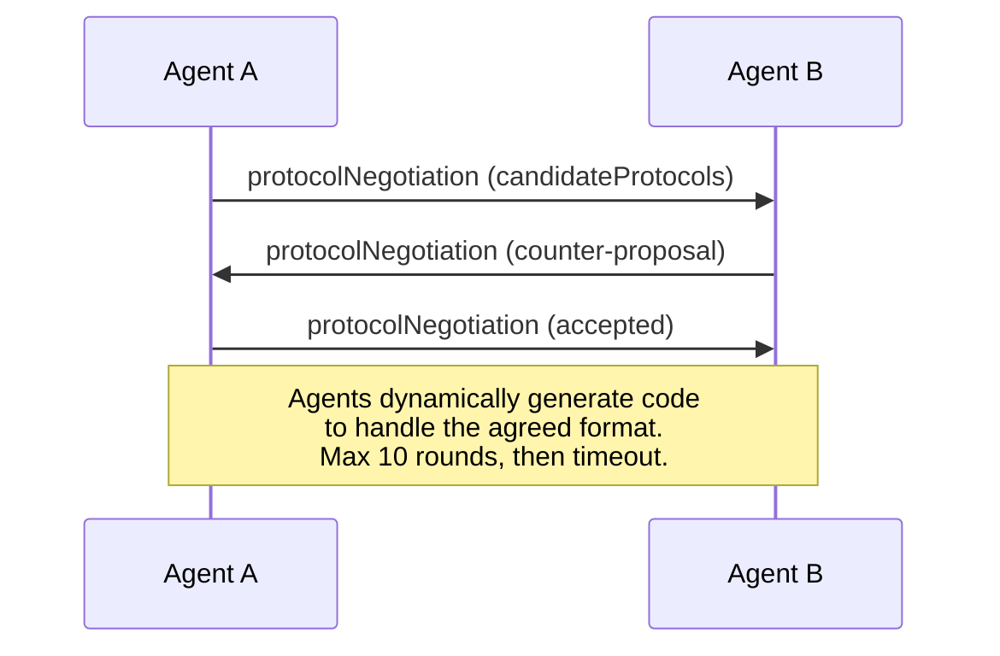

两个智能体来回协商（最多 10 轮），直到就某种格式达成一致，然后动态生成代码来处理它。状态值包括：`negotiating`、`rejected`、`accepted`、`timeout`。

这意味着两个从未谋面的智能体，无需任何人预先定义共享 schema，就能自行搞清楚怎样通信。

### 对比（修正版）

| | MCP | A2A | ACP | ANP |
|---|---|---|---|---|
| **创建方** | Anthropic | Google / Linux Foundation | IBM / BeeAI | 社区 |
| **规范格式** | JSON-RPC | JSON-RPC / REST / gRPC | OpenAPI 3.1（REST） | JSON-RPC |
| **主要用途** | 智能体到工具 | 智能体到智能体 | 智能体到智能体 | 智能体到智能体 |
| **发现机制** | 工具列表 | `/.well-known/agent-card.json` | `GET /agents`、`/.well-known/agent.yml` | `/.well-known/agent-descriptions`、DID 服务端点 |
| **身份** | 隐式（本地） | 安全方案（OAuth、mTLS） | 服务器级 | W3C DID（`did:wba`）+ 端到端加密 |
| **审计轨迹** | 无 | 基础（任务历史） | TrajectoryMetadata（工具调用、推理过程） | 未正式规定 |
| **状态机** | 无 | 9 个任务状态 | 7 个 Run 状态 | 无 |
| **流式传输** | 无 | SSE | SSE | 与传输层无关 |
| **独有特性** | 工具 schema | 智能体卡片 + 技能 | 轨迹审计 | 元协议协商 |
| **最适场景** | 工具与数据 | 动态协作 | 受监管行业 | 跨组织信任 |
| **现状** | 稳定 | 稳定（v1.0） | 正在并入 A2A | 活跃开发中 |

### 它们如何协同工作

这些协议不是互斥的。一个现实的企业系统会同时使用多个：

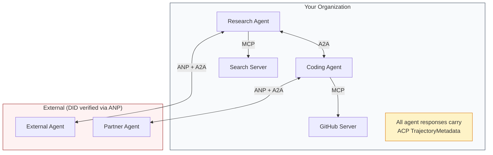

- **MCP** 把每个智能体连接到它的工具
- **A2A** 处理智能体之间（内部与外部）的协作
- **ACP** 把响应包裹在轨迹元数据中以实现可审计性
- **ANP** 为你无法控制的智能体提供身份验证

## 从零实现

### 第 1 步：核心消息类型

每个多智能体系统都从消息格式开始。我们定义的类型直接映射到真实协议所使用的结构：

```typescript
import crypto from "node:crypto";

type MessageRole = "user" | "agent";

type MessagePart =
  | { kind: "text"; text: string }
  | { kind: "data"; data: unknown; mediaType: string }
  | { kind: "file"; name: string; url: string; mediaType: string };

type TrajectoryEntry = {
  reasoning: string;
  toolName?: string;
  toolInput?: unknown;
  toolOutput?: unknown;
  timestamp: number;
};

type AgentMessage = {
  id: string;
  role: MessageRole;
  parts: MessagePart[];
  trajectory?: TrajectoryEntry[];
  replyTo?: string;
  timestamp: number;
};

function createMessage(
  role: MessageRole,
  parts: MessagePart[],
  replyTo?: string
): AgentMessage {
  return {
    id: crypto.randomUUID(),
    role,
    parts,
    replyTo,
    timestamp: Date.now(),
  };
}

function textMessage(role: MessageRole, text: string): AgentMessage {
  return createMessage(role, [{ kind: "text", text }]);
}
```

注意：`MessagePart` 是多模态的（文本、结构化数据、文件），与真实的 A2A 和 ACP 规范一致。`TrajectoryEntry` 捕获推理链，对应 ACP 的 TrajectoryMetadata。

### 第 2 步：A2A 智能体卡片与注册表

构建与真实 A2A 规范一致的智能体发现机制：

```typescript
type Skill = {
  id: string;
  name: string;
  description: string;
  tags: string[];
  inputModes: string[];
  outputModes: string[];
};

type AgentCard = {
  name: string;
  description: string;
  version: string;
  url: string;
  capabilities: {
    streaming: boolean;
    pushNotifications: boolean;
  };
  defaultInputModes: string[];
  defaultOutputModes: string[];
  skills: Skill[];
};

class AgentRegistry {
  private cards: Map<string, AgentCard> = new Map();

  register(card: AgentCard) {
    this.cards.set(card.name, card);
  }

  discoverBySkillTag(tag: string): AgentCard[] {
    return [...this.cards.values()].filter((card) =>
      card.skills.some((skill) => skill.tags.includes(tag))
    );
  }

  discoverByInputMode(mimeType: string): AgentCard[] {
    return [...this.cards.values()].filter(
      (card) =>
        card.defaultInputModes.includes(mimeType) ||
        card.skills.some((skill) => skill.inputModes.includes(mimeType))
    );
  }

  resolve(name: string): AgentCard | undefined {
    return this.cards.get(name);
  }

  listAll(): AgentCard[] {
    return [...this.cards.values()];
  }
}
```

这比简单的「名称到能力」映射要丰富得多。你可以按技能标签、按输入 MIME 类型或按名称发现智能体，与真实 A2A 规范支持的方式一致。

### 第 3 步：A2A 任务生命周期

构建完整的任务状态机：

```typescript
type TaskState =
  | "submitted"
  | "working"
  | "input-required"
  | "auth-required"
  | "completed"
  | "failed"
  | "canceled"
  | "rejected";

const TERMINAL_STATES: TaskState[] = [
  "completed",
  "failed",
  "canceled",
  "rejected",
];

type TaskStatus = {
  state: TaskState;
  message?: AgentMessage;
  timestamp: number;
};

type Artifact = {
  id: string;
  name: string;
  parts: MessagePart[];
};

type Task = {
  id: string;
  contextId: string;
  status: TaskStatus;
  artifacts: Artifact[];
  history: AgentMessage[];
};

type TaskEvent =
  | { kind: "statusUpdate"; taskId: string; status: TaskStatus }
  | {
      kind: "artifactUpdate";
      taskId: string;
      artifact: Artifact;
      append: boolean;
      lastChunk: boolean;
    };

type TaskHandler = (
  task: Task,
  message: AgentMessage
) => AsyncGenerator<TaskEvent>;

class TaskManager {
  private tasks: Map<string, Task> = new Map();
  private handlers: Map<string, TaskHandler> = new Map();
  private listeners: Map<string, ((event: TaskEvent) => void)[]> = new Map();

  registerHandler(agentName: string, handler: TaskHandler) {
    this.handlers.set(agentName, handler);
  }

  subscribe(taskId: string, listener: (event: TaskEvent) => void) {
    const existing = this.listeners.get(taskId) ?? [];
    existing.push(listener);
    this.listeners.set(taskId, existing);
  }

  async sendMessage(
    agentName: string,
    message: AgentMessage,
    contextId?: string
  ): Promise<Task> {
    const handler = this.handlers.get(agentName);
    if (!handler) {
      const task = this.createTask(contextId);
      task.status = {
        state: "rejected",
        timestamp: Date.now(),
        message: textMessage("agent", `No handler for ${agentName}`),
      };
      return task;
    }

    const task = this.createTask(contextId);
    task.history.push(message);
    task.status = { state: "submitted", timestamp: Date.now() };

    this.processTask(task, handler, message).catch((err) => {
      task.status = {
        state: "failed",
        timestamp: Date.now(),
        message: textMessage("agent", String(err)),
      };
    });
    return task;
  }

  getTask(taskId: string): Task | undefined {
    return this.tasks.get(taskId);
  }

  cancelTask(taskId: string): boolean {
    const task = this.tasks.get(taskId);
    if (!task || TERMINAL_STATES.includes(task.status.state)) return false;
    task.status = { state: "canceled", timestamp: Date.now() };
    this.emit(taskId, {
      kind: "statusUpdate",
      taskId,
      status: task.status,
    });
    return true;
  }

  private createTask(contextId?: string): Task {
    const task: Task = {
      id: crypto.randomUUID(),
      contextId: contextId ?? crypto.randomUUID(),
      status: { state: "submitted", timestamp: Date.now() },
      artifacts: [],
      history: [],
    };
    this.tasks.set(task.id, task);
    return task;
  }

  private async processTask(
    task: Task,
    handler: TaskHandler,
    message: AgentMessage
  ) {
    task.status = { state: "working", timestamp: Date.now() };
    this.emit(task.id, {
      kind: "statusUpdate",
      taskId: task.id,
      status: task.status,
    });

    try {
      for await (const event of handler(task, message)) {
        if (TERMINAL_STATES.includes(task.status.state)) break;

        if (event.kind === "statusUpdate") {
          task.status = event.status;
        }
        if (event.kind === "artifactUpdate") {
          const existing = task.artifacts.find(
            (a) => a.id === event.artifact.id
          );
          if (existing && event.append) {
            existing.parts.push(...event.artifact.parts);
          } else {
            task.artifacts.push(event.artifact);
          }
        }
        this.emit(task.id, event);
      }
    } catch (err) {
      task.status = {
        state: "failed",
        timestamp: Date.now(),
        message: textMessage("agent", String(err)),
      };
      this.emit(task.id, {
        kind: "statusUpdate",
        taskId: task.id,
        status: task.status,
      });
    }
  }

  private emit(taskId: string, event: TaskEvent) {
    for (const listener of this.listeners.get(taskId) ?? []) {
      listener(event);
    }
  }
}
```

这实现了真实的 A2A 任务生命周期：submitted、working、input-required 以及各个终止态。处理器是异步生成器，产出事件（状态更新和工件分块），对应 SSE 流式模型。

### 第 4 步：ACP 风格的审计轨迹

为通信加上轨迹追踪：

```typescript
type AuditEntry = {
  runId: string;
  agentName: string;
  input: AgentMessage[];
  output: AgentMessage[];
  trajectory: TrajectoryEntry[];
  status: "created" | "in-progress" | "completed" | "failed" | "awaiting";
  startedAt: number;
  completedAt?: number;
  sessionId?: string;
};

class AuditableRunner {
  private log: AuditEntry[] = [];
  private handlers: Map<
    string,
    (input: AgentMessage[]) => Promise<{
      output: AgentMessage[];
      trajectory: TrajectoryEntry[];
    }>
  > = new Map();

  registerAgent(
    name: string,
    handler: (input: AgentMessage[]) => Promise<{
      output: AgentMessage[];
      trajectory: TrajectoryEntry[];
    }>
  ) {
    this.handlers.set(name, handler);
  }

  async run(
    agentName: string,
    input: AgentMessage[],
    sessionId?: string
  ): Promise<AuditEntry> {
    const entry: AuditEntry = {
      runId: crypto.randomUUID(),
      agentName,
      input: structuredClone(input),
      output: [],
      trajectory: [],
      status: "created",
      startedAt: Date.now(),
      sessionId,
    };
    this.log.push(entry);

    const handler = this.handlers.get(agentName);
    if (!handler) {
      entry.status = "failed";
      return entry;
    }

    entry.status = "in-progress";
    try {
      const result = await handler(input);
      entry.output = structuredClone(result.output);
      entry.trajectory = structuredClone(result.trajectory);
      entry.status = "completed";
      entry.completedAt = Date.now();
    } catch (err) {
      entry.status = "failed";
      entry.trajectory.push({
        reasoning: `Error: ${String(err)}`,
        timestamp: Date.now(),
      });
      entry.completedAt = Date.now();
    }
    return entry;
  }

  getFullAuditLog(): AuditEntry[] {
    return structuredClone(this.log);
  }

  getAuditLogForAgent(agentName: string): AuditEntry[] {
    return structuredClone(
      this.log.filter((e) => e.agentName === agentName)
    );
  }

  getAuditLogForSession(sessionId: string): AuditEntry[] {
    return structuredClone(
      this.log.filter((e) => e.sessionId === sessionId)
    );
  }

  getTrajectoryForRun(runId: string): TrajectoryEntry[] {
    const entry = this.log.find((e) => e.runId === runId);
    return entry ? structuredClone(entry.trajectory) : [];
  }
}
```

每次智能体执行都会产生一条完整的审计条目：输入是什么、输出是什么，以及中间所有工具调用和推理步骤的完整轨迹。你可以按智能体、按会话或按单次运行来查询。

### 第 5 步：ANP 风格的身份验证

构建基于 DID 的身份与验证：

```typescript
type VerificationMethod = {
  id: string;
  type: string;
  controller: string;
  publicKeyDer: string;
};

type DIDDocument = {
  id: string;
  verificationMethod: VerificationMethod[];
  authentication: string[];
  keyAgreement: string[];
  humanAuthorization: string[];
  service: { id: string; type: string; serviceEndpoint: string }[];
};

type AgentIdentity = {
  did: string;
  document: DIDDocument;
  privateKey: crypto.KeyObject;
  publicKey: crypto.KeyObject;
};

class IdentityRegistry {
  private documents: Map<string, DIDDocument> = new Map();

  publish(doc: DIDDocument) {
    this.documents.set(doc.id, doc);
  }

  resolve(did: string): DIDDocument | undefined {
    return this.documents.get(did);
  }

  verify(did: string, signature: string, payload: string): boolean {
    const doc = this.documents.get(did);
    if (!doc) return false;

    const authKeyIds = doc.authentication;
    const authKeys = doc.verificationMethod.filter((vm) =>
      authKeyIds.includes(vm.id)
    );

    for (const key of authKeys) {
      const publicKey = crypto.createPublicKey({
        key: Buffer.from(key.publicKeyDer, "base64"),
        format: "der",
        type: "spki",
      });
      const isValid = crypto.verify(
        null,
        Buffer.from(payload),
        publicKey,
        Buffer.from(signature, "hex")
      );
      if (isValid) return true;
    }
    return false;
  }

  requiresHumanAuth(did: string, operationKeyId: string): boolean {
    const doc = this.documents.get(did);
    if (!doc) return false;
    return doc.humanAuthorization.includes(operationKeyId);
  }
}

function createIdentity(domain: string, agentName: string): AgentIdentity {
  const did = `did:wba:${domain}:agent:${agentName}`;
  const { publicKey, privateKey } = crypto.generateKeyPairSync("ed25519");

  const publicKeyDer = publicKey
    .export({ format: "der", type: "spki" })
    .toString("base64");

  const keyId = `${did}#key-1`;
  const encKeyId = `${did}#key-x25519-1`;

  const document: DIDDocument = {
    id: did,
    verificationMethod: [
      {
        id: keyId,
        type: "Ed25519VerificationKey2020",
        controller: did,
        publicKeyDer,
      },
      {
        id: encKeyId,
        type: "X25519KeyAgreementKey2019",
        controller: did,
        publicKeyDer,
      },
    ],
    authentication: [keyId],
    keyAgreement: [encKeyId],
    humanAuthorization: [],
    service: [
      {
        id: `${did}#agent-description`,
        type: "AgentDescription",
        serviceEndpoint: `https://${domain}/agents/${agentName}/ad.json`,
      },
    ],
  };

  return { did, document, privateKey, publicKey };
}

function signPayload(identity: AgentIdentity, payload: string): string {
  return crypto
    .sign(null, Buffer.from(payload), identity.privateKey)
    .toString("hex");
}
```

这映射了真实的 ANP 身份模型：智能体拥有 DID 文档，其中身份认证、密钥协商和人类授权三类密钥相互独立。`IdentityRegistry` 模拟了 DID 解析（生产环境中这会是对智能体所在域名的 HTTP 请求）。

### 第 6 步：协议网关

把四个协议连接成一个统一的系统：

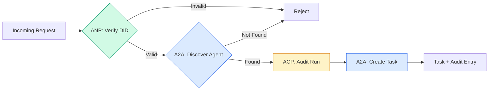

```typescript
class ProtocolGateway {
  private registry: AgentRegistry;
  private taskManager: TaskManager;
  private auditRunner: AuditableRunner;
  private identityRegistry: IdentityRegistry;

  constructor(
    registry: AgentRegistry,
    taskManager: TaskManager,
    auditRunner: AuditableRunner,
    identityRegistry: IdentityRegistry
  ) {
    this.registry = registry;
    this.taskManager = taskManager;
    this.auditRunner = auditRunner;
    this.identityRegistry = identityRegistry;
  }

  async delegateTask(
    fromDid: string,
    signature: string,
    targetAgent: string,
    message: AgentMessage,
    sessionId?: string
  ): Promise<{ task: Task; audit: AuditEntry } | { error: string }> {
    if (!this.identityRegistry.verify(fromDid, signature, message.id)) {
      return { error: "Identity verification failed" };
    }

    const card = this.registry.resolve(targetAgent);
    if (!card) {
      return { error: `Agent ${targetAgent} not found in registry` };
    }

    const audit = await this.auditRunner.run(
      targetAgent,
      [message],
      sessionId
    );
    const task = await this.taskManager.sendMessage(targetAgent, message);

    return { task, audit };
  }

  discoverAndDelegate(
    fromDid: string,
    signature: string,
    skillTag: string,
    message: AgentMessage
  ): Promise<{ task: Task; audit: AuditEntry } | { error: string }> {
    const candidates = this.registry.discoverBySkillTag(skillTag);
    if (candidates.length === 0) {
      return Promise.resolve({
        error: `No agents found with skill tag: ${skillTag}`,
      });
    }
    return this.delegateTask(
      fromDid,
      signature,
      candidates[0].name,
      message
    );
  }
}
```

网关在一次调用中完成四件事：
1. **ANP**：通过 DID 签名验证调用方身份
2. **A2A**：发现目标智能体并检查其能力
3. **ACP**：把执行过程包裹在带轨迹的审计记录中
4. **A2A**：创建带完整生命周期追踪的任务

### 第 7 步：完整串联

```typescript
async function protocolDemo() {
  const registry = new AgentRegistry();
  registry.register({
    name: "researcher",
    description: "Searches and summarizes findings",
    version: "1.0.0",
    url: "https://researcher.local/a2a/v1",
    capabilities: { streaming: true, pushNotifications: false },
    defaultInputModes: ["text/plain"],
    defaultOutputModes: ["text/plain", "application/json"],
    skills: [
      {
        id: "web-research",
        name: "Web Research",
        description: "Searches the web",
        tags: ["research", "search", "summarization"],
        inputModes: ["text/plain"],
        outputModes: ["application/json"],
      },
    ],
  });
  registry.register({
    name: "coder",
    description: "Writes code from specs",
    version: "1.0.0",
    url: "https://coder.local/a2a/v1",
    capabilities: { streaming: false, pushNotifications: false },
    defaultInputModes: ["text/plain", "application/json"],
    defaultOutputModes: ["text/plain"],
    skills: [
      {
        id: "code-gen",
        name: "Code Generation",
        description: "Generates code",
        tags: ["coding", "generation"],
        inputModes: ["text/plain", "application/json"],
        outputModes: ["text/plain"],
      },
    ],
  });

  const taskManager = new TaskManager();
  const auditRunner = new AuditableRunner();

  const researchTrajectory: TrajectoryEntry[] = [];

  taskManager.registerHandler(
    "researcher",
    async function* (task, message) {
      yield {
        kind: "statusUpdate" as const,
        taskId: task.id,
        status: { state: "working" as const, timestamp: Date.now() },
      };

      researchTrajectory.push({
        reasoning: "Searching for React 19 documentation",
        toolName: "web_search",
        toolInput: { query: "React 19 compiler features" },
        toolOutput: {
          results: ["react.dev/blog/react-19", "github.com/react/react"],
        },
        timestamp: Date.now(),
      });

      researchTrajectory.push({
        reasoning: "Extracting key findings from search results",
        toolName: "doc_analysis",
        toolInput: { url: "react.dev/blog/react-19" },
        toolOutput: {
          summary:
            "React 19 compiler auto-memoizes, no manual useMemo needed",
        },
        timestamp: Date.now(),
      });

      yield {
        kind: "artifactUpdate" as const,
        taskId: task.id,
        artifact: {
          id: crypto.randomUUID(),
          name: "research-results",
          parts: [
            {
              kind: "data" as const,
              data: {
                findings: [
                  "React 19 compiler auto-memoizes components",
                  "No more manual useMemo/useCallback needed",
                  "Compiler runs at build time, not runtime",
                ],
                sources: ["react.dev/blog/react-19"],
              },
              mediaType: "application/json",
            },
          ],
        },
        append: false,
        lastChunk: true,
      };

      yield {
        kind: "statusUpdate" as const,
        taskId: task.id,
        status: { state: "completed" as const, timestamp: Date.now() },
      };
    }
  );

  auditRunner.registerAgent("researcher", async () => ({
    output: [
      textMessage("agent", "React 19 compiler auto-memoizes components"),
    ],
    trajectory: researchTrajectory,
  }));

  const identityRegistry = new IdentityRegistry();

  const coderIdentity = createIdentity("coder.local", "coder");
  const researcherIdentity = createIdentity("researcher.local", "researcher");

  identityRegistry.publish(coderIdentity.document);
  identityRegistry.publish(researcherIdentity.document);

  const gateway = new ProtocolGateway(
    registry,
    taskManager,
    auditRunner,
    identityRegistry
  );

  console.log("=== Protocol Demo ===\n");

  console.log("1. Agent Discovery (A2A)");
  const researchAgents = registry.discoverBySkillTag("research");
  console.log(
    `   Found ${researchAgents.length} agent(s):`,
    researchAgents.map((a) => a.name)
  );

  console.log("\n2. Identity Verification (ANP)");
  const message = textMessage("user", "Research React 19 compiler features");
  const signature = signPayload(coderIdentity, message.id);
  const verified = identityRegistry.verify(
    coderIdentity.did,
    signature,
    message.id
  );
  console.log(`   Coder DID: ${coderIdentity.did}`);
  console.log(`   Signature verified: ${verified}`);

  console.log("\n3. Task Delegation (A2A + ACP + ANP)");
  const result = await gateway.delegateTask(
    coderIdentity.did,
    signature,
    "researcher",
    message,
    "session-001"
  );

  if ("error" in result) {
    console.log(`   Error: ${result.error}`);
    return;
  }

  console.log(`   Task ID: ${result.task.id}`);
  console.log(`   Task state: ${result.task.status.state}`);
  console.log(`   Artifacts: ${result.task.artifacts.length}`);

  console.log("\n4. Audit Trail (ACP)");
  console.log(`   Run ID: ${result.audit.runId}`);
  console.log(`   Status: ${result.audit.status}`);
  console.log(`   Trajectory steps: ${result.audit.trajectory.length}`);
  for (const step of result.audit.trajectory) {
    console.log(`     - ${step.reasoning}`);
    if (step.toolName) {
      console.log(`       Tool: ${step.toolName}`);
    }
  }

  console.log("\n5. Full Audit Log");
  const fullLog = auditRunner.getFullAuditLog();
  console.log(`   Total runs: ${fullLog.length}`);
  for (const entry of fullLog) {
    const duration = entry.completedAt
      ? `${entry.completedAt - entry.startedAt}ms`
      : "in-progress";
    console.log(`   ${entry.agentName}: ${entry.status} (${duration})`);
  }
}

protocolDemo().catch((err) => {
  console.error("Protocol demo failed:", err);
  process.exitCode = 1;
});
```

## 哪里会出问题

协议解决的是理想路径。下面是生产环境中真正会出问题的地方：

**Schema 漂移。** 智能体 A 发布的智能体卡片声明输出 `application/json`，但 JSON schema 在版本之间发生了变化。智能体 B 按旧格式解析，得到一堆垃圾。修复方法：给技能和输出 schema 加版本号。A2A 规范正是为此在智能体卡片上支持 `version` 字段。

**违反状态机规则。** 某个智能体处理器产出了 `completed` 事件后，又试图继续产出工件。任务已经不可变了，你的代码要么悄悄丢弃更新，要么抛出异常。修复方法：产出事件前先检查是否已处于终止态。上面的 `TaskManager` 通过在终止态后 `break` 来强制执行这一点。

**信任解析失败。** 智能体 A 想验证智能体 B 的 DID，但 B 的域名宕机了，DID 文档无法获取。这时你是失败放行（接受未验证的智能体）还是失败拒绝（拒绝所有请求）？ANP 建议遵循最小信任原则，失败拒绝。

**轨迹膨胀。** ACP 的轨迹日志强大但开销大。一个复杂智能体每次运行调用 200 次工具，会产生体量巨大的审计条目。修复方法：按可配置的详细程度记录轨迹。出于合规需要记录工具名称和输入输出，对非受监管的工作负载则跳过推理步骤。

**发现请求的惊群效应。** 50 个智能体启动时同时请求 `GET /agents`。修复方法：为智能体卡片设置带 TTL 的缓存、错开发现请求的间隔，或用推送式注册取代轮询。

## 生产实践

### 真实实现

**A2A** 是最成熟的。Google 的[官方规范](https://github.com/google/A2A)以开源形式归属 Linux Foundation，提供 Python 和 TypeScript SDK。如果你的智能体需要动态发现和协作，从这里开始。

**ACP** 正在并入 A2A。IBM 的 [BeeAI 项目](https://github.com/i-am-bee/acp)创建 ACP 作为 REST 优先的替代方案，但轨迹元数据这一概念正在被 A2A 生态吸收。即使你用 A2A 作为传输层，也值得采用 ACP 的模式（轨迹日志、Run 生命周期）。

**ANP** 是最具实验性的。[社区仓库](https://github.com/agent-network-protocol/AgentNetworkProtocol)提供 Python SDK（AgentConnect）。元协议协商的概念确实新颖，对跨组织的智能体部署值得持续关注。

**MCP** 已在 Phase 13 讲过。如果你想让智能体使用工具，MCP 就是标准。

### 选对协议

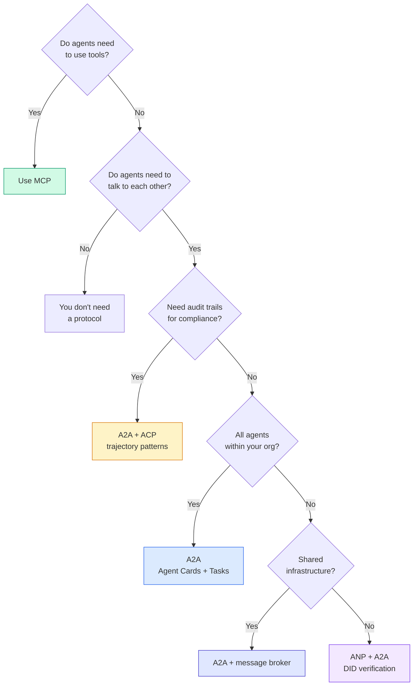

## 交付产物

本课产出：
- `code/main.ts` —— 四种协议模式的完整实现
- `outputs/prompt-protocol-selector.md` —— 一份帮助你为系统选择协议的提示词

## 练习

1. **多跳任务委派。** 扩展 `TaskManager`，让一个智能体处理器可以把子任务委派给其他智能体。研究员收到任务后，把「搜索」和「摘要」两个子任务委派给两个专家智能体，等待两者完成，再把结果合并进自己的工件。

2. **流式审计轨迹。** 修改 `AuditableRunner` 以支持流式模式。不再等待完整结果，而是在轨迹条目添加时实时产出 `AuditEntry` 更新。使用一个产出审计快照的异步生成器。

3. **DID 轮换。** 为 `IdentityRegistry` 添加密钥轮换。智能体应能发布一份带有新密钥的 DID 文档，同时保留 `previousDid` 引用。验证方在宽限期内应同时接受当前密钥和上一个密钥的签名。

4. **协议协商。** 实现 ANP 的元协议概念。两个智能体交换携带候选格式的 `protocolNegotiation` 消息（例如「我会说 JSON-RPC」对「我偏好 REST」）。最多 3 轮后，它们达成一致或超时。商定的格式决定它们使用哪个 `TaskManager` 或 `AuditableRunner`。

5. **限速发现。** 添加一个 `RateLimitedRegistry` 包装器，以可配置的 TTL 缓存智能体卡片查询，并限制每个智能体每秒的发现请求数。模拟 100 个智能体在启动时相互发现的惊群场景，并测量前后差异。

## 关键术语

| 术语 | 人们怎么说 | 实际含义 |
|------|----------------|----------------------|
| MCP | 「AI 工具的协议」 | 一个让智能体发现并使用工具的客户端-服务器协议。智能体到工具，而不是智能体到智能体。 |
| A2A | 「Google 的智能体协议」 | 归属 Linux Foundation 的智能体协作点对点协议。通过智能体卡片发现，9 状态任务生命周期，SSE 流式传输。支持 JSON-RPC、REST 和 gRPC 绑定。 |
| ACP | 「企业级智能体消息传递」 | IBM/BeeAI 的智能体 Run REST API，带 TrajectoryMetadata：每个响应都附带完整的推理和工具调用链。正在并入 A2A。 |
| ANP | 「去中心化智能体身份」 | 社区协议，使用 `did:wba`（DID）实现密码学身份、HPKE 实现端到端加密，并用 AI 驱动的元协议协商让素未谋面的智能体相互沟通。 |
| Agent Card | 「智能体的名片」 | 位于 `/.well-known/agent-card.json` 的 JSON 文档，描述技能、支持的 MIME 类型、安全方案和协议绑定。 |
| DID | 「去中心化 ID」 | W3C 标准，定义托管在智能体自有域名上、可密码学验证的身份。ANP 使用 `did:wba` 方法。 |
| TrajectoryMetadata | 「审计凭证」 | ACP 的机制：在每个智能体响应上附加推理步骤、工具调用及其输入输出。 |
| Meta-protocol | 「智能体协商怎么对话」 | ANP 的方式：智能体用自然语言动态商定数据格式，然后生成代码来处理这些格式。 |
| Task | 「一个工作单元」 | A2A 中带状态的对象，追踪工作从提交到完成的全过程。进入终止态后不可变。 |

## 延伸阅读

- [Google A2A specification](https://github.com/google/A2A) —— 官方规范与 SDK（v1.0.0，Linux Foundation）
- [IBM/BeeAI ACP specification](https://github.com/i-am-bee/acp) —— 智能体 Run 与轨迹元数据的 OpenAPI 3.1 规范
- [Agent Network Protocol](https://github.com/agent-network-protocol/AgentNetworkProtocol) —— 基于 DID 的身份、端到端加密、元协议协商
- [Model Context Protocol docs](https://modelcontextprotocol.io/) —— Anthropic 的 MCP 规范（Phase 13 已讲）
- [W3C Decentralized Identifiers](https://www.w3.org/TR/did-core/) —— 支撑 ANP 的身份标准
- [RFC 9180 (HPKE)](https://www.rfc-editor.org/rfc/rfc9180) —— ANP 用于端到端加密的加密方案
- [FIPA Agent Communication Language](http://www.fipa.org/specs/fipa00061/SC00061G.html) —— 现代智能体协议的学术先驱
