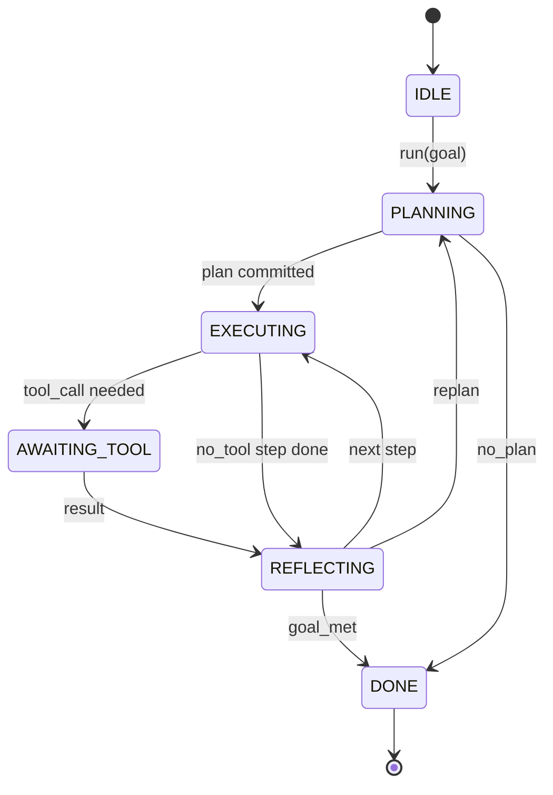

# Agent Harness 循环契约

> Harness 才是智能体本体，模型只是协处理器。本课将固化这份循环契约，让你可以把任意模型接入其中。

**Type:** Build
**Languages:** Python
**Prerequisites:** Phase 13 lessons 01-07, Phase 14 lesson 01
**Time:** ~90 minutes

## 学习目标
- 将智能体 harness 循环定义为一个带有显式转移的确定性状态机（state machine）。
- 实现十个生命周期钩子（hook）主题，供运维方接入策略、遥测和安全护栏。
- 定义两个拉取点（pull point），循环在此把控制权交还给调用方，并在收到新输入后恢复执行。
- 强制执行会话级预算（轮次、工具调用次数、墙钟时间），超限时不泄漏任何中间状态。
- 发出一条包含十一种事件类型的类型化事件流，让下游 UI 和追踪器无需窥探循环内部即可订阅。

## 问题背景

一个无人值守连续运行四十轮的编码智能体，已经不是一个聊天循环。它是一个状态机：运维方可以拦截它的节点，审计它的边。一旦把这份契约写下来，更换模型、工具或策略就不再是一次重构，而只是一次注册调用。

本课就来构建这份契约。我们会命名六个状态、十个钩子主题、两个拉取点、十一种事件类型，以及一个预算包络。Harness 中的其余一切（工具注册表、JSON-RPC 传输层、调度器、规划器）都将接入这个骨架。

## 状态定义

循环共有六个状态：五个为活跃状态，一个为终止状态。



`IDLE` 是唯一合法的入口，`DONE` 是唯一合法的出口。`AWAITING_TOOL` 是唯一会产生拉取点的状态。其余所有转移都是内部转移。

这个状态机是确定性的：给定相同的事件日志，harness 会重新进入相同的状态。正是这个性质，让你可以在不重新调用模型的情况下回放会话进行调试。

## 钩子主题

钩子是运维方切入循环的接缝。Harness 会触发十个主题，每个主题可以挂任意数量的订阅者，订阅者按注册顺序依次触发。订阅者可以修改载荷（payload）、抛出异常以中止当前轮次，或返回一个哨兵值以跳过下一步。

```text
before_plan         after_plan
before_tool_call    after_tool_call
before_step         after_step
on_error
on_pause
on_budget_exceeded
on_complete
```

这套形态正是 Claude Code、Cursor 和 OpenCode 在 2025 年年中共同收敛到的方案。名字都是功能性的，不带品牌色彩。一个拦截 `rm -rf` 的钩子挂在 `before_tool_call`；一个上报 OpenTelemetry span 的钩子挂在 `after_step`；一个负责恢复已暂停会话的钩子挂在 `on_pause`。

## 拉取点

循环会在两处交出控制权。第一处是 `AWAITING_TOOL`：没有工具结果就无法继续推进时。第二处是 `on_pause`：预算耗尽，或某个钩子明确要求人工审核时。

拉取点不是异常，而是一次返回（return）。调用方检查 harness 状态，取来 harness 索要的东西，然后调用 `resume(payload)`，harness 就从停下的地方继续。这与 Python 生成器是同一种形态。跨越拉取点的传输方式由你自己选择：在 TUI 中是按键，在 MCP 上是 `tools/call`，在队列里则是一次任务轮询。

## 事件流

循环会在契约规定的特定时点向一条类型化事件流追加事件。该流只追加不修改（append-only），订阅者可以从任意偏移量回放。已实现的十一种事件类型如下：

- `session.start` — 调用 `run(goal)` 时发出一次
- `plan.draft` — 规划器返回计划草案时发出
- `plan.commit` — 草案被提交为活跃计划后发出
- `step.start` — 每个执行步骤开始时发出
- `step.end` — 每个执行步骤结束时发出
- `tool.call` — 某个需要工具的步骤将控制权交还给调用方时发出
- `tool.result` — 携带工具结果恢复执行时发出
- `tool.error` — 携带错误恢复执行时发出，或钩子中止调用时发出
- `budget.warn` — 触达预算上限时发出
- `session.pause` — 循环因暂停而让出控制权时发出（预算原因或钩子原因）
- `session.complete` — 循环到达 `DONE` 时发出一次

事件不会重复钩子的载荷。钩子是命令式的（修改、中止），事件是观测式的（记录、上报）。把两者视为彼此正交。

## 预算包络

一个会话携带三项上限：轮次数、工具调用数、墙钟秒数。每一轮使轮次计数加一，每次工具调用使工具调用计数加一，墙钟时间则在每次状态转移时检查。任意一项触顶时，循环先触发 `on_budget_exceeded`，再发出 `budget.warn`，然后在下一个拉取点带着「预算超限」的原因转移到 `IDLE`。

预算不是一刀切的终止开关，而是一次让出（yield）。是延长预算后恢复执行，还是直接关闭会话，由调用方决定。

## 本课不做什么

本课不调用模型，不注册真实工具，也不实现传输层。那些是接下来四节课的内容。本课先把契约钉死，后面四节课才能直接接入而无需重写。

`main.py` 中的确定性规划器只是替身。它返回一个写死的三步计划，其中两步需要工具结果。重点在于循环，不在于计划。

## 如何阅读代码

`HarnessLoop` 是主类，负责持有状态、触发钩子、发出事件。`Budget` 跟踪上限。`Event` 是事件流上的类型化信封。`HookRegistry` 是分发表。`_transition` 是唯一会改变状态的函数，因此状态机不变式集中在一处。

从头到尾通读 `main.py`，再读 `code/tests/test_loop.py`。这些测试钉死了每一次转移和每一次钩子的触发顺序。

## 更进一步

在生产环境中构建 harness，最难的不是状态机，而是让契约真正可强制执行。这份契约必须扛得住规划器的热重载，扛得住返回畸形 JSON 的工具，扛得住在四十轮会话进行到三分之二时某个钩子在 `before_tool_call` 中抛出异常。本课的测试演练了这些失败模式。运行它们，弄坏它们，再补充用例。

下一课加入工具注册表，之后是 JSON-RPC 传输层，再之后是调度器。到第二十四课时，本文件中的这个循环将带着真实强制执行的预算，驱动真实计划调用真实工具。
