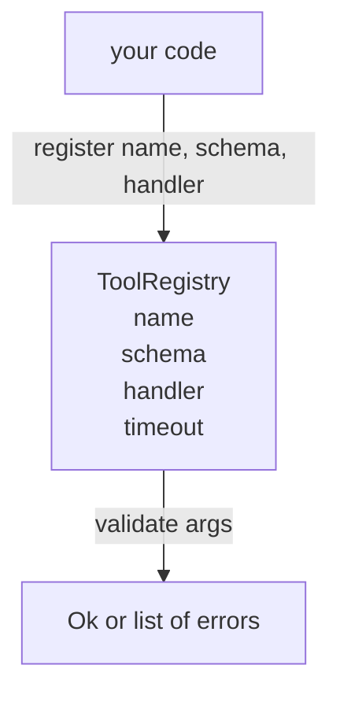

# 带 Schema 校验的工具注册表

> 智能体无法校验的工具，就是智能体无法调用的工具。先把注册表和 schema 校验器建好，再去构建工具本身。

**Type:** Build
**Languages:** Python
**Prerequisites:** Phase 13 lessons 01-07, Phase 14 lesson 01
**Time:** ~90 minutes

## 学习目标
- 维护一个类型化的注册表，记录工具名 → schema → 处理函数的映射，调度器查询一次后即可一直信任。
- 实现 JSON Schema 2020-12 的一个子集，覆盖工具调用中百分之九十实际会用到的关键字。
- 返回精确的、JSON Pointer 格式的错误路径，让模型在一个来回内就能自我修正。
- 默认拒绝重复注册，除非显式覆盖——静默覆盖正是生产环境工具目录逐渐失控的根源。
- 保持校验器是纯函数（无 I/O、无时间依赖、无全局变量），这样它可以在回放日志上重新执行。

## 为什么注册表要先于工具构建

到了 2026 年，一个编码智能体注册的工具数量已经超过模型单个上下文窗口的容量。一个有规模的执行框架（harness）会注册两百个工具，而在任意一轮对话中只暴露十到四十个。注册表是三个问题的唯一可信来源：「存在哪些工具」「它们的参数是什么形状」「我该调用哪个处理函数」。一旦这三个答案确定下来，框架的其余部分就不用再靠猜了。

我们要避免的错误是：只交付处理函数而没有 schema，或者只交付 schema 而不做校验。这两种情况都很常见，也都会把下一层（第二十三课的调度器）变成一场猜谜游戏——唯一的失败信号就是处理函数抛出的堆栈跟踪。

## 一条工具记录长什么样

```text
ToolRecord
  name        : str          (unique, lowercase alphanumeric and underscore segments separated by dots, e.g., snake_case.segment.case)
  description : str          (one line, shown to the model)
  schema      : dict         (JSON Schema 2020-12 subset)
  handler     : Callable     (async or sync, returns Any)
  idempotent  : bool         (dispatcher uses this for retry decisions)
  timeout_ms  : int          (override per-tool dispatcher default)
```

schema 是校验器唯一接触的字段。处理函数对它来说是不透明的。我们刻意把两者分开：schema 是数据，处理函数是代码。把它们混在一起，就会诱使你把校验逻辑塞进处理函数里——这正是我们要杜绝的 bug。

## JSON Schema 2020-12 子集

完整的 2020-12 规范厚如论文。我们只需要八个关键字。

```text
type           string / number / integer / boolean / object / array / null
properties     map of property name -> schema
required       list of property names
enum           list of allowed primitive values
minLength      integer, applies to strings
maxLength      integer, applies to strings
pattern        ECMA-262-compatible regex, applies to strings
items          schema applied to every array element
```

这些已经足以覆盖工具 API 真正需要的部分。我们没有加入的那些关键字（oneOf、anyOf、allOf、$ref、条件语句）在生产级 schema 中确实合法，但会把校验器变成一个需要处理环路的树遍历器。我们要构建的是注册表，不是一个完整的 JSON Schema 引擎。

## JSON Pointer 错误路径

校验失败时，校验器返回一个错误列表。每个错误都携带一条指向输入的 JSON Pointer 路径。Pointer 是一串以斜杠开头的属性名和数组索引序列。

```text
{"a": {"b": [1, 2, "x"]}}
                    ^
                    /a/b/2
```

模型读错误路径比读自然语言句子更准。如果 schema 要求 `args.user.email` 而模型传了一个整数，错误应当是 `/user/email` 加上 `expected_type: string`。模型在下一次调用里直接修正，不需要一轮自然语言往返。

## 注册与覆盖

`register(name, schema, handler, **opts)` 默认拒绝重复注册。调用方必须传 `override=True` 才能替换。这是运维卫生习惯。代码库的两个部分静默注册同一个工具名，是那种要在生产环境里查一周才能找到的 bug。

注册表暴露三个读取方法。`get(name)` 返回记录，否则抛异常。`validate(name, args)` 返回 `Ok` 或一个错误列表。`names()` 按注册顺序返回工具名。

## 校验器是什么、不是什么

它是对 schema 树的一次递归遍历。它是纯函数。它不调用处理函数。它不做类型强转（字符串 `"42"` 不会通过 number 类型的 schema）。它不做静默截断。

它不是安全边界。校验通过之后，恶意的处理函数仍然可以为非作歹。第二十三课的调度器会加上超时和沙箱层。注册表只负责形状。

## 架构



## 如何阅读代码

`code/main.py` 定义了 `ToolRegistry`、`ToolRecord`、`ValidationError` 以及八个校验函数。校验器按 `schema["type"]` 分发（带 `enum` 的 schema 会被当作无类型的枚举检查处理）。每个类型校验函数要么返回空列表，要么返回一个 `ValidationError` 列表。顶层遍历器在向下递归时拼接错误并在前面追加路径片段。

`code/tests/test_registry.py` 覆盖了注册、覆盖、校验成功、带路径的校验失败，以及子集中的每一个关键字。

## 更进一步

这一课落地之后，你最先想加的两个扩展是：针对本地 definitions 块的 `$ref` 解析，以及用于严格形状约束的 `additionalProperties: false`。两者都不大，也都是工具目录超过五十个工具后常见的补充。我们把它们留在课程之外，是为了让文件一次就能读完。

下一课（第二十二课）构建 JSON-RPC stdio 传输层，把这个注册表暴露给模型客户端。再下一课（第二十三课）用一个带超时和重试的调度器把两者包起来。
