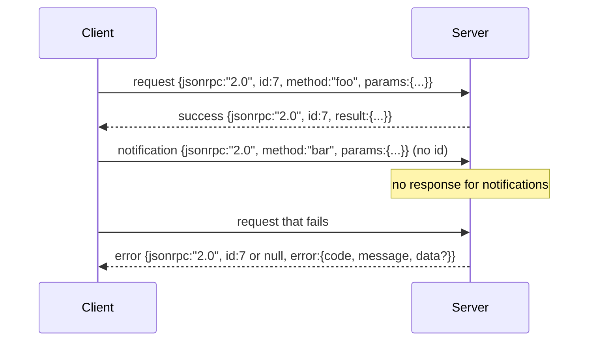

# 基于换行分隔 Stdio 的 JSON-RPC 2.0

> 模型客户端与工具服务器之间的传输层就是基于 stdio 的 JSON-RPC。亲手实现一次，你就会明白每个帧（framing）层到底在为什么买单。

**Type:** Build
**Languages:** Python
**Prerequisites:** Phase 13 lessons 01-07, Phase 14 lesson 01
**Time:** ~90 minutes

## 学习目标
- 使用换行分隔 JSON（newline-delimited JSON）的帧格式，通过 stdin 和 stdout 收发 JSON-RPC 2.0 消息。
- 掌握五个标准错误码（-32700、-32600、-32601、-32602、-32603）的映射关系，并以正确的语义对外暴露。
- 区分请求（request）、响应（response）、通知（notification）和批量调用（batch），不发明任何新的信封字段。
- 每行一个解析错误单独处理，不污染流中的其余内容。
- 用 io.BytesIO 构建一个自我终止的演示程序，让本课无需派生子进程即可运行。

## 为什么 JSON-RPC 始终是通用语言

2026 年的一个编码智能体，单次会话可能要和十几个工具服务器对话。每个服务器都是一个独立进程或远程端点。而线缆格式自 2013 年起就没变过。JSON-RPC 2.0 是一份只有两页的规范。它能存活下来，是因为各种替代方案（gRPC、每次调用一个 HTTP 请求、自定义二进制协议）都强加了 JSON-RPC 没有的取舍：它们要么牺牲流式传输，要么牺牲批量调用，要么与传输层耦合。JSON-RPC 在 stdio、socket、websocket 和 HTTP 上是对称的，只要双方遵守规范，客户端就能驱动一个它从未见过的服务器。

本课构建的是 stdio 变体。换行分隔的 JSON。每个请求一行。每个响应一行。传输边界就是 `\n`。

## 线缆格式

信封一共有四种形态。两种由客户端发出，两种由服务器发出。



通知没有 `id`。服务器绝不能对它做出响应。如果服务器对通知返回了响应，客户端将无法把它关联到任何调用点。正是这一条规则让帧的对账逻辑保持简单。

批量调用是一个由请求或通知组成的 JSON 数组。服务器回复一个响应数组，顺序任意，每个非通知条目对应一个响应。如果批量中的所有条目都是通知，服务器什么也不返回。

## 五个错误码

```text
-32700  Parse error      JSON could not be parsed
-32600  Invalid Request  Envelope shape is wrong
-32601  Method not found
-32602  Invalid params
-32603  Internal error
```

-32000 到 -32099 之间的错误码保留给服务器自定义错误。其余范围都属于应用层自定义。本课只用这五个。如果你的处理函数抛出异常，传输层会把它包装为 -32603，并把异常类名放进 `data.exception`。

解析错误有一条特殊规则：响应中的 `id` 为 `null`，因为请求根本没有解析到能提取出 id 的程度。

## 换行帧与 BytesIO 演示

传输层一次读取一行。一行就是直到并包含 `\n` 的所有字节。如果某一行无法解析，传输层会写出一个 `id: null` 的 -32700 响应，然后继续。流不会被污染。下一行会被重新解析。

在本课中，我们用一对 `io.BytesIO` 来充当 stdin 和 stdout。服务器读取请求直到 EOF，为每个请求写出响应，然后返回。客户端再把响应读回来。不派生进程。没有超时。传输行为和真实的子进程管道完全一致，因为 Python 的 `io` 接口提供同样的 `.readline()` 和 `.write()` 契约。

## 方法分发

传输层并不知道存在哪些方法。它把工作交给由测试框架提供的一个可调用对象 `handler(method, params)`。该处理函数要么返回结果，要么抛出异常。三类异常对应三个特定错误码。

```text
MethodNotFound -> -32601
InvalidParams  -> -32602
Anything else  -> -32603 with exception name in data
```

传输层永远看不到工具注册表（registry）。注册表位于处理函数之后。这正是我们想要的分层：传输层只讲 JSON-RPC，注册表只讲工具的形态，而调度器（第二十三课）把两者缝合在一起。

## 出错时的流行为

```text
client writes              server reads             server writes
---------------            -----------              -------------
{...valid request...}      parses ok                {...response, id matches...}
{...broken json...         parse fails              {id:null, error: -32700}
{...valid request...}      parses ok                {...response, id matches...}
{...missing method...}     invalid envelope         {id:X, error: -32600}
```

一行损坏的 JSON 不会终止循环。缺失 `method` 字段不会终止循环。处理函数抛出异常也不会终止循环。传输层会一直读取，直到 EOF。

## 通知与非对称流程

通知是发后即忘（fire-and-forget）的。测试框架用通知来传递进度事件、取消信号和日志行。通知让一个长时间运行的工具能够流式上报状态更新，而无需为每条更新做一次往返。

本课实现了一个出站通知辅助函数 `write_notification`。服务器用它在请求处理过程中发出进度信息。演示展示了这个模式：一个请求进来，处理函数发出两条进度通知，然后写出最终响应。

## 如何阅读代码

`code/main.py` 定义了 `StdioTransport`、解析辅助函数（`parse_request`）、三个写出辅助函数（`write_response`、`write_error`、`write_notification`），以及分发循环 `serve`。错误码常量位于模块级作用域。

`code/tests/test_transport.py` 覆盖了五个错误码、通知（不写出任何响应）、批量调用（数组进、数组出、通知被跳过）、损坏的 JSON（解析错误后继续运行），以及处理函数在调用过程中写出通知的非对称流程。

## 更进一步

这个传输层对后续课程来说已经足够。生产级传输层会再加三样东西：一个能在转发中存活的关联 id 字段（你的 `id` 已经扮演这个角色，但在服务网格中你还需要一个外层 trace id）；一个取消通道（类似 `$/cancelRequest` 的通知，携带正在处理的调用的 id）；以及一次内容类型协商握手，让同一个 socket 既能讲 JSON-RPC 又能讲 Streamable HTTP。这些都不改变线缆格式，它们只是添加元数据。
