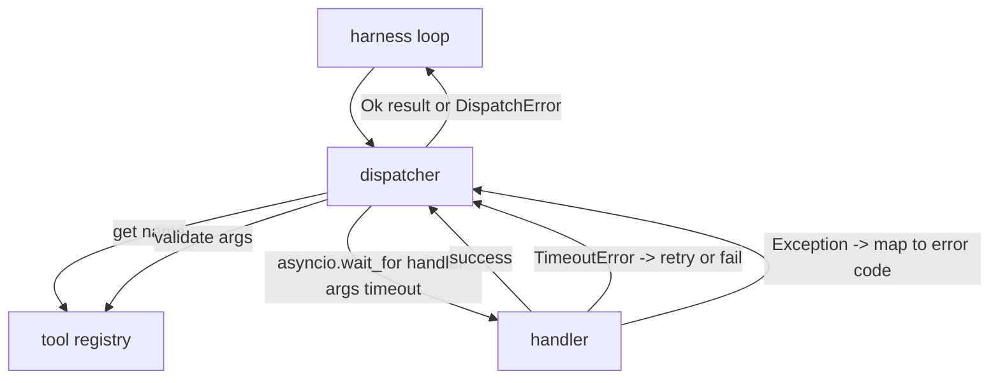
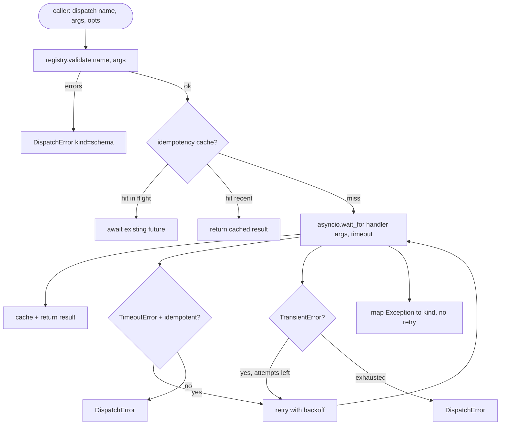

# 函数调用调度器

> 调度器是 harness 为 schema 许下的每个承诺买单的地方。超时、重试、去重、错误映射——全部集中在这一个接缝上。

**Type:** Build
**Languages:** Python
**Prerequisites:** Phase 13 lessons 01-07, Phase 14 lesson 01
**Time:** ~90 minutes

## 学习目标
- 给工具处理函数包上单次调用级别的超时控制，超时后返回带类型的错误，而不是把整个循环挂死。
- 实现带抖动（jitter）和最大尝试次数限制的指数退避重试。
- 基于幂等键（idempotency key）对重试去重，确保与缓慢的原始请求竞速的重试不会执行两次。
- 把处理函数抛出的异常和传输层故障统一映射为 harness 循环已经能理解的单一错误信封（error envelope）。
- 用并发上限约束并行调度，使四十个工具调用同时扇出时不会耗尽事件循环。

## 调度器的位置

它位于 harness 循环（第二十课）和工具注册表（第二十一课）之间。传输层（第二十二课）向循环输送数据。循环把工具调用交给调度器。调度器查询注册表、运行处理函数，然后返回结果或一个 JSON-RPC 形状的错误信封。



调度器是唯一知道定时器、重试和幂等性的层。循环不知道，注册表不知道，处理函数也不知道。这种隔离正是设计的关键。

## 超时

每个工具都有默认超时时间。注册表记录中携带 `timeout_ms`。当 harness 传入单次调用级别的覆盖值时，调度器会用它覆盖默认值。我们使用 `asyncio.wait_for`。一旦超时，处理函数任务会被取消，调度器返回 `DispatchError(kind="timeout")`。

对于非幂等工具，超时默认不是可重试错误。一个超时的 `db.write` 可能已经提交，也可能没有。重试会导致重复写入。调度器遵循注册表记录中的 `idempotent` 标志：幂等工具重试，非幂等工具不重试。

## 指数退避重试

重试策略是最多三次尝试。退避采用带抖动的指数策略。

```text
attempt 1  -> delay 0
attempt 2  -> delay 0.1s * (1 + random[0..0.5])
attempt 3  -> delay 0.4s * (1 + random[0..0.5])
```

只有 `timeout` 和 `transient` 错误会重试。`schema` 错误、`not_found` 或 `internal` 错误不重试。Schema 错误是确定性的——重试不会改变结果，只会白白消耗预算。

重试循环遵守 harness 给定的预算。如果调用方的预算剩余工具调用次数为零，调度器在第一次尝试时就快速失败，返回 `kind="budget_exceeded"`。

## 幂等键去重

原始请求仍在途中时重试就已触发，这是一个真实存在的生产事故。第一次调用卡在 4.9 秒（刚好低于超时阈值），重试在 5 秒时发出。现在两个请求同时打向同一个后端。如果这个工具是 `payments.charge`，你就扣了两次款。

调度器接受一个可选的 `idempotency_key`。如果同一个键对应的调用仍在途中，调度器会等待那个在途的 future 并返回它的结果。缓存会在调用完成后将键保留六十秒，以吸收姗姗来迟的重试。

键由调用方负责生成。harness 从规划器派生它：`f"{step_id}:{tool_name}:{hash(args)}"`。调度器不会自己发明键，因为仅凭参数派生键会让两个语义不同的调用看起来一模一样。

## 错误信封

失败的调度返回单一形状的结构。

```text
DispatchError
  kind        : "timeout" | "transient" | "schema" | "not_found" | "internal" | "budget_exceeded"
  message     : str
  attempts    : int
  jsonrpc_code: int   (one of -32601, -32602, -32603)
```

harness 循环把 `kind` 映射到下一个状态。`schema` 和 `not_found` 进入 `on_error` 并触发重新规划。`timeout` 和 `transient` 进入 `on_error`，是否重新规划取决于尝试次数。`budget_exceeded` 触发 `on_budget_exceeded`。

## 扇出的并发上限

`gather(*calls)` 会同时运行所有协程。四十个工具调用就意味着四十个打开的 socket 或四十条子进程管道。大多数后端都不喜欢来自单个客户端的四十个并行连接。

调度器用信号量（semaphore）包住 `gather`。默认并发上限是八。每个调用在调度前获取信号量，完成时释放。调用方看到的输出仍是 `gather` 的形状，但实际调度被限制在上限之内。

## 单次调用的流程



## 如何阅读代码

`code/main.py` 定义了 `Dispatcher`、`DispatchError` 和 `TransientError`。调度器在构造时接收一个注册表。异步方法 `dispatch(name, args, ...)` 是唯一的入口。单次尝试的超时通过 `asyncio.wait_for` 在 `_run_with_retries` 内部内联施加。`gather_bounded(calls)` 在并发上限约束下批量运行多个调度。

`code/tests/test_dispatcher.py` 覆盖了：超时触发、瞬时错误重试、schema 错误不重试、幂等去重（两个使用相同键的并发调用被合并为一次处理函数调用），以及并发限制（信号量的实际效果）。

测试使用 `asyncio.sleep(0)` 和基于 `Counter` 的确定性处理函数，因此能在毫秒内完成，且不依赖真实时钟。

## 更进一步

生产级调度器通常会加两个扩展。第一，在每次状态转换处做结构化日志（循环的事件流已经提供了这一点，但调度器还应该额外发出 `dispatch.attempt` 和 `dispatch.retry` 事件）。第二，熔断器（circuit breaker）：当某个工具在一个时间窗口内失败 N 次后，进入冷却期，期间调度直接返回 `kind="circuit_open"`，不再尝试执行处理函数。这两个扩展都可以叠加在这个调度器之上，无需改动契约。

第二十四课会把调度器接入一个 plan-and-execute 智能体，让你看到四个组件协同运转的全貌。
