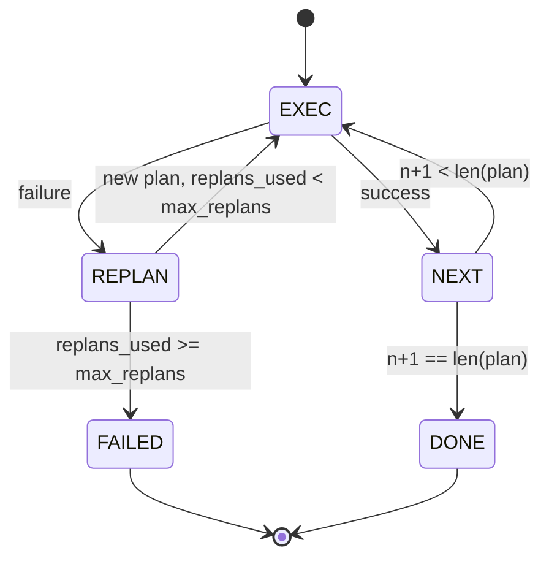

# Plan-Execute 控制流

> 经不起一次失败的计划只是脚本。能够重新规划的脚本才是智能体。先把重规划器（replanner）造出来。

**Type:** Build
**Languages:** Python
**Prerequisites:** Phase 13 lessons 01-07, Phase 14 lesson 01
**Time:** ~90 minutes

## 学习目标
- 将计划表示为一个有序的类型化步骤列表，让执行器能够推断进度和结果。
- 按顺序执行各个步骤，并在失败时以受控的方式将控制权交还给规划器。
- 从当前游标位置重新规划，并把上一次的错误放进上下文，使下一份计划有据可依。
- 每次修订计划时输出一份计划差异（plan diff），让下游的追踪器或 UI 能展示计划为何变化。
- 强制执行两条预算：硬性的步骤数上限和硬性的重规划次数上限。

## 计划加执行，而非链式思考

链式思考（chain-of-thought）智能体不断输出 token，由循环去猜测工具调用在哪里结束。计划-执行（plan-and-execute）智能体则先输出一份结构化的计划，再确定性地执行每个步骤。计划是宿主框架（harness）可以审视的数据。执行就是宿主框架把这份数据交给分发器去跑。

两个部件。一个产出计划的规划器。一个运行计划的执行器。真正有意思的地方在于执行器碰到失败时会发生什么。有三个选项：

```text
1. Abort         (return failed, surface the error)
2. Skip          (mark step failed, continue with the rest)
3. Replan        (hand the error to the planner, get a new plan from the cursor)
```

重新规划（Replan）正是把脚本变成智能体的那一个。

## Step 的结构

```text
Step
  id              : int           (monotonic within a plan revision)
  tool_name       : str
  args            : dict
  expected_outcome: str           (planner's stated success condition)
  result          : Any | None
  error           : str | None
```

`expected_outcome` 是规划器在生成步骤时附带输出的一句简短描述。执行器不会强制校验它。它有两个用途：重规划器在修订计划时会读取它；事件流会把它发出去，让追踪器能够展示"这一步本来应该做 X"。

## 规划器的形态

```python
def planner(goal: str, history: list[Step], last_error: str | None) -> list[Step]:
    ...
```

一个纯函数。`goal` 是用户目标。`history` 是已经执行过的步骤（结果和错误均已填好）。`last_error` 在首次调用时为 None，此后每次调用都是最近一次失败的错误信息。规划器返回从游标位置开始的下一份计划。

规划器对执行器一无所知。它不知道重试，也不知道超时。它只产出计划。仅此而已。

## 执行器

执行器是一台小型状态机。每个步骤都经过分发器运行。结果只有三种：成功、可重规划的失败、致命失败。可重规划的失败会把控制权交还给规划器。致命失败（预算超限、重规划次数触顶）则返回一个 `FAILED` 的会话结果。



## 修订时的计划差异

当规划器在失败后返回新计划时，执行器会发出一个带有三个字段的 `plan.diff` 事件。

```text
removed: list of step ids that were in the old plan and are not in the new
added  : list of step ids in the new plan that were not in the old
revised: list of step ids whose tool_name or args changed
```

追踪器或 UI 可以把它渲染成：被移除的步骤打删除线，新增的步骤高亮显示。重点不在于差异的格式，而在于修订是一个可见的事件，而不是一次悄无声息的改写。

## 两条预算，都是硬性的

`max_steps` 限制整个会话中步骤执行的总次数，包含重规划之后的执行。默认值为十二。一个线性的五步计划如果重规划两次、每次新增三步，就会达到十六次执行，超出预算。此时执行器会拒绝这次重规划并返回 FAILED。

`max_replans` 限制首份计划之后规划器被调用的次数。默认值为五。这是更重要的那条限制。如果一个规划器连续五次返回同样的坏计划，没有这条限制它会一直循环，直到被步骤预算拦下。给重规划设上限，能让失败来得更快、原因更清楚。

## 本课中的确定性规划器

本课不会调用模型。这节课附带一个确定性规划器，根据 `last_error` 来选取计划。

```text
last_error is None    -> emit a four-step plan
last_error matches X  -> emit a three-step plan that routes around X
last_error matches Y  -> emit a two-step plan that gives up gracefully
otherwise             -> return [] (signals nothing to replan)
```

这足以测试执行器在每一条转移路径上的行为：成功、重规划一次、重规划两次、重规划次数耗尽，以及步骤预算耗尽。

## 结果的结构

```text
SessionResult
  status      : "completed" | "failed"
  reason      : str     ("goal_met" | "step_budget" | "replan_budget" | "no_plan")
  history     : list[Step]
  revisions   : list[PlanDiff]
  events      : list[Event]
```

第二十课的宿主循环可以直接读取这个结果。第二十三课的分发器负责执行每个步骤。第二十一课的注册表负责校验每个步骤的参数。第二十二课的传输层则会把整个流程通过 JSON-RPC 暴露给模型客户端。

## 如何阅读代码

`code/main.py` 定义了 `PlanExecuteAgent`、`Step`、`PlanDiff`、`SessionResult` 以及确定性规划器。执行器是一个单独的 `run(goal)` 方法，返回一个 `SessionResult`。计划差异通过比较步骤 id 和 `(tool_name, args)` 元组来计算。

`code/tests/test_agent.py` 覆盖了以下场景：线性成功、计划中途失败并重规划一次、重规划次数耗尽并返回 `failed:replan_budget`、步骤预算耗尽，以及计划差异事件的格式。

## 更进一步

一旦把它接到真实模型上，你会想要两个扩展。第一，部分计划缓存：当一份六步计划前三步成功、随后失败时，你不会想重跑前三步。执行器本来就保存着历史；规划器只需要去读它。第二，并行分支：当前的执行器是严格顺序执行的。如果规划器输出一个独立分支（用 `gather_step` 替代 `next_step`），就可以通过分发器并发地运行两个工具调用。

这两个扩展都会增加实打实的复杂度。也都是在线性执行器定型之后才更容易加上去。而这正是本课要做的事。
