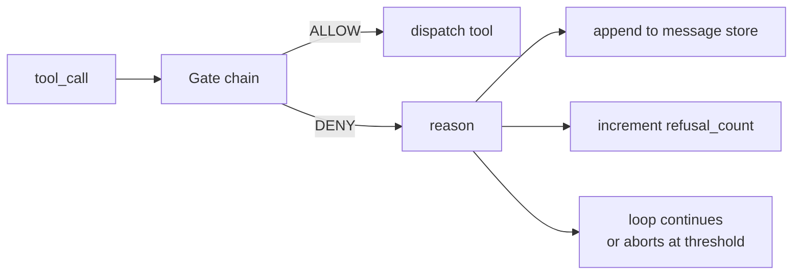
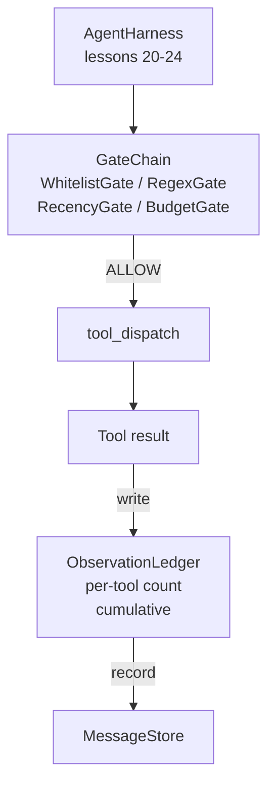

# 毕业设计第 25 课：验证门与观察预算

> 没有验证层的智能体框架，不过是披着风衣的一厢情愿。本课要构建一条确定性的门链（gate chain），由它决定一次工具调用是否允许执行、智能体能看到多少输出，以及当智能体读得太多时循环何时必须停止。这条链由一组小而具名的门（gate）加上一个观察台账（observation ledger）组成，台账记录模型被展示过的每一个 token。

**Type:** Build
**Languages:** Python (stdlib)
**Prerequisites:** Phase 19 · 20-24 (Track A1: agent loop, tool registry, message store, prompt builder, model router), Phase 14 · 33 (instructions as constraints), Phase 14 · 36 (scope contracts), Phase 14 · 38 (verification gates)
**Time:** ~90 minutes

## 学习目标

- 构建一个带有确定性 `evaluate(call)` 方法的 `VerificationGate` 协议。
- 将预算、新近度、白名单和正则四种门组合成一条具有短路语义的链。
- 通过按工具和轮次（turn）索引的 `ObservationLedger` 跟踪每一次观察。
- 当累计观察预算将被超出时，拒绝该工具调用。
- 输出结构化的 `GateDecision` 记录，供下游可观测性系统消费。

## 问题背景

当智能体框架放任模型自由调用工具时，真实使用的第一个小时内就会冒出三类 bug。

第一类是无界观察。在一个 20 万行的代码仓库里执行一次 grep，会把 50 万 token 的输出倾倒进下一轮对话。模型每千字节才看到一个匹配项，其余上下文全被浪费。token 账单很高，而智能体在任务上反而变得更差，而不是更好。

第二类是新近度失效。一个长时间运行的任务累积了五十次工具调用。模型把第三轮的第一次 read_file 当作实时状态来重读，而第四十七轮所做的编辑从未出现——因为提示词构建器（prompt builder）把最早的观察序列化在了最前面。

第三类是权限蔓延。一个研究任务从调用 `web_search` 开始，最后却不知怎么跑起了 `shell`——模型凭空发明了一个工具名，而框架默认放行。等到有人去读执行轨迹时，/tmp 里已经躺着一个垃圾文件，一条 curl 已经打到了某个私有 API 上。

验证门（verification gate）就是框架中负责说"不"的组件。它不是模型，也不是裁判。它是一个关于 `(call, history, ledger)` 的确定性函数，返回 ALLOW 或 DENY 以及一条理由。理由会被记入日志，模型会被告知，循环则继续或中止。

## 核心概念



任何带有 `evaluate(call, ctx) -> GateDecision` 方法的对象都是一个门。门链是一个有序列表，求值在第一个 deny 处短路。顺序很重要：廉价的结构性门要排在昂贵的 token 计数门之前。

本课交付四个门：

- `WhitelistGate`。允许的工具名是一个显式集合，集合之外一律拒绝。这是最廉价的门，排在第一位。
- `RegexGate`。用正则匹配工具参数。适合拒绝带 `rm -rf` 的 shell 调用，或指向内网 IP 的 HTTP 调用。仅作用于调用载荷本身，是纯函数。
- `RecencyGate`。模型只能看到最近 N 轮的观察，更早的观察会被遮蔽。如果一次工具调用的结果会延续一个已经过期的观察窗口，该门就拒绝它。
- `BudgetGate`。模型在整个会话中累计读取的 token 数有一个上限。当台账显示已触及上限时，之后的所有工具调用都被拒绝。

观察台账负责记账。每一次成功的工具调用写入一行：工具名、轮次、产生的 token 数、累计值。台账回答两个问题：模型总共看了多少，以及它看了工具 X 多少。预算门读第一个问题的答案；按工具计的预算门——你将在练习中编写——读第二个。

## 架构



框架向门链发问，门链要么点头要么拒绝。点头时，工具运行，台账计数，结果追加到消息存储；拒绝时，拒绝信息以系统消息的形式交给模型，由循环决定重试还是中止。

## 你将构建什么

实现就是一个 `main.py` 外加测试。

1. `Observation` 和 `ToolCall` 两个 dataclass 定义传输数据结构。
2. `ObservationLedger` 记录 `(turn, tool, tokens)` 行，并回答 `cumulative()` 和 `per_tool(name)`。
3. `GateDecision` 携带 `(allow, reason, gate_name)`。
4. `VerificationGate` 是协议，每个门都实现 `evaluate(call, ctx)`。
5. `GateChain` 包装一个有序列表：依次调用每个门，返回第一个 deny；若全部通过则返回 allow。
6. 演示程序运行一个微型的合成智能体循环，共三轮。第三轮触发预算门，循环以非零的拒绝计数干净地报告一次拒绝。

token 计数器刻意用了一个粗糙的 `len(text) // 4` 启发式。本课的重点是门的管线，不是分词器。生产环境请换成真正的分词器。

## 为什么门链顺序很重要

一次 deny 比一次 allow 更便宜。`WhitelistGate` 是 O(1) 哈希查找，`RegexGate` 是 O(pattern * argv)，`RecencyGate` 只读消息存储的一小段切片，而 `BudgetGate` 要读整个台账。按成本升序排列，被拒绝的调用就能在做昂贵工作之前短路。

你还要按影响范围（blast radius）排序。白名单是最强的断言：这个工具不在契约之内。正则门次之：这个参数不在契约之内。新近度再往后：框架仍然关心，但调用在结构上是合法的。预算门排在最后，因为按定义，它只在其他门都放行之后才会触发。

## 它如何与 Track A 的其余部分组合

前几课交付了循环、工具注册表、消息存储、提示词构建器和模型路由器。本课加上模型与工具之间的这一层。第 26 课交付沙箱——门链说出 ALLOW 之后，分发器把工具调用交给它；第 27 课交付评估框架，将拒绝计数记录为质量信号；第 28 课把门的决策接入 OpenTelemetry span；第 29 课把这一切缝合成一个可工作的编码智能体。

## 运行

```bash
cd phases/19-capstone-projects/25-verification-gates-observation-budget
python3 code/main.py
python3 -m pytest code/tests/ -v
```

演示程序逐轮打印执行轨迹，包含每一次门决策，并以零退出码结束。测试覆盖台账、各门的独立行为、门链短路，以及合成循环的端到端流程。
