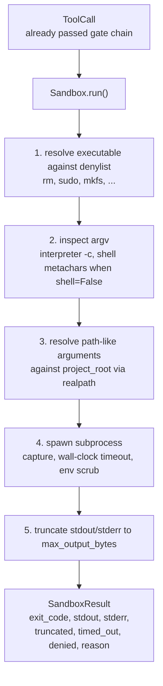
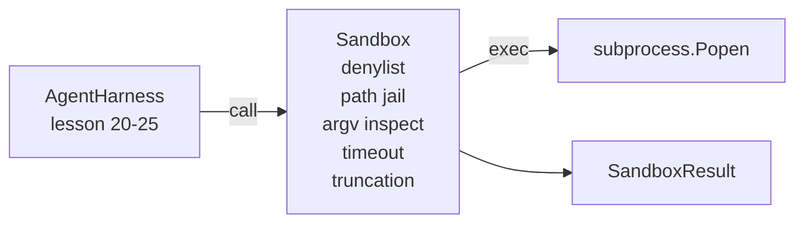

# 顶点项目第 26 课：带拒绝清单与路径牢笼的沙箱运行器

> 验证门禁决定一次工具调用该不该执行，沙箱则决定它执行时会发生什么。本课要交付一个子进程运行器：它拒绝危险的可执行文件、拒绝危险形态的 argv、把所有文件路径关进项目根目录的牢笼、截断超大输出，并在墙钟超时后强制终止失控进程。它是横在模型与操作系统之间两道防线中的第二道。

**Type:** Build
**Languages:** Python (stdlib)
**Prerequisites:** Phase 19 · 25 (verification gates and observation budget), Phase 14 · 33 (instructions as constraints), Phase 14 · 38 (verification gates)
**Time:** ~90 minutes

## 学习目标

- 构建一个 `Sandbox` 类，封装 `subprocess.run`，支持超时、输出捕获和截断。
- 既能按名称对照拒绝清单（denylist）拒绝命令，也能按结构通过 argv 检查器拒绝命令。
- 拒绝任何解析后落在声明的项目根目录之外的路径参数。
- 在关闭 shell 模式时拒绝 shell 元字符。
- 返回结构化的 `SandboxResult`，供下游可观测性组件和评测框架直接消费。

## 问题背景

一个能执行 shell 命令的编程智能体，可以在一轮对话里装后门、外泄密钥、把开发者的笔记本搞成砖头，再刷爆一笔云账单。代价最低的防御是干脆不给它 shell；代价次低的，是一个能对一组精确模式说「不」的沙箱。

智能体执行轨迹中反复出现三类失败。

第一类是危险的可执行文件。一个急于修复路径问题的模型会尝试 `sudo`、`chmod -R 777`、`rm -rf`、`mkfs`、`dd`。这些都不该出现在智能体运行中。拒绝清单按名称和别名将它们拦截。

第二类是 argv 花招。被告知不能用 shell 的模型，会借解释器把攻击管道化：`python3 -c "import os; os.system('rm -rf /')"`、`bash -c '...'`、`node -e '...'`、`perl -e '...'`。沙箱必须明白：任何带 `-c` 类标志运行的解释器，本质上就是绕了个弯的 shell 调用。

第三类是路径逃逸。模型被要求读取 `./src/main.py`，却去读 `../../etc/passwd`。沙箱通过 `os.path.realpath` 解析每个路径参数并断言其前缀，把路径关进牢笼。

这个沙箱不是操作系统意义上的安全边界。一个握有代码执行权的坚定攻击者仍然能突破它。它是开发期的护栏：让常见失败模式发出响亮的告警，并阻止智能体纯粹因为笨拙而造成破坏。

## 核心概念



沙箱有四条拒绝轴线：名称、argv、路径、结构。每条轴线都是对调用本身的纯函数判定，此时尚未触碰子进程。只有所有轴线全部通过，子进程才会被启动。

`SandboxResult` 的退出码沿用惯例：0 表示成功，非零表示失败，另外加三个哨兵码——denied（-100）、timed_out（-101），以及 truncated（退出码保留真实值，仅置一个标志位）。后续课程读取这个结构化结果，而不是去解析 stderr。

## 架构



拒绝清单是一个由可执行文件基础名（basename）组成的 frozenset。各种别名（`/bin/rm`、`/usr/bin/rm`）都会解析到同一个基础名。argv 检查器懂得解释器的形态：只要 argv[0] 是解释器且后续任一参数以 `-c` 或 `-e` 开头，调用即被拒绝。当调用没有显式请求 shell 时，出现 shell 元字符（`;`、`|`、`&`、`>`、`<`、反引号、`$()`）就会触发拒绝。

路径牢笼是最微妙的一环。沙箱在构造时接收一个 `project_root`。任何看起来像路径的参数（包含 `/` 或匹配某个已存在的文件）都先经 `os.path.realpath` 规范化，再与项目根目录的 realpath 比对。若解析后的目标不在根目录之下，则拒绝。符号链接逃逸（项目根目录内的符号链接指向外部）会被挡住，因为检查的是 realpath 而不是字面路径。

## 你将构建什么

实现由 `main.py` 加一个 tests 目录组成。

1. `SandboxResult` 数据类：exit_code、stdout、stderr、truncated、timed_out、denied、reason、duration_ms。
2. `SandboxConfig` 数据类：project_root、max_output_bytes、timeout_seconds、denylist、interpreter_block。
3. `Sandbox` 类：`run(argv, *, shell=False, cwd=None)` 返回一个 `SandboxResult`。
4. 内部拒绝辅助函数：`_check_executable_denylist`、`_check_argv_interpreter`、`_check_shell_metachars`、`_check_path_jail`。
5. 输出截断，带明确的 `truncated` 标志，并在捕获流中插入一行标记。
6. 文件底部的演示：一连串正常调用与对抗性调用，逐一展示各自的结果。

沙箱默认以 `shell=False` 和 `capture_output=True` 调用 `subprocess.run`。墙钟超时通过 `timeout` 参数实现；捕获到 `TimeoutExpired` 时，沙箱杀掉整个进程组并合成一个 SandboxResult。

## 为什么这不是真正的沙箱

本课的沙箱不使用命名空间、cgroups、seccomp、gVisor、Firecracker 或任何内核级隔离。子进程能做的事，沙箱本身都做得到。它的保护是结构性的：拒绝智能体最常见的危险调用，并把响亮的拒绝记录进可观测性系统，而不是悄无声息地放行执行。

生产环境的智能体要在此之上再加层：跑在无特权的 Docker 容器里、跑在 microVM 里、丢弃 capabilities、把项目根目录以只读方式挂载并额外挂一个可读写的临时目录、用 ulimit 限制内存和 CPU、把环境变量清洗成已知安全的白名单。第 29 课会做其中一部分。操作系统级隔离不在本课范围内。

## 运行方式

```bash
cd phases/19-capstone-projects/26-sandbox-runner-denylist
python3 code/main.py
python3 -m pytest code/tests/ -v
```

演示程序创建一个临时目录，放入一个干净文件，然后跑一组调用。合法调用成功；被拒调用返回 `denied=True` 且附带 reason 的 SandboxResult；超时返回 `timed_out=True`；截断置 `truncated=True`。演示打印一张 JSON 结果表，并以零退出码结束。

## 它如何与 Track A 的其余部分组合

第 25 课产出了门禁链。第 26 课是门禁判定 ALLOW 之后实际执行的执行器。第 27 课的评测框架会把沙箱结果与每个任务预期的退出码做比对。第 28 课在每次 `Sandbox.run` 调用外层发出一个 `gen_ai.tool.execution` span。第 29 课的端到端演示把一个真实的编程智能体接入这两道防线。
