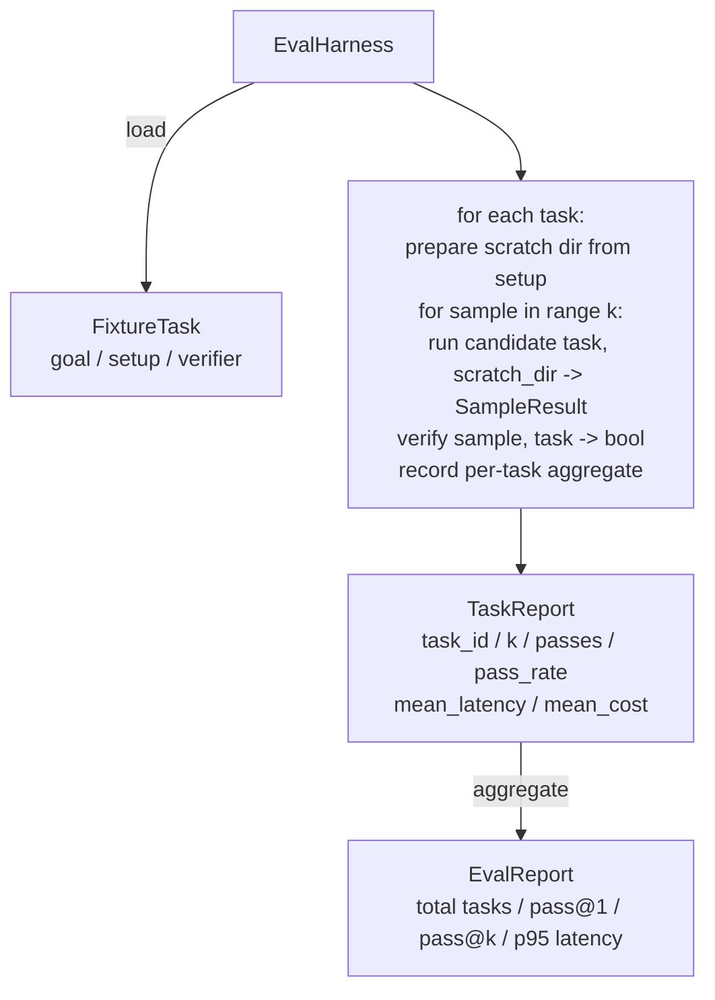

# 毕业项目第 27 课：基于固定任务集的评估框架

> 一个编码智能体的水平，取决于你用来衡量它的任务集。本课构建一个评估框架（eval harness）：它读取一个固定任务（fixture task）目录，把每个任务交给候选智能体执行，通过确定性的验证器判定通过或失败，并将结果汇总为 pass@1、pass@k、平均延迟和平均成本。这个框架是事实的最终依据，让你能够分辨一次回归和一次重构。

**Type:** Build
**Languages:** Python (stdlib)
**Prerequisites:** Phase 19 · 25 (verification gates), Phase 19 · 26 (sandbox runner), Phase 14 · 30 (eval-driven agent development), Phase 14 · 19 (SWE-bench and GAIA benchmarks)
**Time:** ~90 minutes

## 学习目标

- 将固定任务定义为目标、初始环境、验证器组成的三元组。
- 对每个任务进行多次采样运行打分，并计算 pass@1 和 pass@k。
- 把延迟和成本汇总为均值与第 95 百分位指标。
- 将确定性验证器（文件比对、退出码、正则匹配）封装为可复用的函数。
- 输出结构化的 JSON 报告，供回归跟踪脚本直接读取。

## 问题背景

没有评估框架的智能体基准测试会反复遭遇三种失败模式。

第一种是未经验证的「通过」。智能体声称修好了 bug，人扫了一眼 diff，测试套件就被标成了绿色，三周后回归测试又暴露出同一个 bug。智能体只是给出了看似合理的推理，实际上什么也没修。

第二种是未被察觉的回归。一次提示词模板的改动让智能体在显眼的任务上提升了 4%，却在不起眼的任务上下降了 14%。没有黄金任务集（goldset）和逐任务评分，这个回归会一路混进 main 分支，直到客户投诉才浮出水面。

第三种是任务集漂移。周一的评估跑了 100 个任务，周五只跑了其中 95 个，因为有人重命名了五个固定任务。通过率看上去提升了 5%。实际上并没有。

评估框架就是把这些失败变成事实的程序。它每次都以可复现的顺序运行每一个固定任务，由验证器在确定性的检查上返回真或假。

## 核心概念

```mermaid
flowchart LR
  F1[fixtures/task_001/<br/>task.json + expected/] --> Harness
  F2[fixtures/task_002/<br/>...] --> Harness
  Harness[Harness<br/>for each task:<br/>setup / run agent k samples /<br/>verify each sample /<br/>record latency, cost]
  Harness --> Report[EvalReport<br/>pass@1 / pass@k<br/>mean ms / p95 ms<br/>mean cost]
```

一个 `FixtureTask` 是一个小的 JSON 文件加上一个可选的 `expected/` 目录。JSON 中声明 `id`、`goal`（喂给智能体的提示词）、`setup` 块（要放入临时工作目录的文件）以及 `verifier` 块。验证器块指定框架验证器注册表中的某个函数名，并提供其参数。

三种验证器形态就能覆盖大多数有用的任务。

第一种是 `file_equals`。智能体运行结束后，把指定文件与期望内容做比对。这适用于「以这种确切方式修复这个 bug」的任务。

第二种是 `regex_match`。用正则表达式匹配指定文件的内容。这适用于「函数必须存在且返回 X」这类存在多种可接受解法的任务。

第三种是 `shell_exit_zero`。框架运行一条 shell 命令（通过第 26 课的沙箱），仅当命令以零退出码结束时才判定任务通过。这适用于「测试必须通过」的任务。

框架对每个任务运行 `k` 次。pass@k 的计算公式是 `1 - (1 - p)^k`，其中 p 是经验通过率；框架同时报告原始计数，以便你发现方差。延迟是每次采样的真实墙钟时间。成本由智能体自行上报（token 数、美元金额或两者皆有）；框架将其在所有采样上求和，并给出单任务和总体的数字。

```figure
pass-at-k
```

## 架构



候选智能体是一个可调用对象：`Callable[[FixtureTask, str], SampleResult]`。框架通过 `tempfile.mkdtemp()` 创建临时工作目录，并将其路径以普通字符串传入。框架不关心候选智能体内部如何工作。候选可以是一个确定性的补丁应用器（适合框架自测）、一个真实的 LLM 智能体，或是一个模糊测试器。契约就是 SampleResult。

## 你将构建什么

`main.py` 包含：

1. `FixtureTask` 数据类。
2. `SampleResult` 数据类：success_self_reported、latency_ms、cost_units、edits。
3. 带 `to_dict()` 的 `TaskReport`、`EvalReport` 数据类。
4. `VerifierRegistry`，将验证器名称映射到函数。内置验证器：file_equals、regex_match、shell_exit_zero。
5. `EvalHarness` 类。把一个任务目录跑在候选智能体上，返回 EvalReport。
6. 打包在 `tasks/` 中的五个固定任务：
   - `fizzbuzz` 中的差一错误（off-by-one）
   - `factorial` 中缺失的 return
   - 错误信息中的拼写错误
   - 空函数体
   - 链表遍历中的差一错误
7. 一个确定性的参考候选（`apply_known_fixes`），框架用它演示一次干净的 pass@1 = 1.0。
8. 演示程序打印 EvalReport 的 JSON 并以零退出码结束。

固定任务以 JSON 文件形式打包在 `tasks/` 中，并在 `tasks/<id>/buggy/` 和 `tasks/<id>/expected/` 下配有成对的源文件。框架把 buggy 复制到临时工作目录，交给候选智能体，再对照 expected 进行验证。

## 为什么要 pass@k 而不只是 pass@1

真实的 LLM 智能体是随机的。0.6 的 pass@1 看上去像是失败。而 0.95 的 pass@5 则说明智能体多数时候能得到正确答案，只是在早期采样中选错了。解决之道是采样加排序，而不总是更多训练。pass@k 让这一点变得可见。

pass@k 要与 pass@1 一并报告，因为 pass@k 会掩盖一种真实的失败：如果模型二十次尝试中只对一次，你拥有的并不是一个有用的智能体。框架两者都展示。

## 本课如何与 Track A 的其余部分组合

第 25 课产出了门控链。第 26 课产出了沙箱。本框架在任何 `shell_exit_zero` 验证器中使用该沙箱。第 28 课将每次框架运行包进一条 OTel trace。第 29 课用打包的固定任务之一运行端到端演示，并断言参考候选的 pass@1 = 1.0。

## 运行方式

```bash
cd phases/19-capstone-projects/27-eval-harness-fixture-tasks
python3 code/main.py
python3 -m pytest code/tests/ -v
```

演示程序以 JSON 形式打印 EvalReport，包括 pass@1、pass@5、平均延迟以及逐任务的明细。退出码为零。测试覆盖验证器函数、pass@k 的计算、固定任务加载，以及框架对打包参考候选的端到端运行。
