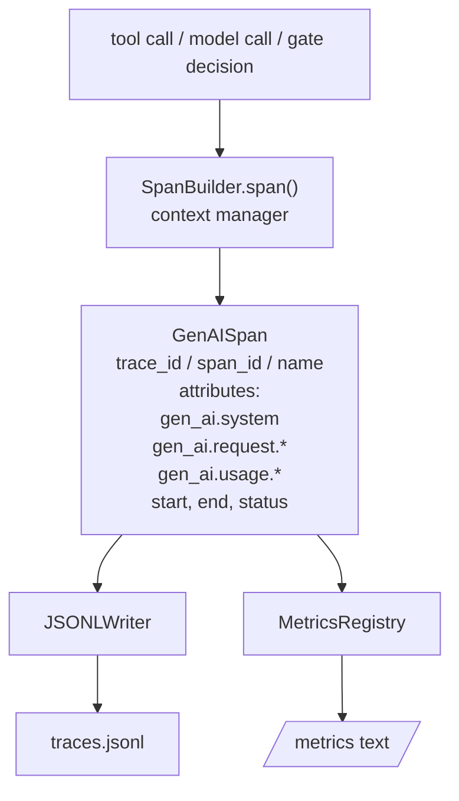
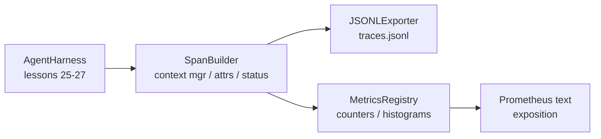

# 毕业项目第 28 课：基于 OTel GenAI Span 与 Prometheus 指标的可观测性

> 一个没有可观测性的智能体执行框架（agent harness）就是一个烧钱的黑盒。本课从零手写一个 span 构建器，输出符合 OpenTelemetry GenAI 语义约定的记录，以每行一个 span 的方式写入 JSON-Lines 文件，并以 Prometheus 文本格式暴露计数器和直方图。整个实现只用 Python 标准库，可完全离线运行。

**Type:** Build
**Languages:** Python (stdlib)
**Prerequisites:** Phase 19 · 25 (verification gates), Phase 19 · 26 (sandbox), Phase 19 · 27 (eval harness), Phase 13 · 20 (OpenTelemetry GenAI), Phase 14 · 23 (OTel GenAI conventions)
**Time:** ~90 minutes

## 学习目标

- 构建一个符合 OpenTelemetry GenAI 语义约定的 span 数据类。
- 实现一个 JSONL 导出器，每行写入一个自包含的 span。
- 构建带标签的计数器和直方图，并以 Prometheus 文本格式暴露。
- 用 span 上下文管理器包装任意可调用对象，记录执行时长、状态和异常。
- 验证输出的 span 能通过 `json.loads` 完成往返解析，且形状符合规范。

## 问题背景

生产环境中的编码智能体每一轮都会产生三类产物：一次模型调用、一次工具执行、一次验证门控（verification gate）决策。如果没有结构化遥测数据，这些产物都派不上用场。

第一种故障模式是链路追踪缺失。周二出了问题，但唯一的记录是一份 500 行的对话日志。哪个工具运行了、跑了多久、提示词消耗了多少 token、门控有没有拒绝过什么操作——统统没有记录。智能体的作者只能靠猜。

第二种故障模式是链路无法解析。执行框架确实写出了 span，但用的是自创的字段名。Grafana、Honeycomb、Jaeger 乃至本地 CLI 都读不了它们。团队技术栈里已有的工具全部白费，因为这些 span 不符合标准。

第三种故障模式是指标未聚合。你能在链路中看到某一次工具调用很慢，但无法回答「过去一小时 read_file 调用的 p95 延迟是多少？」，因为你只有链路，没有指标。

OpenTelemetry GenAI 语义约定正是为此而生。它定义了一小组标准属性，各 LLM 框架的 span 输出端共同遵守。只要你的执行框架写出这些属性，任何兼容 OTel 的后端都能读取它们。

## 核心概念



执行框架中的每个操作都会产生一个 span。一个 span 包含：trace id（标识整次智能体调用）、span id（标识这一次操作）、名称（如 `gen_ai.chat`、`gen_ai.tool.execution`）、遵循 GenAI 约定的属性、起止时间，以及状态。

GenAI 约定将这些属性键标准化：`gen_ai.system`（提供商，如 `anthropic`、`openai`）、`gen_ai.request.model`（模型 id）、`gen_ai.request.max_tokens`、`gen_ai.usage.input_tokens`、`gen_ai.usage.output_tokens`、`gen_ai.response.model`、`gen_ai.response.id`、`gen_ai.operation.name`，以及工具专用的键 `gen_ai.tool.name` 和 `gen_ai.tool.call.id`。

导出器写 JSONL：每行一个 JSON 对象。这是下游工具能流式读取、grep 检索和直接导入的最简单格式。真正的 OTel 导出器走的是 OTLP gRPC；本课的 JSONL 导出器是它的离线等价物，在任何工作站上都能以零退出码运行。

指标与链路并存。每次工具调用让计数器加一：`tools_called_total{tool="read_file"}`。直方图记录观测到的延迟：`tool_latency_ms{tool="read_file"}`。两者都序列化为 Prometheus 文本暴露格式（text exposition format），这是拉取式指标事实上的标准。

```figure
trace-spans
```

## 架构



span 构建器是一个小型类，其 `span(name, attrs)` 方法返回一个上下文管理器。该上下文管理器在进入时记录开始时间，退出时记录结束时间，若抛出异常则附加异常信息，最后把定稿的 span 推送给导出器。

指标注册表就是两个字典。计数器是 `{(name, frozen_labels): int}`。直方图把原始样本存在列表中，在暴露时才序列化为 Prometheus 直方图桶。

## 你将构建什么

`main.py` 包含：

1. `GenAISpan` 数据类：trace_id、span_id、parent_span_id、name、attributes、start_unix_nano、end_unix_nano、status、status_message、events。
2. `SpanBuilder` 类，带 `span(name, attrs, parent=None)` 上下文管理器。
3. `JSONLExporter` 类，其 `export(span)` 方法追加一行。
4. `Counter` 和 `Histogram` 类，外加 `MetricsRegistry`。
5. `prometheus_exposition(registry)`，生成文本格式输出。
6. `wrap_tool_call(name)` 装饰器，输出 span 并更新指标。
7. 演示程序：合成一次完整的智能体调用（gen_ai.chat span 包裹若干工具 span），写入 traces.jsonl，打印 Prometheus 暴露文本，以零退出码结束。

span id 和 trace id 是由 `os.urandom` 生成的 16 字节十六进制字符串，与 OTel 的 W3C trace context 一致。导出器永不抛出异常；IO 错误会被上报，但执行框架继续运行。

直方图采用固定桶集合（OTel 默认的毫秒延迟桶：5、10、25、50、100、250、500、1000、2500、5000、10000、+Inf）。样本以列表形式存储；暴露时按需计算每个桶的计数。

## 为什么手写而不是用 opentelemetry-sdk

OTel 的 Python SDK 是一个真实依赖。它有数千行代码，OTLP 导出器涉及多个进程，运行开销远超一节课的预算。手写版本教的是底层数据格式（wire format）。生产环境中，你把同样这套属性接进真正的 SDK，就能免费获得 OTLP 导出器、批处理和资源探测。

这套约定是稳定的。本课输出的数据格式到 2030 年依然可解析，因为 OTel 从不破坏已有的 GenAI 属性名，只会新增。

## 本课如何与 Track A 的其余部分组合

第 25 课产出了门控链。第 26 课产出了沙箱。第 27 课产出了评估框架。第 28 课让这三者都可观测。第 29 课会把端到端演示的每一步都包进 span，并在结尾打印 Prometheus 文本。

## 运行方式

```bash
cd phases/19-capstone-projects/28-observability-otel-traces
python3 code/main.py
python3 -m pytest code/tests/ -v
```

演示程序会在本课工作目录下生成 `traces.jsonl`（结束时清理），随后打印三个 span 样例，再打印计数器和直方图的 Prometheus 暴露文本。测试会验证：span 序列化可往返、规范的 GenAI 属性齐全、计数器正确递增、直方图暴露文本包含预期的桶计数。
