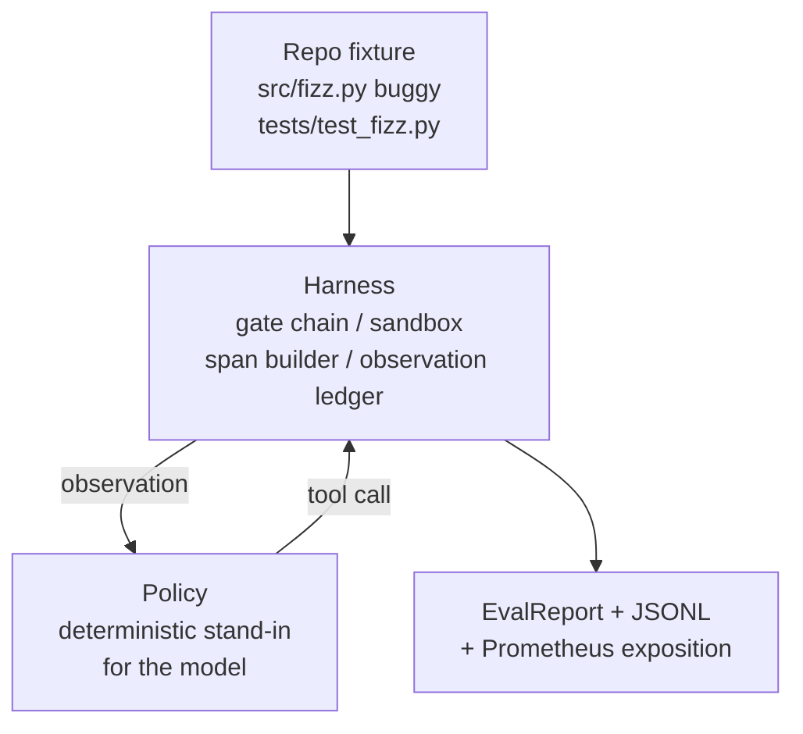
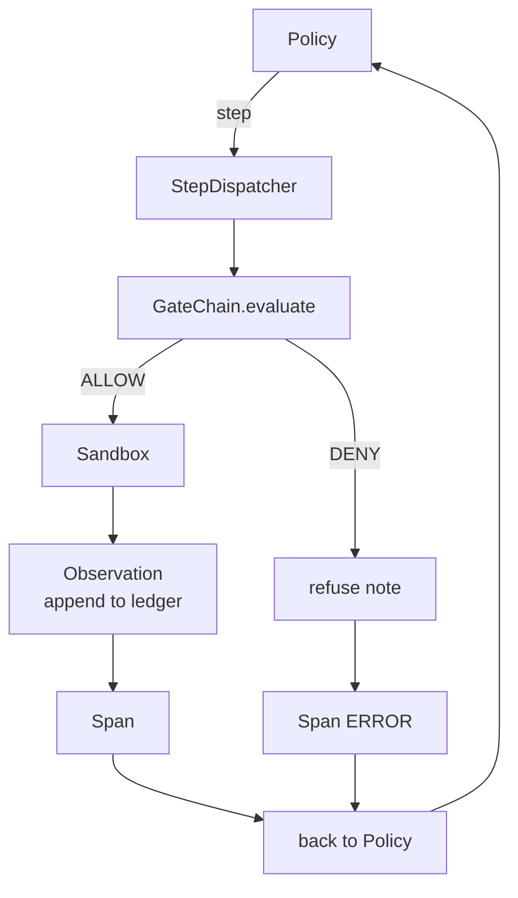

# 毕业设计第 29 课：在 Harness 上运行端到端编码智能体

> Track A 的收官之作。本课把门控链、沙箱、评测框架和 OTel span 拼装成一个可运行的编码智能体（coding agent），用它修复一个多文件 Python 项目中的真实（小型、fixture 规模）bug。这个智能体是一个确定性策略，而不是 LLM；这种替换让本课可复现，并且证明了 harness 才是真正有趣的部分。契约完全相同：真实模型可以直接接入策略这条接缝。

**Type:** Build
**Languages:** Python (stdlib)
**Prerequisites:** Phase 19 · 25 (verification gates), Phase 19 · 26 (sandbox), Phase 19 · 27 (eval harness), Phase 19 · 28 (observability), Phase 14 · 38 (verification gates), Phase 14 · 41 (workbench for real repos), Phase 14 · 42 (agent workbench capstone)
**Time:** ~90 minutes

## 学习目标

- 将门控链、沙箱、评测框架和 span 构建器组合成单一的智能体循环。
- 实现一个确定性策略，通过 read_file、run_tests 和 write_file 修复 fixture 中的 bug。
- 在端到端运行中同时执行全局步数预算和观测 token 预算。
- 为整次运行输出完整的 OTel GenAI 追踪和 Prometheus 指标。
- 验证智能体在 12 步以内解决 fixture 问题，且合法工具调用零门控拦截。

## 问题背景

大多数智能体演示都是孤立运行的：沙箱单独演示、评测框架单独演示、span 发射器单独演示。各自看起来都没问题。一旦组合起来，接缝处的问题就暴露了。

门控链判定 ALLOW，但沙箱以一个门控链没有预料到的理由拒绝执行。评测框架记录了通过，但 OTel span 显示门控拒绝了一个智能体声称自己用过的工具。Prometheus 计数器本该加一却加了两次。观测预算已经超限，但智能体仍在继续运行，因为预算是在门控链里跟踪的，沙箱并不知情。

本课就是整个 Track 的集成测试。智能体必须按顺序完成这些事：读取项目、运行测试、从测试失败中定位 bug、写入修复、重新运行测试、然后停止。每个操作都经过门控链。每次工具执行都经过沙箱。每一步都被包裹在 span 中。最后由评测框架对整个过程打分。

## 核心概念



智能体的策略是一个状态机，共五个状态。

`SURVEY`：智能体读取项目文件列表。下一个状态是 RUN_TESTS。

`RUN_TESTS`：智能体运行测试命令。如果测试通过，状态机以成功结束。否则下一个状态是 INSPECT。

`INSPECT`：智能体读取出错的源文件。下一个状态是 FIX。

`FIX`：智能体写入修正后的文件。下一个状态是 VERIFY。

`VERIFY`：智能体再次运行测试命令。如果测试通过，以成功结束。否则以失败结束。

每个状态对应一次工具调用。每次工具调用都经过门控链。如果工具调用被拒绝，智能体在追踪记录中报告这次拒绝并停止运行。

fixture 中的 bug 是 `fizz.py` 里的一个差一错误（off-by-one）。确定性策略通过正则表达式从测试失败信息中识别出这个 bug，并输出修正后的文件。把策略换成 LLM 不会改变 harness 的契约。

## 架构



本课是自包含的。前几课的每个原语都在 `main.py` 中以最小规模重新实现（门控、沙箱、账本、span），因此本课无需导入兄弟目录即可运行。命名与第 25-28 课完全一致，概念映射没有任何歧义。

## 你将构建什么

`main.py` 提供：

1. 最小化的 harness 原语，命名与第 25-28 课完全相同：`GateChain`、`Sandbox`、`ObservationLedger`、`SpanBuilder`、`MetricsRegistry`。
2. `CodingAgentPolicy` 类：包含五个状态的状态机。
3. `Repo` 辅助类：用自带的有 bug 的 fixture 准备一个临时工作目录。
4. `AgentRun` 类：驱动策略、通过 harness 分发调用、返回 `AgentRunReport`。
5. 一个内置 fixture（`fixture_repo/`），包含 src/fizz.py、tests/test_fizz.py，以及供评测框架使用的 expected/ 目录树。
6. 演示程序：端到端运行策略，逐步打印追踪记录，断言测试通过，打印指标。

内置 fixture 与第 27 课的任务结构形态相同：一个有 bug 的文件加一个测试文件。测试失败信息包含的内容足以让确定性策略识别出修复方案。真实的 LLM 会做同样的工作——更慢、但召回范围更广——但它不会改变 harness 的预期。

## 为什么策略不是 LLM

真实的 LLM 需要 API key、网络调用，以及无法验证的随机性。本课关心的是 harness 这部分。换成确定性策略后，本课可以在任何开发者的笔记本上零外部依赖地运行，并且让测试套件能够断言精确的步数。

本课的策略是 LLM 智能体行为的严格子集。策略读取仓库、看到失败的测试、定位出错的行、输出修复。LLM 走的是同一个循环、同一份 harness 契约；记账逻辑完全一致。

## 演示程序断言什么

端到端演示在退出时断言五件事，测试套件再以编程方式复核它们。

策略在 12 步以内解决了 fixture 问题。

观测预算从未超限。

合法工具调用零门控拒绝。（智能体从未凭空捏造一个被拒绝的工具名。）

traces.jsonl 中每一步都有对应的 span。

Prometheus 输出中包含一个 `tools_called_total{tool="read_file"}` 条目和一个 `tool_latency_ms` 直方图。

## 这一课如何与 Track A 的其余部分组合

本课就是集成本身。第 25 课写了门控链。第 26 课写了沙箱。第 27 课写了评测框架。第 28 课写了可观测性。第 29 课证明它们能作为一个系统协同工作。真实的智能体 harness 从这里向外扩展：把确定性策略换成模型，把内置 fixture 换成真实仓库的任务，把 JSONL 导出器换成 OTLP。

## 运行方式

```bash
cd phases/19-capstone-projects/29-end-to-end-coding-task-demo
python3 code/main.py
python3 -m pytest code/tests/ -v
```

演示程序会打印逐步追踪记录、最终评测报告和 Prometheus 输出。退出码为零。测试覆盖策略状态转换、对合成工具调用的门控拒绝、在内置 fixture 上的端到端运行，以及步数预算不变量。
