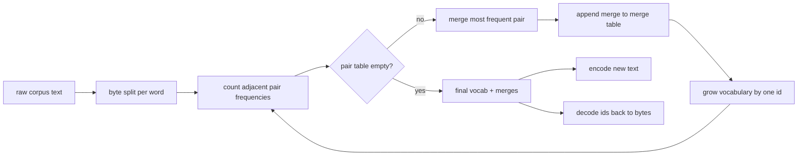
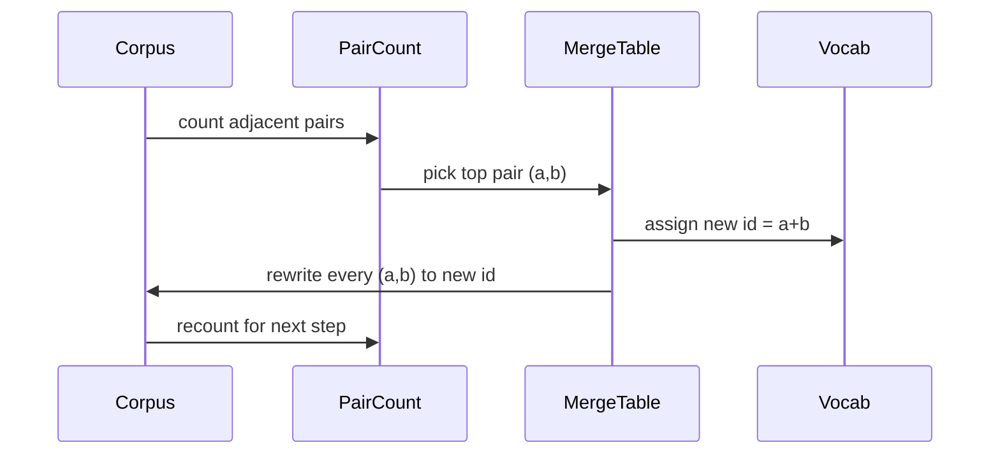

# 从零实现 BPE 分词器

> 字节进，id 出，id 再还原成同样的字节。亲手构建每个现代文本模型至今仍然依赖的分词器。

**Type:** Build
**Languages:** Python
**Prerequisites:** Phase 04 lessons, Phase 07 transformer lessons
**Time:** ~90 minutes

## 学习目标
- 在原始文本语料上训练一个字节对编码（Byte-Pair Encoding）词表：反复合并出现频率最高的相邻符号对。
- 实现一张确定性的合并表（merge table），并将其应用到新文本上，产出子词 id 序列。
- 对任意 UTF-8 输入做编码再解码的往返转换，且不丢失任何信息。
- 预留并保护特殊 token（`<|endoftext|>`、`<|pad|>`），确保它们在训练和解码过程中不被破坏。
- 理解为什么字节级字母表是通用分词器的正确底座。

## 问题框架

语言模型从来看不到文本，它看到的是整数。把字符串映射成整数列表、再映射回来的，就是分词器（tokenizer）。这一层做错了，整个训练过程中的每条损失曲线度量的都是错误的东西。

通用文本模型中占主导地位的子词分词器家族是字节对编码。思路很简单：从一个已知字母表出发，找出训练语料中出现次数最多的相邻符号对，把它合并成一个新符号，重复这个过程直到词表达到目标大小。编码新文本时，按同样的顺序复用同一份合并列表。

我们要构建的是字节级变体：字母表是 256 个原始字节，而不是 Unicode 码点。正是这个选择让分词器能处理任何 UTF-8 输入，而不需要退回到未知 token。

## 流水线

训练侧和推理侧共享同一张合并表。这种共享就是契约：如果推理时改变合并顺序，解码出来的就是另一串 id。

## 字节字母表

前 256 个 id 预留给 0x00 到 0xFF 这些原始字节。这保证了在任何合并发生之前，每个输入字符串都已经可以用词表表达。在字节区之后，我们再预留一小段范围给特殊 token。训练循环永远不会把这些 id 提名为合并目标，因为我们让它们完全不出现在预分词后的符号流里。

预分词器（pretokenizer）在训练开始之前，先按空白符和标点边界切分语料。如果不做这一步切分，BPE 的合并步骤会毫不犹豫地学出跨越词边界的合并，词表会被各种常见的完整短语塞满。有了这一步切分，合并只发生在单词内部，结果才具有泛化能力。

## 训练循环

每个训练步骤里，循环做三件事。它遍历语料中的每个词，统计当前符号的每个相邻对出现的频次，并按该词本身出现的频次加权；它选出计数最高的符号对；它把这个对的每一处出现重写为一个新符号，新符号的 id 是词表中下一个空闲位置。然后把这次合并记录下来。

把语料表示成符号序列列表后，每一步的开销与该列表的规模成线性关系。对一百万个词、目标词表一万个 id 的设置，整个循环几秒钟就能跑完，因为随着合并不断落地，符号序列会越来越短。

## 编码新文本

推理阶段不会调用配对计数器。它按照学习时的顺序应用合并表。对一个新词，编码器从字节切分出发，扫描当前序列，找到秩（rank）最低的可用合并（即最早学到的那条），执行这次合并，然后再扫描一遍。当合并表中没有任何一条合并能应用到当前序列时，循环结束。

按秩排序正是让编码具有确定性、并与训练阶段在相同输入上行为一致的关键性质。最早学到的合并排在表的最上面，最先被应用。如果两条合并可以应用在同一个位置，秩更低的那条获胜。

## 特殊 token

特殊 token 是字节流永远不可能产生的 id。我们手动预留它们。本课只需要两个。

- `<|endoftext|>` 在预训练时分隔文档。它告诉模型「一篇新文档从这里开始，不要让上一篇的上下文泄漏进来」。
- `<|pad|>` 用来把短序列补齐，使一个批次可以拼成矩形张量。训练时损失掩码会把它遮蔽掉。

编码器接受一个标志位，用来决定是否允许输入中出现特殊 token。标志位关闭时，字符串 `<|endoftext|>` 和 `<|pad|>` 会被当成拼出它们的那些字节来分词；标志位打开时，这些字面字符串会被映射到它们预留的 id，并且不参与任何合并。

## 往返保证

先编码再解码，必须精确还原输入的字节。解码器按顺序把每个 id 的字节展开拼接起来。由于每个 id 要么是原始字节，要么是两个已知 id 的拼接，递归展开最终一定终止于原始字节。解码随后返回这些字节拼出的 UTF-8 字符串。

本课的测试套件在三种输入上验证这个性质：一个未见过的句子、一个包含 Unicode emoji 的句子，以及一个包含字面 `<|endoftext|>` token 的句子。

## 本课不做的事

它不实现最大型生产级分词器所用的那种正则驱动预分词器。这里的预分词器只是一个小型的空白符加标点切分。在小训练语料上它足以产生合理的合并，与本课程链路其余部分的契约也保持不变。下一课会把分词器当作黑盒，在其之上构建滑动窗口数据集。

它不并行化配对计数器。用 Python 循环遍历几千个词的语料，远不到一秒就能跑完。对更大的语料，显而易见的做法是按词并行计数再做归约。

## 如何阅读代码

`main.py` 定义了四个对象。`BPETokenizer` 持有词表、合并表和特殊 token 表。`train` 是训练循环。`encode` 是推理路径。`decode` 是字节拼接。文件底部的演示在一个内置语料上训练一个小分词器，编码一个留出的句子，再把 id 解码回来，并把两者都打印出来。`code/tests/test_bpe.py` 中的测试固定住了往返性质、特殊 token 预留和合并顺序这三项行为。

运行演示。然后把演示中的目标词表大小从 300 改成 600，观察留出句子的编码长度如何下降。那条曲线就是 BPE 的压缩曲线。
