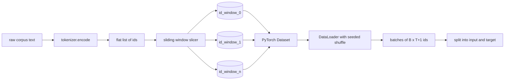
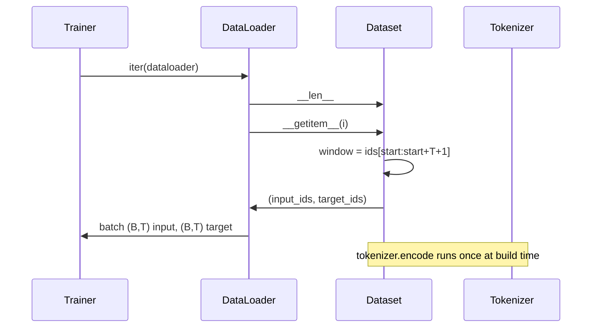

# 基于滑动窗口的分词数据集

> 一次预训练运行就是一个从 token id 到梯度的函数。本课要构建的，就是把 id 源源不断送进去的那条传送带。

**Type:** Build
**Languages:** Python
**Prerequisites:** Phase 04 lessons, Phase 07 transformer lessons, Lesson 30 of this phase
**Time:** ~90 minutes

## 学习目标
- 只调用一次分词器，把原始语料转换成一条 token id 流。
- 用可配置的重叠步长（stride），把 id 流切分成定长窗口。
- 构建一个 PyTorch Dataset，为下一个 token 预测任务返回输入和目标张量。
- 把数据集包装进 DataLoader，并使用按 epoch 设种子的确定性打乱。
- 分析步长、冗余度与有效数据集规模之间的权衡。

## 整体框架

预训练运行每次读取一个批次的 token id，然后更新模型。每个批次的形状由训练契约固定下来。对因果语言模型而言，批次包含形状为 `(B, T)` 的输入 id 和形状为 `(B, T)` 的目标 id，其中目标就是输入向左移一位。数据管线的职责，就是从可能有数 GB 原始文本的语料中，以确定性、可复现的方式按需产出符合这一契约的数据。

本课构建这条管线。上一课的分词器把文本变成一个很长的扁平 id 列表。滑动窗口把这个列表切分成训练样本。自定义 Dataset 把样本暴露为张量。DataLoader 负责组装批次，并用已知种子打乱顺序。

## 形状契约

因果语言模型消费形状为 `(B, T)` 的 id，其中 `B` 是批大小，`T` 是上下文长度。位置 `t` 的目标是位置 `t+1` 的输入。这意味着每个训练样本要覆盖 `T+1` 个原始 id。窗口步长控制相邻样本之间的重叠程度。

切分器绝不会越过语料的边界。如果最后一个窗口的 id 数量不足以填满 `T+1` 个位置，切分器会直接丢弃它。用 `<|pad|>` 填充尾部也是一种合理选择，但会让损失掩码变复杂。本课选择丢弃。

## 为什么用滑动窗口

预训练语料就是一条很长的 id 流。如果模型只见过互不重叠的窗口，那么每个训练样本教给它的都是同样的 `T` 个边界位置。调整步长可以挪动这些边界，让模型见到更多样的「预测下一个 token」任务。

步长为 `T` 时窗口互不重叠。步长为 `T // 2` 时窗口重叠百分之五十，有效数据集翻倍。步长为 `1` 时重叠最大，数据集扩大 `T` 倍。代价是每个 epoch 的计算量更大，收益是边界多样性更高。大多数预训练运行使用等于上下文长度的步长，因为语料本身已经远大于模型在一个 epoch 内能消化的量，边界多样性的论据就没那么有力了。

## Dataset 类

PyTorch Dataset 有两个必须实现的方法。`__len__` 返回样本数量。`__getitem__` 返回一个样本，即一对张量。我们的 Dataset 存储编码后的 id 流和步长。索引时即时计算窗口起点，因此无论步长产生多少样本，内存开销都只有一份 id 流的拷贝。

移位一格的操作发生在 `__getitem__` 内部。Dataset 返回 `(input, target)`，其中 `input = window[:-1]`、`target = window[1:]`。两者都是 PyTorch 长整型张量。训练循环把它们当作真值（ground truth）使用。

## 确定性打乱

设置了 `shuffle=True` 的 DataLoader 会从 PyTorch 随机数生成器读取随机性。通过显式传入一个按 epoch 设种子的 `torch.Generator`，每次重启运行都能得到完全相同的打乱顺序。当你想比较两次只差一个超参数的运行时，这个性质至关重要。没有种子的话，两次运行看到的数据顺序不同，损失曲线就会因为与改动本身无关的原因而分叉。

本课的种子契约很简单：`epoch_seed = base_seed + epoch_index`。基础种子在构造时传入，epoch 索引由训练器在每个 epoch 开始时递增。用相同基础种子重跑，每个 epoch 看到的顺序都完全一致。

## 批采样器

PyTorch 的默认采样器以均匀随机、不放回的方式选取索引。这正是预训练想要的。在小数据集上做微调时契约也一样。DataLoader 通过调用 `B` 次 `__getitem__` 并把结果堆叠起来组装批次。由于构造方式保证了每个样本长度相同，不需要任何填充逻辑。

为了简单起见，本课保持 `num_workers=0`。在生产级运行中，worker 会并行执行 `__getitem__` 调用。对我们这条管线来说，这基本没有收益，因为每次调用只是对内存中张量做一次切片，但同一套 Dataset API 可以干净地支持多 worker。

## 计算样本数量

对于长度为 `N` 的 id 流、上下文长度 `T` 和步长 `S`，样本数量是 `max(0, 1 + (N - (T + 1)) // S)`。本课把这个计算暴露为 Dataset 上的一个静态方法，这样训练器无需遍历就能算出每个 epoch 的总步数。

## 本课不做的事

不做磁盘流式读取。语料被完整编码进内存，保存为单个张量。对几百万 id 的语料来说，这远低于一百兆字节，正适合本课的体量。磁盘流式读取是一个独立的问题，只需替换存储层就能接入，Dataset 契约保持不变。

不处理多文档。语料被当作一条连续的 id 流。当语料由多个文档构建时，文档之间的边界通过插入 `<|endoftext|>` id 来编码。模型会学会在边界附近做出预测。

## 如何阅读代码

`main.py` 定义了两个类和一个辅助函数。`SlidingWindowDataset` 是 PyTorch Dataset。`make_dataloader` 返回一个配好种子生成器的 DataLoader。`_encode_corpus_to_ids` 是那次一次性的分词器调用。文件底部的演示会在进程内构建一个小分词器，编码内置语料，构造数据集和 dataloader，打印一个批次，并断言形状契约成立。`code/tests/test_dataset.py` 中的测试固定了窗口数量公式、移位一格性质、确定性打乱以及步长权衡。

运行演示。然后把上下文长度从 16 改成 32，观察每个 epoch 的样本数量如何下降。这个数字就是你每个 epoch 的步数预算。
