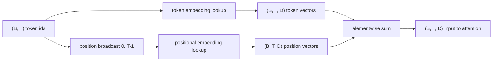
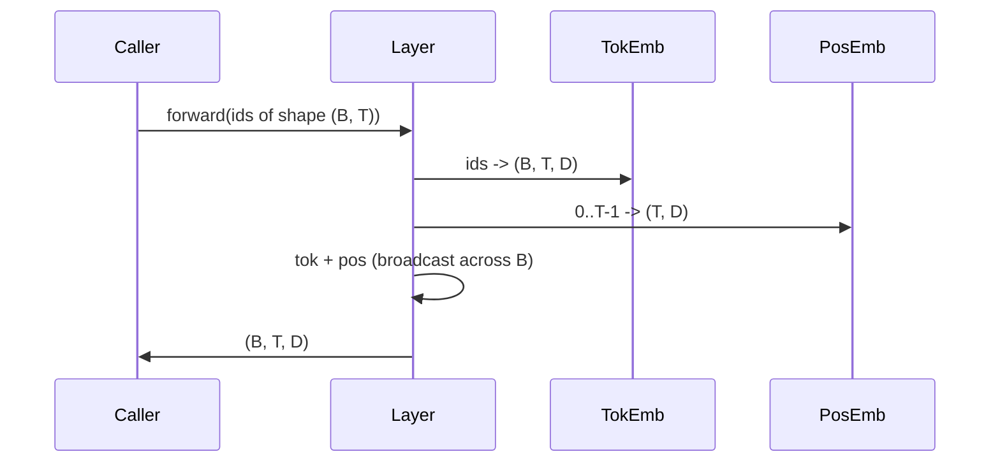

# Token 嵌入与位置嵌入

> Token id 是整数，而模型需要向量。两张查找表横在两者之间，其中位置表的选择决定了模型能学到什么。

**Type:** Build
**Languages:** Python
**Prerequisites:** Phase 04 lessons, Phase 07 transformer lessons, Lessons 30 and 31 of this phase
**Time:** ~90 minutes

## 学习目标
- 构建一个 token 嵌入查找表，把词表 id 映射为稠密向量。
- 构建一个按位置索引的可学习位置嵌入查找表。
- 构建一个按位置索引、不含任何参数的固定正弦位置嵌入。
- 把 token 嵌入与位置嵌入组合成单一输入，供 Transformer 块使用。
- 从长度泛化和参数量两个角度对比可学习嵌入与正弦嵌入。

## 整体框架

模型与 token id 的第一次接触，就是在 token 嵌入矩阵里做一次按行查找。这个矩阵每个词表 id 对应一行，每个模型维度对应一列。查找返回一个向量，模型的其余部分会把它当作这个 id 的含义。反向传播只更新前向传播中被用到的那些行。随着训练推进，这些行的几何结构逐渐学会用方向来编码相似性。

token id 本身没有顺序信息。模型需要第二个信号来区分位置一和位置十七。这个信号有两种主流选择：可学习位置嵌入（第二张查找表，每个位置一行）和固定正弦位置嵌入（一个不含参数的数学公式）。这个选择是有代价的。可学习的表是参数，并且受限于模型训练时的最大上下文长度。正弦表在理论上无参数、公式可以延伸到任意位置，但本课的 `SinusoidalPositionalEmbedding` 在构造时按 `max_context_length` 预先计算了一张固定的表，其 `forward` 在超出该上界时会抛出异常；因此在这里，两个模块都强制了最大上下文长度。即使表大到足以索引，模型在超出训练长度后仍可能表现不佳。

本课会把两种位置嵌入都构建出来，并将它们与 token 嵌入组合成单一输入，供下一课的注意力块使用。

## 形状约定

嵌入阶段的输入是一批形状为 `(B, T)` 的 token id。输出是形状为 `(B, T, D)` 的张量，其中 `D` 是模型维度。每个批次元素都有相同的上下文长度 `T`，每个位置都有相同的向量维度 `D`。



组合方式是求和，而不是拼接。求和让 `D` 在整个网络中保持不变，并让模型可以在每个特征维度上自行决定：在每一层，是 token 含义占主导，还是位置信息占主导。

## token 嵌入矩阵

token 嵌入是一个形状为 `(V, D)` 的参数张量，其中 `V` 是词表大小。PyTorch 将其封装为 `nn.Embedding(V, D)`。初始化时，矩阵元素从一个小方差的高斯分布中采样，对于 Transformer 规模的模型，传统做法是均值为零、标准差约为 `0.02`。具体的初始化数值不那么重要，重要的是在不同的运行之间保持一致。

前向传播就是一次索引操作。PyTorch 通过按行收集（gather），把 `(B, T)` 的 int64 id 映射为 `(B, T, D)` 的浮点张量。反向传播只把梯度累加到前向传播中被触及的那些行上。批次中从未出现过的行，在该步骤中获得的梯度为零。

一个微妙的细节：token 嵌入与模型末端的输出投影常常共享权重（权重绑定，weight tying）。一旦共享，每次反向传播都会通过输出端触及嵌入矩阵的每一行。本课把两者作为独立模块呈现，但在完整模型中，同一个矩阵可以同时扮演这两个角色。

## 可学习位置嵌入

可学习位置嵌入是第二个 `nn.Embedding`，形状为 `(max_context_length, D)`。查找以位置 id `0, 1, 2, ..., T-1` 为键。前向传播把这些位置向量沿批次维度广播。

可学习表的缺点是：如果模型只训练到位置 `T-1`，那么位置 `T` 就无法查询——对应的行根本不存在。采用这种方案的生产级 decoder-only 模型会把最大上下文长度固化进架构，拒绝处理更长的输入。

## 正弦位置嵌入

正弦位置嵌入是一个从位置到向量的函数。位置 `p` 和特征维度 `i` 产生

```python
angle = p / (10000 ** (2 * (i // 2) / D))
emb[p, 2k]     = sin(angle)
emb[p, 2k + 1] = cos(angle)
```

这个函数没有参数。每个位置都有唯一的向量。波长在特征维度上按几何级数变化，因此低维编码粗粒度位置，高维编码细粒度位置。

同时使用 `sin` 和 `cos` 带来的性质是：位置 `p + k` 的向量是位置 `p` 向量的线性函数。这给了注意力层一条学习相对位置偏移的捷径。模型不需要额外的参数来表达"往回看五个 token"。

本课在构造时一次性计算完整的正弦表，前向传播时直接索引。

## 组合

输入管线按顺序做三件事：读取 token id；查找 token 向量；加上位置向量；返回和。



求和步骤中的广播会把 `(T, D)` 的位置张量沿批次维度复制。PyTorch 会自动处理，因为位置张量经过 unsqueeze 后形状是 `(1, T, D)`。

## 对比分析

本课在相同输入上运行两种变体，并打印两项诊断指标。

第一项是参数量。可学习变体在 token 嵌入之上额外增加 `max_context_length * D` 个参数；正弦变体增加零个。

第二项是相邻位置嵌入之间的余弦相似度。正弦变体的相似度衰减平滑且可预测，因为函数是连续的。可学习变体在初始化时相似度接近随机，因为各行是独立采样的。训练之后，可学习变体通常也会发展出类似的平滑结构，但它必须从数据中自己发现这种结构。

## 本课不涉及的内容

本课不实现旋转位置编码（RoPE）和 AliBi。它们是生产级 Transformer 中的现代选择。两者都遵循与本课嵌入相同的形状约定（对形状为 `(B, T, D)` 的向量施加依赖于位置的变换），但作用点在注意力投影步骤而非输入端。下一课将构建注意力块，其中一个可选扩展就是把旋转位置编码融入查询-键投影。

本课也不训练嵌入。训练需要损失，损失需要模型输出，模型输出又需要注意力和 LM head。那是下一课和再下一课的内容。

## 如何阅读代码

`main.py` 定义了三个模块。`TokenEmbedding` 封装 `nn.Embedding(V, D)`。`LearnedPositionalEmbedding` 封装 `nn.Embedding(L, D)`。`SinusoidalPositionalEmbedding` 预先计算正弦表，并将其作为 buffer 暴露。`EmbeddingComposer` 把一个 token 嵌入和一个位置嵌入绑在一起。底部的演示代码打印形状、参数量以及相邻位置相似度诊断。`code/tests/test_embeddings.py` 中的测试固定了形状、广播行为、参数量和正弦公式。

运行演示。然后把模型维度 `D` 从 64 改为 32，观察正弦波长频段如何变化。
