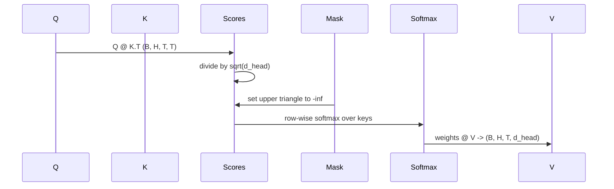

# 多头自注意力

> 一次线性投影、三份视图、H 个并行头、一个掩码。这就是模型实际使用的注意力模块。

**Type:** Build
**Languages:** Python
**Prerequisites:** Phase 04 lessons, Phase 07 transformer lessons, Lessons 30 through 32 of this phase
**Time:** ~90 minutes

## 学习目标
- 用单个线性层实现批量化的 Query/Key/Value 投影，并切分为 H 个头。
- 计算缩放点积注意力（scaled dot-product attention），正确处理归一化和数据类型。
- 应用因果掩码（causal mask），阻止某个位置关注其后的未来位置。
- 针对固定输入查看每个头的注意力权重，分析各个头在关注什么。
- 在一个玩具任务上训练小型注意力模块，观察随着各头逐渐分化，损失如何下降。

## 整体框架

注意力是让一个 token 的表示从同一序列的其他 token 中获取信息的函数。自注意力（self-attention）意味着查询（query）、键（key）、值（value）全部来自同一个输入。多头（multi-head）意味着把投影切分成 H 个并行的注意力子问题，各自的输出拼接后再投影回去。

高效的实现模式是：用一个线性层从 `D` 投影到 `3 * D`，切成三份视图，再重塑成 H 个头，每个头的维度是 `D // H`。矩阵乘法、softmax 和加权求和都以批量张量运算完成，因此各个头在加速器上是并行执行的。

本课就来构建这个模块。我们还会加上因果掩码，让同一份代码可以直接充当 decoder-only 语言模型的注意力层。下一课会把这个模块堆叠成完整的 Transformer，再下一课会训练它。

## 形状约定

输入是 `(B, T, D)`，输出是 `(B, T, D)`。掩码是 `(T, T)`，或可广播到该形状。模块内部的中间张量形状为 `(B, H, T, d_head)`，其中 `d_head = D // H`。约束条件是 `D % H == 0`。

```mermaid
flowchart LR
    A["(B, T, D) input"] --> B[Linear D -> 3D]
    B --> C["split into Q, K, V"]
    C --> D["reshape to (B, H, T, d_head)"]
    D --> E["scores = Q @ K.T / sqrt(d_head)"]
    E --> F[apply causal mask]
    F --> G[softmax over keys]
    G --> H["context = weights @ V"]
    H --> I["reshape to (B, T, D)"]
    I --> J[output Linear D -> D]
    J --> K["(B, T, D) output"]
```

两个线性层（QKV 投影和输出投影）是模块中仅有的参数。掩码、softmax、矩阵乘法和各种重塑操作都不含参数。

## QKV 切分

朴素实现用三个独立的线性层，分别产生 Q、K、V。高效实现用单个线性层输出 `3 * D` 个特征，再切分结果。两者在数学上等价：用三个 `(D, D)` 权重分别做矩阵乘法，恰好等于用它们堆叠成的 `(3D, D)` 权重做一次矩阵乘法。

高效版本更快，因为加速器只需启动一次矩阵乘法而不是三次。初始化也更方便，因为三个子矩阵位于同一个参数张量中，可以一起初始化。

## 头重塑

切分之后，Q、K、V 各自的形状是 `(B, T, D)`。要把它变成 H 个并行的注意力子问题，先重塑为 `(B, T, H, d_head)`，再转置为 `(B, H, T, d_head)`。此时头维度紧挨着批次维度，PyTorch 会把每个头的注意力当作跨越 `B * H` 个独立实例的批量运算来处理。

d_head 维度保持在最后，这样打分的矩阵乘法 `Q @ K.transpose(-2, -1)` 正好沿它收缩。结果是形状为 `(B, H, T, T)` 的每头注意力分数。

## 缩放

分数在 softmax 之前要除以 `sqrt(d_head)`。如果不缩放，点积会随 `d_head` 增大而变大，把 softmax 推入一种状态：某一项几乎占据全部权重，其余项小到可以忽略。在那种状态下梯度极小，学习会停滞。除以 `sqrt(d_head)` 能让分数的方差在不同头维度下大致保持恒定。

## 因果掩码

decoder-only 语言模型在预测下一个 token 时只能依赖过去的信息，掩码就是用来强制这一点的。具体来说，在 softmax 之前，`(T, T)` 分数矩阵对角线以上的每个元素都被替换为负无穷。softmax 之后这些位置的权重就变成零。

我们在构造时把掩码注册为 buffer，这样它会和模型位于同一设备上，并且不参与梯度图。掩码覆盖模块可能见到的最大上下文长度，前向传播时只切出左上角的 `(T, T)` 部分。

## 输出投影

得到每个头的上下文向量 `(B, H, T, d_head)` 后，先转置回 `(B, T, H, d_head)`，再重塑为 `(B, T, D)`，最后应用一个 `(D, D)` 的线性投影。输出投影让模型能够混合各个头的信息。没有它，H 个头只能在后续层中才得以重新组合，模块的表达能力会被人为限制。

## 注意力权重检查

本课在前向传播上暴露了一个 `return_weights=True` 标志。设置后，模块除输出外还会返回形状为 `(B, H, T, T)` 的每头注意力权重。演示程序会针对一段短输入打印某一个头的权重热力图，让你直观看到因果三角形结构以及每个位置的关注焦点。

在训练好的模型中，不同的头会学到不同的模式。有的头关注紧邻的前一个 token，有的头关注序列开头，有的头把注意力近乎均匀地铺开。这个检查接口就是开展此类可解释性工作的入口。

## 训练演示

`main.py` 底部的演示程序把注意力模块接上一个小型 LM 头，在一个重复任务上整体训练。输入的每一行是同一个随机 id 在整个上下文中的复制，目标是输入右移一位，因此模型必须学会下一个 token 就等于前一个 token。损失函数是交叉熵。在 H=4、D=32、T=12、词表大小为 64 的设置下，损失从随机水平（约 `log(64) ~ 4.16`）在 CPU 上经过三个 epoch 降到远低于 `1.0`。

演示的目的不是训练一个有用的模型，而是确认梯度能流经模块的每个部分，并且在一个答案显而易见的问题上，各个头确实学到了东西。

## 本课不做的事

本课不加前馈模块。真实模型中的 Transformer 层是注意力之后接一个两层 MLP，并在两者外各包一层残差连接和层归一化。下一课会加上这些。

本课不实现旋转位置编码（rotary）或 AliBi 位置编码。两者都作用于同一个模块的 QKV 投影步骤，但属于单独的教学单元。本课构建的模块与两者兼容：只需在矩阵乘法之前对 Q 和 K 做相应变换。

本课不实现推理用的 KV cache。跨前向传播缓存键和值，是让自回归解码变快的优化。它会改变 K 和 V 张量的形状约定，但不影响 Q。这部分属于推理课的内容。

## 如何阅读代码

`main.py` 定义了 `MultiHeadSelfAttention`。该类持有两个线性层和一个已注册的掩码 buffer。前向传播依次完成投影、重塑、打分、掩码、softmax、加权、再重塑、再投影。文件底部的演示程序构建了一个小模型，用 token 嵌入和位置嵌入加上 LM 头包装注意力模块，在复制任务上训练三个 epoch，打印损失曲线和每头注意力热力图。`code/tests/test_attention.py` 中的测试固定了形状约定、因果性、softmax 性质、头切分性质和梯度流动。

先运行演示程序。然后把 `n_heads` 从 4 改到 8（保持 `d_model=32`，因此 `d_head=4`），观察热力图的变化。
