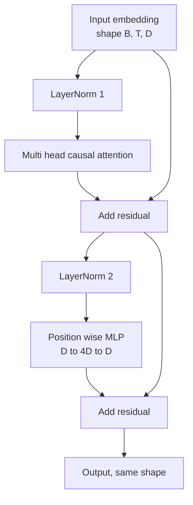
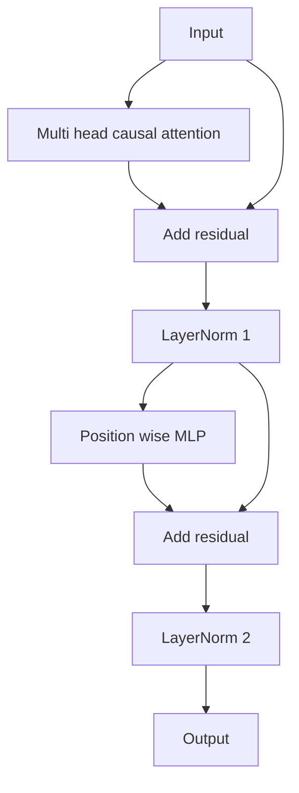

# 从零构建 Transformer Block

> 一个 block 就是所有现代解码器 LLM 的基本单元：层归一化、多头注意力、残差、MLP、残差。pre-LN 变体无需 warmup 即可稳定训练；post-LN 变体则是原始论文采用的方案。本课将并排实现两种变体，并展示在常见学习率下，哪一种能在 12 层堆叠中存活下来。

**Type:** Build
**Languages:** Python
**Prerequisites:** Phase 19 lessons 30 to 33 (tokenizer, embeddings, attention math, batched data loader)
**Time:** ~90 minutes

## 学习目标

- 用 PyTorch 从四个核心部件搭建一个 transformer block：LayerNorm、多头因果注意力、残差连接、逐位置 MLP（position wise MLP）。
- 将 LayerNorm 放置在两种位置（pre-LN 和 post-LN），并解释为什么其中一种无需 warmup 即可稳定训练。
- 在多头注意力内部实现因果掩码（causal mask），使 token `i` 无法看到 `j > i` 的 token。
- 在 12 层堆叠上追踪两种变体的梯度流动，并实打实地读懂结果，不含糊其辞。
- 把这个 block 作为可直接复用的单元，供下一课组装出 1.24 亿参数的 GPT。

## 问题背景

Transformer 就是同一个 block 的重复堆叠。一旦把 block 写错一次，再重复十二次，你交付的模型要么在第一个 epoch 就发散，要么余下的训练全程都得靠 warmup 补丁续命。本课中你会看到的两种失败模式并不罕见，初学者第一次天真地堆叠 block 时就会遇到。一种是注意力层偷看了未来的 token；另一种是 LayerNorm 放错了位置，无法在深层抑制残差信号。

一旦看清问题，修复方式是机械的。这个 block 恰好有两条残差路径和两个归一化位置。把位置选对，整个堆叠剩下的部分就只是例行公事。

## 核心概念

每个仅解码器（decoder only）的 transformer block 都是一个函数：输入一个形状为 `(batch, sequence, embedding)` 的张量，返回一个相同形状的张量。内部由两个子层完成实际工作。



这是 pre-LN 变体：LayerNorm 位于残差分支内部、子层之前，残差连接将未归一化的信号向前传递。

post-LN 变体则把 LayerNorm 移到残差相加之后。



两者形状完全相同，训练行为却不同。在 post-LN 中，沿残差路径反向传播的梯度必须穿过 LayerNorm。在 12 层深度、学习率 `3e-4` 时，这个梯度衰减得足够快，必须依赖 warmup 调度。pre-LN 让残差路径保持未归一化状态，梯度因此能干净地传播到嵌入层。正因如此，pre-LN 成为 GPT-2 及之后所有模型采用的配置。

### 因果多头注意力

注意力子层将输入投影成三份：查询（query）、键（key）、值（value）张量。每份从 `(B, T, D)` 重塑为 `(B, H, T, D/H)`，其中 `H` 是头数。缩放点积注意力按头计算 `softmax(Q K^T / sqrt(d_k))`，将上三角掩为负无穷，通过 softmax 应用掩码，再乘以 `V`。各头拼接回单个 `(B, T, D)` 张量，并再做一次投影。掩码是让模型具备因果性的唯一部件。忘了掩码，你训练出来的就是一个会作弊的模型。

### MLP

逐位置 MLP 对每个 token 独立应用同一个两层网络。隐藏层宽度是嵌入宽度的四倍，激活函数为 GELU，第二个线性层之后接一个 dropout。MLP 内部 token 之间互不交流，所有的 token 混合都发生在注意力中。

### 残差连接做了两件事

它让梯度路径在深度方向上变成加法叠加，使梯度范数在十二层中保持合理量级。它还让每个 block 学习对运行中表示（running representation）的增量更新，而非整体替换。这两个效应正是 block 能够规模化的原因。

## 从零实现

`code/main.py` 实现了：

- `class LayerNorm`：带可学习的缩放与平移参数，含偏置 eps，按 token 向量逐个应用。
- `class MultiHeadAttention`：包含 `num_heads`、`head_dim = d_model // num_heads`、融合 QKV 投影、注册为 buffer 的因果掩码，以及注意力 dropout 和残差 dropout。
- `class FeedForward`：两个线性层、GELU 激活、dropout。
- `class TransformerBlock`：通过 `pre_ln` 标志在两种变体之间切换。
- 一个演示程序：用相同输入构建一个 6 层 pre-LN 堆叠和一个 6 层 post-LN 堆叠，打印 (a) 输出形状，(b) 一次反向传播后嵌入层处的梯度范数。

运行：

```bash
python3 code/main.py
```

输出：两个堆叠的形状检查，以及并排展示的梯度范数。在相同学习率下，pre-LN 堆叠的嵌入梯度比 post-LN 堆叠大一个数量级——这就是 pre-LN 无需 warmup 即可训练的实证信号。

## 技术栈

- `torch`：负责张量运算、自动求导和 `nn.Module` 基础设施。
- 不用 `transformers`，不用预训练权重。block 完全由基础组件实现。

## 实际生产中的模式

三个模式能把教科书式的 block 变成可上线的实现。

**融合 QKV 投影。** 三个独立的线性层意味着三次 kernel 启动和三次矩阵乘法。一个宽度为 `3 * d_model` 的线性层在一次启动中完成同样的工作，再沿最后一个维度切分输出。融合路径在所有加速器上都更快，并且与 GPT-2、LLaMA、Mistral 的参考实现一致。

**用 register_buffer 注册因果掩码。** 掩码只依赖于最大上下文长度。在构造时用 `register_buffer` 一次性分配，每次前向传播时切出当前窗口，从而省去每次调用的分配开销。忘了这一点，在长上下文下掩码就会变成内存分配的热点。

**Dropout 放两处，而不是三处。** dropout 应放在注意力 softmax 之后（注意力 dropout）和 MLP 第二个线性层之后（残差 dropout）。在残差本身上加 dropout 会破坏让梯度在深层流动的加法恒等结构。一些早期实现犯过这个错误，付出的代价就是脆弱的训练过程。

## 生产实践

- 本课的 block 可以不加修改地直接接入第 35 课的 GPT 组装。
- pre-LN 变体是所有现代开放权重 LLM 采用的方案；post-LN 变体则是 2017 年原始注意力论文采用的方案。掌握这两种，就足以读懂你将遇到的任何解码器架构。
- 把 GELU 换成 SiLU，你就得到了 LLaMA 系列的激活函数；把 LayerNorm 换成 RMSNorm，你就得到了 LLaMA 系列的归一化。骨架完全相同。

## 练习

1. 给 block 中的每个线性层加上 `bias=False` 标志。现代开放权重 LLM 的线性层都不带偏置。测量在一个 12 层、768 维的模型中能省下多少参数。
2. 用手写的 RMSNorm 替换 `nn.LayerNorm`，并验证输出形状不变。
3. 添加一个标志，使其以 `(B, T, T)` 张量返回第一个头的注意力权重。绘制上三角部分，确认 softmax 之后它为零。
4. 编写一个健全性检查：将 `(2, 16, 384)` 张量在 `H=6` 配置下分别通过两种变体，并断言在权重初始化相同且 dropout 设为零时，两者的前向输出不同（例如 `not torch.allclose`）。

## 关键术语

| 术语 | 常见说法 | 实际含义 |
|------|-----------------|------------------------|
| Pre-LN | "Pre norm" | LayerNorm 位于残差分支内部、每个子层之前；残差携带的是未归一化的信号 |
| Post-LN | "Post norm" | LayerNorm 位于残差相加之后；2017 年论文采用的方案，需要 warmup |
| 因果掩码（Causal mask） | "三角掩码" | 将注意力 logits 的上三角设为负无穷，使 token i 无法读取位置大于 i 的 token j |
| 融合 QKV（Fused QKV） | "合并投影" | 用一个宽度为 3D 的线性层代替三个宽度为 D 的线性层；一次 kernel，一次矩阵乘法 |
| 残差流（Residual stream） | "跳跃连接" | 自上而下贯穿每个 block 的未归一化张量；每个 block 向其叠加更新 |

## 延伸阅读

- Phase 7 第 02 课（从零实现自注意力）：本 block 底层的注意力数学。
- Phase 7 第 05 课（完整 transformer）：同一骨架的编码器-解码器版本。
- Phase 10 第 04 课（预训练 mini GPT）：本 block 所接入的训练流程。
- Phase 19 第 35 课（本系列）：将十二个这样的 block 堆叠成一个 GPT 模型。
