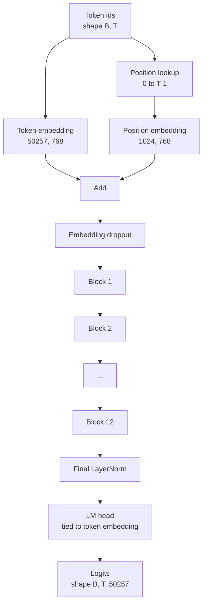
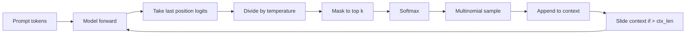

# GPT 模型组装

> 十二个堆叠的 block、一个 token 嵌入、一个可学习的位置嵌入、一个最终 LayerNorm，再加一个权重绑定的语言模型头——这就是完整的 1.24 亿参数 GPT 模型。本课把这些部件组装成一个可用的类，统计参数量以确认模型与参考的 124M 形状一致，并用多项式采样、温度和 top-k 生成文本。

**Type:** Build
**Languages:** Python
**Prerequisites:** Phase 19 lessons 30 to 34
**Time:** ~90 minutes

## 学习目标

- 把第 34 课的 Transformer block 组装成完整的 GPT 模型：token 嵌入、位置嵌入、N 个 block、最终 LayerNorm、语言模型头。
- 复现 1.24 亿参数配置：词表 50257、上下文 1024、嵌入维度 768、十二个头、十二层。
- 把语言模型头的权重与 token 嵌入绑定，并解释为什么在这个规模下能省下约 3800 万参数。
- 从一个提示词出发，用多项式采样、温度缩放和 top-k 截断生成文本，并用滑动窗口维持上下文长度。
- 对照 124M 目标，测量参数量和前向传播开销。

## 问题背景

一个 Transformer block 自己什么也做不了。你需要把 token id 变成向量、混入位置信息、送进堆叠的层，再投影回词表 logits。这四步漏掉任何一步，模型要么无法前向传播，要么位置信息漂移，要么根本说不出话。

模型的形状同样重要。参考的 GPT-2 small 恰好是上述配置下的 1.24 亿参数。这些数字并不神秘：词表 50257 乘嵌入维度 768 是 token 表；位置 1024 乘 768 是位置表；十二个 block 各约 700 万参数，共 8400 万；最终的头通过权重绑定复用 token 表。把各部分加起来，正好落在 1.24 亿。如果你搭出的模型参数量对不上参考值，说明某处接线接错了。

## 核心概念



Token id 变成 token 向量，位置 id 变成位置向量，两者相加后送入堆叠的层。最终 LayerNorm 是 block 之外唯一在所有现代变体中都保留下来的部件。LM 头复用 token 嵌入矩阵，这正是权重绑定（weight tying）的含义。

### 权重绑定

Token 嵌入的形状是 `(vocab, d_model)`，语言模型头需要从 `d_model` 投影回 `vocab`，两者互为转置。绑定意味着字面上使用同一个参数张量，用两次。在词表 50257、d_model 768 的条件下，这个矩阵有 3800 万参数。不绑定，你要付两次代价；绑定后只付一次，而且由于嵌入和头一起更新，你还能得到稍微干净一点的梯度信号。

### 位置嵌入是可学习的，不是正弦式的

GPT-2 自带可学习的位置嵌入。位置表是一个形状为 `(1024, 768)` 的参数张量。模型在每次前向时查询位置 0 到 T-1，并把查询结果加到 token 嵌入上。这是各种位置方案中最简单的一种（RoPE、ALiBi、T5 相对偏置是其替代方案），也是 124M 参考模型所使用的。

### 生成：温度、top-k、多项式采样

生成是自回归的。每一步，模型在每个位置都返回覆盖整个词表的 logits。你只取最后一个位置，除以温度，可选地把 top k 之外的所有 logits 掩码为负无穷，softmax 得到概率，然后从结果分布中采样一个 token。



三个旋钮，三种不同行为。温度趋近于零时退化为贪心解码；温度为一时与模型的自然分布一致。Top-k 为一就是贪心；top-k 为四十则过滤掉长尾。组合方式很重要：下一课的训练会把生成结果当作定性评估信号。

## 从零实现

`code/main.py` 实现了：

- `class GPTConfig` dataclass，带 124M 默认值：`vocab_size=50257`、`context_length=1024`、`d_model=768`、`num_heads=12`、`num_layers=12`、`mlp_expansion=4`、`dropout=0.1`、`use_bias=True`、`weight_tying=True`。
- `class GPTModel`，包含 token 嵌入、位置嵌入、嵌入 dropout、十二个 `TransformerBlock`、最终 LayerNorm，以及一个在开关打开时与 token 嵌入绑定的 `lm_head`。
- 一个 `count_parameters` 辅助函数，返回去重后的参数量（因此统计时会正确处理权重绑定）。
- 一个 `generate` 函数，实现温度、top-k、多项式采样和滑动窗口上下文。
- 一个演示程序：构建模型，把参数量与参考的 124M 并排打印，并从一个固定提示词生成一小段序列，展示端到端流水线。

运行：

```bash
python3 code/main.py
```

输出：参数量与 124M 参考值的对照、从随机提示词生成的 token id，以及在绑定开启时 LM 头与 token 嵌入共享存储的确认信息。

为了让演示保持快速，脚本还用一个微型配置（`d_model=64`、`num_layers=2`）端到端运行一遍，并内联打印生成的 token 序列。124M 配置会被构建出来，但只执行参数量统计和一次前向传播。

## 技术栈

- `torch`：张量运算、自动求导和模块管线。
- `code/main.py` 在本地重新实现了第 34 课的同一套 block 模式。

## 实战中的生产模式

三个模式决定了一个模型是"能跑"还是"能上线"。

**把残差投影初始化得小一些。** 注意力的输出投影和 MLP 的第二个线性层都直接馈入残差相加。如果用与其他线性层相同的标准差初始化它们，残差流会随深度增长，把最终的 LayerNorm 推入过热区间。对这两个投影，把标准差按 `1 / sqrt(2 * num_layers)` 缩放，残差流在十二层中就能保持在合理范围。

**缓存位置 id 张量，不要重复计算。** `torch.arange(T)` 在每次前向时都会分配新内存。在 `__init__` 中按最大上下文一次性分配，每次调用时切出前 T 个条目，跳过分配器的来回开销。

**在参数层面绑定权重，而不只是复制。** 设置 `lm_head.weight = token_embedding.weight` 是共享张量，复制则不是。优化器需要更新的是一个参数，自动求导图也只需要一次梯度累加。如果你用复制，头会逐渐偏离嵌入，权重绑定就毫无收益。

## 生产实践

- 本课的模型类与下一课要训练的模型形状完全一致。
- 把可学习的位置嵌入换成 RoPE，不用动 block 和头，就得到了 LLaMA 系列。
- 把 GELU 换成 SiLU、把 LayerNorm 换成 RMSNorm，就补齐了 LLaMA 系列的其余改动。
- 生成函数适用于任何 logits 来源，不只是这个模型。你可以在第 37 课从预训练的 GPT-2 文件中取 logits，复用同一个生成循环。

## 练习

1. 解除 LM 头与 token 嵌入的绑定，重新统计参数量。验证差值是 50257 乘 768 = 3800 万。
2. 把可学习的位置嵌入换成在构造时计算的正弦表。确认模型仍能前向传播，且参数量减少 786,432。
3. 给生成函数加一个 `greedy=True` 开关，跳过采样直接取 argmax。确认多次运行得到的序列是确定性的。
4. 加一个 `repetition_penalty` 旋钮，在 softmax 之前把提示词或生成历史中已出现 token 的 logit 除以一个常数。在固定提示词上展示：取值大于一时输出中的重复次数减少。
5. 在 `top_k` 旁边加上 `top_p`（核采样）。用两行代码检查保留 token 的概率之和超过 `top_p`。

## 关键术语

| 术语 | 大家怎么说 | 实际含义 |
|------|-----------------|------------------------|
| 权重绑定（Weight tying） | "Tied embeddings" | LM 头与 token 嵌入共享同一个参数张量；省下 vocab 乘 d_model 的参数量，与 GPT-2 参考实现一致 |
| 位置嵌入（Position embedding） | "Learned positions" | 一个形状为（上下文长度, d_model）的独立查找表，加到 token 向量上；端到端学习 |
| 滑动窗口上下文（Sliding window context） | "Context cap" | 当提示词加生成 token 超过上下文长度时，丢弃最旧的 token，使活动窗口保持在限制内 |
| Top-k 采样 | "K truncation" | 保留值最大的 K 个 logits，其余掩码为负无穷，对剩余部分做 softmax |
| 温度（Temperature） | "Sampling temperature" | 在 softmax 前把 logits 除以 T；T 小于 1 使分布更尖锐，T 等于 1 保持自然分布，T 大于 1 使分布更平坦 |

## 延伸阅读

- Phase 19 第 34 课：本模型所堆叠的 block。
- Phase 19 第 36 课：用交叉熵损失驱动本模型的训练循环。
- Phase 19 第 37 课：把预训练的 GPT-2 权重加载进这个完全相同的架构。
- Phase 7 第 07 课（GPT 因果语言建模）：下一个 token 预测的数学原理。
- Phase 10 第 04 课（预训练 mini GPT）：同一架构上的原始训练流程。
