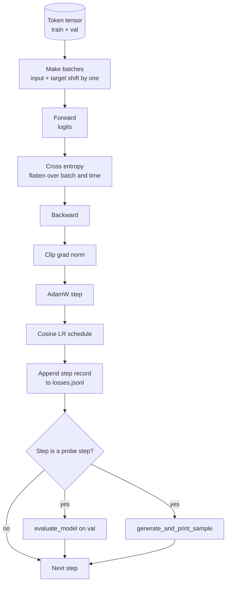

# 训练循环与评估

> 不做度量的循环就是在说谎的循环。本课构建驱动 GPT 模型的训练循环：带权重衰减分组的 AdamW、线性预热加余弦的学习率调度、一个 `calc_loss_batch` 辅助函数、在留出数据上运行的 `evaluate_model`、每 K 步执行一次的 `generate_and_print_sample` 定性探针，以及一份事后可以绘图的 JSONL 损失日志。这套骨架可以训练你今后构建的每一个解码器 LLM。

**Type:** Build
**Languages:** Python
**Prerequisites:** Phase 19 lessons 30 to 35
**Time:** ~90 minutes

## 学习目标

- 构建一个训练循环，用正确的输入与目标对齐方式计算下一个词元预测的交叉熵损失。
- 配置 AdamW，使权重衰减只作用于权重张量，而不作用于 LayerNorm 或偏置张量。
- 实现带线性预热和余弦衰减的学习率调度，并能读懂学习率随时间的变化。
- 通过 `evaluate_model` 在留出（held out）数据划分上评估，使不同训练运行之间的评估损失可比。
- 每 K 步用 `generate_and_print_sample` 生成一个定性样本，在损失曲线暴露问题之前先捕捉到发散。
- 将逐步损失持久化为 JSONL，以便随时重新加载、绘图，并把训练日志作为交付物提交。

## 问题背景

一个只打印损失、别的什么都不做的训练脚本会在三个方面失效。它无法告诉你损失下降的原因是否正确（模型可能在过拟合训练集，什么都没学到）。它无法告诉你发散是否正在开始（损失可能尖峰一步后恢复，也可能尖峰一步后崩溃）。它无法告诉你模型学到了什么（损失只是一个标量，而生成的样本是一段文字）。只要循环不做度量，这三种失效就全部隐藏起来。

本课的循环以三种方式做度量。每一步计算训练批次上的损失。每 K 步计算留出批次上的损失。每 K 步从一个固定提示词生成一段续写。训练日志落地为 JSONL，这份产物就是循环的"证词"。

## 核心概念



其中两个不那么直观的部分是损失对齐和 AdamW 的衰减分组。

### 损失对齐

模型在每个位置上预测下一个词元。如果输入批次是词元 `[t0, t1, t2, t3]`，目标批次就必须是 `[t1, t2, t3, t4]`。交叉熵在展平后的形状 `(batch * seq, vocab)` 与展平后的目标 `(batch * seq,)` 之间计算。忘记这个移位，就等于训练模型去预测它自己——损失会收敛到零，但什么有用的东西都没学到。

### AdamW 衰减分组

权重衰减正则化的是权重张量，而不是归一化的缩放参数或偏置。给 LayerNorm 的缩放参数施加衰减会慢慢把缩放值压向零，破坏归一化。给偏置施加衰减在数学上无害，但纯属浪费算力。标准的分组方式是：矩阵形状的张量（线性层权重、嵌入表）施加衰减，任何看起来像缩放或平移的参数不施加。

### 预热加余弦调度

预热（warmup）让学习率在几百步内从零爬升到目标值，给优化器状态留出填充的时间。余弦衰减让学习率在剩余步数中回落到接近零，使训练末段以很小的步长微调权重。这套组合是开放权重 LLM 训练中最常见的调度方案，因为它消除了前一千步和最后一千步里大多数脆弱的时刻。

### 留出评估

`evaluate_model` 从验证划分中跑固定数量的批次，累加损失，除以批次数，然后返回。不计算梯度。不启用 dropout。在相同的随机种子和相同的数据划分下，这个数值在不同运行之间可复现。把留出损失和训练损失并排报告，就是发现过拟合的方法。

### 把定性采样作为早期信号

一个训练损失下降得很漂亮、但生成样本全是同一个词元的模型是坏的。一个损失曲线看起来平坦、但生成样本逐渐锐化成连贯单词的模型正在学习。定性探针比读完整条曲线更快，并且能捕捉到标量遗漏的失效模式。

## 从零实现

`code/main.py` 实现了：

- `make_batches(token_ids, batch_size, context_length)`：把一条长词元张量切成输入与目标的配对。
- `calc_loss_batch(model, inputs, targets)`：前向传播、展平，返回标量交叉熵。
- `evaluate_model(model, val_loader, max_batches)`：在不计算梯度的情况下遍历固定数量的验证批次，返回平均损失。
- `generate_and_print_sample(model, prompt, max_new_tokens)`：用第 35 课的生成函数对一个固定提示词运行并打印结果。
- `build_param_groups(model, weight_decay)`：生成 AdamW 的两组参数列表。
- `cosine_with_warmup(step, warmup_steps, total_steps, max_lr, min_lr)`：返回给定步数下的学习率。
- `train(...)`：运行训练循环，持久化 `outputs/losses.jsonl`，并每 `eval_every` 步打印评估损失和一个生成样本。
- 一个演示：在合成数据上训练一个微型模型若干步，写出 JSONL 日志，并在探针点打印评估损失和样本。演示在 CPU 上远不到一分钟就能跑完。

运行：

```bash
python3 code/main.py
```

输出：每步一行损失，每个探针步一个评估损失，每个探针步一个生成样本，以及最终的 `outputs/losses.jsonl`——可以逐行用 `json.loads` 加载。

## 技术栈

- `torch` 提供自动求导、优化器和模块。
- `main.py` 在本地重新实现了第 35 课的 `GPTModel` 及配套模块。

## 业界生产模式

三个模式能把教科书式的循环变成可以放心跑通宵的循环。

**梯度范数裁剪没有商量余地。** 一个坏批次（异常数据、学习率尖峰、数值边界情况）会产生一个巨大的梯度，把几个小时的训练成果一笔抹掉。在 `backward` 之后、`step` 之前调用 `torch.nn.utils.clip_grad_norm_(params, max_norm=1.0)`，能把优化器保持在安全范围内。裁剪阈值是一个自由参数；1.0 是在大多数配置下都能稳住的默认值。

**用可恢复的 JSONL 日志，而不是 pickle 序列化的状态。** 把每步的损失记录写成 JSONL 行 `{"step": int, "train_loss": float, "lr": float}` 是耐久的：任何崩溃都会留下一份可读的产物，你可以 grep，可以用三十行 Python 画图，还可以通过读取最后一步来恢复训练。而 pickle 状态把你绑死在生成该文件的那套模块布局上，一旦重构就脆弱不堪。

**评估批次取自固定切片。** 验证词元在脚本启动时就切成批次，而不是边训练边切。可复现性依赖于评估批次在每次运行中完全一致；否则比较两次运行的评估损失，测的既是模型，也是批次的洗牌方式。

## 生产实践

- 本课的循环与训练 124M 模型用真实数据时是同一套骨架。把合成的词元张量换成 `datasets` 风格的加载器，循环不需任何改动就能继续跑。
- JSONL 日志是把一次训练运行变成证据的交付物。下一课会用它来对比一个新训练的检查点和一个预训练的检查点。
- 定性采样探针是标量损失无法替代的兜底手段。

## 练习

1. 为 `weight_decay_groups()` 添加单元测试，确认缩放和偏置参数落入无衰减组，线性层权重和嵌入权重落入衰减组。
2. 把合成的随机词元换成一个小文本文件的字节，让演示在可读的数据上训练。验证生成样本使用的字符确实出现在该文件中。
3. 给余弦调度加一个等于 `max_lr` 10% 的 `min_lr` 下限，并重新绘图。
4. 除了 JSONL 日志外，每 `eval_every` 步保存一个检查点。添加一个 `resume_from` 标志，重新加载模型状态和优化器状态。
5. 在损失旁边记录每步吞吐量（每秒词元数），并确认它稳定在一个区间内。

## 关键术语

| 术语 | 大家怎么说 | 实际含义 |
|------|-----------------|------------------------|
| 损失对齐 | "移位一格" | 输入词元在位置 0..T-1，目标词元在位置 1..T；交叉熵在展平后的形状上计算 |
| 衰减分组 | "两个组" | AdamW 对矩阵形状的张量施加权重衰减，对缩放或偏置张量不施加 |
| 预热 | "爬坡" | 学习率在固定步数内从零爬升到目标值，让优化器状态得以填充 |
| 评估批次 | "留出批次" | 验证词元张量的一个固定切片，在脚本启动时切一次，每次探针都使用完全相同的数据 |
| 定性探针 | "样本打印" | 每 K 步从固定提示词做一段短生成并打印，用于捕捉损失本身掩盖的失效模式 |

## 延伸阅读

- Phase 19 第 35 课：这个循环所驱动的模型。
- Phase 19 第 37 课：把预训练权重加载进同一个模型。
- Phase 10 第 04 课（预训练 mini GPT）：在真实数据上的完整流程。
- Phase 10 第 10 课（评估）：交叉熵损失之外更广的评估面。
