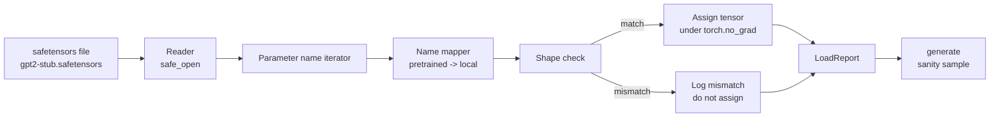

# 加载预训练权重

> 从零训练一个 1.24 亿参数的模型是需要走预算审批的大事；加载一份公开发布的检查点（checkpoint）则是稀松平常的日常操作。本课将把 GPT-2 风格的预训练权重从一个 safetensors 文件加载进第 35 课构建的那套架构，逐项讲解参数名映射，并通过生成一段续写来验证加载确实生效。不联网、不依赖第三方加载器、没有任何不透明的黑魔法。

**Type:** Build
**Languages:** Python
**Prerequisites:** Phase 19 lessons 30 to 36
**Time:** ~90 minutes

## 学习目标

- 使用 `safetensors` Python 库读取 safetensors 文件，并检查其中张量的名称和形状。
- 把每个预训练参数名映射到第 35 课 GPT 模型内部的对应参数。
- 处理公开发布的 GPT-2 权重与本课程模型之间不同的两套命名约定：`wte/wpe/h.N.attn.c_attn/c_proj` 和 `mlp.c_fc/c_proj`，对应本地命名的 `tok_embed/pos_embed/blocks.N.attn.qkv/out_proj` 和 `mlp.fc1/fc2`。
- 在任何权重赋值发生之前，检测形状不匹配并给出清晰的错误信息予以拒绝。
- 用加载后的权重生成一段简短的续写，确认生成的 token 来自加载进来的分布，而不是随机初始化的分布。

## 问题背景

公开发布的权重不会按你的架构来打包。它们沿用的是原始实现所用的名称。预训练文件里有形状为 `(2304, 768)` 的 `transformer.h.0.attn.c_attn.weight`；而你的模型期望的是形状为 `(2304, 768)` 的 `blocks.0.attn.qkv.weight`（同一个矩阵，只是布局约定不同），或者你的模型使用 `nn.Linear`，矩阵以转置形式存储。同一个参数会以三种微妙不同的身份出现（名称、形状、字节布局），加载器必须把这三者全部对齐。

盲目复制的加载器会把正确的张量放到错误的位置，最终得到一个生成乱码的模型。形状不一致时拒绝复制却什么都不记录的加载器，则会让你只能靠猜来判断是哪个张量没有落位。本课的加载器是显式的：每次赋值都有日志，每个形状都会检查，并由一个 `LoadReport` 汇总命中、缺失和形状不匹配的情况，让你能直接读出到底发生了什么。

## 核心概念



名称映射器只是一个从字符串到字符串的函数。形状检查只是一个 if。赋值发生在 `torch.no_grad()` 内部，因此 autograd 不会追踪加载过程。报告记录了每个名称的处理结果。

### GPT-2 的命名约定

公开发布的 GPT-2 权重使用类似下面的名称：

| 预训练名称 | 形状 | 含义 |
|-----------------|-------|---------|
| `wte.weight` | (50257, 768) | Token 嵌入 |
| `wpe.weight` | (1024, 768) | 位置嵌入 |
| `h.N.ln_1.weight` | (768,) | 第 N 个 block 的 LayerNorm 1 缩放 |
| `h.N.ln_1.bias` | (768,) | 第 N 个 block 的 LayerNorm 1 平移 |
| `h.N.attn.c_attn.weight` | (768, 2304) | 融合 QKV 线性层权重 |
| `h.N.attn.c_attn.bias` | (2304,) | 融合 QKV 线性层偏置 |
| `h.N.attn.c_proj.weight` | (768, 768) | 注意力输出投影 |
| `h.N.attn.c_proj.bias` | (768,) | 注意力输出投影偏置 |
| `h.N.ln_2.weight` | (768,) | LayerNorm 2 缩放 |
| `h.N.ln_2.bias` | (768,) | LayerNorm 2 平移 |
| `h.N.mlp.c_fc.weight` | (768, 3072) | MLP fc1 权重 |
| `h.N.mlp.c_fc.bias` | (3072,) | MLP fc1 偏置 |
| `h.N.mlp.c_proj.weight` | (3072, 768) | MLP fc2 权重 |
| `h.N.mlp.c_proj.bias` | (768,) | MLP fc2 偏置 |
| `ln_f.weight` | (768,) | 最终 LayerNorm 缩放 |
| `ln_f.bias` | (768,) | 最终 LayerNorm 平移 |

有两个需要提前留意的意外之处。`c_attn`、`c_proj`、`c_fc` 这几个线性层存储的矩阵，相对于 `nn.Linear.weight` 期望的布局是转置的，加载器在赋值时进行转置。LM 头（LM head）根本不在文件里；模型依靠与 `wte` 的权重绑定（weight tying），所以一旦 `wte` 落位，通过设置别名即可恢复 LM 头。

### 本地命名约定

本课程的模型使用描述性命名：

| 本地名称 | 含义 |
|------------|---------|
| `tok_embed.weight` | Token 嵌入 |
| `pos_embed.weight` | 位置嵌入 |
| `blocks.N.ln1.scale` | 第 N 个 block 的 LayerNorm 1 缩放 |
| `blocks.N.ln1.shift` | LayerNorm 1 平移 |
| `blocks.N.attn.qkv.weight` | 融合 QKV |
| `blocks.N.attn.qkv.bias` | 融合 QKV 偏置 |
| `blocks.N.attn.out_proj.weight` | 注意力输出投影 |
| `blocks.N.attn.out_proj.bias` | 输出投影偏置 |
| `blocks.N.ln2.scale` | LayerNorm 2 缩放 |
| `blocks.N.ln2.shift` | LayerNorm 2 平移 |
| `blocks.N.mlp.fc1.weight` | MLP fc1 |
| `blocks.N.mlp.fc1.bias` | MLP fc1 偏置 |
| `blocks.N.mlp.fc2.weight` | MLP fc2 |
| `blocks.N.mlp.fc2.bias` | MLP fc2 偏置 |
| `final_ln.scale` | 最终 LayerNorm 缩放 |
| `final_ln.shift` | 最终 LayerNorm 平移 |

这个映射是一个固定函数。本课把它实现为一个 dict，由加载器迭代使用。

### 桩文件

真实的 GPT-2 权重有 0.5 GB。演示程序不会去下载它们，而是在首次运行时生成一个小的 safetensors 桩文件（stub fixture），其命名约定与 GPT-2 完全一致，形状则适配一个 d_model 为 192（而非 768）的 12 块模型。这个桩文件结构正确，足以覆盖加载器的每一条代码路径。换成真实文件，加载器无需任何修改即可工作。

## 从零实现

`code/main.py` 实现了：

- 第 35 课 `GPTModel` 的一个小型复刻版，使本课自成一体。
- `make_pretrained_to_local(num_layers)`，按层展开映射条目。
- `load_safetensors(model, path)`，迭代名称、做映射、检查形状、转置 conv1d 风格的权重，并在 `torch.no_grad()` 下赋值。返回一个 `LoadReport`。
- `make_stub_safetensors(path, cfg)`，生成一个严格遵循预训练命名约定的桩文件。
- 一个演示：首次运行时创建 `outputs/gpt2-stub.safetensors`，构建一个全新模型，记录随机初始化状态下生成的一段续写，加载桩文件，再记录一段续写，打印两者，并验证两者不同（说明加载确实改变了模型）。

运行：

```bash
python3 code/main.py
```

输出：桩文件路径、逐名称的加载日志、一份 `LoadReport` 摘要、加载前的一段续写、加载后的一段续写，以及一个故意注入到桩文件中的坏张量所触发的形状不匹配，用来演练失败路径。

## 技术栈

- `safetensors` 提供磁盘存储格式和流式读取器。
- `torch` 提供模型和赋值运算。
- 不用 `transformers`，不用 `huggingface_hub`，不发起网络调用。

## 生产环境中的实战模式

有三个模式能让加载器在面对不是你自己创建的权重时存活下来。

**在任何赋值之前先完整校验文件。** 打开文件，列出每个张量的名称及其 dtype 和形状，带着形状检查跑完整个映射，只有全部通过后才开始赋值。半加载状态的模型是静默失败的制造机。

**为每次赋值同时记录源名称和目标名称。** 当结果看起来不对时，日志能告诉你哪个张量落到了哪里；不这么做，替代方案就是去读十六进制转储。本课的 `LoadReport` dataclass 追踪 `loaded`、`missing`、`unexpected` 和 `shape_mismatch` 四个列表，并在最后打印一份摘要。

**LM 头是权重绑定的别名，不是一份独立拷贝。** 在加载完 `tok_embed` 之后设置 `model.lm_head.weight = model.tok_embed.weight` 是规范做法。把嵌入矩阵复制进一个全新的 `lm_head.weight` 参数会破坏绑定，并悄悄让你的参数量翻倍。

## 生产实践

- 这个加载器适用于任何使用该预训练命名约定的 safetensors 文件。真实的 GPT-2 文件（small / medium / large / xl）无需改代码即可使用；只有模型配置不同。
- 只要更新名称映射，同样的模式就能扩展到 LLaMA、Mistral、Qwen 的权重。形状检查和报告保持完全相同。
- 加载后的健全性生成（sanity generation）是一道快速关卡：如果加载后的样本看起来和加载前一样，说明加载没有改变模型，也就意味着映射静默地漏掉了每一个张量。

## 练习

1. 给加载器添加一个 `dtype` 参数，在赋值时把每个张量转换为目标 dtype（`bfloat16`、`float16`、`float32`）。确认一个 `float32` 模型可以降精度到 `bfloat16` 并且仍能正常生成。
2. 添加一个 `expected_layers` 参数，当检查点的 `h.N` 索引与模型的 `num_layers` 不一致时拒绝加载。
3. 把加载器接入第 35 课的生成函数，产出两份并排对比的样本：一份来自随机初始化，一份来自加载后的桩文件。
4. 添加导出路径：使用预训练命名约定把当前模型状态写入一个新的 safetensors 文件。用加载器做一次往返（round trip），确认报告中的形状不匹配数为零。
5. 扩展 `NAME_MAP` 以处理 LLaMA 的命名约定（无偏置、RMSNorm、融合 qkv 布局），并在你自己生成的 LLaMA 桩文件上重新运行加载器。

## 关键术语

| 术语 | 常见说法 | 实际含义 |
|------|-----------------|------------------------|
| 名称映射（Name map） | 「键重映射」 | 从预训练张量名到本地参数名的函数；通常是一个字面量 dict，每个层索引一个条目，通过循环展开 |
| 形状不匹配（Shape mismatch） | 「形状不对」 | 预训练张量在映射后的名称下确实存在，但其维度与本地参数不一致；加载器拒绝赋值并记录这一对名称 |
| 加载时转置（Transpose-on-load） | 「Conv1d 布局」 | 公开发布的 GPT-2 以 nn.Linear 期望布局的转置形式存储注意力和 MLP 投影；加载器在赋值时进行转置 |
| 权重绑定别名（Weight tying alias） | 「共享 LM 头」 | 设置 model.lm_head.weight = model.tok_embed.weight，使 LM 头与嵌入共享存储；正因如此，LM 头不在文件中 |
| 加载报告（Load report） | 「覆盖率摘要」 | 一个小型 dataclass，追踪 loaded、missing、unexpected 和 shape_mismatch 四个列表；打印它就是判断加载是否成功的方式 |

## 延伸阅读

- 第 19 阶段第 35 课：接收这些权重的模型架构。
- 第 19 阶段第 36 课：产出相同形状检查点的训练循环。
- 第 10 阶段第 11 课（量化）：内存吃紧时如何处理加载好的权重。
- 第 10 阶段第 13 课（构建完整的 LLM 流水线）：围绕加载与推理的完整生命周期。
