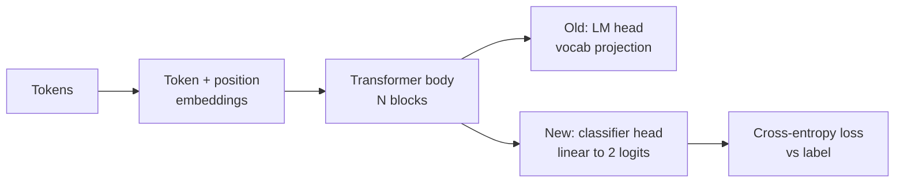
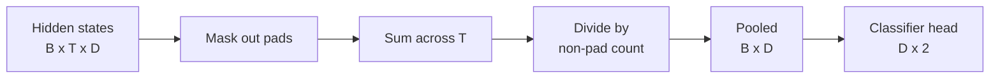
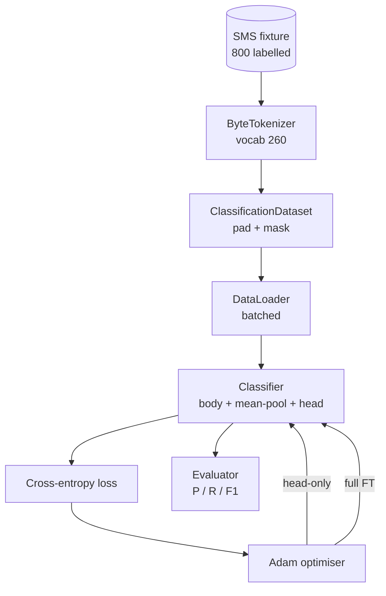

# 毕业项目第 38 课：分类头替换微调

> Track B 的第一个毕业项目。预训练语言模型是一摞自注意力块，末端接着一个 token 预测头。当你的目标是判断垃圾短信（spam）还是正常短信（ham）时，这个头是错的，但模型主体基本是对的。本课把原来的头拆掉，在池化后的表示上接一个二分类线性层，然后用两种方式训练分类器：只训练最后一层，以及全量微调。评估指标是留出集上的精确率、召回率和 F1。你会学到每种策略带来什么收益、付出什么代价。

**Type:** Build
**Languages:** Python (torch, numpy)
**Prerequisites:** Phase 19 lessons 30-37 (NLP LLM track: tokenizer, embedding table, attention block, transformer body, pre-training loop, checkpointing, generation, perplexity)
**Time:** ~90 minutes

## 学习目标

- 在不重新初始化模型主体的前提下，把语言模型头替换为分类头。
- 实现两种训练方案：冻结主体（只训头）和全量微调，二者共用同一个训练循环。
- 构建感知分词器的数据流水线，完成填充、填充掩码和注意力输出的池化。
- 从原始 logits 计算精确率、召回率、F1 和混淆矩阵。
- 分析参数量、训练时间和性能上限之间的权衡。

## 问题背景

你在通用语料上预训练了一个小型 Transformer。它的输出头把最后一层隐状态投影到 1000 个 token 的词表上。现在你手里有 800 条标注为 spam 或 ham 的 SMS 短信，想做一个二分类器。摆在面前的有三条路。

错误的选项是用 800 个样本从零训练一个全新的分类器。预训练模型的主体已经编码了有用的结构：词的身份、位置信息、简单的共现关系。把它扔掉等于浪费了当初构建它的算力。

两个正确的选项是：换头并冻结主体，以及换头并让主体可训练。只训头的方式速度快、几乎不占额外内存，而且在数据这么少的情况下很少过拟合。全量微调更慢，在小数据上可能过拟合，但当下游领域偏离预训练语料时，能达到更高的准确率。

本课两种都会实现，让你能在同一份测试数据上比较它们。

## 核心概念

模型是一个函数 `f_theta(tokens) -> hidden_states`。头是一个函数 `g_phi(hidden) -> logits`。换头意味着保留 `theta`、替换 `g_phi`。主体的参数才是昂贵的部分，头只是一个线性层。

有两组可训练参数需要关注：

- `theta`（主体）：每个注意力块包含数万个权重。
- `phi`（头）：`hidden_dim * num_classes` 个权重外加一个偏置。

在只训头的方案中，你只对 `phi` 计算梯度，对 `theta` 的梯度归零。PyTorch 里只需把主体参数的 `requires_grad` 设为 `False`。优化器就只能看到头，主体保持冻结。

在全量微调中，梯度回传贯穿整个网络。主体的权重会向分类目标漂移。风险在于小数据上的灾难性遗忘（catastrophic forgetting）：主体在预训练中学到的东西被过拟合噪声冲刷殆尽。

## 池化方式的选择

分类器需要的是每个序列一个向量，而不是每个 token 一个向量。常见的选择有三种：

- **均值池化（Mean pool）**：按注意力掩码加权，对序列上的隐状态取平均。
- **CLS 池化（CLS pool）**：在序列前面加一个特殊 token，只用它的输出。BERT 就是这么做的。
- **末 token 池化（Last-token pool）**：使用最后一个非填充 token。GPT 类分类器就是这么做的。

本课采用带显式注意力掩码加权的均值池化。它最简单，在不同序列长度下给出稳定的信号，也不需要为 CLS token 做预训练。

## 数据

800 条 SMS 短信，spam 和 ham 各 400 条，均衡分布，由 `code/main.py` 确定性地生成。生成器使用固定种子，挑选模板并填入槽位词，产出长度在 5 到 25 个 token 之间的短信。真实数据集会有这份测试数据所没有的噪声。这份固定数据的意义在于可复现。

数据按 80/20 划分：640 条训练，160 条测试。划分采用分层抽样，保证测试集维持 50/50 的均衡。一个比例已知的留出集，能让精确率和召回率读起来是诚实的数字。

## 评估指标

二分类，类别 1 为正类（spam）。计数如下：

- `TP`：预测为 spam，实际是 spam。
- `FP`：预测为 spam，实际是 ham。
- `FN`：预测为 ham，实际是 spam。
- `TN`：预测为 ham，实际是 ham。

三个核心指标：

- `precision = TP / (TP + FP)`。被标记为 spam 的短信里，有多大比例真的是 spam？
- `recall = TP / (TP + FN)`。所有真实的 spam 里，模型抓到了多大比例？
- `F1 = 2 * P * R / (P + R)`。二者的调和平均。

混淆矩阵以 2x2 网格打印这四个计数。演示程序会把两种训练方案的结果都写到 stdout。

## 架构

主体是一个刻意做小的 Transformer：词表 260、隐藏维度 64、4 个头、2 个块、最大序列长度 32。它小到可以在 CPU 上九十秒内把两种方案都训练到收敛。本课不使用真正的预训练；取而代之，`pretrain_quick` 辅助函数在同一份数据的文本上做五个 epoch 的语言模型训练，给主体一个非平凡的起点。这样课程就能自成一体。

## 你将构建什么

实现包括一个 `main.py` 和一个测试模块（`code/tests/test_main.py`）。

1. `ByteTokenizer`：把字节映射到 id，并保留一个填充 id。
2. `Block`：包含多头注意力和前馈层的 Transformer 块。Pre-norm 结构。
3. `LMBody`：token 嵌入加位置嵌入，再叠一摞块。返回隐状态。
4. `MeanPool`：沿序列轴做掩码加权平均。
5. `Classifier`：主体、池化、线性头。两种方案共用同一个主体实例。
6. `freeze_body` 和 `unfreeze_body`：切换主体参数的 `requires_grad`。
7. `train_classifier`：一个共用的训练循环。接收模型和一个针对当前可训练参数组配置好的优化器。
8. `evaluate`：在测试集上运行并返回 `Metrics(precision, recall, f1, confusion)`。
9. `run_demo`：先对主体做简短预训练，然后依次训练并评估只训头和全量微调两种方案，打印两份报告，以零状态码退出。

## 为什么这个对比重要

只训头的方案通常训练更快，欠拟合得也更体面。在这份数据上，二十个 epoch 的只训头训练之后，精确率通常接近 0.9，召回率接近 0.85。全量微调耗时大约三倍，最终结果上下浮动几个点，取决于随机种子。

本课不评出胜者。它教你读懂数字和成本。在 800 个样本和一个迷你主体上，只训头是正确的选择。在 80,000 个样本和一个更大的主体上，全量微调开始划算。你从本课带走的契约是这套 API：同一个 `train_classifier` 函数处理两种方案，切换只需一次调用。

## 进阶目标

- 增加第三种方案：只解冻最后一个块。这有时被称为部分微调（partial fine-tuning）。它的成本低于全量微调，学到的东西多于只训头。
- 添加学习率调度器。头上用余弦调度、主体上用更小的常数学习率，是常见的生产配置。
- 把均值池化替换为可学习的注意力池化：一个带单个可学习 query 的小注意力层。在较长序列上它经常优于均值池化。

实现给了你扩展的钩子。测试钉死了契约。数字由你自己去刷。
