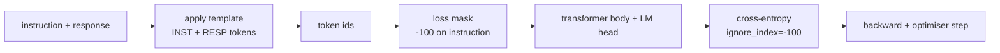
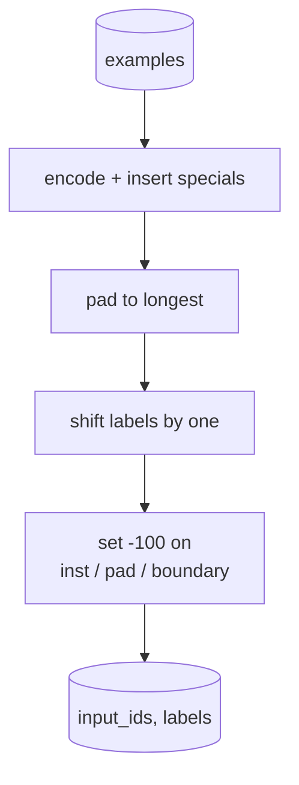
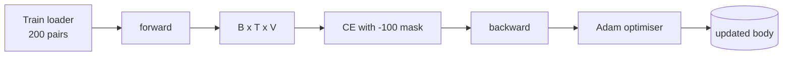

# 毕业项目第 39 课：基于监督微调的指令微调

> 预训练的基座模型能够续写一个序列，却不会遵循指令。监督微调（Supervised Fine-Tuning, SFT）是解决这一问题的最小改动：把成对的「指令 + 期望回复」样本喂给模型，训练模型主体去预测回复部分的 token。关键技巧在于：损失只应统计回复部分，而不应统计指令部分。本课会构建一个 Alpaca 风格的 SFT 训练循环，使用自定义的 collate 函数以 `ignore_index=-100` 屏蔽指令 token，在 200 条指令-回复对上训练，并在保留集上用精确匹配（exact-match）进行评估。

**Type:** Build
**Languages:** Python (torch, numpy)
**Prerequisites:** Phase 19 lessons 30-37 (NLP LLM track: tokenizer, embedding table, attention block, transformer body, pre-training loop, checkpointing, generation, perplexity)
**Time:** ~90 minutes

## 学习目标

- 把成对的指令-回复数据格式化为带有显式边界 token 的单一因果序列。
- 构建一个 collate 函数来屏蔽指令 token，使交叉熵损失只统计回复 token。
- 在 SFT 目标下训练一个小型 Transformer 主体，并观察评估指标的变化。
- 实现遵守回复起始边界的贪心生成和温度采样生成。
- 在生成的补全结果上计算保留集的精确匹配率。

## 问题背景

一个只做过下一 token 预测训练的基座模型完全不知道什么是指令。给它字符串 `"What is the capital of France?"`，它会继续把问题写下去，或者编造一句新的话。模型掌握了语言，却没有掌握格式契约。

SFT 的契约就是一个字符串模板。每条训练样本都被组装成一个包含三个区域的单一序列：

```text
<INST> What is the capital of France? <RESP> The capital of France is Paris.
```

边界 token 是训练时预留的特殊 token。模型学到：`<RESP>` 之后的所有内容都是回复，而回复才是被打分的部分。基座模型的下一 token 目标依然成立，只是训练语料中每条样本都具有这种形状。

但这里有个陷阱。如果把整个序列直接交给原始的交叉熵损失，你同时也在训练模型去预测指令 token。指令是已经给定的，你希望这些位置上的梯度为零。解决办法就是掩码（mask）。

## 核心概念



`ignore_index` 是 `torch.nn.functional.cross_entropy` 的一个特性。任何等于 `ignore_index` 的目标位置都贡献零损失和零梯度。PyTorch 的惯例是 `-100`。collate 函数为每条样本构建两个张量：`input_ids`（完整序列）和 `labels`（`input_ids` 的副本，其中指令位置被覆写为 `-100`）。

前向传播时模型看到的是完整序列；注意力可以关注到指令。损失只统计回复 token。这正是你想要的：以指令为条件，预测回复。

## 数据

200 条指令-回复对在 `main.py` 中以确定性方式生成，覆盖六种任务类型：

- 单步事实问答（X 的首都）
- 算术
- 列表抽取
- 单句摘要
- 代码（print、排序）
- 定义

每种任务都有模板化的指令和确定性的回复。这种设计是有意从简的。精确匹配很脆弱，本课用的是「正确答案只有一个特定字符串」的固定数据集。真实的 SFT 数据集需要模糊度量；但原理完全相同。

数据划分为 160 条训练、40 条测试。测试集覆盖全部六种任务类型，因此可以按类别汇报精确匹配率。

## 分词与填充

分词器是字节级的，预留了三个特殊 token：

- `INST_ID = 256`：标记指令区域的起点。
- `RESP_ID = 257`：标记指令与回复之间的边界。
- `PAD_ID = 258`：用于变长批次的填充。

序列形如 `[INST] inst_bytes [RESP] resp_bytes [PAD]*`。collate 函数：

1. 对每条样本分词。
2. 把批次内的每条样本填充到该批次中最长的序列长度。
3. 构建 `labels` = `input_ids` 右移一位（因果语言模型目标），并且：
   - 指令区域替换为 `-100`。
   - 填充区域替换为 `-100`。
   - `RESP_ID` 边界位置本身也替换为 `-100`（不需要训练模型预测边界 token；它预测的是边界之后的内容）。



这个移位是标准的因果技巧：`input_ids` 的位置 `i` 预测位置 `i+1`，因此 `labels[i] = input_ids[i+1]`（输入丢弃最后一个位置，目标丢弃第一个位置）。掩码在移位之后再施加，以落在正确的位置上。

## 训练



训练循环就是标准的 PyTorch SFT 循环。Adam 优化器，学习率在 3e-4 到 1e-3 之间，在这个固定数据集上训练十到二十个 epoch，不用调度器。模型足够小（隐藏维度 96、2 个 block、最大长度 64），在 CPU 上两分钟内即可训练到收敛。

每隔五个 epoch，循环会在保留集上跑一次小型评估并打印精确匹配率。看着精确匹配率从第 1 个 epoch 的 0.0 升到第 15 个 epoch 的 0.85 左右，就是本课的回报：你能亲眼看到模型同时在学格式和学答案。

## 生成

评估时，模型拿到指令前缀 `[INST] inst_bytes [RESP]`，然后持续生成 token，直到满足以下任一条件：

- 序列达到 `max_len`，或者
- 模型触发一个特殊的停止启发式：连续两个句末字节（`.`、`!`、`?`）。

本课提供贪心解码，外加一个可选的温度采样器。精确匹配评估使用贪心解码，因为温度采样会让指标变得随机。真实系统通常先采样、再做模糊评判；那条流水线是第 41 课的内容。

## 精确匹配评估

精确匹配是最严格的文本指标。预测的回复字符串经过归一化（转小写、去除首尾空白、合并连续空格），再与同样归一化后的参考回复比较。每条样本的指标非 1 即 0，整体结果取均值。

真实的 SFT 流水线会用 token 级 F1（第 41 课）和评判模型来补充精确匹配。精确匹配仍然有用，因为它毫无歧义；如果它显示 0.7，就意味着恰好 70% 的测试指令产出了与标准回复逐字符相同的结果。

## 从零实现

实现是一个 `main.py` 加测试。

1. `InstructionTokenizer`：带预留特殊 token 的字节级编码器。既能编码指令前缀，也能编码完整的指令-回复对。
2. `make_dataset`：用固定种子生成覆盖六种任务类型的 200 条样本对。
3. `SFTDataset`：每条样本返回 `(input_ids, labels)`，掩码已经预处理好。
4. `sft_collate`：动态填充，构建批次张量，在指令和填充位置设置 `-100`。
5. `TinyGPT`：Transformer 主体加上权重绑定或不绑定的 LM head。
6. `train_sft`：SFT 训练循环，带每 epoch 的评估钩子。
7. `generate`：从前缀开始的因果解码，支持贪心或采样，带停止启发式。
8. `exact_match`：归一化字符串比较，返回 `[0, 1]` 区间内的浮点数。
9. `run_demo`：构建数据，训练二十个 epoch，评估，打印按类别的细分结果，成功时以零退出码退出。

## 掩码为什么重要

没有掩码时，损失会把指令 token 当作预测目标，模型就会去学习预测指令。这是一个不同的目标函数，会在两方面产出更差的模型。第一，模型容量被浪费在重建用户总会提供的输入上。第二，在大多数批次中指令 token 数量多于回复 token，导致回复损失在梯度总和中占比更小；优化器在你真正关心的部分上的有效学习率低于你的设定。掩码不是锦上添花，它就是目标函数本身。

## 进阶目标

- 添加学习率预热（warmup）加余弦衰减。SFT 对学习率比预训练更敏感。
- 添加逐 token 损失日志，并绘制训练过程中的损失曲线。注意早期 epoch 的损失由模板 token（`<RESP>`、常见前缀）主导，后期 epoch 则由真正的答案 token 主导。
- 把评估扩展到 BLEU-1 或 chrF。精确匹配会低估那些用同义改写给出相同答案的模型。
- 添加支持多轮格式的对话模板，并在包含追问的固定数据集上训练。

这份实现交给你的是格式契约、掩码和训练循环。从基座模型到指令跟随者的目标函数变化，只是一个 collate 函数而已。
